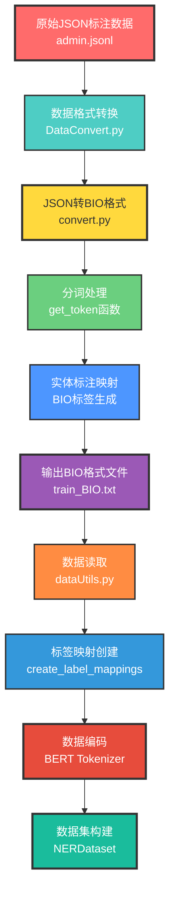
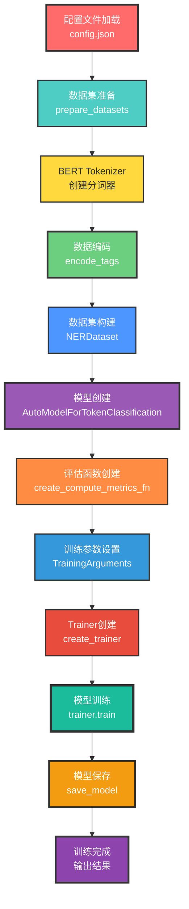
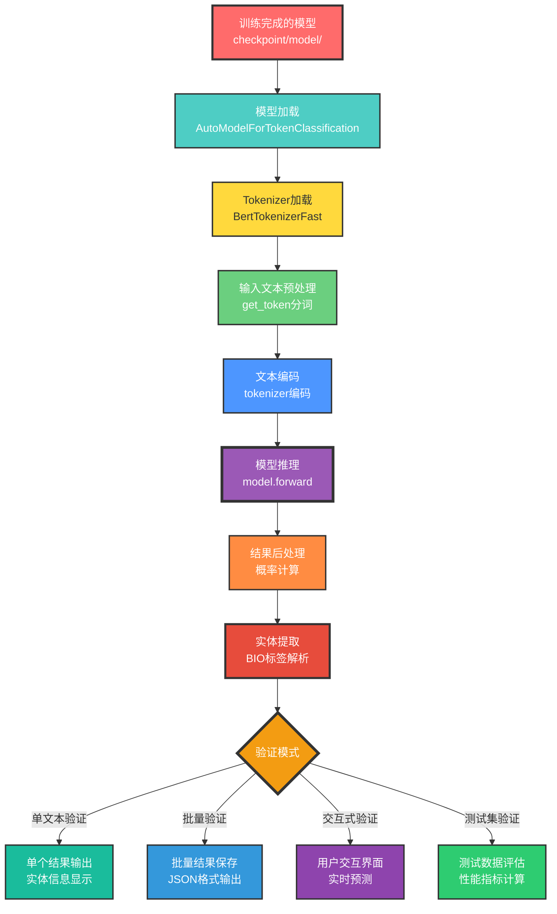

Link: https://github.com/Zhengke0110/NER

## 项目概述

NER 项目是一个基于 BERT 的中文命名实体识别系统，主要用于识别文本中的实体类型。项目采用 BIO 标注体系，使用 `transformers` 库进行模型训练和预测。

---

## 数据预处理流程

### 预处理流程图



### 数据转换核心代码

#### 分词处理函数

```python
def get_token(text: str) -> List[str]:
    """
    将文本分词，英文字母作为单词处理，其他字符单独处理

    Args:
        text: 输入文本

    Returns:
        分词后的列表
    """
    if not text:
        raise ValueError("输入文本不能为空")

    english_letters = set('abcdefghijklmnopqrstuvwxyzABCDEFGHIJKLMNOPQRSTUVWXYZ')
    output = []
    buffer = ''

    for char in text:
        if char in english_letters:
            buffer += char
        else:
            if buffer:
                output.append(buffer)
                buffer = ''
            if char.strip():  # 忽略空白字符
                output.append(char)

    if buffer:
        output.append(buffer)

    return output
```

**功能说明**:

- 智能分词处理，将英文字母组合为单词，中文字符单独处理
- 过滤空白字符，保证分词结果的质量
- 为后续的 BIO 标注提供合适的 token 粒度

#### JSON 到 BIO 转换核心函数

```python
def json2bio(input_file: str, output_file: str, split_by: str = 's') -> None:
    """
    将JSON格式的标注数据转换为BIO格式

    Args:
        input_file: 输入JSON文件路径
        output_file: 输出BIO格式文件路径
        split_by: 分割方式（暂未使用）
    """
    try:
        with open(input_file, 'r', encoding='utf-8') as f_in, \
             open(output_file, 'w', encoding='utf-8') as f_out:

            for line_num, line in enumerate(f_in, 1):
                # 1. 解析JSON数据
                annotations = json.loads(line.strip())

                # 2. 验证必要字段（text和label）
                # 3. 预处理文本（移除换行符等）
                text = annotations['text'].replace('\n', ' ')

                # 4. 使用get_token函数进行分词
                tokens = get_token(text.replace(' ', ','))

                # 5. 初始化所有标签为'O'
                labels = ['O'] * len(tokens)

                # 6. 处理实体标注
                for entity in annotations['label']:
                    start_pos, end_pos, entity_type = entity[0], entity[1], entity[2]

                    # 设置BIO标签：B-开头，I-内部
                    labels[start_pos] = f'B-{entity_type}'
                    for pos in range(start_pos + 1, end_pos):
                        labels[pos] = f'I-{entity_type}'

                # 7. 写入BIO格式文件
                for token, label in zip(tokens, labels):
                    f_out.write(f'{token} {label}\n')
                f_out.write('\n')  # 句子间空行分隔

    except Exception as e:
        raise Exception(f"转换过程中发生错误: {e}")

# 转换流程伪代码:
# FOR 每一行JSON数据:
#   1. 解析JSON → 获取text和label字段
#   2. 数据验证 → 检查必要字段是否存在
#   3. 文本预处理 → 清理换行符和特殊字符
#   4. 智能分词 → 调用get_token函数
#   5. 标签初始化 → 所有token默认标记为'O'
#   6. 实体标注 → 根据位置信息设置B-/I-标签
#   7. 格式输出 → 写入"token label"格式
#   8. 错误处理 → 记录异常并继续处理
```

**功能说明**:

- **核心转换逻辑**: 将 JSON 中的位置标注转换为 BIO 标注体系
- **标注规则**: B-标签表示实体开始，I-标签表示实体内部，O 表示非实体
- **容错处理**: 对格式错误和边界异常进行验证和处理
- **输出格式**: 每行一个 token 及其对应标签，句子间用空行分隔

### 数据格式示例

#### 原始 JSON 格式:

```json
{
  "id": 41,
  "text": "词汇阅读是关键 08年考研暑期英语复习全指南",
  "label": [
    [8, 11, "year"],
    [11, 17, "exam"]
  ],
  "Comments": []
}
```

#### 转换后的 BIO 格式:

```
词 O
汇 O
阅 O
读 O
是 O
关 O
键 O
, O
0 B-year
8 I-year
年 I-year
考 B-exam
研 I-exam
暑 I-exam
期 I-exam
英 I-exam
语 I-exam
复 O
习 O
```

### 数据处理

#### 标签映射创建

```python
def create_label_mappings(train_tags: List[List[str]]) -> Tuple[Dict[str, int], Dict[int, str], List[str]]:
    """
    创建标签映射

    Returns:
        tuple: (tag2id, id2tag, label_list)
    """
    # 收集所有唯一标签
    unique_tags = set()
    for doc_tags in train_tags:
        unique_tags.update(doc_tags)

    # 创建映射
    unique_tags = sorted(list(unique_tags))  # 保证顺序一致
    tag2id = {tag: id for id, tag in enumerate(unique_tags)}
    id2tag = {id: tag for tag, id in tag2id.items()}
    label_list = list(unique_tags)

    return tag2id, id2tag, label_list
```

**功能说明**:

- 从训练数据中提取所有唯一的标签
- 创建标签到 ID 的双向映射
- 为模型训练提供标签字典

---

## 模型训练流程

### 训练流程图



### 训练核心代码

#### 模型创建函数

```python
def create_model(
    model_config, tag2id: Dict[str, int], id2tag: Dict[int, str]
) -> AutoModelForTokenClassification:
    """
    创建NER模型

    Args:
        model_config: 模型配置
        tag2id: 标签到ID的映射
        id2tag: ID到标签的映射

    Returns:
        初始化的模型
    """
    try:
        logger.info(f"正在创建模型: {model_config.model_name}")
        logger.info(f"标签数量: {model_config.num_labels}")

        model = AutoModelForTokenClassification.from_pretrained(
            model_config.model_name,
            num_labels=model_config.num_labels,
            id2label=id2tag,
            label2id=tag2id,
        )

        logger.info("模型创建成功")
        return model

    except Exception as e:
        logger.error(f"创建模型失败: {e}")
        raise
```

**功能说明**:

- 基于预训练的 BERT-base-chinese 模型创建 token 分类模型
- 自动设置标签数量和标签映射关系
- 利用 Hugging Face transformers 库的自动模型配置

#### 数据编码核心函数

```python
def encode_tags(tags, encodings, tag2id):
    """
    标签编码函数

    Args:
        tags: 原始标签列表，每个元素是一个文档的标签列表
        encodings: tokenizer编码结果
        tag2id: 标签到ID的映射

    Returns:
        编码后的标签列表
    """
    # 将标签转换为ID
    labels = [[tag2id[tag] for tag in doc] for doc in tags]

    encoded_labels = []

    for doc_labels, doc_offset in zip(labels, encodings.offset_mapping):
        # 创建全由-100组成的数组（用于忽略loss计算）
        doc_enc_labels = np.ones(len(doc_offset), dtype=int) * -100

        # 追踪当前处理到的原始token位置
        token_idx = 0

        for i, (start, end) in enumerate(doc_offset):
            # 跳过特殊token：[CLS], [SEP], [PAD]等
            if start == 0 and end == 0:
                continue

            # 只为每个原始token的第一个subword分配标签
            if start == 0 and end > 0:
                if token_idx < len(doc_labels):
                    doc_enc_labels[i] = doc_labels[token_idx]
                    token_idx += 1

        encoded_labels.append(doc_enc_labels.tolist())

    return encoded_labels
```

**功能说明**:

- 处理 BERT tokenizer 的子词分割问题
- 将原始 BIO 标签映射到 tokenizer 产生的子词上
- 使用-100 标记填充位置和特殊 token，在计算 loss 时会被忽略

#### 训练参数配置

```python
def create_training_arguments(training_config) -> TrainingArguments:
    """
    创建训练参数

    Args:
        training_config: 训练配置

    Returns:
        训练参数对象
    """
    training_args = TrainingArguments(
        output_dir=training_config.output_dir,  # 输出目录
        num_train_epochs=training_config.num_train_epochs,  # 训练轮数
        per_device_train_batch_size=training_config.per_device_train_batch_size,  # 训练批次大小
        per_device_eval_batch_size=training_config.per_device_eval_batch_size,  # 评估批次大小
        learning_rate=training_config.learning_rate,  # 学习率
        warmup_steps=training_config.warmup_steps,  # 预热步数
        weight_decay=training_config.weight_decay,  # 权重衰减
        logging_dir=training_config.logging_dir,  # 日志目录
        logging_steps=training_config.logging_steps,  # 日志步数
        save_strategy=training_config.save_strategy,  # 保存策略
        save_steps=training_config.save_steps,
        save_total_limit=training_config.save_total_limit,  # 保存数量限制
        eval_strategy=training_config.eval_strategy,  # 评估策略
        eval_steps=training_config.eval_steps,  # 评估步数
        load_best_model_at_end=True,  # 加载最佳模型
        metric_for_best_model="f1",  # 评估指标
        greater_is_better=True,  # 评估指标是否越
        report_to=None,  # 禁用wandb等日志记录
    )

    return training_args
```

**功能说明**:

- 配置训练的各项超参数，包括学习率、批次大小、训练轮数等
- 设置保存策略和评估策略
- 使用 F1 分数作为最佳模型选择标准

### 训练配置示例

#### config.json 训练配置部分:

```json
{
  "training": {
    "output_dir": "./output",
    "num_train_epochs": 1000,
    "per_device_train_batch_size": 8,
    "per_device_eval_batch_size": 8,
    "learning_rate": 5e-5,
    "warmup_steps": 500,
    "weight_decay": 0.01,
    "logging_steps": 10,
    "save_strategy": "steps",
    "save_steps": 1000,
    "eval_strategy": "steps",
    "eval_steps": 1000
  }
}
```

### 训练流程总结

模型训练阶段完成了以下关键任务：

1. **模型初始化**: 基于 BERT-base-chinese 创建 token 分类模型
2. **数据编码**: 处理子词分割和标签对齐问题
3. **评估设置**: 配置实体级别的评估指标
4. **参数优化**: 设置学习率调度和权重衰减
5. **模型保存**: 自动保存最佳性能的模型检查点

训练过程通过模块化设计实现了高效的端到端训练流程，确保了模型的性能和稳定性。

---

## 模型验证流程

### 验证流程图



### 验证核心代码

#### NER 预测核心函数

```python
def predict_ner(text: str, model, tokenizer) -> List[Dict[str, Any]]:
    """
    对文本进行NER预测，提取命名实体

    Args:
        text: 输入文本
        model: 训练好的模型
        tokenizer: tokenizer实例

    Returns:
        预测结果列表，每个元素包含实体信息
    """
    try:
        # 1. 文本预处理和分词
        input_char = get_token(text)

        # 2. Tokenizer编码
        input_tensor = tokenizer(
            input_char,
            is_split_into_words=True,
            padding=True,
            truncation=True,
            return_offsets_mapping=True,
            max_length=512,
            return_tensors="pt",
        )

        # 3. 获取tokens和offset信息
        input_tokens = input_tensor.tokens()
        offsets = input_tensor["offset_mapping"]
        ignore_mask = offsets[0, :, 1] == 0
        input_tensor.pop("offset_mapping")

        # 4. 模型推理
        model.eval()
        with torch.no_grad():
            outputs = model(**input_tensor)

        # 5. 计算概率和预测结果
        probabilities = torch.nn.functional.softmax(outputs.logits, dim=-1)[0].tolist()
        predictions = outputs.logits.argmax(dim=-1)[0].tolist()

        # 6. 解析BIO标签和实体提取
        results = []
        idx = 0

        while idx < len(predictions):
            if ignore_mask[idx]:
                idx += 1
                continue

            pred = predictions[idx]
            label = model.config.id2label[pred]

            if label != "O":
                # 提取实体类型和边界
                entity_type = label[2:]  # 移除B-或I-前缀
                start = idx
                end = start + 1

                # 处理连续的I-标签
                while (end < len(predictions) and not ignore_mask[end] and
                       model.config.id2label[predictions[end]] == f"I-{entity_type}"):
                    end += 1
                    idx += 1

                # 计算置信度和构建实体信息
                entity_tokens = input_tokens[start:end]
                entity_word = "".join(entity_tokens).replace("##", "")
                score = np.mean([probabilities[i][predictions[i]] for i in range(start, end)]).item()

                entity_info = {
                    "entity_group": entity_type, "score": score, "word": entity_word, "tokens": entity_tokens, "start": start, "end": end,
                }
                results.append(entity_info)

            idx += 1

        return results

    except Exception as e:
        logger.error(f"预测过程中发生错误: {e}")
        raise

# 预测流程伪代码:
# 输入: 原始文本
# 1. 文本预处理 → 调用get_token进行分词
# 2. Tokenizer编码 → 转换为模型输入格式
# 3. 获取映射信息 → 处理子词分割和位置映射
# 4. 模型推理 → 前向传播获取logits
# 5. 概率计算 → softmax转换为概率分布
# 6. 标签预测 → argmax获取最大概率标签
# 7. BIO解析 → 识别实体边界(B-开始, I-内部)
# 8. 实体合并 → 将连续token组合为完整实体
# 9. 置信度计算 → 计算实体的平均置信度
# 10. 结果构建 → 生成结构化实体信息
# 输出: 实体列表[{type, word, score, position}]
```

**功能说明**:

- **智能分词**: 使用与训练时相同的分词策略确保一致性
- **模型推理**: 通过 BERT 模型前向传播获取每个 token 的标签概率
- **BIO 解析**: 识别 B-标签(实体开始)和 I-标签(实体内部)，合并连续实体
- **置信度计算**: 对实体内所有 token 的预测概率取平均值
- **结果结构化**: 返回包含实体类型、文本、置信度和位置的完整信息

### 验证配置示例

#### config.json 验证配置部分:

```json
{
  "validation": {
    "model_path": "./output/checkpoint-1000",
    "tokenizer_path": "bert-base-chinese",
    "val_file": "./data/val.txt",
    "log_file": "./logs/validation.log",
    "log_level": "INFO",
    "output_dir": "./validation_output",
    "single_output_file": "single_validation_results.json",
    "batch_output_file": "batch_validation_results.json",
    "max_length": 512,
    "device": "cpu",
    "default_test_texts": [
      "2009年高考在北京的报名费是2009元",
      "2020年研究生考试在上海进行",
      "明年的公务员考试将在广州举办"
    ]
  }
}
```

### 验证结果示例

#### 单文本验证结果:

```json
[
  {
    "entity_group": "year",
    "score": 0.9876,
    "word": "2009年",
    "tokens": ["2009", "年"],
    "start": 0,
    "end": 2
  },
  {
    "entity_group": "exam",
    "score": 0.9654,
    "word": "高考",
    "tokens": ["高", "考"],
    "start": 2,
    "end": 4
  },
  {
    "entity_group": "location",
    "score": 0.9432,
    "word": "北京",
    "tokens": ["北", "京"],
    "start": 5,
    "end": 7
  }
]
```
