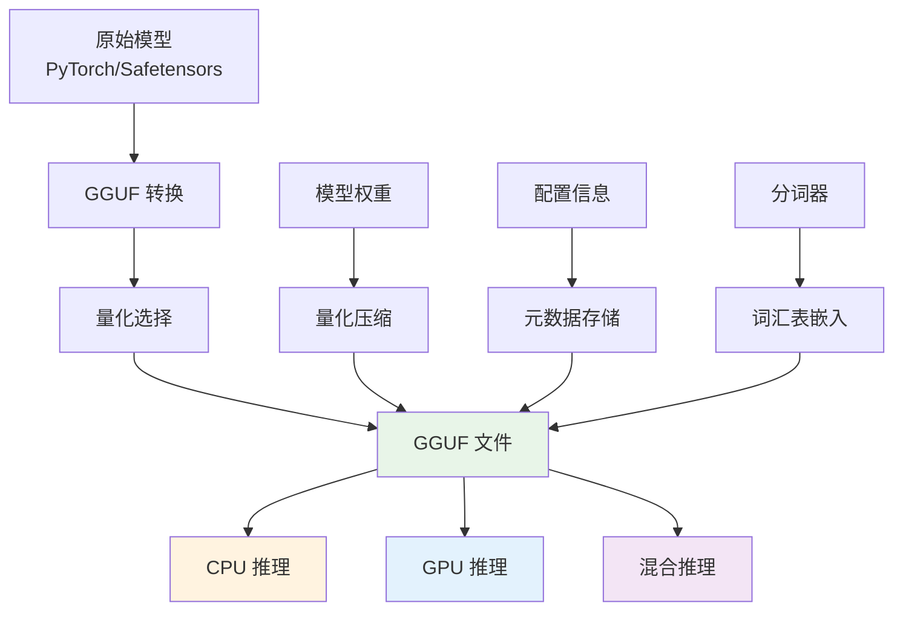

## 概述

GGUF (GPT-Generated Unified Format) 是由 llama.cpp 项目开发的新一代模型文件格式，于 2023 年推出，用于替代之前的 GGML 格式。GGUF 专为高效存储和加载大语言模型而设计，特别针对 CPU 推理优化，支持多种量化精度和内存映射技术。

## 为什么要转换 GGUF 格式

### 核心驱动因素

将模型转换为 GGUF 格式的主要原因包括：

#### 1. **硬件门槛降低**

**问题**：原始 PyTorch 模型对硬件要求极高

- 7B 模型需要 26GB+ 显存
- 13B 模型需要 49GB+ 显存
- 普通消费级硬件无法运行

**解决方案**：GGUF 量化大幅降低资源需求

```python
# 内存需求对比
model_requirements = {
    "Qwen2.5-7B": {
        "PyTorch FP16": "14 GB",
        "GGUF Q8_0": "7.5 GB",
        "GGUF Q4_0": "4.2 GB"  # 普通电脑可运行
    },
    "Qwen2.5-14B": {
        "PyTorch FP16": "28 GB",
        "GGUF Q8_0": "15 GB",
        "GGUF Q4_0": "8.5 GB"  # 高端消费级显卡可运行
    }
}
```

#### 2. **部署成本优化**

**云服务成本对比**：

- **GPU 服务器**：¥15-60/小时 (A100, H100)
- **CPU 服务器**：¥0.7-3.5/小时
- **边缘设备**：一次性投入，无持续费用

GGUF 本地部署年成本可节省 80%+

#### 3. **隐私和安全**

**数据安全需求**：

- **金融行业**：客户数据不能上云
- **医疗行业**：患者隐私保护
- **企业内部**：商业机密安全
- **个人用户**：隐私敏感信息

GGUF 支持完全本地运行，数据不出设备。

#### 4. **网络依赖消除**

**离线场景需求**：

- 工业现场（网络不稳定）
- 移动设备（流量限制）
- 军事/特殊环境（网络隔离）
- 开发调试（无需联网）

#### 5. **响应延迟优化**

**延迟对比**：

- **API 调用**：网络延迟 + 云端处理 ≈ 250ms
- **本地 GGUF**：仅本地处理 ≈ 150ms

本地推理延迟降低约 40%。

#### 6. **定制化控制**

**完全控制权**：

- **模型版本**：固定模型版本，避免 API 变更
- **输出格式**：自定义响应格式和长度
- **停止条件**：精确控制生成终止条件
- **温度参数**：细粒度调整创造性输出

### 核心特性

GGUF 格式的主要优势包括：

1. **高效量化**：支持多种精度的权重量化（Q4_0, Q4_1, Q5_0, Q5_1, Q8_0 等）
2. **内存映射**：支持 mmap，实现快速模型加载
3. **跨平台兼容**：统一的二进制格式，支持不同操作系统
4. **元数据丰富**：包含完整的模型配置和分词器信息
5. **向后兼容**：可以转换现有的 PyTorch/Safetensors 模型



### 技术优势

相比传统格式，GGUF 具有显著优势：

| 特性     | GGUF       | PyTorch     | Safetensors |
| -------- | ---------- | ----------- | ----------- |
| 特件大小 | 小（量化） | 大          | 中等        |
| 加载速度 | 快（mmap） | 慢          | 中等        |
| CPU 推理 | 优化       | 一般        | 一般        |
| 内存使用 | 低         | 高          | 中等        |
| 跨平台   | 优秀       | Python 依赖 | 好          |

## 技术原理

### 文件结构

GGUF 文件采用二进制格式，由以下部分组成：

```text
┌─────────────────┐
│     文件头       │ ← 魔数、版本、元数据
├─────────────────┤
│   键值元数据      │ ← 模型配置、分词器信息
├─────────────────┤
│   张量信息       │ ← 权重张量的元信息
├─────────────────┤
│   填充对齐       │ ← 内存对齐优化
├─────────────────┤
│   张量数据       │ ← 实际的权重数据
└─────────────────┘
```

### 量化算法

GGUF 支持多种量化方法，每种都有不同的精度和压缩比：

#### Q4_0 量化（4-bit）

```python
# Q4_0 量化原理
def quantize_q4_0(weights, block_size=32):
    """4-bit 量化，每32个元素一组"""

    # 将权重分块
    blocks = weights.reshape(-1, block_size)
    quantized_blocks = []
    scales = []

    for block in blocks:
        # 计算缩放因子
        abs_max = torch.max(torch.abs(block))
        scale = abs_max / 7.0  # 4-bit 范围：-7到7
        scales.append(scale)

        # 量化到4-bit
        quantized = torch.round(block / scale).clamp(-7, 7)

        # 打包为4-bit存储
        packed = pack_4bit(quantized)
        quantized_blocks.append(packed)

    return quantized_blocks, scales

def dequantize_q4_0(quantized_blocks, scales):
    """反量化恢复权重"""
    dequantized = []

    for packed, scale in zip(quantized_blocks, scales):
        # 解包4-bit数据
        unpacked = unpack_4bit(packed)

        # 反量化
        block = unpacked.float() * scale
        dequantized.append(block)

    return torch.cat(dequantized)
```

#### Q8_0 量化（8-bit）

```python
def quantize_q8_0(weights, block_size=32):
    """8-bit 量化，更高精度"""

    blocks = weights.reshape(-1, block_size)
    quantized_blocks = []
    scales = []

    for block in blocks:
        abs_max = torch.max(torch.abs(block))
        scale = abs_max / 127.0  # 8-bit 范围：-127到127
        scales.append(scale)

        quantized = torch.round(block / scale).clamp(-127, 127)
        quantized_blocks.append(quantized.to(torch.int8))

    return quantized_blocks, scales
```

### 内存映射技术

GGUF 通过内存映射实现快速加载：

```python
import mmap
import numpy as np

class GGUFLoader:
    """GGUF 文件加载器"""

    def __init__(self, file_path):
        self.file_path = file_path
        self.file_handle = None
        self.mmap_handle = None

    def load_with_mmap(self):
        """使用内存映射加载模型"""

        # 打开文件
        self.file_handle = open(self.file_path, 'rb')

        # 创建内存映射
        self.mmap_handle = mmap.mmap(
            self.file_handle.fileno(),
            0,
            access=mmap.ACCESS_READ
        )

        # 解析文件头
        header = self.parse_header()

        # 解析元数据
        metadata = self.parse_metadata()

        # 获取张量信息（不立即加载数据）
        tensor_info = self.parse_tensor_info()

        return header, metadata, tensor_info

    def get_tensor(self, tensor_name):
        """按需加载特定张量"""
        tensor_info = self.tensor_info[tensor_name]

        # 直接从内存映射中获取数据
        offset = tensor_info['offset']
        size = tensor_info['size']
        dtype = tensor_info['dtype']

        # 零拷贝获取数据
        data = np.frombuffer(
            self.mmap_handle[offset:offset+size],
            dtype=dtype
        )

        return data.reshape(tensor_info['shape'])
```

## 实现细节

### 模型转换

基本转换流程：

```python
from transformers import AutoTokenizer, AutoModelForCausalLM
import gguf

def convert_to_gguf(model_name, output_path, quantization="q4_0"):
    """转换模型为 GGUF 格式"""

    # 1. 加载原始模型
    model = AutoModelForCausalLM.from_pretrained(model_name)
    tokenizer = AutoTokenizer.from_pretrained(model_name)

    # 2. 创建 GGUF 写入器并写入数据
    gguf_writer = gguf.GGUFWriter(output_path, "llama")
    gguf_writer.add_name(model_name)
    gguf_writer.add_tokenizer_model("llama")

    # 3. 量化并写入权重
    for name, tensor in model.state_dict().items():
        if quantization == "q4_0":
            quantized_tensor = quantize_q4_0(tensor)
        else:
            quantized_tensor = tensor
        gguf_writer.add_tensor(name, quantized_tensor)

    # 4. 完成写入
    gguf_writer.write_header_to_file()
    gguf_writer.write_kv_data_to_file()
    gguf_writer.write_tensors_to_file()
    gguf_writer.close()

# 使用示例
convert_to_gguf("microsoft/DialoGPT-small", "model.gguf")
```

### 模型推理

```python
import llama_cpp

# 加载模型
llm = llama_cpp.Llama(
    model_path="./models/model.gguf",
    n_ctx=2048,      # 上下文长度
    n_threads=4,     # 线程数
    n_gpu_layers=0   # CPU推理
)

# 文本生成
response = llm(
    "你好，请介绍一下GGUF格式",
    max_tokens=100,
    temperature=0.7
)

print(response['choices'][0]['text'])
```

## 性能分析

### 量化精度对比

不同量化方法的性能特征：

| 量化类型 | 比特数 | 模型大小压缩 | 推理速度 | 精度损失 | 适用场景   |
| -------- | ------ | ------------ | -------- | -------- | ---------- |
| F16      | 16     | 50%          | 中等     | 无       | 高精度需求 |
| Q8_0     | 8      | 75%          | 快       | 很小     | 平衡选择   |
| Q5_1     | 5      | 80%          | 快       | 小       | 推荐选择   |
| Q4_1     | 4      | 87.5%        | 很快     | 中等     | 资源受限   |
| Q4_0     | 4      | 87.5%        | 很快     | 中等     | 最小模型   |

### 性能优化建议

根据硬件配置选择合适的量化级别：

| 内存容量 | 推荐量化 | 上下文长度 | 适用场景 |
| -------- | -------- | ---------- | -------- |
| < 8GB    | Q4_0     | 1024       | 资源受限 |
| 8-16GB   | Q5_1     | 2048       | 平衡选择 |
| > 16GB   | Q8_0     | 4096       | 高质量   |

## 实际应用案例

### 本地部署示例

```python
# 基本服务器实现
from flask import Flask, request, jsonify
import llama_cpp

app = Flask(__name__)

# 加载模型
llm = llama_cpp.Llama(
    model_path="./qwen2.5-7b-instruct-q4_0.gguf",
    n_ctx=4096,
    n_threads=8
)

@app.route('/chat', methods=['POST'])
def chat():
    data = request.json
    prompt = data.get('prompt', '')

    response = llm(prompt, max_tokens=500, temperature=0.7)
    return jsonify({'response': response['choices'][0]['text']})

if __name__ == '__main__':
    app.run(host='0.0.0.0', port=8000)
```

### 命令行工具

```bash
# 使用 llama.cpp 转换模型
python convert.py --input model.bin --output model.gguf --type q4_0

# 使用 ollama 快速部署
ollama run qwen:7b
```

## 工具与生态

### 主要工具

- **llama.cpp**：原生 C++ 实现，高性能推理
- **ollama**：用户友好的本地部署工具
- **ggml**：底层计算库
- **text-generation-webui**：Web 界面

### 模型来源

- **Hugging Face Hub**：官方模型仓库
- **TheBloke**：社区量化模型
- **Chinese-LLaMA-Alpaca**：中文优化模型

## 总结

### 优势与局限

**优势：**

- 高效压缩：通过量化大幅减少模型大小
- 快速加载：内存映射技术实现秒级加载
- 跨平台：统一格式支持多种硬件平台
- 生态丰富：完善的工具链和社区支持

**局限：**

- 精度损失：量化会带来一定的精度损失
- CPU 优化：主要针对 CPU 推理优化
- 格式依赖：需要专门的加载库

### 相关资源

- **GGUF 规范**：[Format Specification](https://github.com/ggml-org/ggml/blob/master/docs/gguf.md)
- **llama.cpp**：[GitHub Repository](https://github.com/ggml-org/llama.cpp)
- **模型下载**：[Hugging Face GGUF Models](https://huggingface.co/models?library=gguf)
