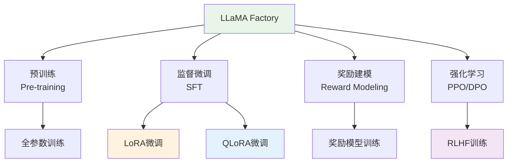
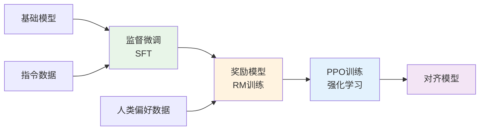

## 概述

LLaMA Factory（Large Language Model Factory）是一个专为大语言模型训练和微调设计的统一框架，支持多种模型架构和训练方法。它提供了从数据预处理到模型部署的完整工具链，特别专注于提升训练效率和降低资源消耗。

## 为什么选择 LLaMA Factory

### Web UI 界面展示


### 核心优势

#### 1. **统一的训练框架**

LLaMA Factory 支持多种主流大语言模型：

- **LLaMA 系列**：LLaMA, LLaMA2, Code Llama
- **ChatGLM 系列**：ChatGLM2-6B, ChatGLM3-6B
- **Qwen 系列**：Qwen-7B, Qwen-14B, Qwen1.5, Qwen2
- **Baichuan 系列**：Baichuan-7B, Baichuan2-7B, Baichuan2-13B
- **其他模型**：Falcon, InternLM, Yi 等

#### 2. **多样化的训练方法**

支持从全参数训练到高效微调的各种方法：



#### 3. **高效的参数优化**

- **LoRA（Low-Rank Adaptation）**：减少可训练参数至原模型的 0.1%-1%
- **QLoRA（Quantized LoRA）**：结合 4-bit 量化，进一步降低显存需求
- **混合精度训练**：支持 FP16/BF16，提升训练速度

#### 4. **用户友好的界面**

提供 Web UI 和命令行两种使用方式，降低技术门槛。

## 技术架构

### 系统架构图


### 架构层次解析

LLaMA Factory 采用分层架构设计，从上到下分为四个主要层次：

#### 1. 用户接口层

- **Web UI 界面**：提供可视化的训练配置和监控界面
- **命令行工具**：支持脚本化的批量操作和自动化流程
- **配置文件**：通过 YAML 文件灵活配置训练参数

#### 2. 训练引擎层

- **数据处理模块**：负责数据预处理、格式转换和增强
- **模型管理模块**：处理模型加载、保存和版本管理
- **训练调度模块**：控制训练流程和资源分配
- **评估模块**：提供模型性能评估和指标计算

#### 3. 优化技术层

- **LoRA/QLoRA**：参数高效微调技术
- **混合精度训练**：FP16/BF16 精度优化
- **梯度检查点**：内存优化技术
- **DeepSpeed 集成**：分布式训练加速

#### 4. 模型支持层

- **Transformers 集成**：基于 HuggingFace 生态
- **PEFT 库**：参数高效微调算法库
- **FSDP 支持**：全切片数据并行
- **模型并行**：大模型分布式推理

### 核心特性

#### 1. **灵活的数据处理**

支持多种数据格式和预处理方式：

```python
# 数据格式示例
{
    "instruction": "请解释什么是机器学习",
    "input": "",
    "output": "机器学习是人工智能的一个分支..."
}

# 支持的数据格式
formats = {
    "alpaca": "指令微调格式",
    "sharegpt": "对话格式",
    "openai": "OpenAI API格式",
    "custom": "自定义格式"
}
```

#### 2. **高效的内存管理**

通过多种技术优化显存使用：

| 技术           | 显存优化效果 | 训练速度影响 | 适用场景      |
| -------------- | ------------ | ------------ | ------------- |
| LoRA           | 减少 90%+    | 几乎无影响   | 指令微调      |
| QLoRA          | 减少 95%+    | 轻微降低     | 资源受限环境  |
| 梯度检查点     | 减少 50%     | 轻微降低     | 大模型训练    |
| DeepSpeed ZeRO | 减少 75%     | 几乎无影响   | 多 GPU 训练   |
| 混合精度训练   | 减少 50%     | 提升 1.5x    | 现代 GPU 硬件 |

## 实际使用案例

### 1. 快速开始：LoRA 微调

```bash
# 安装 LLaMA Factory
git clone https://github.com/hiyouga/LLaMA-Factory.git
cd LLaMA-Factory
pip install -r requirements.txt

# 启动 Web UI
python src/webui.py
```

### 2. 命令行训练示例

```bash
# LoRA 微调 Qwen-7B
python src/train.py \
    --stage sft \
    --model_name_or_path qwen/Qwen-7B-Chat \
    --do_train \
    --dataset alpaca_gpt4_zh \
    --template qwen \
    --finetuning_type lora \
    --lora_target q_proj,v_proj \
    --output_dir ./saves/qwen-7b-lora \
    --overwrite_cache \
    --per_device_train_batch_size 4 \
    --gradient_accumulation_steps 4 \
    --lr_scheduler_type cosine \
    --logging_steps 10 \
    --save_steps 1000 \
    --learning_rate 5e-5 \
    --num_train_epochs 3.0 \
    --max_samples 3000 \
    --max_grad_norm 1.0 \
    --quantization_bit 4 \
    --loraplus_lr_ratio 16.0 \
    --fp16
```

### 3. 配置文件方式

```yaml
# config/qwen_lora_sft.yaml
model_name_or_path: qwen/Qwen-7B-Chat
stage: sft
do_train: true
finetuning_type: lora
lora_target: q_proj,v_proj
dataset: alpaca_gpt4_zh
template: qwen
cutoff_len: 1024
max_samples: 1000
overwrite_cache: true
output_dir: saves/qwen-7b-lora
logging_steps: 10
save_steps: 500
plot_loss: true
overwrite_output_dir: true
per_device_train_batch_size: 2
gradient_accumulation_steps: 4
learning_rate: 1.0e-4
num_train_epochs: 3.0
lr_scheduler_type: cosine
warmup_steps: 0
fp16: true
```

## 高级功能

### 1. 强化学习人类反馈（RLHF）

LLaMA Factory 支持完整的 RLHF 流程：



### 2. 多 GPU 分布式训练

```python
# DeepSpeed 配置示例
{
    "train_batch_size": 64,
    "train_micro_batch_size_per_gpu": 4,
    "steps_per_print": 10,
    "zero_optimization": {
        "stage": 2,
        "allgather_partitions": true,
        "reduce_scatter": true,
        "allgather_bucket_size": 500000000,
        "reduce_bucket_size": 500000000,
        "overlap_comm": false,
        "contiguous_gradients": true,
        "cpu_offload": false
    },
    "fp16": {
        "enabled": true,
        "loss_scale": 0,
        "loss_scale_window": 1000,
        "hysteresis": 2,
        "min_loss_scale": 1
    }
}
```

### 3. 模型评估与导出

```python
# 模型评估
python src/evaluate.py \
    --model_name_or_path ./saves/qwen-7b-lora \
    --adapter_name_or_path ./saves/qwen-7b-lora \
    --template qwen \
    --task ceval \
    --split validation \
    --lang zh \
    --n_shot 5 \
    --batch_size 4

# 模型合并与导出
python src/export_model.py \
    --model_name_or_path qwen/Qwen-7B-Chat \
    --adapter_name_or_path ./saves/qwen-7b-lora \
    --template qwen \
    --finetuning_type lora \
    --export_dir ./saves/qwen-7b-merged \
    --export_size 2 \
    --export_legacy_format false
```

## 性能优化

### 显存优化策略

根据不同硬件配置的优化建议：

| GPU 显存 | 推荐配置               | 模型规模     | 训练方法  |
| -------- | ---------------------- | ------------ | --------- |
| 4-8GB    | QLoRA + 4bit 量化      | 7B 模型      | LoRA 微调 |
| 12-16GB  | LoRA + 混合精度        | 7B-13B 模型  | LoRA 微调 |
| 24GB+    | 全参数微调 + DeepSpeed | 7B 模型      | 全参数    |
| 80GB+    | 全参数微调 + 模型并行  | 13B-70B 模型 | 全参数    |

### 训练效率优化

```python
# 推荐的训练配置
training_config = {
    "per_device_train_batch_size": 4,
    "gradient_accumulation_steps": 4,
    "max_grad_norm": 1.0,
    "learning_rate": 5e-5,
    "warmup_ratio": 0.1,
    "lr_scheduler_type": "cosine",
    "save_strategy": "steps",
    "save_steps": 500,
    "evaluation_strategy": "steps",
    "eval_steps": 500,
    "logging_steps": 10,
    "fp16": True,  # 或 bf16
    "dataloader_num_workers": 4,
    "remove_unused_columns": False,
    "ddp_find_unused_parameters": False
}
```

## 常见问题与解决方案

### 1. 显存不足

**问题**：训练时出现 CUDA out of memory

**解决方案**：

- 降低 batch size 或增加梯度累积步数
- 使用量化训练（4-bit 或 8-bit）
- 启用梯度检查点
- 使用 DeepSpeed ZeRO

### 2. 训练不收敛

**问题**：损失不下降或模型性能差

**解决方案**：

- 检查数据质量和格式
- 调整学习率（通常 LoRA 需要更高的学习率）
- 增加训练数据量
- 调整 LoRA 参数（rank, alpha）

### 3. 推理速度慢

**问题**：微调后模型推理速度慢

**解决方案**：

- 合并 LoRA 权重到基础模型
- 使用 vLLM 等推理加速框架
- 量化模型到 INT8 或 INT4

## 工具生态与集成

### 主要组件

- **Transformers**：基础模型库
- **PEFT**：参数高效微调库
- **DeepSpeed**：分布式训练优化
- **BitsAndBytes**：量化训练支持
- **vLLM**：高速推理引擎

### 数据集支持

LLaMA Factory 内置了多个高质量数据集：

```python
# 内置数据集列表
datasets = {
    "alpaca_gpt4_zh": "中文指令数据集",
    "belle_2m_cn": "中文对话数据集",
    "firefly_train_1.1m": "中文指令微调数据集",
    "moss_003_sft_data": "中文助手数据集",
    "c_eval": "中文评估基准",
    "cmmlu": "中文语言理解评估"
}
```

## 未来发展方向

### 技术趋势

1. **更高效的微调方法**：探索新的参数高效微调技术
2. **多模态支持**：集成视觉、音频等多模态能力
3. **自动化调优**：智能超参数搜索和模型架构优化
4. **边缘部署**：支持移动设备和边缘计算环境

### 生态建设

- **模型市场**：预训练模型和微调模型的分享平台
- **评估框架**：标准化的模型评估和比较工具
- **部署工具**：一键部署到云服务和边缘设备

## 相关资源

### 官方资源

- **GitHub 仓库**：[LLaMA Factory](https://github.com/hiyouga/LLaMA-Factory)
- **技术文档**：[使用指南](https://github.com/hiyouga/LLaMA-Factory/wiki)
- **论文参考**：[LoRA: Low-Rank Adaptation](https://arxiv.org/abs/2106.09685)

### 学习资源

- **QLoRA 论文**：[QLoRA: Efficient Finetuning of Quantized LLMs](https://arxiv.org/abs/2305.14314)
- **RLHF 综述**：[Training language models to follow instructions](https://arxiv.org/abs/2203.02155)
- **混合精度训练**：[Mixed Precision Training](https://arxiv.org/abs/1710.03740)

### 社区支持

- **讨论区**：GitHub Issues 和 Discussions
- **技术博客**：相关技术文章和最佳实践分享
- **视频教程**：B 站、YouTube 等平台的教学视频

## 总结

LLaMA Factory 作为一个成熟的大语言模型微调框架，提供了从数据处理到模型部署的完整解决方案。它的核心优势在于：

**技术优势**：

- 支持多种主流模型架构
- 集成先进的参数高效微调技术
- 提供完整的 RLHF 训练流程
- 优秀的内存和计算效率

**易用性**：

- 友好的 Web UI 界面
- 灵活的配置系统
- 丰富的内置数据集
- 详细的文档和示例

**生态完整性**：

- 与主流深度学习框架无缝集成
- 支持多种部署方式
- 活跃的社区支持

对于需要进行大语言模型微调的开发者和研究者来说，LLaMA Factory 是一个值得推荐的工具选择。它降低了技术门槛，提高了开发效率，使得更多人能够参与到大语言模型的应用和研究中来。
