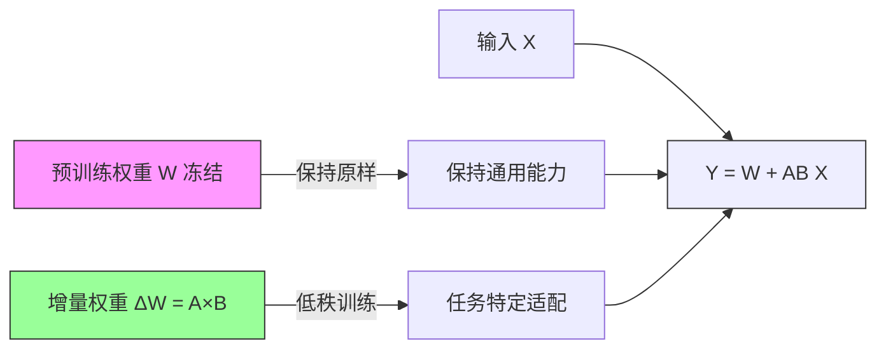
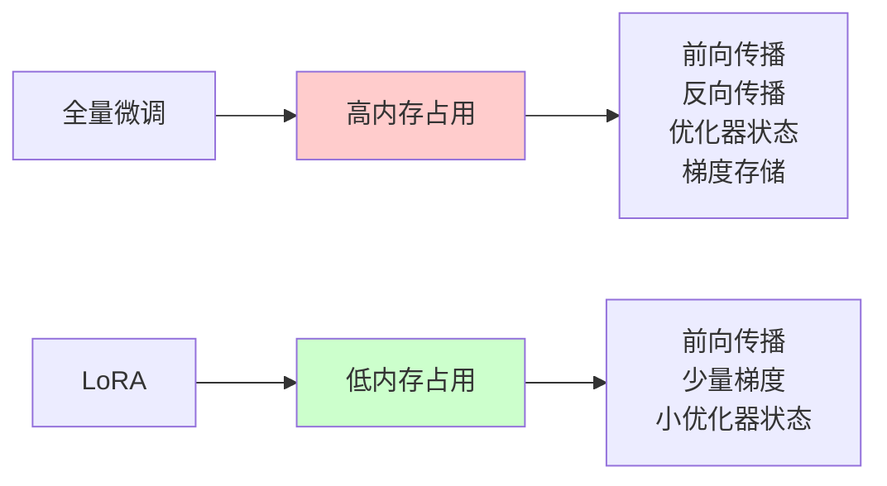

## 概述

LoRA (Low-Rank Adaptation) 是一种参数高效的微调技术，由微软研究团队在 2021 年提出。该技术通过学习低秩分解矩阵来适应预训练的大语言模型，同时保持原始权重冻结，极大地减少了可训练参数的数量和存储需求。

### 核心思想

LoRA 的核心思想是：**模型微调过程中的权重更新具有内在的低秩特性**。具体来说：

- 将权重更新分解为两个低秩矩阵的乘积
- 只训练这些低秩矩阵，保持原始权重冻结
- 在推理时可以将低秩矩阵合并到原始权重中，无额外延迟

---

## 一、LoRA核心定义与概述

LoRA（Low-Rank Adaptation）是2021年由微软研究团队提出的**参数高效型大模型微调技术**，并非传统算法，核心是通过学习低秩分解矩阵适配预训练大语言模型，同时保持原始权重冻结，从根源上解决全量微调"资源消耗大、训练效率低"的痛点。

其关键特性可概括为三点：

1. **大幅减少可训练参数**：仅为全量微调的0.01%~3%，原论文中可减少10,000倍
2. **降低存储与显存需求**：模型检查点仅几MB，GPU内存使用减少3倍  
3. **支持灵活部署**：多任务切换高效，推理时合并权重无额外延迟

普通GPU即可实现十亿参数级模型的微调。

## 二、LoRA核心思想与数学原理

### 1. 核心思想：权重更新的低秩特性

LoRA的核心逻辑基于"**预训练模型微调时的权重更新具有内在低秩特性**"——即微调导致的权重变化量（ΔW = W任务 - W预训练）并非随机分布，其信息高度集中在少数几个维度（如GPT-3上ΔW的前10-20个奇异值占据90%以上信息），因此可通过两个低秩矩阵A、B的乘积近似表示ΔW，无需更新原始权重矩阵W。

这种设计既保留了原始模型的基础能力，又能针对性适配新任务，还避免了"灾难性遗忘"。

### 2. 数学原理与关键公式

#### （1）基础公式：权重调整与低秩分解

LoRA通过低秩矩阵叠加实现权重调整，核心公式为：

$$W' = W + \Delta W = W + A \times B$$

其中：

- $W$：预训练模型原始权重矩阵（形状d×k，冻结，梯度设为0）
- $A$：低秩矩阵（形状d×r，r为秩，通常远小于d、k，可训练）
- $B$：低秩矩阵（形状r×k，可训练）
- $W'$：调整后的有效权重，用于前向传播计算

为控制适应强度，LoRA引入**缩放因子**优化公式，进一步平衡低秩矩阵对权重的影响：

$$h = W_0 x + \frac{\alpha}{r} B A x$$

其中 $\alpha$ 为超参数，通常设置为秩r的整数倍（如r=16时α=32），确保训练过程中权重更新的稳定性。

#### （2）初始化策略

为避免初始阶段低秩矩阵对原始模型的干扰，LoRA采用特殊初始化方式：

- 矩阵 $A$ 使用随机高斯分布初始化（如 kaiming_uniform 初始化），确保初始值较小
- 矩阵 $B$ 初始化为全零矩阵，使训练开始时 ΔW = A×B = 0，完全保留原始模型性能，后续通过反向传播逐步更新A、B参数

## 三、LoRA技术优势与性能表现

### 1. 核心技术优势

结合原总结与新增文本，LoRA的优势可归纳为五大维度：

| 优势类型       | 具体表现                                                                 | 数据支撑（原论文/实验结果）                                                                 |
|----------------|--------------------------------------------------------------------------|----------------------------------------------------------------------------------------------|
| 参数效率       | 可训练参数极少，仅更新低秩矩阵A、B                                       | RoBERTa-Base全量微调需125M参数，LoRA仅需0.8M；DeBERTa-XXL全量微调需1.5B参数，LoRA仅需4.7M |
| 内存与存储效率 | 降低显存占用，减少模型存储成本                                           | GPU内存使用减少3倍；模型检查点从GB级降至MB级（RoBERTa-Base LoRA checkpoint仅3.2MB）         |
| 训练效率       | 仅更新少量参数，反向传播计算量小，训练速度快                             | 普通GPU可训练十亿参数模型，无需高端硬件支持                                                  |
| 部署灵活性     | 支持多任务共享基础模型，LoRA模块“即插即用”，任务切换无需重新训练         | 切换任务仅需加载不同LoRA文件（几秒完成），一个基础模型可搭配多个LoRA适配器                  |
| 推理性能       | 推理时可将低秩矩阵合并到原始权重，无额外延迟，性能接近全量微调           | RoBERTa-Base LoRA在GLUE任务平均分87.5±0.3，与全量微调（87.6）几乎持平；DeBERTa-XXL LoRA平均分91.9±0.1，超越全量微调 |

### 2. 与全量微调的性能对比

以文本分类、通用语言理解（GLUE任务）为例，LoRA在参数量大幅减少的前提下，性能仍能匹配甚至超越全量微调，具体对比如下：

| 模型         | 微调方法   | 可训练参数 | 存储需求 | GLUE 平均分 | 性能差距（与全量微调比） |
|--------------|------------|------------|----------|-------------|--------------------------|
| RoBERTa-Base | 全量微调   | 125M       | ~500MB   | 87.6        | -                        |
| RoBERTa-Base | LoRA       | 0.8M       | ~3.2MB   | 87.5±0.3    | 差距仅0.1-0.4分          |
| DeBERTa-XXL  | 全量微调   | 1.5B       | ~6GB     | 91.7        | -                        |
| DeBERTa-XXL  | LoRA       | 4.7M       | ~18.8MB  | 91.9±0.1    | 反超0.2-0.3分            |

此外，在推理延迟上，LoRA合并权重后与原始模型几乎无差异，未合并时虽有少量额外计算，但通过优化可将延迟控制在极低范围（如合并后延迟比未合并时降低约5%-10%）。

### 内存使用对比

## 四、LoRA实现细节与应用场景

### 1. 基础实现：LoRA层与模型适配

#### （1）LoRA核心层设计

LoRA的实现需构建专用层结构，通常包含基础接口与线性层扩展：

- **基础接口（LoRALayer）**：定义秩r、缩放因子α、Dropout概率等核心参数，提供权重合并标记（merged），控制训练/推理时的权重状态；
- **LoRA线性层（Linear）**：继承基础接口与PyTorch nn.Linear，冻结原始权重（weight.requires_grad = False），新增可训练的lora_A、lora_B矩阵，实现前向传播时“原始权重计算+低秩矩阵调整”的叠加逻辑。

#### （2）训练/推理模式切换

为平衡训练灵活性与推理效率，LoRA设计了模式切换机制：

- **训练模式**：解除权重合并，单独计算原始权重输出与低秩矩阵输出，叠加后得到结果（result = F.linear(x, W) + (x @ A.T @ B.T) * 缩放因子），确保反向传播仅更新A、B参数；
- **推理模式**：合并低秩矩阵到原始权重（W.data += A×B * 缩放因子），后续推理直接使用合并后的权重，消除额外计算延迟

### 2. Transformer模型适配

LoRA在Transformer中的应用遵循“**好钢用在刀刃上**”的原则，优先适配对任务影响最大的层，具体如下：

#### （1）核心适配层：注意力层与前馈层

- **自注意力层**：主要适配查询投影（Wq）与值投影（Wv）矩阵——Wq决定模型“关注输入中的哪些信息”，Wv决定“基于关注信息输出什么内容”，微调这两个矩阵可高效提升任务适配能力；Wk（键投影）因与Wq功能重叠，Wo（输出投影）因影响间接，通常可选适配或不适配；
- **前馈层（FFN）**：适配升维矩阵（W1）与降维矩阵（W2），FFN负责特征提取与非线性映射，微调后可增强模型对任务特定特征的表达能力，大模型（如GPT-3）或生成任务（如对话生成）中常用。

#### （2）冻结层：嵌入层、LayerNorm与偏置

- **嵌入层**：权重大但微调时变动小，冻结可节省资源
- **LayerNorm**：参数少，直接更新成本低，无需LoRA辅助  
- **偏置（Bias）**：梯度更新学习速度快，无需低秩矩阵适配

### 3. 实际应用案例

#### （1）文本分类任务

基于Hugging Face Transformers与LoRA库，构建分类模型的流程为：

1. 加载预训练模型（如bert-base-uncased）与Tokenizer；
2. 替换模型分类头为LoRA线性层，适配注意力层的Wq、Wv矩阵；
3. 标记仅LoRA参数可训练（lora.mark_only_lora_as_trainable(model)），使用AdamW优化器训练；
4. 训练完成后，仅保存LoRA参数（lora_state_dict），后续加载时结合预训练模型权重即可使用

#### （2）对话生成任务

以GPT-2为例，适配流程为：

1. 加载GPT-2基础模型与Tokenizer
2. 对Transformer块的注意力层（c_attn）适配LoRA，仅启用Wq、Wv的低秩调整（enable_lora=[True, False, True]）
3. 适配前馈层的c_fc（升维）与c_proj（降维）矩阵  
4. 生成时使用合并权重的模型，确保输出流畅性与效率

## 五、LoRA改进版本与调参指南

### 1. 主流改进版本

为进一步优化性能、效率与灵活性，LoRA衍生出多个变体，各版本核心差异与适配场景如下：

| 改进版本 | 核心改进                                                                 | 优势                                                                 | 劣势                                                                 | 适用场景                     |
|----------|--------------------------------------------------------------------------|----------------------------------------------------------------------|----------------------------------------------------------------------|------------------------------|
| LoRA+    | 为A、B矩阵设置不同学习率（ηB/ηA=4-16，B靠近输出，学习率更高）            | 加速收敛，利用“靠近输出的权重对梯度更敏感”的特性提升训练效率           | 需调整学习率比例，参数稍复杂                                         | 训练资源有限，追求快收敛     |
| DoRA     | 将原始权重W分解为幅度（m，标量）与方向（V，单位矩阵），分别微调V（+A×B）与m | 性能提升1%-3%，接近全微调，解决LoRA可能丢失幅度信息的问题             | 训练复杂度高（需分解/归一化），内存占用稍增                           | 追求高性能，可接受一定复杂度 |
| rsLoRA   | 动态调整秩的影响，将缩放因子改为α/√r，使秩r的变化更平滑                 | 对r选择不敏感（调参简单），支持大r（64+），性能提升1%-2%              | 需额外计算缩放因子，逻辑稍复杂                                       | 复杂任务，尝试大秩           |
| PiSSA    | 通过奇异值分解（SVD）初始化A、B（A=U×√∑，B=√∑×V^T，取前r个奇异值）       | 初始化接近最优解，收敛速度快20%-50%                                  | 前期需SVD计算，初始化成本高，禁用量化模型                             | 需高性能且能承担初始化成本   |
| GaLore   | 将全权重梯度投影到低秩空间（∇W≈P×Q），仅更新P、Q梯度                     | 内存占用比标准LoRA再降50%-70%，性能接近全微调（差距0.5%-2%）         | 每步需投影，训练时间稍长                                             | 内存资源极低，优先保性能     |

### 2. 关键调参指南（以LLaMA-Factory为例）

#### （1）核心超参数说明

| 参数名           | 含义                                                                 | 建议值                                  | 默认值 |
|------------------|----------------------------------------------------------------------|-----------------------------------------|--------|
| lora_rank（r）   | 低秩矩阵的秩，决定表达能力                                             | 简单任务：8-16；中等任务：32；复杂任务：64+ | 8      |
| lora_alpha       | 缩放因子，平衡低秩矩阵对权重的影响                                     | 设为lora_rank的1-2倍（如r=16时α=32）    | None   |
| lora_dropout     | Dropout概率，防止过拟合                                               | 小数据集（<5K样本）：0.05-0.1；大数据集：0.0 | 0.0    |
| lora_target      | 适配LoRA的模块名称                                                   | 默认“q_proj,v_proj”；复杂任务加“k_proj,FFN” | all    |
| use_rslora       | 是否启用rsLoRA动态秩调整                                             | 小r（4-16）：false；大r（32+）：true    | false  |
| use_dora         | 是否启用DoRA权重分解                                                 | 复杂任务、追求高性能：true              | false  |

#### （2）实用调参技巧

1. **从小秩开始尝试**：多数任务从r=8或r=16起步，评估性能后再决定是否增大，避免资源浪费
2. **结合数据集大小选r**：小数据集（<5K样本）用小秩（r=8）防止过拟合，大数据集（>50K样本）可试大秩（r=32+）提升表达力
3. **复杂任务组合策略**：推理类任务可组合"增大r至32/64 + 启用rsLoRA + 适配FFN层"，平衡性能与效率

## 六、LoRA的优势与局限总结

### 1. 核心优势

- **低资源友好**：普通GPU可训练十亿参数级模型，降低大模型微调的硬件门槛
- **高效灵活**：参数量少、存储成本低、任务切换快，适合多任务场景与团队协作
- **性能稳定**：在多数任务上接近或超越全量微调，且避免"灾难性遗忘"，保留原始模型能力

### 2. 主要局限

- **表现力限制**：低秩假设可能无法覆盖某些复杂任务（如高精度推理）的需求，导致性能上限低于全量微调
- **秩选择依赖经验**：不同任务需调整秩r，缺乏统一标准，需通过实验试错
- **初始化成本差异**：部分改进版本（如PiSSA）需前期SVD计算，初始化成本较高

### 3. 相关资源与发展趋势

LoRA目前已形成完善的生态，核心资源包括：

- 论文：《LoRA: Low-Rank Adaptation of Large Language Models》（arXiv:2106.09685）
- 官方实现：Microsoft LoRA GitHub仓库
- 工具库：Hugging Face PEFT（Parameter-Efficient Fine-Tuning）库，集成LoRA及多种高效微调方法

未来发展方向将围绕"进一步提升性能上限、降低调参复杂度、适配更多模型结构"展开，持续优化资源利用效率与任务适配能力。

---

## 总结

LoRA 作为一种参数高效的微调技术，通过低秩分解显著降低了大模型微调的门槛，在保持性能的同时大幅减少了计算和存储成本。其模块化设计使得多任务部署变得灵活高效，是当前大模型时代的重要技术突破。

无论是学术研究还是工业应用，LoRA 都为资源受限环境下的大模型微调提供了可行的解决方案，推动了参数高效微调技术的发展。
