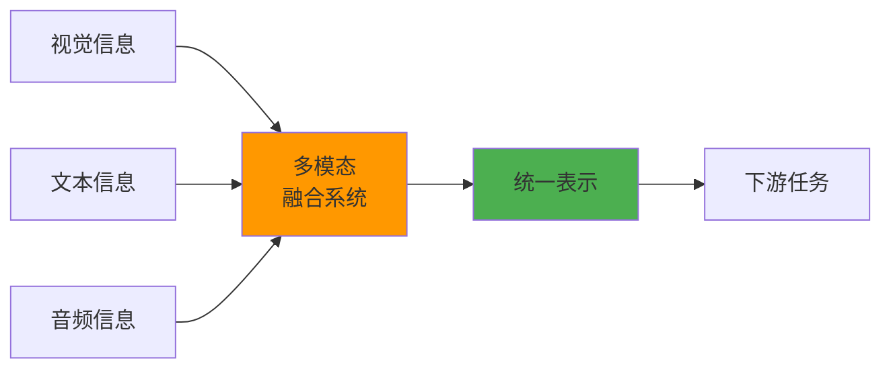
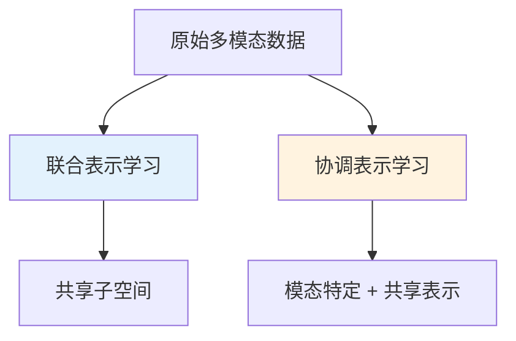
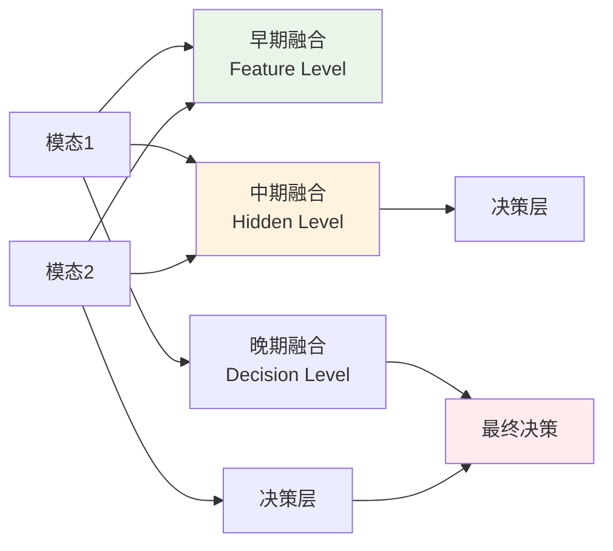
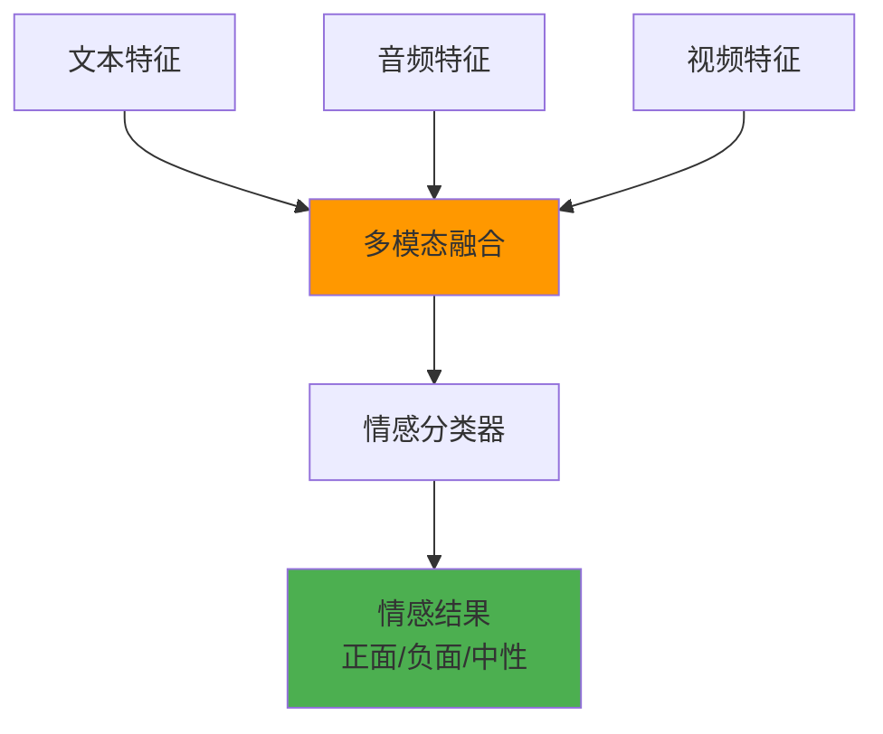

## 概述

多模态学习是人工智能领域的一个重要研究方向，旨在构建能够处理和关联来自多个模态信息的模型。正如我们人类通过视觉、听觉、触觉等多种感官来感知世界一样，多模态 AI 系统试图模拟这种多感官的信息处理能力。

## 模态与多模态的概念

### 什么是模态（Modality）

**模态**是指信息传达或体验的方式。在机器学习中，模态通常指不同类型的数据表示形式：

- **视觉模态**：图像、视频
- **听觉模态**：音频、语音、音乐
- **文本模态**：自然语言文本
- **传感器模态**：雷达、激光雷达、GPS 等
- **生物信号模态**：脑电图、心电图等

### 多模态系统的特征



多模态系统具有以下核心特征：

1. **互补性**：不同模态提供互补信息
2. **冗余性**：模态间存在重叠信息，提高鲁棒性
3. **协同性**：多模态联合学习产生协同效应

## 多模态学习的核心挑战

基于 Baltrusaitis 等人在《Multimodal Machine Learning: A Survey and Taxonomy》中提出的分类框架，多模态学习面临五大核心挑战：

### 1. 表示学习（Representation）

如何学习能够反映跨模态和模态内关系的表示。



**主要方法：**

- **联合表示（Joint Representation）**：将多模态数据映射到统一空间
- **协调表示（Coordinated Representation）**：分别处理各模态，但学习协调的表示

### 2. 模态翻译（Translation）

将一种模态的信息转换为另一种模态。

**典型应用：**

- 图像描述生成（Image Captioning）
- 文本到图像生成（Text-to-Image）
- 语音识别与合成

### 3. 模态对齐（Alignment）

识别不同模态间的对应关系和相似性。

```python
# 对齐示例：图像-文本对齐
def contrastive_alignment(image_features, text_features):
    # 计算相似度矩阵
    similarity = torch.matmul(image_features, text_features.T)

    # 对比学习损失
    labels = torch.arange(len(image_features))
    loss_i2t = F.cross_entropy(similarity, labels)
    loss_t2i = F.cross_entropy(similarity.T, labels)

    return (loss_i2t + loss_t2i) / 2
```

### 4. 模态融合（Fusion）

整合来自多个模态的信息进行预测或推理。



**融合策略分类：**

| 融合类型 | 融合位置 | 优点                 | 缺点                   |
| -------- | -------- | -------------------- | ---------------------- |
| 早期融合 | 特征级   | 能学习模态间低级交互 | 需要时序对齐，计算复杂 |
| 中期融合 | 隐层级   | 平衡复杂度和性能     | 需要精心设计架构       |
| 晚期融合 | 决策级   | 简单易实现，模态独立 | 无法学习复杂交互       |

### 5. 协同学习（Co-learning）

利用多模态的互补性，通过一个模态的监督信号来提升其他模态的学习效果。

## 多模态学习的典型任务

### 1. 视觉-语言理解任务

#### 图像描述生成（Image Captioning）

生成描述图像内容的自然语言文本。


#### 视觉问答（Visual Question Answering, VQA）

基于图像内容回答自然语言问题。

**关键技术点：**

- 多步推理能力
- 视觉注意力机制
- 跨模态交互建模

#### 图像-文本检索

根据文本查询检索相关图像，或根据图像检索相关文本。

### 2. 语音-语言任务

#### 语音识别（ASR）

将语音信号转换为文本。

#### 语音合成（TTS）

将文本转换为自然语音。

#### 语音翻译

直接将一种语言的语音翻译为另一种语言的语音或文本。

### 3. 视频理解任务

#### 视频描述生成

为视频内容生成描述性文本。

#### 视频问答

基于视频内容回答问题，需要时序推理能力。

#### 动作识别

识别视频中的人类动作或行为。

### 4. 多模态情感分析

结合文本、音频、视频等多种模态进行情感识别。



## 技术挑战与发展趋势

### 当前挑战

1. **模态不平衡**：不同模态的信息量和质量差异
2. **计算复杂度**：多模态模型参数量大，训练成本高
3. **数据获取**：高质量对齐的多模态数据稀缺
4. **模态缺失**：实际应用中某些模态可能缺失
5. **可解释性**：多模态决策过程难以解释

### 发展趋势

#### 1. 大规模预训练模型

- 参数规模持续增长
- 更大规模的多模态数据集
- 更强的零样本和少样本学习能力

#### 2. 高效训练技术

结合混合精度训练等优化技术：

```python
# 多模态模型的混合精度训练示例
from torch.cuda.amp import autocast, GradScaler

scaler = GradScaler()

def train_multimodal_step(model, image_batch, text_batch, optimizer):
    optimizer.zero_grad()

    with autocast():
        image_features = model.image_encoder(image_batch)
        text_features = model.text_encoder(text_batch)
        loss = contrastive_loss(image_features, text_features)

    scaler.scale(loss).backward()
    scaler.step(optimizer)
    scaler.update()
```

#### 3. 模态统一架构

- 单一模型处理多种模态
- 模态无关的通用架构
- 动态模态适应机制

#### 4. 端到端优化

- 联合优化多个任务
- 端到端的多模态推理
- 自适应融合策略

## 参考资料

1. **Multimodal Machine Learning: A Survey and Taxonomy** - Baltrusaitis et al., 2017
   - [论文链接](https://arxiv.org/abs/1705.09406)
2. **Learning Transferable Visual Models From Natural Language Supervision (CLIP)** - Radford et al., 2021
   - [论文链接](https://arxiv.org/abs/2103.00020)
3. **FLAVA: A Foundational Language And Vision Alignment Model** - Singh et al., 2022
   - [论文链接](https://arxiv.org/abs/2112.04482)
4. **Multimodal Chain-of-Thought Reasoning in Language Models** - Zhang et al., 2023
   - [论文链接](https://arxiv.org/abs/2302.00923)

## 总结

多模态学习作为人工智能的重要发展方向，正在推动 AI 系统向更加智能和通用的方向发展。通过融合多种模态的信息，我们能够构建更加鲁棒、智能的 AI 系统，这对于实现通用人工智能具有重要意义。

随着大规模预训练模型的发展和计算资源的提升，多模态学习正迎来新的发展机遇。未来的研究将更加关注模型的效率、可解释性和泛化能力，以及在更多实际应用场景中的部署。
