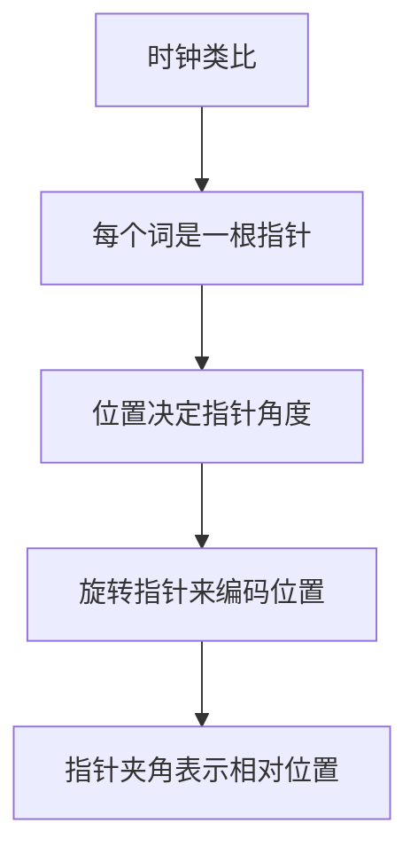
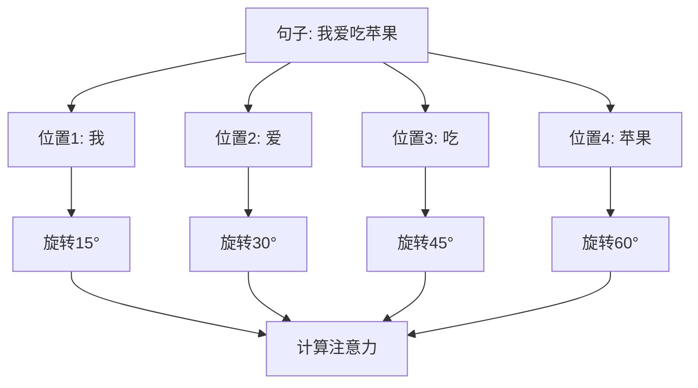

---
title: 旋转位置编码 (RoPE)
date: 2025-07-26
type: llm
---

_旋转位置编码的艺术概念图_

### 一个简单的例子

> 想象你在阅读这样两个句子：
>
> - "小明喜欢小红"
> - "小红喜欢小明"
>
> 这两个句子用的字完全一样，但是意思完全不同。为什么？因为**顺序很重要**！

但是 Transformer 的注意力机制有个"缺陷"：它天生不知道词语的顺序。对它来说，"小明喜欢小红"和"小红喜欢小明"看起来是一样的，就像把句子里的词随机打乱了一样。

### 位置编码就是解决方案

> 位置编码就像给每个词贴上"位置标签"：
>
> - 第 1 个位置的词：贴上"1 号"标签
> - 第 2 个位置的词：贴上"2 号"标签
> - 第 3 个位置的词：贴上"3 号"标签
>
> 这样模型就知道词语的先后顺序了。

### 传统方法的问题

现有的位置编码方法有两种：

**绝对位置编码**：就像给每个座位编号

- 优点：简单直接
- 缺点：只知道绝对位置，不知道词语之间的相对关系

**相对位置编码**：关注词语之间的距离

- 优点：更符合人类理解
- 缺点：实现复杂，有些场景用不了

RoPE 的目标就是：**能不能既简单又智能？**

---

## RoPE 的核心思想

### 用时钟来理解 RoPE

> 想象一个时钟，每个词语都是时钟上的一个指针：
>
> - 第 1 个位置的词：指针指向 12 点
> - 第 2 个位置的词：指针旋转一定角度
> - 第 3 个位置的词：指针再旋转相同角度
> - ...

### 为什么用旋转？

> 假设我们有两个词在位置 3 和位置 5：
>
> - 它们的指针夹角代表它们的"相对距离"（5-3=2）
> - 如果我们把整个句子都往后移动 2 个位置
> - 这两个词现在在位置 5 和位置 7
> - 但它们的指针夹角还是一样的！（7-5=2）

这就是 RoPE 的精髓：**通过旋转来保持相对位置关系不变**。

---

## 通俗理解 RoPE

### 生活中的类比

> 想象你和朋友站在一个大转盘上：
>
> 1. **初始状态**：你们俩面向不同方向，中间有个角度差
> 2. **转盘旋转**：转盘开始转动，你们都跟着转
> 3. **相对位置不变**：虽然你们在转动，但是你们之间的角度关系没变
>
> RoPE 就是这样工作的：
>
> - 每个词都像转盘上的一个人
> - 位置信息通过"旋转"来编码
> - 词与词之间的相对角度保持不变

### 简单的数学解释

> 不用担心复杂公式，核心思想很简单：
>
> 1. **把每个词想象成一个向量**（就像一根箭头）
> 2. **根据位置旋转这个向量**（就像转动箭头）
> 3. **计算两个向量的相似度**（就像看两根箭头有多像）

---

## RoPE 是如何工作的？

### 步骤拆解

> 让我们用一个具体例子来理解：
>
> **句子：** "我 爱 吃 苹果"
>
> **第一步：词向量**
>
> - 我：[0.1, 0.3, 0.5, 0.2]
> - 爱：[0.4, 0.1, 0.3, 0.6]
> - 吃：[0.2, 0.5, 0.1, 0.4]
> - 苹果：[0.3, 0.2, 0.4, 0.1]
>
> **第二步：位置旋转**
>
> - 位置 1 的"我"：向量旋转 15 度
> - 位置 2 的"爱"：向量旋转 30 度
> - 位置 3 的"吃"：向量旋转 45 度
> - 位置 4 的"苹果"：向量旋转 60 度
>
> **第三步：计算注意力**
>
> - "爱"和"吃"的相对角度：45°-30°=15°
> - 无论整个句子怎么移动，这个相对角度都不变

### 为什么这样设计有效？

1. **保持相对关系**：相邻词语的相对位置总是一样的
2. **支持长序列**：理论上可以处理任意长度的文本
3. **计算简单**：只需要简单的旋转运算

### 可视化理解

---

## RoPE 的优势

### 1. 最佳方案的结合

| 特性         | 绝对位置编码 | 相对位置编码 | RoPE |
| ------------ | ------------ | ------------ | ---- |
| 实现简单     | ✅           | ❌           | ✅   |
| 表达相对位置 | ❌           | ✅           | ✅   |
| 支持长序列   | ❌           | ❌           | ✅   |
| 计算效率高   | ✅           | ❌           | ✅   |

### 2. 神奇的"远程衰减"

> RoPE 有个很棒的特性：**距离越远的词，注意力自然衰减**。
>
> 就像现实生活中：
>
> - 你更关注身边的人（相邻的词）
> - 对远处的人关注度会自然降低（远距离的词）
>
> 这种设计很符合人类的认知习惯！

_RoPE 的远程衰减性质图表（d=128）- 横轴为相对距离，纵轴为相对强度_

### 3. 无限长度的理论支持

> 传统方法需要预先设定最大长度：
>
> - "这个模型最多只能处理 1000 个词"
>
> RoPE 理论上没有长度限制：
>
> - "给我多长的文章都能处理"

### 4. 适用性广泛

RoPE 是目前唯一可以用在各种注意力机制中的方法：

- 标准注意力：✅
- 线性注意力：✅
- 其他变种：✅

_RoPE 在 Performer（线性注意力）中的效果对比 - 显著降低验证损失_

---

## 实际应用

### 在哪些模型中使用？

RoPE 已经成为现代大语言模型的标配：

1. **LLaMA 系列**（Meta 公司）

   - 包括 ChatGPT 的强劲竞争对手

2. **ChatGLM 系列**（清华大学）

   - 中文对话模型的代表

3. **GPT-NeoX**（EleutherAI）

   - 开源大语言模型

4. **RoFormer**（追一科技）
   - 最早应用 RoPE 的模型

### 效果如何？

> 用数据说话：
>
> **小模型实验（125M 参数）：**
>
> - 传统绝对位置编码：困惑度 16.59
> - T5 相对位置编码：困惑度 16.46
> - **RoPE：困惑度 15.78**（最好！）
>
> **大模型实验（1.4B 参数）：**
>
> - 传统绝对位置编码：困惑度 9.393
> - T5 相对位置编码：困惑度 9.234
> - **RoPE：困惑度 8.784**（最好！）

_125M 参数模型在 OpenWebText2 数据集上的训练效果对比_

_1.4B 参数模型在 Pile 数据集上的训练效果对比_

_困惑度越低说明模型效果越好_

### 性能开销

> 很多人担心新方法会不会很慢？
>
> 实际测试结果：
>
> - 朴素实现：比传统方法慢 4-5 倍
> - 优化实现：比传统方法慢 2-3 倍
> - **整体模型影响：几乎可以忽略（1-3%）**
>
> 为什么影响这么小？因为大部分计算都花在模型的其他部分了！

---

## 总结

### RoPE 解决了什么问题？

1. **位置感知**：让 AI 知道词语的顺序
2. **相对关系**：理解词语之间的距离关系
3. **长序列**：支持处理很长的文本
4. **计算效率**：不会显著拖慢模型速度

### 为什么 RoPE 这么受欢迎？

> 用一个比喻来总结：
>
> 传统方法就像：
>
> - 绝对位置编码：给每个人发身份证号
> - 相对位置编码：让每个人记住和所有人的关系
>
> RoPE 就像：
>
> - 让大家站在一个聪明的转盘上
> - 转盘会自动维护大家的相对位置关系
> - 简单、智能、有效！

### 未来发展

RoPE 还在不断进化：

1. **更好的频率设计**：让旋转更精准
2. **多维扩展**：不只是文本，还能处理图像、音频
3. **效率优化**：让计算更快
4. **理论完善**：更深入的数学理解

---

## 写在最后

RoPE 的成功告诉我们：**好的想法往往来自简单而深刻的洞察**。

用旋转来编码位置，这个想法如此简单，却解决了困扰研究者多年的问题。这就是科学研究的魅力——在复杂的世界中找到简洁优雅的解决方案。

希望这个通俗的解释能帮助你理解 RoPE 的精髓。记住，不管多复杂的技术，背后的核心思想往往都很简单！

_RoPE：简单想法，深刻洞察_

---

