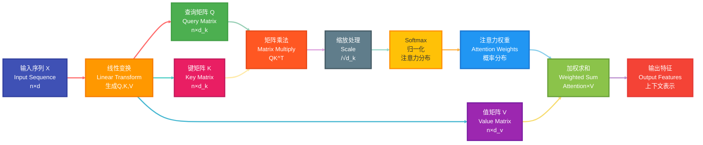
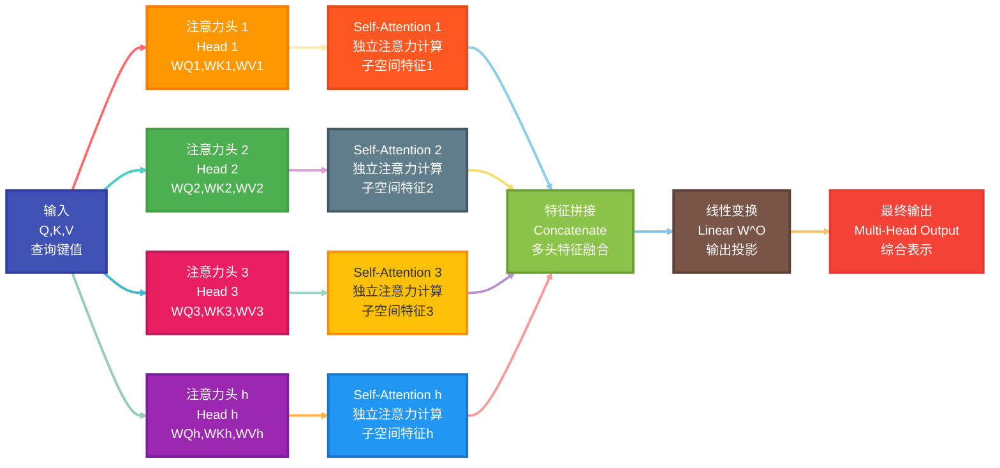
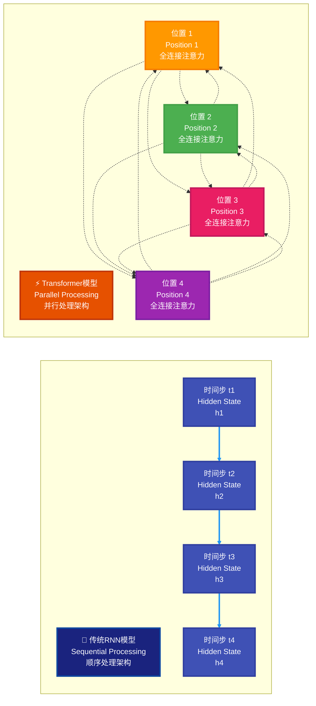

## 一、引言与背景

### 1. Transformer 的重要性

Transformer 是一种基于注意力机制的神经网络架构，由 Google 在 2017 年的论文《Attention is All You Need》中提出。它彻底改变了自然语言处理领域，成为了现代大型语言模型（如 GPT、BERT 等）的基础架构。

### 2. 传统模型的局限性

#### 2.1 RNN/LSTM 的问题

- **顺序依赖性**：RNN 必须按顺序处理输入，无法并行计算，训练效率低
- **梯度消失/爆炸**：长序列中信息传递困难，难以捕获长距离依赖关系
- **内存限制**：隐状态容量有限，难以存储复杂的上下文信息

#### 2.2 传统词向量的问题

- **静态表示**：Word2Vec 等预训练词向量是固定的，无法根据上下文动态调整
- **多义词困扰**：同一个词在不同语境中的含义无法区分
- **上下文缺失**：无法充分利用句子级别的语义信息

## 二、注意力机制（Attention Mechanism）

### 1. 注意力机制的核心思想

注意力机制模拟人类的注意力过程，让模型能够动态地关注输入序列中的重要部分，而不是平等对待所有信息。

### 2. Self-Attention（自注意力）

#### 2.1 基本概念

Self-Attention 是指序列内部元素之间的注意力计算，每个位置都可以关注序列中的任意位置，包括自身。

**经典例子**：

- "The animal didn't cross the street because **it** was too tired." → "it"指向"animal"
- "The animal didn't cross the street because **it** was too narrow." → "it"指向"street"

#### 2.2 数学计算过程

对于输入序列 $X \in \mathbb{R}^{n \times d}$，Self-Attention 的计算步骤如下：

1. **生成 Q、K、V 矩阵**：
   $$Q = XW^Q, \quad K = XW^K, \quad V = XW^V$$
   其中 $W^Q, W^K, W^V \in \mathbb{R}^{d \times d_k}$ 是可学习的权重矩阵

2. **计算注意力得分**：
   $$\text{Attention}(Q,K,V) = \text{softmax}\left(\frac{QK^T}{\sqrt{d_k}}\right)V$$

3. **缩放因子**：$\sqrt{d_k}$ 用于防止点积过大导致 softmax 饱和

4. **详细计算步骤**：
   - 注意力得分计算：$\text{Score}_{ij} = \frac{Q_i \cdot K_j^T}{\sqrt{d_k}}$
   - 注意力权重：$\alpha_{ij} = \frac{\exp(\text{Score}_{ij})}{\sum_{k=1}^{n} \exp(\text{Score}_{ik})}$
   - 输出向量：$\text{Output}_i = \sum_{j=1}^{n} \alpha_{ij} V_j$

5. **时间复杂度**：$O(n^2 \cdot d)$，其中 $n$ 是序列长度，$d$ 是特征维度

#### 2.4 Self-Attention 计算流程图

#### 2.3 Self-Attention 的优势

- **并行计算**：所有位置可以同时计算，不存在顺序依赖
- **长距离依赖**：任意两个位置之间可以直接建立连接
- **动态权重**：根据上下文动态调整注意力权重

### 3. Multi-Head Attention（多头注意力）

#### 3.1 设计动机

单个注意力头可能只关注某种特定的模式，多头注意力允许模型同时关注不同子空间的信息。

#### 3.2 计算公式

$$\text{MultiHead}(Q,K,V) = \text{Concat}(\text{head}_1, ..., \text{head}_h)W^O$$

其中每个头：
$$\text{head}_i = \text{Attention}(QW_i^Q, KW_i^K, VW_i^V)$$

#### 3.3 参数维度

- 输入维度：$d_{\text{model}} = 512$
- 注意力头数：$h = 8$
- 每个头的维度：$d_k = d_v = \frac{d_{\text{model}}}{h} = 64$
- 权重矩阵维度：
  - $W_i^Q, W_i^K, W_i^V \in \mathbb{R}^{d_{\text{model}} \times d_k}$
  - $W^O \in \mathbb{R}^{h \cdot d_v \times d_{\text{model}}}$

#### 3.4 计算复杂度

- 单头注意力：$O(n^2 d_k + n d_k^2)$
- 多头注意力：$O(h \cdot n^2 d_k + h \cdot n d_k^2) = O(n^2 d_{\text{model}} + n d_{\text{model}}^2)$

#### 3.3 Multi-Head Attention 架构图

#### 3.4 参数说明

- $h$：注意力头的数量（通常为 8 或 16）
- $W_i^Q, W_i^K, W_i^V \in \mathbb{R}^{d \times d_k}$：第$i$个头的投影矩阵
- $W^O \in \mathbb{R}^{hd_v \times d}$：输出投影矩阵
- 通常设置 $d_k = d_v = d/h$，保证参数量不变

## 三、Transformer 架构详解

### 1. 整体架构

Transformer 采用 Encoder-Decoder 架构：

- **Encoder**：将输入序列编码为隐状态表示
- **Decoder**：基于编码结果生成输出序列

#### 1.1 Transformer 整体架构流程图

```mermaid
graph LR
    A["输入文本<br/>Input Text<br/>原始序列"] --> B["词嵌入<br/>Token Embedding<br/>词汇向量化"]
    B --> C["位置编码<br/>Positional Encoding<br/>位置信息注入"]
    C --> D["编码器栈<br/>Encoder Stack<br/>N层编码器"]

    D --> E["编码表示<br/>Encoded Representation<br/>上下文特征"]
    E --> F["解码器栈<br/>Decoder Stack<br/>N层解码器"]

    G["目标序列<br/>Target Sequence<br/>输出引导"] --> H["词嵌入<br/>Token Embedding<br/>目标向量化"]
    H --> I["位置编码<br/>Positional Encoding<br/>目标位置信息"]
    I --> F

    F --> J["线性层<br/>Linear Layer<br/>特征映射"]
    J --> K["Softmax层<br/>Softmax<br/>概率分布"]
    K --> L["输出概率<br/>Output Probabilities<br/>词汇预测"]

    style A fill:#3F51B5,stroke:#303F9F,stroke-width:3px,color:#fff
    style B fill:#FF9800,stroke:#F57C00,stroke-width:3px,color:#fff
    style C fill:#4CAF50,stroke:#43A047,stroke-width:3px,color:#fff
    style D fill:#E91E63,stroke:#C2185B,stroke-width:3px,color:#fff
    style E fill:#9C27B0,stroke:#7B1FA2,stroke-width:3px,color:#fff
    style F fill:#FF5722,stroke:#E64A19,stroke-width:3px,color:#fff
    style G fill:#607D8B,stroke:#455A64,stroke-width:3px,color:#fff
    style H fill:#FFC107,stroke:#FF8F00,stroke-width:3px,color:#333
    style I fill:#2196F3,stroke:#1976D2,stroke-width:3px,color:#fff
    style J fill:#8BC34A,stroke:#689F38,stroke-width:3px,color:#fff
    style K fill:#795548,stroke:#5D4037,stroke-width:3px,color:#fff
    style L fill:#F44336,stroke:#E53935,stroke-width:3px,color:#fff

    linkStyle 0 stroke:#FF6B6B,stroke-width:3px
    linkStyle 1 stroke:#4ECDC4,stroke-width:3px
    linkStyle 2 stroke:#45B7D1,stroke-width:3px
    linkStyle 3 stroke:#96CEB4,stroke-width:3px
    linkStyle 4 stroke:#FFEAA7,stroke-width:3px
    linkStyle 5 stroke:#DDA0DD,stroke-width:3px
    linkStyle 6 stroke:#98D8C8,stroke-width:3px
    linkStyle 7 stroke:#FFB347,stroke-width:3px
    linkStyle 8 stroke:#87CEEB,stroke-width:3px
    linkStyle 9 stroke:#F7DC6F,stroke-width:3px
    linkStyle 10 stroke:#BB8FCE,stroke-width:3px
```

### 2. 输入处理

#### 2.1 词嵌入（Token Embedding）

将离散的词汇转换为连续的向量表示：
$$\text{Embedding}: \text{vocab\_size} \rightarrow d_{\text{model}}$$

#### 2.2 位置编码（Positional Encoding）

由于 Self-Attention 缺乏位置信息，需要添加位置编码：

$$PE_{(pos, 2i)} = \sin\left(\frac{pos}{10000^{2i/d_{\text{model}}}}\right)$$
$$PE_{(pos, 2i+1)} = \cos\left(\frac{pos}{10000^{2i/d_{\text{model}}}}\right)$$

其中：

- $pos$：位置索引（$0 \leq pos < \text{max\_len}$）
- $i$：维度索引（$0 \leq i < d_{\text{model}}/2$）
- $d_{\text{model}}$：模型维度

#### 2.3 位置编码的数学特性

位置编码具有以下重要特性：

1. **唯一性**：每个位置都有唯一的编码向量
2. **相对位置感知**：通过三角函数的加法定理实现
3. **外推能力**：可以处理比训练时更长的序列

**相对位置计算**：
$$PE_{pos+k} = PE_{pos} \cdot M_k + PE_{pos}^{\perp} \cdot N_k$$

其中 $M_k$ 和 $N_k$ 只依赖于相对距离 $k$。

#### 2.4 输入组合

最终输入为词嵌入与位置编码的元素级相加：
$$\text{Input} = \text{TokenEmbedding} + \text{PositionalEncoding}$$

### 3. Encoder 结构

每个 Encoder 层包含：

#### 3.1 Encoder 层内部流程图

每个 Encoder 层包含：

#### 3.1 Multi-Head Self-Attention

- 输入：$X \in \mathbb{R}^{n \times d}$
- 输出：注意力加权后的表示

#### 3.2 Position-wise Feed-Forward Network

$$\text{FFN}(x) = \max(0, xW_1 + b_1)W_2 + b_2$$

- 两层全连接网络，中间使用 ReLU 激活
- 通常中间层维度为 $4d_{\text{model}}$

#### 3.3 残差连接与层归一化

$$\text{LayerNorm}(x + \text{Sublayer}(x))$$

**层归一化的详细计算**：

1. **计算均值和方差**：
   $$\mu = \frac{1}{d} \sum_{i=1}^{d} x_i$$
   $$\sigma^2 = \frac{1}{d} \sum_{i=1}^{d} (x_i - \mu)^2$$

2. **标准化**：
   $$\hat{x}_i = \frac{x_i - \mu}{\sqrt{\sigma^2 + \epsilon}}$$

3. **缩放和平移**：
   $$\text{LayerNorm}(x_i) = \gamma \hat{x}_i + \beta$$

其中：
- $\gamma$ 和 $\beta$ 是可学习参数
- $\epsilon$ 是防止除零的小常数（通常为 $10^{-6}$）
- $d$ 是特征维度

**残差连接的作用**：
- 缓解深层网络的梯度消失问题
- 提供信息的直接通道
- 使得网络可以学习恒等映射

### 4. Decoder 结构

Decoder 在 Encoder 基础上增加了：

#### 4.1 Decoder 层内部流程图

```mermaid
graph LR
    A["目标输入<br/>Target Input<br/>输出序列"] --> B["掩码自注意力<br/>Masked Self-Attention<br/>防止信息泄露"]
    B --> C["残差连接&归一化<br/>Add & Norm<br/>第一层稳定"]
    A --> C
    C --> D["编码-解码注意力<br/>Encoder-Decoder Attention<br/>源序列关注"]
    E["编码器输出<br/>Encoder Output<br/>源序列表示"] --> D
    D --> F["残差连接&归一化<br/>Add & Norm<br/>第二层稳定"]
    C --> F
    F --> G["前馈神经网络<br/>Feed Forward<br/>非线性变换"]
    G --> H["残差连接&归一化<br/>Add & Norm<br/>最终稳定"]
    F --> H
    H --> I["解码输出<br/>Decoder Output<br/>生成表示"]

    style A fill:#3F51B5,stroke:#303F9F,stroke-width:3px,color:#fff
    style B fill:#FF9800,stroke:#F57C00,stroke-width:3px,color:#fff
    style C fill:#4CAF50,stroke:#43A047,stroke-width:3px,color:#fff
    style D fill:#E91E63,stroke:#C2185B,stroke-width:3px,color:#fff
    style E fill:#9C27B0,stroke:#7B1FA2,stroke-width:3px,color:#fff
    style F fill:#FF5722,stroke:#E64A19,stroke-width:3px,color:#fff
    style G fill:#607D8B,stroke:#455A64,stroke-width:3px,color:#fff
    style H fill:#FFC107,stroke:#FF8F00,stroke-width:3px,color:#333
    style I fill:#F44336,stroke:#E53935,stroke-width:3px,color:#fff

    linkStyle 0 stroke:#FF6B6B,stroke-width:3px
    linkStyle 1 stroke:#4ECDC4,stroke-width:3px
    linkStyle 2 stroke:#45B7D1,stroke-width:3px
    linkStyle 3 stroke:#96CEB4,stroke-width:3px
    linkStyle 4 stroke:#FFEAA7,stroke-width:3px
    linkStyle 5 stroke:#DDA0DD,stroke-width:3px
    linkStyle 6 stroke:#98D8C8,stroke-width:3px
    linkStyle 7 stroke:#FFB347,stroke-width:3px
    linkStyle 8 stroke:#87CEEB,stroke-width:3px
```

#### 4.2 Masked Self-Attention

- 在训练时防止模型"看到未来"的信息
- 使用下三角掩码矩阵：
  $$
  \text{mask}_{i,j} = \begin{cases}
  0 & \text{if } j \leq i \\
  -\infty & \text{if } j > i
  \end{cases}
  $$

#### 4.3 Encoder-Decoder Attention

- Query 来自 Decoder，Key 和 Value 来自 Encoder
- 允许 Decoder 关注输入序列的相关部分

### 5. 输出层

#### 5.1 线性变换

$$\text{Linear}: d_{\text{model}} \rightarrow \text{vocab\_size}$$

#### 5.2 Softmax

$$P(w_i) = \frac{\exp(z_i)}{\sum_{j=1}^{|\text{vocab}|} \exp(z_j)}$$

## 四、训练与优化

### 1. 损失函数

使用交叉熵损失：
$$\mathcal{L} = -\sum_{i=1}^{n} \sum_{j=1}^{|\text{vocab}|} y_{i,j} \log(\hat{y}_{i,j})$$

### 2. 优化技巧

#### 2.1 学习率调度

原论文使用了预热+衰减的学习率调度策略：

$$\text{lr} = d_{\text{model}}^{-0.5} \cdot \min(\text{step\_num}^{-0.5}, \text{step\_num} \cdot \text{warmup\_steps}^{-1.5})$$

- **预热阶段**：学习率线性增加到峰值
- **衰减阶段**：学习率按步数的平方根衰减

#### 2.2 正则化技术

- **Dropout**：在注意力权重和前馈网络中应用，防止过拟合
  $$\text{Dropout}(x) = \begin{cases}
  \frac{x}{1-p} & \text{训练时，概率为 } 1-p \\
  x & \text{推理时}
  \end{cases}$$

- **Label Smoothing**：提高泛化能力
  $$\tilde{y}_k = (1-\alpha) y_k + \frac{\alpha}{K}$$
  其中 $\alpha$ 是平滑参数，$K$ 是类别数

### 3. 计算复杂度

- Self-Attention：$O(n^2 \cdot d)$
- Feed-Forward：$O(n \cdot d^2)$
- 其中$n$是序列长度，$d$是模型维度

## 五、应用与变体

### 1. 主要应用

- **机器翻译**：原始 Transformer 的主要任务
- **语言建模**：GPT 系列
- **文本理解**：BERT 系列
- **多模态**：CLIP、ViT 等

### 2. 重要变体

- **BERT**：只使用 Encoder，双向建模
- **GPT**：只使用 Decoder，自回归生成
- **T5**：Text-to-Text 统一框架

## 六、总结

Transformer 的核心贡献：

1. **完全基于注意力**：摒弃了循环和卷积结构
2. **并行化训练**：大幅提升训练效率
3. **长距离建模**：有效捕获长距离依赖关系
4. **可扩展性强**：为大规模预训练模型奠定基础

### Transformer vs 传统模型对比图

---

Transformer 不仅革命性地改变了 NLP 领域，也为计算机视觉、语音处理等领域带来了新的思路，是深度学习历史上的重要里程碑。
