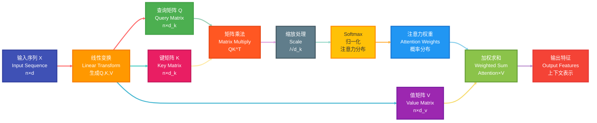
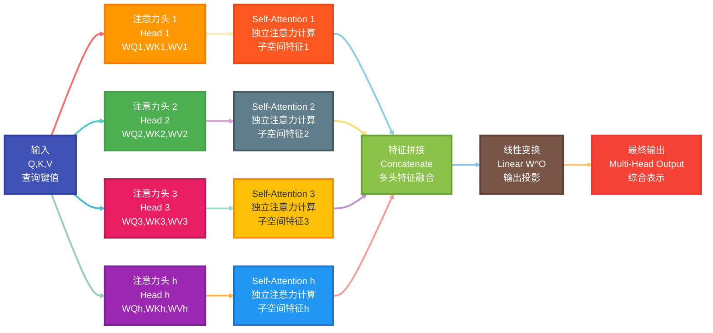
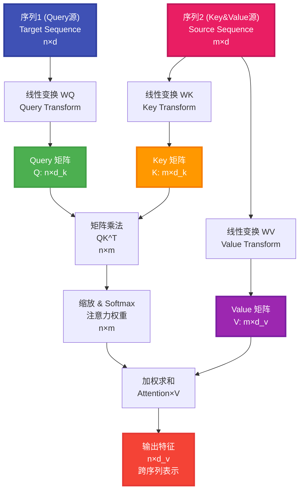

---
title: Transformer
date: 2025-07-13
type: notes
---


## 传统的 RNN 网络


传统的 RNN 计算时有什么问题？

1. 长期依赖问题
   - 在处理长文本序列时，RNN 无法有效记住前面的序列信息
   - 随着序列长度增加，早期信息会逐渐丢失
2. 梯度消失/爆炸问题
   - 在反向传播过程中，梯度可能会指数级衰减（梯度消失）
   - 或者梯度可能会指数级增长（梯度爆炸）
   - 导致网络难以学习长距离依赖关系
3. 顺序计算限制

   - RNN 必须按顺序处理序列，无法并行计算
   - 训练和推理效率较低

4. 信息瓶颈
   - 所有历史信息都要通过固定大小的隐藏状态传递
   - 容易造成信息丢失，特别是在长序列中

RNN 退出历史舞台的原因：2017 年 `Attention Is All You Need`，2018 Google 发布`BERT`

## 传统的 word2vec


- **静态表示**：Word2Vec 等预训练词向量是固定的，无法根据上下文动态调整
- **多义词困扰**：同一个词在不同语境中的含义无法区分
- **上下文缺失**：无法充分利用句子级别的语义信息

## 注意力机制（Attention Mechanism）

### 注意力机制的核心思想

注意力机制模拟人类的注意力过程，让模型能够动态地关注输入序列中的重要部分，而不是平等对待所有信息。

### Self-Attention（自注意力）

#### 基本概念

Self-Attention 是指序列内部元素之间的注意力计算，每个位置都可以关注序列中的任意位置，包括自身。

**经典例子**：

- "The animal didn't cross the street because **it** was too tired." → "it"指向"animal"
- "The animal didn't cross the street because **it** was too narrow." → "it"指向"street"

#### 数学计算过程

_Link：[注意力机制的本质|Self-Attention|Transformer|QKV 矩阵哔哩哔哩 bilibili](https://www.bilibili.com/video/BV1dt4y1J7ov)_

对于输入序列 $X \in \mathbb{R}^{n \times d}$，Self-Attention 的计算步骤如下：

1. **生成 Q、K、V 矩阵**：
   $$Q = XW^Q, \quad K = XW^K, \quad V = XW^V$$
   其中 $W^Q, W^K, W^V \in \mathbb{R}^{d \times d_k}$ 是可学习的权重矩阵

2. **计算注意力得分**：
   $$\text{Attention}(Q,K,V) = \text{softmax}\left(\frac{QK^T}{\sqrt{d_k}}\right)V$$

   

3. **缩放因子**：$\sqrt{d_k}$ 用于防止点积过大导致 softmax 饱和


#### Self-Attention 计算流程图




#### Self-Attention 的优势

- **并行计算**：所有位置可以同时计算，不存在顺序依赖
- **长距离依赖**：任意两个位置之间可以直接建立连接
- **动态权重**：根据上下文动态调整注意力权重

## Multi-Head Attention（多头注意力）


### 设计动机

单个注意力头可能只关注某种特定的模式，**多头注意力允许模型同时关注不同子空间的信息**。

### 位置编码

Transformer 引入了位置编码，将输入序列中的位置信息编码为向量，并作为输入序列的输入。

位置编码的计算公式为：
$$PE_{(pos, 2i)} = \sin\left(\frac{pos}{10000^{2i/d_{model}}}\right), \quad PE_{(pos, 2i+1)} = \cos\left(\frac{pos}{10000^{2i/d_{model}}}\right)$$
其中 $pos$ 是位置，$i$ 是维度索引，$d_{model}$ 是模型的维度。

### 计算公式

$$\text{MultiHead}(Q,K,V) = \text{Concat}(\text{head}_1, ..., \text{head}_h)W^O$$

其中每个头：
$$\text{head}_i = \text{Attention}(QW_i^Q, KW_i^K, VW_i^V)$$

### Multi-Head Attention 架构图



### 参数说明

- $h$：注意力头的数量（通常为 8 或 16）
- $W_i^Q, W_i^K, W_i^V \in \mathbb{R}^{d \times d_k}$：第$i$个头的投影矩阵
- $W^O \in \mathbb{R}^{hd_v \times d}$：输出投影矩阵
- 通常设置 $d_k = d_v = d/h$，保证参数量不变

## Cross Attention（交叉注意力）

### 基本概念

Cross Attention 是注意力机制的一种变体，与 Self-Attention 的主要区别在于：

- **Self-Attention**：Query、Key、Value 都来自同一个序列
- **Cross Attention**：Query 来自一个序列，Key 和 Value 来自另一个序列

### 计算公式

$$\text{CrossAttention}(Q, K, V) = \text{softmax}\left(\frac{QK^T}{\sqrt{d_k}}\right)V$$

其中：

- $Q = X_1 W^Q$（来自序列 1）
- $K = X_2 W^K$（来自序列 2）
- $V = X_2 W^V$（来自序列 2）

### 应用场景

#### 1. **机器翻译**

- Query：目标语言的词向量
- Key & Value：源语言的词向量
- 作用：目标语言的每个词都能关注到源语言的相关词汇

#### 2. **Transformer Decoder**

- Query：来自 Decoder 的隐藏状态
- Key & Value：来自 Encoder 的输出
- 作用：Decoder 在生成时能够关注到 Encoder 的全部信息

#### 3. **图像描述生成**

- Query：文本序列的隐藏状态
- Key & Value：图像的特征向量
- 作用：生成文本时关注图像的相关区域

### Cross Attention 架构图



### 与 Self-Attention 的对比

| 特性               | Self-Attention     | Cross Attention      |
| ------------------ | ------------------ | -------------------- |
| **Q, K, V 来源**   | 同一序列           | 不同序列             |
| **注意力矩阵大小** | n×n                | n×m                  |
| **主要用途**       | 序列内部建模       | 序列间关系建模       |
| **典型应用**       | 语言理解、特征提取 | 机器翻译、多模态融合 |

### 实际应用示例

#### 机器翻译中的 Cross Attention

```
源语言: "I love you"
目标语言: "我 爱 你"

Cross Attention 让：
- "我" 主要关注 "I"
- "爱" 主要关注 "love"
- "你" 主要关注 "you"
```

### 优势特点

1. **跨模态连接**：能够建立不同序列/模态之间的联系
2. **信息融合**：有效整合来自不同源的信息
3. **对齐能力**：在翻译等任务中实现源-目标对齐
4. **灵活性**：适用于各种序列到序列的任务

Cross Attention 是 Transformer 架构中实现编码器-解码器信息交互的关键机制，使得模型能够在生成过程中充分利用输入信息。

