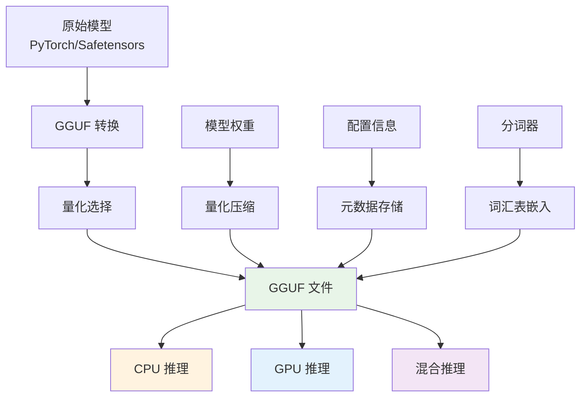

## 概述

GGUF (GPT-Generated Unified Format) 是由 llama.cpp 项目开发的新一代模型文件格式，于 2023 年推出，用于替代之前的 GGML 格式。GGUF 专为高效存储和加载大语言模型而设计，特别针对 CPU 推理优化，支持多种量化精度和内存映射技术。

### 核心特性

GGUF 格式的主要优势包括：

1. **高效量化**：支持多种精度的权重量化（Q4_0, Q4_1, Q5_0, Q5_1, Q8_0 等）
2. **内存映射**：支持 mmap，实现快速模型加载
3. **跨平台兼容**：统一的二进制格式，支持不同操作系统
4. **元数据丰富**：包含完整的模型配置和分词器信息
5. **向后兼容**：可以转换现有的 PyTorch/Safetensors 模型



### 技术优势

相比传统格式，GGUF 具有显著优势：

| 特性     | GGUF       | PyTorch     | Safetensors |
| -------- | ---------- | ----------- | ----------- |
| 文件大小 | 小（量化） | 大          | 中等        |
| 加载速度 | 快（mmap） | 慢          | 中等        |
| CPU 推理 | 优化       | 一般        | 一般        |
| 内存使用 | 低         | 高          | 中等        |
| 跨平台   | 优秀       | Python 依赖 | 好          |

## 技术原理

### 文件结构

GGUF 文件采用二进制格式，由以下部分组成：

```text
┌─────────────────┐
│     文件头       │ ← 魔数、版本、元数据
├─────────────────┤
│   键值元数据      │ ← 模型配置、分词器信息
├─────────────────┤
│   张量信息       │ ← 权重张量的元信息
├─────────────────┤
│   填充对齐       │ ← 内存对齐优化
├─────────────────┤
│   张量数据       │ ← 实际的权重数据
└─────────────────┘
```

### 量化算法

GGUF 支持多种量化方法，每种都有不同的精度和压缩比：

#### Q4_0 量化（4-bit）

```python
# Q4_0 量化原理
def quantize_q4_0(weights, block_size=32):
    """4-bit 量化，每32个元素一组"""

    # 将权重分块
    blocks = weights.reshape(-1, block_size)
    quantized_blocks = []
    scales = []

    for block in blocks:
        # 计算缩放因子
        abs_max = torch.max(torch.abs(block))
        scale = abs_max / 7.0  # 4-bit 范围：-7到7
        scales.append(scale)

        # 量化到4-bit
        quantized = torch.round(block / scale).clamp(-7, 7)

        # 打包为4-bit存储
        packed = pack_4bit(quantized)
        quantized_blocks.append(packed)

    return quantized_blocks, scales

def dequantize_q4_0(quantized_blocks, scales):
    """反量化恢复权重"""
    dequantized = []

    for packed, scale in zip(quantized_blocks, scales):
        # 解包4-bit数据
        unpacked = unpack_4bit(packed)

        # 反量化
        block = unpacked.float() * scale
        dequantized.append(block)

    return torch.cat(dequantized)
```

#### Q8_0 量化（8-bit）

```python
def quantize_q8_0(weights, block_size=32):
    """8-bit 量化，更高精度"""

    blocks = weights.reshape(-1, block_size)
    quantized_blocks = []
    scales = []

    for block in blocks:
        abs_max = torch.max(torch.abs(block))
        scale = abs_max / 127.0  # 8-bit 范围：-127到127
        scales.append(scale)

        quantized = torch.round(block / scale).clamp(-127, 127)
        quantized_blocks.append(quantized.to(torch.int8))

    return quantized_blocks, scales
```

### 内存映射技术

GGUF 通过内存映射实现快速加载：

```python
import mmap
import numpy as np

class GGUFLoader:
    """GGUF 文件加载器"""

    def __init__(self, file_path):
        self.file_path = file_path
        self.file_handle = None
        self.mmap_handle = None

    def load_with_mmap(self):
        """使用内存映射加载模型"""

        # 打开文件
        self.file_handle = open(self.file_path, 'rb')

        # 创建内存映射
        self.mmap_handle = mmap.mmap(
            self.file_handle.fileno(),
            0,
            access=mmap.ACCESS_READ
        )

        # 解析文件头
        header = self.parse_header()

        # 解析元数据
        metadata = self.parse_metadata()

        # 获取张量信息（不立即加载数据）
        tensor_info = self.parse_tensor_info()

        return header, metadata, tensor_info

    def get_tensor(self, tensor_name):
        """按需加载特定张量"""
        tensor_info = self.tensor_info[tensor_name]

        # 直接从内存映射中获取数据
        offset = tensor_info['offset']
        size = tensor_info['size']
        dtype = tensor_info['dtype']

        # 零拷贝获取数据
        data = np.frombuffer(
            self.mmap_handle[offset:offset+size],
            dtype=dtype
        )

        return data.reshape(tensor_info['shape'])
```

## 实现细节

### 模型转换

将现有模型转换为 GGUF 格式：

```python
from transformers import AutoTokenizer, AutoModelForCausalLM
import gguf

def convert_to_gguf(model_name, output_path, quantization="q4_0"):
    """转换模型为 GGUF 格式"""

    # 1. 加载原始模型
    model = AutoModelForCausalLM.from_pretrained(
        model_name,
        torch_dtype=torch.float16,
        device_map="cpu"
    )
    tokenizer = AutoTokenizer.from_pretrained(model_name)

    # 2. 创建 GGUF 写入器
    gguf_writer = gguf.GGUFWriter(output_path, "llama")

    # 3. 写入元数据
    gguf_writer.add_name(model_name)
    gguf_writer.add_description(f"Converted from {model_name}")
    gguf_writer.add_file_type(gguf.GGMLQuantizationType.Q4_0)

    # 4. 写入分词器信息
    gguf_writer.add_tokenizer_model("llama")
    gguf_writer.add_token_list(tokenizer.get_vocab())

    # 5. 写入模型配置
    config = model.config
    gguf_writer.add_context_length(config.max_position_embeddings)
    gguf_writer.add_embedding_length(config.hidden_size)
    gguf_writer.add_block_count(config.num_hidden_layers)
    gguf_writer.add_feed_forward_length(config.intermediate_size)
    gguf_writer.add_head_count(config.num_attention_heads)

    # 6. 量化并写入权重
    for name, tensor in model.state_dict().items():
        # 量化张量
        if quantization == "q4_0":
            quantized_tensor = quantize_q4_0(tensor)
        elif quantization == "q8_0":
            quantized_tensor = quantize_q8_0(tensor)
        else:
            quantized_tensor = tensor  # 保持原精度

        # 写入张量
        gguf_writer.add_tensor(name, quantized_tensor)

    # 7. 完成写入
    gguf_writer.write_header_to_file()
    gguf_writer.write_kv_data_to_file()
    gguf_writer.write_tensors_to_file()
    gguf_writer.close()

    print(f"模型已转换为 GGUF 格式: {output_path}")

# 使用示例
convert_to_gguf("microsoft/DialoGPT-small", "dialogpt-small-q4_0.gguf")
```

### 模型加载与推理

```python
import llama_cpp

class GGUFInference:
    """GGUF 模型推理类"""

    def __init__(self, model_path, **kwargs):
        # 加载 GGUF 模型
        self.llm = llama_cpp.Llama(
            model_path=model_path,
            n_ctx=kwargs.get('context_length', 2048),
            n_threads=kwargs.get('threads', 4),
            n_gpu_layers=kwargs.get('gpu_layers', 0),  # CPU推理设为0
            verbose=False
        )

    def generate(self, prompt, max_tokens=100, temperature=0.7):
        """文本生成"""
        response = self.llm(
            prompt,
            max_tokens=max_tokens,
            temperature=temperature,
            stop=["</s>", "\n"],
            echo=False
        )

        return response['choices'][0]['text']

    def get_embeddings(self, text):
        """获取文本嵌入"""
        return self.llm.embed(text)

    def get_model_info(self):
        """获取模型信息"""
        return {
            'context_length': self.llm.n_ctx(),
            'vocab_size': self.llm.n_vocab(),
            'embedding_size': self.llm.n_embd()
        }

# 使用示例
model = GGUFInference("./models/llama-2-7b-chat.q4_0.gguf")
response = model.generate("你好，今天天气怎么样？", max_tokens=50)
print(response)
```

## 性能分析

### 量化精度对比

不同量化方法的性能特征：

| 量化类型 | 比特数 | 模型大小压缩 | 推理速度 | 精度损失 | 适用场景   |
| -------- | ------ | ------------ | -------- | -------- | ---------- |
| F16      | 16     | 50%          | 中等     | 无       | 高精度需求 |
| Q8_0     | 8      | 75%          | 快       | 很小     | 平衡选择   |
| Q5_1     | 5      | 80%          | 快       | 小       | 推荐选择   |
| Q4_1     | 4      | 87.5%        | 很快     | 中等     | 资源受限   |
| Q4_0     | 4      | 87.5%        | 很快     | 中等     | 最小模型   |

### 性能优化建议

针对不同硬件配置的 GGUF 优化策略：

```python
def get_optimal_config(available_memory_gb, cpu_cores):
    """根据硬件配置推荐最优设置"""

    configs = {
        # 低配置设备 (< 8GB RAM)
        "low": {
            "quantization": "Q4_0",
            "context_length": 1024,
            "threads": min(4, cpu_cores),
            "batch_size": 1,
            "use_mmap": True
        },
        # 中配置设备 (8-16GB RAM)
        "medium": {
            "quantization": "Q5_1",
            "context_length": 2048,
            "threads": min(8, cpu_cores),
            "batch_size": 4,
            "use_mmap": True
        },
        # 高配置设备 (> 16GB RAM)
        "high": {
            "quantization": "Q8_0",
            "context_length": 4096,
            "threads": cpu_cores,
            "batch_size": 8,
            "use_mmap": True
        }
    }

    if available_memory_gb < 8:
        return configs["low"]
    elif available_memory_gb < 16:
        return configs["medium"]
    else:
        return configs["high"]

# 实际使用示例
import psutil

def setup_optimized_model(model_path):
    """自动配置最优模型设置"""

    # 获取系统信息
    memory_gb = psutil.virtual_memory().total / (1024**3)
    cpu_cores = psutil.cpu_count()

    # 获取推荐配置
    config = get_optimal_config(memory_gb, cpu_cores)

    # 加载模型
    llm = llama_cpp.Llama(
        model_path=model_path,
        n_ctx=config["context_length"],
        n_threads=config["threads"],
        use_mmap=config["use_mmap"],
        verbose=True
    )

    print(f"已加载模型，配置: {config}")
    return llm, config
```

### 推理性能测试

```python
def benchmark_inference():
    """推理性能基准测试"""

    import time

    models = {
        "GGUF-Q4_0": GGUFInference("model-q4_0.gguf"),
        "GGUF-Q8_0": GGUFInference("model-q8_0.gguf"),
        "GGUF-F16": GGUFInference("model-f16.gguf")
    }

    test_prompt = "解释一下人工智能的发展历程："
    results = {}

    for name, model in models.items():
        times = []

        # 多次测试取平均
        for _ in range(10):
            start = time.time()
            response = model.generate(test_prompt, max_tokens=100)
            end = time.time()
            times.append(end - start)

        avg_time = sum(times) / len(times)
        tokens_per_second = 100 / avg_time

        results[name] = {
            "avg_time": avg_time,
            "tokens_per_second": tokens_per_second,
            "response_length": len(response)
        }

    return results
```

## 实际应用案例

### 本地部署

使用 GGUF 格式进行 Qwen 模型本地部署：

```python
from flask import Flask, request, jsonify
import llama_cpp
import json

app = Flask(__name__)

# 加载 Qwen 模型
llm = llama_cpp.Llama(
    model_path="./models/qwen2.5-7b-instruct-q4_0.gguf",
    n_ctx=8192,  # Qwen 支持更长的上下文
    n_threads=8,
    n_gpu_layers=0,  # 纯 CPU 推理
    verbose=False
)

def format_qwen_prompt(messages):
    """格式化 Qwen 对话提示词"""
    formatted_prompt = ""

    for message in messages:
        role = message.get('role', 'user')
        content = message.get('content', '')

        if role == 'system':
            formatted_prompt += f"<|im_start|>system\n{content}<|im_end|>\n"
        elif role == 'user':
            formatted_prompt += f"<|im_start|>user\n{content}<|im_end|>\n"
        elif role == 'assistant':
            formatted_prompt += f"<|im_start|>assistant\n{content}<|im_end|>\n"

    # 添加助手开始标记
    formatted_prompt += "<|im_start|>assistant\n"
    return formatted_prompt

@app.route('/chat', methods=['POST'])
def chat():
    """聊天接口 - 兼容 OpenAI API 格式"""
    data = request.json
    messages = data.get('messages', [])
    max_tokens = data.get('max_tokens', 1024)
    temperature = data.get('temperature', 0.7)

    # 格式化提示词
    prompt = format_qwen_prompt(messages)

    # 生成回复
    response = llm(
        prompt,
        max_tokens=max_tokens,
        temperature=temperature,
        top_p=0.8,
        stop=["<|im_end|>", "<|im_start|>"],
        echo=False
    )

    assistant_response = response['choices'][0]['text'].strip()

    return jsonify({
        'id': 'chatcmpl-' + str(hash(prompt))[-8:],
        'object': 'chat.completion',
        'model': 'qwen2.5-7b-instruct',
        'choices': [{
            'index': 0,
            'message': {
                'role': 'assistant',
                'content': assistant_response
            },
            'finish_reason': 'stop'
        }],
        'usage': {
            'prompt_tokens': len(prompt.split()),
            'completion_tokens': len(assistant_response.split()),
            'total_tokens': response['usage']['total_tokens']
        }
    })

@app.route('/v1/chat/completions', methods=['POST'])
def openai_compatible_chat():
    """OpenAI 兼容的聊天接口"""
    return chat()

@app.route('/models', methods=['GET'])
def list_models():
    """模型列表接口"""
    return jsonify({
        'data': [{
            'id': 'qwen2.5-7b-instruct',
            'object': 'model',
            'created': 1234567890,
            'owned_by': 'local'
        }]
    })

@app.route('/health', methods=['GET'])
def health():
    """健康检查"""
    return jsonify({
        'status': 'healthy',
        'model': 'qwen2.5-7b-instruct',
        'context_length': llm.n_ctx(),
        'vocab_size': llm.n_vocab()
    })

# 测试函数
def test_qwen_model():
    """测试 Qwen 模型功能"""
    test_messages = [
        {"role": "system", "content": "你是一个有用的AI助手。"},
        {"role": "user", "content": "请简单介绍一下GGUF格式的优势。"}
    ]

    prompt = format_qwen_prompt(test_messages)
    response = llm(prompt, max_tokens=200, temperature=0.7)

    print("测试提示词:")
    print(prompt)
    print("\n模型回复:")
    print(response['choices'][0]['text'])

if __name__ == '__main__':
    print("正在启动 Qwen 模型服务...")
    print(f"模型上下文长度: {llm.n_ctx()}")
    print(f"词汇表大小: {llm.n_vocab()}")

    # 运行测试
    test_qwen_model()

    # 启动服务
    app.run(host='0.0.0.0', port=8000, debug=False)
```

**使用示例：**

```bash
# 启动服务
python qwen_server.py

# 使用 curl 测试
curl -X POST http://localhost:8000/chat \
  -H "Content-Type: application/json" \
  -d '{
    "messages": [
      {"role": "system", "content": "你是一个AI助手，专门帮助用户理解技术概念。"},
      {"role": "user", "content": "什么是GGUF格式？它有什么优势？"}
    ],
    "max_tokens": 500,
    "temperature": 0.7
  }'

# OpenAI 兼容接口测试
curl -X POST http://localhost:8000/v1/chat/completions \
  -H "Content-Type: application/json" \
  -d '{
    "model": "qwen2.5-7b-instruct",
    "messages": [
      {"role": "user", "content": "用Python写一个简单的Hello World程序"}
    ]
  }'
```

## 工具与生态

### 转换工具

主要的 GGUF 转换工具：

1. **llama.cpp convert.py**：官方转换脚本
2. **ggml-tools**：社区工具集
3. **transformers-to-gguf**：Hugging Face 桥接

```bash
# 使用 llama.cpp 转换
python convert.py --input model.bin --output model.gguf --type q4_0

# 使用 Hugging Face transformers
python -m transformers.convert_graph_to_gguf \
    --model_name microsoft/DialoGPT-medium \
    --output_dir ./gguf_models \
    --quantize q4_0
```

### 推理框架支持

- **llama.cpp**：原生 C++ 实现
- **ggml**：底层计算库
- **ollama**：用户友好的本地部署
- **text-generation-webui**：Web 界面
- **koboldcpp**：游戏 AI 应用

### 模型仓库

主要的 GGUF 模型来源：

- **Hugging Face Hub**：官方模型仓库
- **TheBloke**：社区量化模型
- **Chinese-LLaMA-Alpaca**：中文优化模型

## 总结

### GGUF 的优势与局限

**优势：**

1. **高效压缩**：通过量化大幅减少模型大小
2. **快速加载**：内存映射技术实现秒级加载
3. **跨平台**：统一格式支持多种硬件平台
4. **生态丰富**：完善的工具链和社区支持

**局限：**

1. **精度损失**：量化会带来一定的精度损失
2. **CPU 限制**：主要针对 CPU 推理优化
3. **格式依赖**：需要专门的加载库
4. **转换成本**：需要额外的模型转换步骤

### 相关资源

#### 官方文档与规范

- **GGUF 规范文档**：[GGUF Format Specification](https://github.com/ggml-org/ggml/blob/master/docs/gguf.md) - 完整的技术规范和格式定义
- **llama.cpp 仓库**：[llama.cpp GitHub](https://github.com/ggml-org/llama.cpp) - 主要实现和工具集
- **GGML 项目**：[GGML](https://github.com/ggml-org/ggml) - 底层机器学习库

#### 图像资源

- **GGUF 文件结构图**：[官方结构示意图](https://private-user-images.githubusercontent.com/1991296/313174776-c3623641-3a1d-408e-bfaf-1b7c4e16aa63.png) - 展示 GGUF 文件的内部布局
- **量化示意图**：建议参考 [GGML 文档的量化章节](https://github.com/ggml-org/ggml/blob/master/docs/gguf.md#file-structure) 了解量化原理

#### 在线工具

- **模型转换**：[GGUF-my-repo](https://huggingface.co/spaces/ggml-org/gguf-my-repo) - Hugging Face 在线转换工具
- **元数据编辑**：[GGUF Editor](https://huggingface.co/spaces/CISCai/gguf-editor) - 浏览器内编辑 GGUF 元数据
- **LoRA 转换**：[GGUF-my-LoRA](https://huggingface.co/spaces/ggml-org/gguf-my-lora) - LoRA 适配器格式转换

#### 模型资源

- **GGUF 模型集合**：[Hugging Face GGUF Models](https://huggingface.co/models?library=gguf&sort=trending) - 社区共享的量化模型
- **量化模型**：[TheBloke](https://huggingface.co/TheBloke) - 高质量的模型量化版本
- **中文模型**：[Chinese-LLaMA-Alpaca](https://github.com/ymcui/Chinese-LLaMA-Alpaca) - 中文优化的 GGUF 模型
