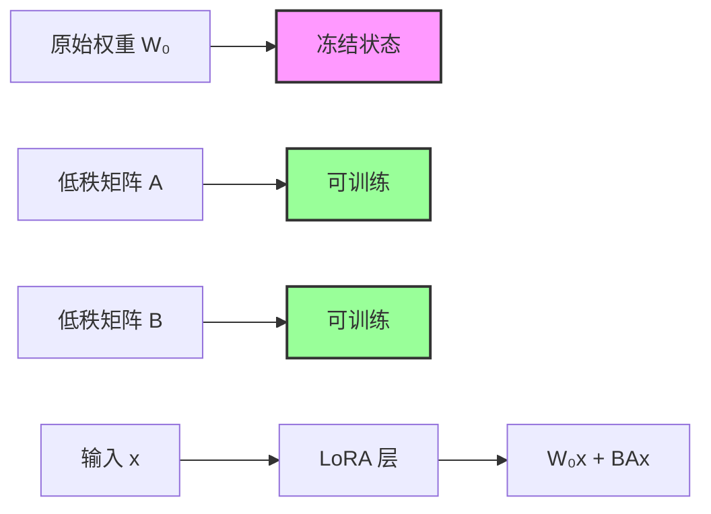
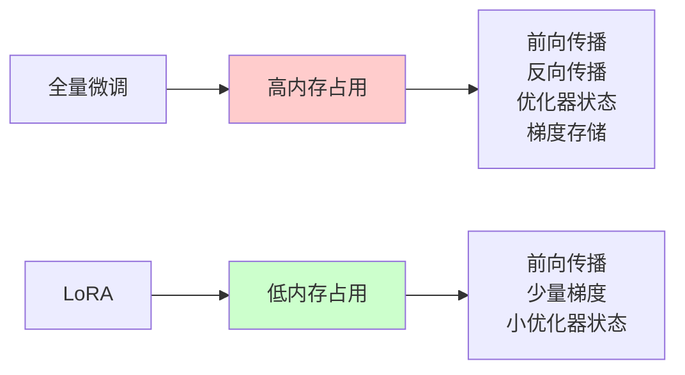

## 概述

LoRA (Low-Rank Adaptation) 是一种参数高效的微调技术，由微软研究团队在 2021 年提出。该技术通过学习低秩分解矩阵来适应预训练的大语言模型，同时保持原始权重冻结，极大地减少了可训练参数的数量和存储需求。

### 核心思想

LoRA 的核心思想是：**模型微调过程中的权重更新具有内在的低秩特性**。具体来说：

- 将权重更新分解为两个低秩矩阵的乘积
- 只训练这些低秩矩阵，保持原始权重冻结
- 在推理时可以将低秩矩阵合并到原始权重中，无额外延迟



### 技术优势

根据原论文实验结果，LoRA 具有以下显著优势：

1. **参数效率**：可训练参数减少 10,000 倍
2. **内存效率**：GPU 内存使用减少 3 倍
3. **存储效率**：模型检查点大小减少到几 MB
4. **任务切换**：支持高效的多任务部署
5. **推理性能**：零延迟推理（权重合并后）

## 数学原理

### 低秩分解理论

对于预训练权重矩阵 $W_0 \in \mathbb{R}^{d \times k}$，LoRA 通过以下方式进行适应：

$$h = W_0 x + \Delta W x = W_0 x + B A x$$

其中：

- $A \in \mathbb{R}^{r \times d}$，$B \in \mathbb{R}^{k \times r}$
- $r \ll \min(d, k)$（$r$ 是秩）
- $\Delta W = BA$ 是权重更新矩阵

### 初始化策略

LoRA 采用特殊的初始化策略来确保训练开始时的稳定性：

- $A$ 使用随机高斯初始化
- $B$ 初始化为零矩阵
- 这确保了训练开始时 $\Delta W = BA = 0$

### 缩放因子

为了控制适应的强度，LoRA 引入缩放因子：

$$h = W_0 x + \frac{\alpha}{r} B A x$$

其中 $\alpha$ 是可调节的超参数，通常设置为 $r$ 的整数倍。

## 实现细节

### 基础 LoRA 层实现

#### LoRA 基础接口

```python
import torch
import torch.nn as nn
import torch.nn.functional as F
import math

class LoRALayer:
    """LoRA 基础层接口"""
    def __init__(
        self,
        r: int,
        lora_alpha: int,
        lora_dropout: float,
        merge_weights: bool,
    ):
        self.r = r
        self.lora_alpha = lora_alpha
        # 可选的 dropout 用于训练正则化
        if lora_dropout > 0.0:
            self.lora_dropout = nn.Dropout(p=lora_dropout)
        else:
            self.lora_dropout = lambda x: x

        # 标记是否合并权重
        self.merged = False
        self.merge_weights = merge_weights
```

#### LoRA 线性层初始化

```python
class Linear(nn.Module, LoRALayer):
    """LoRA 线性层实现"""
    def __init__(
        self,
        in_features: int,
        out_features: int,
        r: int = 0,
        lora_alpha: int = 1,
        lora_dropout: float = 0.0,
        fan_in_fan_out: bool = False,
        merge_weights: bool = True,
        **kwargs
    ):
        nn.Module.__init__(self)
        LoRALayer.__init__(self, r=r, lora_alpha=lora_alpha,
                          lora_dropout=lora_dropout,
                          merge_weights=merge_weights)

        # 原始线性层配置
        self.in_features = in_features
        self.out_features = out_features
        self.fan_in_fan_out = fan_in_fan_out

        # 原始权重（冻结）
        self.weight = nn.Parameter(torch.zeros(out_features, in_features))
        if 'bias' in kwargs:
            self.bias = nn.Parameter(torch.zeros(out_features))
        else:
            self.register_parameter('bias', None)

        # LoRA 权重初始化
        if r > 0:
            self.lora_A = nn.Parameter(torch.zeros(r, in_features))
            self.lora_B = nn.Parameter(torch.zeros(out_features, r))
            self.scaling = self.lora_alpha / self.r

            # 初始化策略
            nn.init.kaiming_uniform_(self.lora_A, a=math.sqrt(5))
            nn.init.zeros_(self.lora_B)

        # 冻结原始权重
        self.weight.requires_grad = False
```

#### 训练/评估模式切换

```python
    def train(self, mode: bool = True):
        """训练模式切换"""
        nn.Module.train(self, mode)
        if self.merge_weights and self.merged:
            # 训练时解除权重合并
            if self.r > 0:
                self.weight.data -= (self.lora_B @ self.lora_A) * self.scaling
            self.merged = False

    def eval(self):
        """评估模式"""
        nn.Module.eval(self)
        if self.merge_weights and not self.merged:
            # 评估时合并权重
            if self.r > 0:
                self.weight.data += (self.lora_B @ self.lora_A) * self.scaling
            self.merged = True
```

#### 前向传播实现

```python
    def forward(self, x: torch.Tensor):
        """前向传播"""
        if self.r > 0 and not self.merged:
            # 未合并时的计算
            result = F.linear(x, self.weight, bias=self.bias)
            if self.r > 0:
                # 添加 LoRA 适应
                lora_result = self.lora_dropout(x) @ self.lora_A.T @ self.lora_B.T
                result += lora_result * self.scaling
            return result
        else:
            # 已合并或无 LoRA 时的计算
            return F.linear(x, self.weight, bias=self.bias)

    def reset_parameters(self):
        """重置参数"""
        if hasattr(self, 'lora_A'):
            nn.init.kaiming_uniform_(self.lora_A, a=math.sqrt(5))
            nn.init.zeros_(self.lora_B)
```

### 模型适配示例

#### 原始 Transformer 块

```python
import loralib as lora

# 原始模型定义
class TransformerBlock(nn.Module):
    def __init__(self, d_model: int, n_heads: int):
        super().__init__()
        self.attention = MultiHeadAttention(d_model, n_heads)
        self.feed_forward = FeedForward(d_model)
        self.norm1 = nn.LayerNorm(d_model)
        self.norm2 = nn.LayerNorm(d_model)

    def forward(self, x):
        # 注意力机制
        x = x + self.attention(self.norm1(x))
        # 前馈网络
        x = x + self.feed_forward(self.norm2(x))
        return x
```

#### LoRA 适配的 Transformer

```python
# 使用 LoRA 适配
class LoRATransformerBlock(nn.Module):
    def __init__(self, d_model: int, n_heads: int, lora_r: int = 16):
        super().__init__()

        # 用 LoRA 层替换注意力机制中的线性层
        self.query_proj = lora.Linear(d_model, d_model, r=lora_r)
        self.key_proj = nn.Linear(d_model, d_model)  # 可选择不适配
        self.value_proj = lora.Linear(d_model, d_model, r=lora_r)
        self.out_proj = lora.Linear(d_model, d_model, r=lora_r)

        # 前馈网络
        self.ff1 = lora.Linear(d_model, 4 * d_model, r=lora_r)
        self.ff2 = lora.Linear(4 * d_model, d_model, r=lora_r)

        self.norm1 = nn.LayerNorm(d_model)
        self.norm2 = nn.LayerNorm(d_model)
```

#### Transformer 前向传播

```python
    def forward(self, x):
        # 多头注意力
        q = self.query_proj(x)
        k = self.key_proj(x)
        v = self.value_proj(x)

        # 简化的注意力计算
        attn_out = self.scaled_dot_product_attention(q, k, v)
        attn_out = self.out_proj(attn_out)
        x = x + attn_out
        x = self.norm1(x)

        # 前馈网络
        ff_out = self.ff2(F.relu(self.ff1(x)))
        x = x + ff_out
        x = self.norm2(x)

        return x
```

### 训练设置

#### 训练配置函数

```python
import loralib as lora

def setup_lora_training(model, learning_rate=1e-4):
    """设置 LoRA 训练配置"""

    # 1. 标记只有 LoRA 参数可训练
    lora.mark_only_lora_as_trainable(model)

    # 2. 打印可训练参数统计
    trainable_params = sum(p.numel() for p in model.parameters() if p.requires_grad)
    total_params = sum(p.numel() for p in model.parameters())

    print(f"可训练参数: {trainable_params:,}")
    print(f"总参数: {total_params:,}")
    print(f"可训练参数比例: {100 * trainable_params / total_params:.4f}%")

    # 3. 设置优化器（只优化 LoRA 参数）
    optimizer = torch.optim.AdamW(
        [p for p in model.parameters() if p.requires_grad],
        lr=learning_rate,
        weight_decay=0.01
    )

    return optimizer
```

#### 检查点管理

```python
def save_lora_checkpoint(model, path):
    """保存 LoRA 检查点"""
    # 只保存 LoRA 参数
    lora_state_dict = lora.lora_state_dict(model)
    torch.save(lora_state_dict, path)
    print(f"LoRA 检查点已保存到: {path}")
    print(f"文件大小: {os.path.getsize(path) / 1024 / 1024:.2f} MB")

def load_lora_checkpoint(model, pretrained_path, lora_path):
    """加载预训练模型和 LoRA 检查点"""
    # 1. 加载预训练权重
    model.load_state_dict(torch.load(pretrained_path), strict=False)
    print("已加载预训练权重")

    # 2. 加载 LoRA 权重
    model.load_state_dict(torch.load(lora_path), strict=False)
    print("已加载 LoRA 权重")

    return model
```

## 性能分析与对比

### 参数效率对比

根据原论文和 Microsoft LoRA 实现的实验结果：

| 模型         | 方法     | 可训练参数 | 存储需求 | GLUE 平均分 |
| ------------ | -------- | ---------- | -------- | ----------- |
| RoBERTa-Base | 全量微调 | 125M       | ~500MB   | 87.6        |
| RoBERTa-Base | LoRA     | 0.8M       | ~3.2MB   | 87.5±0.3    |
| DeBERTa-XXL  | 全量微调 | 1.5B       | ~6GB     | 91.7        |
| DeBERTa-XXL  | LoRA     | 4.7M       | ~18.8MB  | 91.9±0.1    |

### 内存使用对比



### 推理延迟分析

#### 基准测试函数

```python
import time
import torch

def benchmark_inference(model, input_data, num_runs=100):
    """推理性能基准测试"""
    model.eval()

    # 预热
    with torch.no_grad():
        for _ in range(10):
            _ = model(input_data)

    # 正式测试
    torch.cuda.synchronize()
    start_time = time.time()

    with torch.no_grad():
        for _ in range(num_runs):
            output = model(input_data)

    torch.cuda.synchronize()
    end_time = time.time()

    avg_time = (end_time - start_time) / num_runs * 1000  # ms
    return avg_time
```

#### LoRA 性能对比

```python
def compare_lora_performance(lora_model, test_input):
    """比较 LoRA 合并前后的性能"""

    # 未合并时的性能
    lora_model.train()  # 确保未合并状态
    unmerged_time = benchmark_inference(lora_model, test_input)

    # 合并后的性能
    lora_model.eval()  # 触发权重合并
    merged_time = benchmark_inference(lora_model, test_input)

    print(f"未合并延迟: {unmerged_time:.2f} ms")
    print(f"合并后延迟: {merged_time:.2f} ms")
    print(f"性能提升: {(unmerged_time - merged_time) / unmerged_time * 100:.1f}%")
```

## 实际应用案例

### 文本分类任务

#### 创建 LoRA 分类器

```python
from transformers import AutoTokenizer, AutoModelForSequenceClassification
import loralib as lora

def create_lora_classifier(model_name, num_classes, lora_r=16):
    """创建 LoRA 文本分类器"""

    # 加载预训练模型
    model = AutoModelForSequenceClassification.from_pretrained(
        model_name,
        num_labels=num_classes
    )

    # 替换分类头为 LoRA 层
    model.classifier = lora.Linear(
        model.config.hidden_size,
        num_classes,
        r=lora_r
    )

    # 适配注意力层
    for layer in model.bert.encoder.layer:
        # 替换查询和值投影
        layer.attention.self.query = lora.Linear(
            model.config.hidden_size,
            model.config.hidden_size,
            r=lora_r
        )
        layer.attention.self.value = lora.Linear(
            model.config.hidden_size,
            model.config.hidden_size,
            r=lora_r
        )

    return model
```

#### 训练循环实现

```python
def train_lora_classifier():
    """训练 LoRA 分类器"""
    model = create_lora_classifier("bert-base-uncased", num_classes=2)

    # 设置 LoRA 训练
    lora.mark_only_lora_as_trainable(model)

    # 优化器
    optimizer = torch.optim.AdamW(
        [p for p in model.parameters() if p.requires_grad],
        lr=1e-4
    )

    # 训练循环
    model.train()
    for batch in dataloader:
        optimizer.zero_grad()

        outputs = model(
            input_ids=batch['input_ids'],
            attention_mask=batch['attention_mask'],
            labels=batch['labels']
        )

        loss = outputs.loss
        loss.backward()
        optimizer.step()
```

### 对话生成任务

#### 创建 LoRA 对话机器人

```python
def create_lora_chatbot(base_model_path, lora_r=32):
    """创建 LoRA 对话机器人"""

    from transformers import GPT2LMHeadModel, GPT2Tokenizer

    # 加载基础模型
    model = GPT2LMHeadModel.from_pretrained(base_model_path)
    tokenizer = GPT2Tokenizer.from_pretrained(base_model_path)

    # 应用 LoRA 到 Transformer 块
    for block in model.transformer.h:
        # 注意力层
        block.attn.c_attn = lora.MergedLinear(
            model.config.n_embd,
            3 * model.config.n_embd,  # q, k, v
            r=lora_r,
            enable_lora=[True, False, True]  # 只适配 q 和 v
        )

        # 前馈网络
        block.mlp.c_fc = lora.Linear(
            model.config.n_embd,
            4 * model.config.n_embd,
            r=lora_r
        )
        block.mlp.c_proj = lora.Linear(
            4 * model.config.n_embd,
            model.config.n_embd,
            r=lora_r
        )

    return model, tokenizer
```

#### 生成函数实现

```python
def generate_with_lora(model, tokenizer, prompt, max_length=100):
    """使用 LoRA 模型生成对话"""
    model.eval()

    inputs = tokenizer.encode(prompt, return_tensors="pt")

    with torch.no_grad():
        outputs = model.generate(
            inputs,
            max_length=max_length,
            num_return_sequences=1,
            temperature=0.7,
            do_sample=True,
            pad_token_id=tokenizer.eos_token_id
        )

    generated_text = tokenizer.decode(outputs[0], skip_special_tokens=True)
    return generated_text[len(prompt):]
```

## 总结

### LoRA 的优势与局限

**优势：**

- **参数效率**：显著减少可训练参数数量
- **存储效率**：模型检查点大小仅为 MB 级别
- **部署灵活性**：支持多任务快速切换
- **训练稳定性**：较少的参数更新，训练更稳定

**局限：**

- **表现力限制**：低秩假设可能限制某些复杂任务的性能
- **秩选择**：需要为不同任务和层选择合适的秩
- **推理开销**：未合并时会有额外的计算开销

### 相关资源

- **论文地址**：[LoRA: Low-Rank Adaptation of Large Language Models](https://arxiv.org/abs/2106.09685)
- **官方实现**：[Microsoft LoRA GitHub](https://github.com/microsoft/LoRA)
- **PEFT 库**：[Hugging Face PEFT](https://github.com/huggingface/peft)
- **视频介绍**：[LoRA 技术讲解](https://www.youtube.com/watch?v=DhRoTONcyZE)
