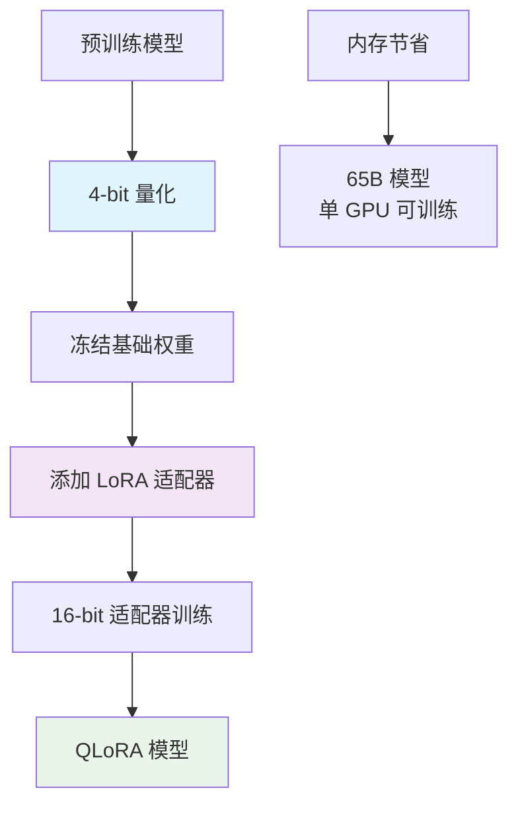

## 概述

QLoRA (Quantized Low-Rank Adaptation) 是在 LoRA 基础上进一步优化的参数高效微调技术，由华盛顿大学在 2023 年提出。QLoRA 结合了量化技术和低秩适应，通过 4-bit 量化大幅降低内存占用，使得在消费级硬件上微调大型语言模型成为可能。

### 核心创新

QLoRA 的核心创新在于：

1. **4-bit NormalFloat (NF4) 量化**：理论最优的 4-bit 量化格式
2. **双重量化**：对量化常数进行二次量化，进一步节省内存
3. **分页注意力**：处理训练过程中的内存峰值
4. **保持 LoRA 精度**：适配器权重使用 16-bit 精度



### 技术优势

相比传统方法，QLoRA 具有显著优势：

1. **内存效率**：相比 16-bit LoRA 节省约 33% 内存
2. **性能保持**：接近全精度训练的效果
3. **硬件友好**：消费级 GPU 可训练大模型
4. **部署便利**：量化模型便于部署

## 技术原理

### NF4 量化机制

NF4 (4-bit NormalFloat) 是专为正态分布权重设计的量化格式，基于神经网络权重通常遵循正态分布的特性进行优化。

**核心思想**：

- 传统 Int4 量化假设权重均匀分布
- NF4 针对正态分布进行量化级别优化
- 使用 16 个精心设计的量化级别，在 [-1, 1] 范围内不均匀分布

### 双重量化

为进一步减少内存占用，QLoRA 对量化常数进行二次量化：

1. **第一层量化**：将权重量化为 4-bit
2. **第二层量化**：将缩放因子量化为 8-bit
3. **内存节省**：额外节省约 0.37 bit/参数

### 分页注意力

处理训练过程中的内存峰值问题：

- 将临时激活值存储到 CPU
- 需要时再加载到 GPU
- 避免内存溢出

## 实现要点

### QLoRA 层结构

QLoRA 层由两个主要组件构成：

1. **量化基础权重**：使用 4-bit NF4 格式存储，冻结不训练
2. **LoRA 适配器**：保持 16-bit 精度，参与训练

```python
class QLoRALinear(nn.Module):
    def __init__(self, in_features, out_features, r=4, lora_alpha=32):
        super().__init__()

        # 4-bit 量化的基础权重（冻结）
        self.weight_quantized = None
        self.weight_scales = None

        # 16-bit LoRA 适配器（可训练）
        self.lora_A = nn.Parameter(torch.zeros(r, in_features))
        self.lora_B = nn.Parameter(torch.zeros(out_features, r))
        self.scaling = lora_alpha / r

    def forward(self, x):
        # 反量化基础权重
        base_weight = self.dequantize_weight()

        # 基础变换 + LoRA 适应
        result = F.linear(x, base_weight)
        if self.r > 0:
            lora_result = x @ self.lora_A.T @ self.lora_B.T
            result += lora_result * self.scaling

        return result
```

### 模型转换

使用现有库快速实现 QLoRA：

```python
from transformers import AutoModelForCausalLM, BitsAndBytesConfig
from peft import LoraConfig, get_peft_model

# 1. 量化配置
bnb_config = BitsAndBytesConfig(
    load_in_4bit=True,
    bnb_4bit_quant_type="nf4",
    bnb_4bit_use_double_quant=True,
    bnb_4bit_compute_dtype=torch.float16
)

# 2. 加载量化模型
model = AutoModelForCausalLM.from_pretrained(
    "model_name",
    quantization_config=bnb_config,
    device_map="auto"
)

# 3. 添加 LoRA 适配器
lora_config = LoraConfig(
    r=8,
    lora_alpha=32,
    target_modules=["q_proj", "v_proj"],
    lora_dropout=0.1,
    task_type="CAUSAL_LM"
)

model = get_peft_model(model, lora_config)
```

## 性能分析

### 内存使用对比

QLoRA 在内存使用方面具有显著优势：

| 方法        | 65B 模型内存占用 | 训练内存峰值 | 最小 GPU 要求 |
| ----------- | ---------------- | ------------ | ------------- |
| 全精度微调  | ~260GB           | ~780GB       | 8×A100 (80GB) |
| 16-bit LoRA | ~130GB           | ~390GB       | 4×A100 (80GB) |
| QLoRA       | ~48GB            | ~95GB        | 1×A100 (80GB) |

### 精度保持

QLoRA 通过以下方式保持训练精度：

- **基础权重量化**：使用理论最优的 NF4 格式
- **适配器高精度**：LoRA 权重保持 16-bit 精度
- **梯度计算**：在 16-bit 精度下进行

## 实际应用案例

### Llama-2 7B QLoRA 微调

```python
from transformers import AutoModelForCausalLM, AutoTokenizer, TrainingArguments
from peft import LoraConfig, get_peft_model
from datasets import load_dataset

def finetune_llama2_qlora():
    """Llama-2 7B QLoRA 微调示例"""

    model_name = "meta-llama/Llama-2-7b-hf"

    # 量化配置
    bnb_config = BitsAndBytesConfig(
        load_in_4bit=True,
        bnb_4bit_quant_type="nf4",
        bnb_4bit_use_double_quant=True,
        bnb_4bit_compute_dtype=torch.float16
    )

    # 加载模型
    model = AutoModelForCausalLM.from_pretrained(
        model_name,
        quantization_config=bnb_config,
        device_map="auto"
    )

    tokenizer = AutoTokenizer.from_pretrained(model_name)
    tokenizer.pad_token = tokenizer.eos_token

    # LoRA 配置
    lora_config = LoraConfig(
        r=8,
        lora_alpha=32,
        target_modules=[
            "q_proj", "k_proj", "v_proj", "o_proj",
            "gate_proj", "up_proj", "down_proj"
        ],
        lora_dropout=0.1,
        bias="none",
        task_type="CAUSAL_LM"
    )

    model = get_peft_model(model, lora_config)

    # 训练配置
    training_args = TrainingArguments(
        output_dir="./qlora-llama2-7b",
        num_train_epochs=3,
        per_device_train_batch_size=4,
        gradient_accumulation_steps=4,
        learning_rate=2e-4,
        weight_decay=0.01,
        logging_steps=10,
        save_steps=500,
        fp16=True,
    )

    return model, tokenizer, training_args
```

### 对话模型微调

```python
def create_qlora_chatbot():
    """创建 QLoRA 对话机器人"""

    model_name = "microsoft/DialoGPT-medium"

    # QLoRA 设置
    bnb_config = BitsAndBytesConfig(
        load_in_4bit=True,
        bnb_4bit_quant_type="nf4",
        bnb_4bit_use_double_quant=True,
        bnb_4bit_compute_dtype=torch.float16
    )

    model = AutoModelForCausalLM.from_pretrained(
        model_name,
        quantization_config=bnb_config,
        device_map="auto"
    )

    # 添加适配器
    lora_config = LoraConfig(
        r=8,
        lora_alpha=32,
        target_modules=["c_attn", "c_proj"],
        lora_dropout=0.1,
        task_type="CAUSAL_LM"
    )

    model = get_peft_model(model, lora_config)
    tokenizer = AutoTokenizer.from_pretrained(model_name)

    return model, tokenizer

def chat_with_qlora_model(model, tokenizer, prompt, max_length=100):
    """使用 QLoRA 模型进行对话"""
    inputs = tokenizer.encode(prompt + tokenizer.eos_token, return_tensors="pt")

    with torch.no_grad():
        outputs = model.generate(
            inputs,
            max_length=max_length,
            temperature=0.7,
            do_sample=True,
            pad_token_id=tokenizer.eos_token_id
        )

    response = tokenizer.decode(outputs[0], skip_special_tokens=True)
    return response[len(prompt):].strip()
```

## 最佳实践

### 超参数调优

根据不同条件推荐的 QLoRA 配置：

```python
def get_qlora_config(model_size, gpu_memory_gb, task_type):
    """获取推荐的 QLoRA 配置"""

    base_configs = {
        'small_model': {  # < 7B
            'r': 16,
            'lora_alpha': 32,
            'batch_size': 8,
            'gradient_accumulation_steps': 4
        },
        'medium_model': {  # 7B-30B
            'r': 8,
            'lora_alpha': 32,
            'batch_size': 4,
            'gradient_accumulation_steps': 8
        },
        'large_model': {  # > 30B
            'r': 4,
            'lora_alpha': 16,
            'batch_size': 1,
            'gradient_accumulation_steps': 32
        }
    }

    if model_size < 7e9:
        config = base_configs['small_model']
    elif model_size < 30e9:
        config = base_configs['medium_model']
    else:
        config = base_configs['large_model']

    # 根据 GPU 内存调整
    if gpu_memory_gb < 16:
        config['batch_size'] = max(1, config['batch_size'] // 2)
        config['gradient_accumulation_steps'] *= 2

    return config
```

### 训练监控

```python
class QLoRATrainingMonitor:
    """QLoRA 训练监控"""

    def __init__(self):
        self.metrics = {
            'gpu_memory': [],
            'loss': [],
            'learning_rate': []
        }

    def log_step(self, loss, lr):
        """记录训练步骤"""
        # GPU 内存使用
        if torch.cuda.is_available():
            memory_used = torch.cuda.memory_allocated() / 1024**3  # GB
            self.metrics['gpu_memory'].append(memory_used)

        self.metrics['loss'].append(loss)
        self.metrics['learning_rate'].append(lr)

    def print_summary(self):
        """打印训练摘要"""
        print("\n=== QLoRA 训练监控摘要 ===")

        if self.metrics['gpu_memory']:
            avg_memory = sum(self.metrics['gpu_memory']) / len(self.metrics['gpu_memory'])
            max_memory = max(self.metrics['gpu_memory'])
            print(f"GPU 内存使用: 平均 {avg_memory:.1f}GB, 峰值 {max_memory:.1f}GB")

        if self.metrics['loss']:
            initial_loss = self.metrics['loss'][0]
            final_loss = self.metrics['loss'][-1]
            print(f"损失变化: {initial_loss:.4f} → {final_loss:.4f}")
```

## 总结

### QLoRA 的优势与局限

**优势：**

1. **极低内存占用**：4-bit 量化大幅减少内存需求
2. **硬件友好**：消费级 GPU 可训练大模型
3. **精度保持**：接近全精度训练效果
4. **部署便利**：量化模型便于部署和分发

**局限：**

1. **量化损失**：虽然很小，但仍存在精度损失
2. **计算开销**：反量化过程增加计算负担
3. **硬件依赖**：需要支持 4-bit 运算的硬件
4. **调优复杂**：量化和 LoRA 参数都需要调优

### 相关资源

- **论文地址**：[QLoRA: Efficient Finetuning of Quantized LLMs](https://arxiv.org/abs/2305.14314)
- **官方实现**：[QLoRA GitHub](https://github.com/artidoro/qlora)
- **BitsAndBytes 库**：[BitsAndBytes](https://github.com/TimDettmers/bitsandbytes)
- **PEFT 库**：[Hugging Face PEFT](https://github.com/huggingface/peft)

---

QLoRA 作为 LoRA 的进一步优化，通过量化技术实现了在有限硬件资源下训练大型语言模型的突破。它不仅降低了大模型微调的门槛，也为个人研究者和小型团队提供了参与大模型研究的机会。随着技术的不断发展，QLoRA 将在大模型民主化进程中发挥重要作用。
