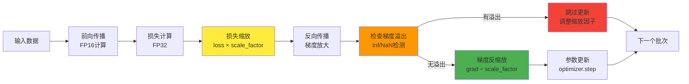
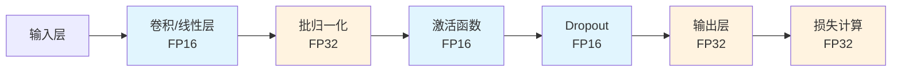

## 混合精度训练概述

混合精度训练（Mixed Precision Training）是一种深度学习训练优化技术，通过在训练过程中同时使用 16 位浮点数（FP16）和 32 位浮点数（FP32）来提升训练效率，同时保持模型精度。

## 核心概念

### 数值精度类型

- **FP32（单精度浮点）**：32 位浮点数，标准训练精度
- **FP16（半精度浮点）**：16 位浮点数，内存占用减半，计算速度更快
- **BF16（Brain Float 16）**：16 位浮点数，动态范围与 FP32 相同

### 主要优势

1. **内存效率**：减少约 50%的 GPU 显存占用
2. **计算速度**：在支持 Tensor Core 的 GPU 上可获得 1.5-2 倍加速
3. **训练稳定性**：通过损失缩放技术保持训练稳定性

## 技术原理

### 前向传播

```python
# 伪代码示例
def forward_pass_mixed_precision(model, inputs):
    # 输入转换为FP16
    inputs_fp16 = inputs.half()

    # 大部分层使用FP16计算
    with autocast():
        logits = model(inputs_fp16)

    # 损失计算使用FP32保证精度
    loss = loss_function(logits.float(), targets.float())

    return loss
```

### 梯度缩放（Gradient Scaling）

由于 FP16 的数值范围较小，小梯度可能会 underflow 为 0。梯度缩放技术解决这个问题：



主要步骤：

1. **前向传播**：损失乘以缩放因子
2. **反向传播**：梯度被相应放大
3. **参数更新**：梯度除以缩放因子恢复原始大小

```python
# PyTorch实现示例
scaler = GradScaler()

def training_step(model, optimizer, inputs, targets):
    optimizer.zero_grad()

    with autocast():
        outputs = model(inputs)
        loss = criterion(outputs, targets)

    # 损失缩放
    scaler.scale(loss).backward()

    # 梯度更新
    scaler.step(optimizer)
    scaler.update()
```

## PyTorch 实现

### 自动混合精度（AMP）

PyTorch 提供了自动混合精度功能，简化了混合精度训练的实现：

```python
from torch.cuda.amp import autocast, GradScaler

# 创建梯度缩放器
scaler = GradScaler()

for epoch in range(num_epochs):
    for batch in dataloader:
        optimizer.zero_grad()

        # 自动混合精度上下文
        with autocast():
            outputs = model(inputs)
            loss = criterion(outputs, targets)

        # 缩放损失并反向传播
        scaler.scale(loss).backward()

        # 更新参数
        scaler.step(optimizer)
        scaler.update()
```

## 关键技术点

### 1. 层精度选择策略



### 2. 动态损失缩放

动态损失缩放可以自动调整缩放因子，优化训练稳定性：

```python
class DynamicLossScaler:
    def __init__(self, init_scale=2.**16):
        self.scale = init_scale
        self.growth_factor = 2.0
        self.backoff_factor = 0.5
        self.growth_interval = 2000
        self.consecutive_successes = 0

    def scale_loss(self, loss):
        return loss * self.scale

    def update(self, overflow):
        if overflow:
            self.scale *= self.backoff_factor
            self.consecutive_successes = 0
        else:
            self.consecutive_successes += 1
            if self.consecutive_successes >= self.growth_interval:
                self.scale *= self.growth_factor
                self.consecutive_successes = 0
```

#### 硬件要求与性能

混合精度训练需要支持 Tensor Core 的 GPU：

- **Volta 架构（V100）**：首次支持 Tensor Core
- **Turing 架构（RTX 20 系列）**：改进的 Tensor Core
- **Ampere 架构（A100, RTX 30 系列）**：第三代 Tensor Core
- **Ada Lovelace（RTX 40 系列）**：第四代 Tensor Core

#### 性能提升对比

下图展示了混合精度训练与 FP32 训练的对比效果：


| 模型类型       | FP32 基线 | FP16 加速比 | 显存节省 |
| -------------- | --------- | ----------- | -------- |
| BERT-Base      | 1.0x      | 1.6x        | 47%      |
| GPT-2          | 1.0x      | 1.8x        | 51%      |
| ResNet-50      | 1.0x      | 1.4x        | 45%      |
| Transformer-XL | 1.0x      | 1.9x        | 52%      |

## 常见问题与解决方案

### 1. 梯度 Underflow

**问题**：小梯度在 FP16 表示下变为 0

**解决方案**：

- 使用梯度缩放
- 调整学习率
- 使用 BF16 替代 FP16

### 2. 数值不稳定

**问题**：某些操作在 FP16 下数值不稳定

**解决方案**：

- 关键层保持 FP32 精度
- 使用混合精度白名单/黑名单
- 监控梯度范数

### 3. 性能优化建议

```python
# 优化建议
def optimize_mixed_precision():
    # 1. 合适的batch size（利用Tensor Core需要8的倍数）
    batch_size = 32

    # 2. 线性层维度设为8的倍数
    hidden_size = 768

    # 3. 定期清理GPU缓存
    torch.cuda.empty_cache()
```

## 最佳实践

### 训练配置建议

```python
# 推荐的PyTorch训练配置
from torch.cuda.amp import autocast, GradScaler

def train_with_mixed_precision(model, dataloader, optimizer, criterion):
    scaler = GradScaler()

    for epoch in range(num_epochs):
        for batch_idx, (inputs, targets) in enumerate(dataloader):
            optimizer.zero_grad()

            # 混合精度前向传播
            with autocast():
                outputs = model(inputs)
                loss = criterion(outputs, targets)

            # 梯度缩放和反向传播
            scaler.scale(loss).backward()

            # 梯度裁剪（可选）
            scaler.unscale_(optimizer)
            torch.nn.utils.clip_grad_norm_(model.parameters(), max_norm=1.0)

            # 参数更新
            scaler.step(optimizer)
            scaler.update()
```

## 参考资料

- [NVIDIA Mixed Precision Training](https://docs.nvidia.com/deeplearning/performance/mixed-precision-training/index.html)
- [PyTorch Automatic Mixed Precision](https://pytorch.org/docs/stable/amp.html)
- [Micikevicius et al. "Mixed Precision Training" ICLR 2018](https://arxiv.org/abs/1710.03740)
