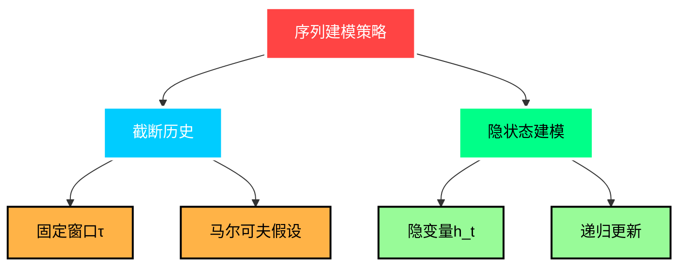
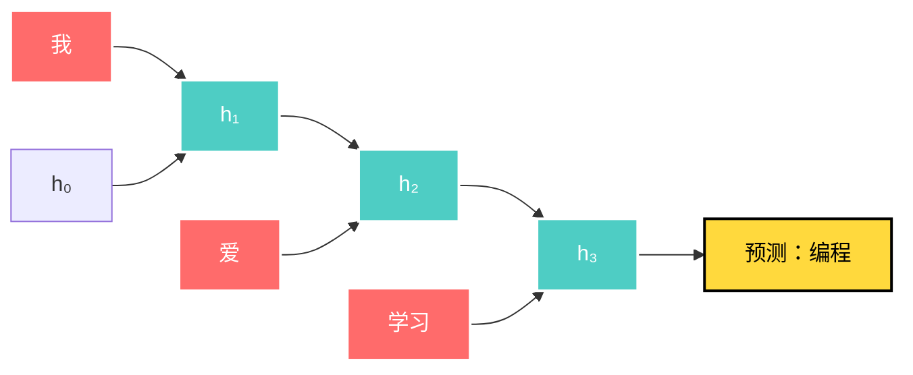
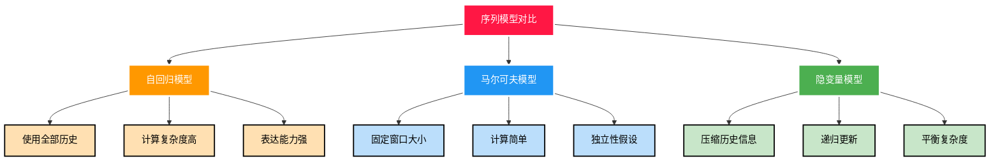
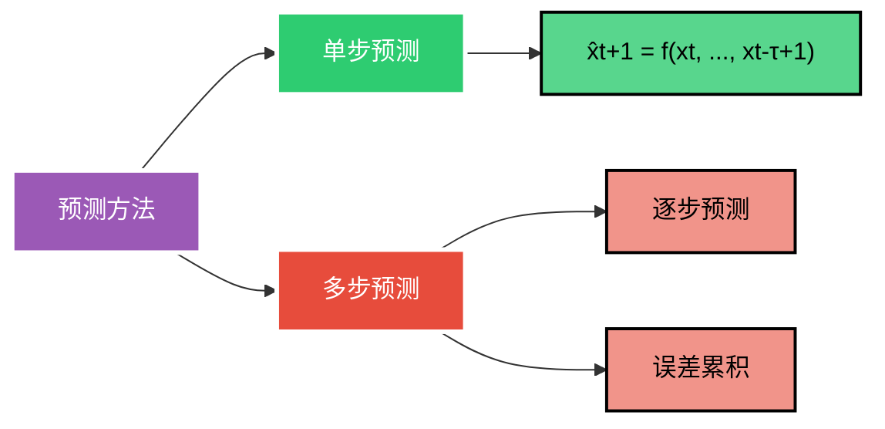
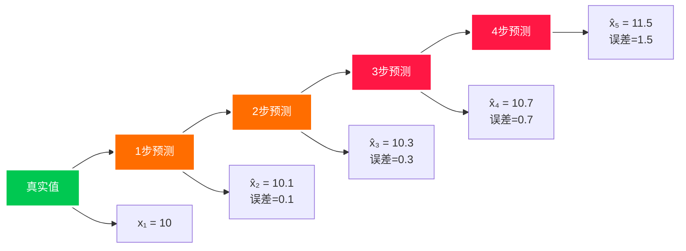

---
title: 序列模型
date: 2025-07-12
type: notes-nlp
---

## 序列数据概述

序列数据是指按时间顺序排列的数据，其中每个数据点都依赖于前面的观测值。序列模型的核心是估计条件概率分布：

$$x_t \sim P(x_t | x_{t-1}, \ldots, x_1)$$

_图 1：富时 100 指数 - 典型的序列数据示例_

### 序列数据的特点

- **时间依赖性**：当前观测依赖于历史信息
- **因果性**：未来不能影响过去
- **非平稳性**：数据分布可能随时间变化
- **预测难度**：外推比内插更困难

### 序列模型的挑战

- **输入维度变化**：历史观测序列长度不固定
- **误差累积**：多步预测中错误会快速积累
- **计算复杂度**：处理长序列计算量大

## 序列建模策略

### 自回归模型

基于历史观测值来预测未来值：

$$P(x_1, \ldots, x_T) = \prod_{t=1}^T P(x_t | x_{t-1}, \ldots, x_1)$$

**两种主要策略**：

> **简单例子**：股票价格预测
>
> - 假设今天股价为 100，昨天为 95，前天为 98
> - 自回归模型：$P(\text{明天价格} | 100, 95, 98, ...)$
> - 预测明天价格可能为 102 或 97

### 马尔可夫模型

假设当前状态只依赖于前 τ 个观测：

$$P(x_t | x_{t-1}, \ldots, x_1) \approx P(x_t | x_{t-\tau}, \ldots, x_{t-1})$$

**一阶马尔可夫链**：
$$P(x_1, \ldots, x_T) = \prod_{t=1}^T P(x_t | x_{t-1})$$

其中 $P(x_1 | x_0) = P(x_1)$

> **简单例子**：天气预测
>
> - 状态：{晴天, 雨天, 阴天}
> - 一阶马尔可夫假设：今天天气只依赖昨天
> - 转移概率：
>   - P(今天晴天 | 昨天晴天) = 0.7
>   - P(今天雨天 | 昨天晴天) = 0.2
>   - P(今天阴天 | 昨天晴天) = 0.1
> - 如果昨天是晴天，今天最可能还是晴天

### 隐变量自回归模型

保持历史信息的总结 $h_t$：

$$\hat{x}_t = P(x_t | h_t)$$
$$h_t = g(h_{t-1}, x_{t-1})$$

_图 2：隐变量自回归模型架构_

> **简单例子**：RNN 语言模型
>
> - 输入序列：["我", "爱", "学习"]
> - 隐状态更新：
>   - $h_1 = g(h_0, \text{"我"})$ → 记住"我"的信息
>   - $h_2 = g(h_1, \text{"爱"})$ → 记住"我爱"的信息
>   - $h_3 = g(h_2, \text{"学习"})$ → 记住"我爱学习"的信息
> - 预测下一个词：$P(\text{下一词} | h_3)$ 可能是"编程"、"数学"等

## 序列建模的数学基础

### 三种模型对比

### 联合概率分解

**前向分解**：
$$P(x_1, \ldots, x_T) = \prod_{t=1}^T P(x_t | x_{t-1}, \ldots, x_1)$$

**后向分解**：
$$P(x_1, \ldots, x_T) = \prod_{t=T}^1 P(x_t | x_{t+1}, \ldots, x_T)$$

### 静态性假设

假设序列的动力学规律不随时间改变，即分布是平稳的：

$$P(x_t | x_{t-1}, \ldots, x_1) = P(x_s | x_{s-1}, \ldots, x_1) \text{ for all } t, s$$

### 马尔可夫链的边际化

对于二阶马尔可夫链：

$$P(x_{t+1} | x_{t-1}) = \sum_{x_t} P(x_{t+1} | x_t, x_{t-1}) P(x_t | x_{t-1})$$

## 预测方法与挑战

### 预测类型

**单步预测公式**：
$$\hat{x}_{t+1} = f(x_t, x_{t-1}, \ldots, x_{t-\tau+1})$$

### k 步预测

对于观测序列直到 $x_t$，k 步预测定义为：

$$\hat{x}_{t+k} = f(x_t, x_{t-1}, \ldots, x_{t-\tau+1})$$

### 多步预测的递归公式

$$\hat{x}_{605} = f(x_{601}, x_{602}, x_{603}, x_{604})$$
$$\hat{x}_{606} = f(x_{602}, x_{603}, x_{604}, \hat{x}_{605})$$
$$\hat{x}_{607} = f(x_{603}, x_{604}, \hat{x}_{605}, \hat{x}_{606})$$

### 误差累积问题

假设第一步误差为 $\epsilon_1 = \bar{\epsilon}$，则：

- 第二步误差：$\epsilon_2 = \bar{\epsilon} + c\epsilon_1$
- 误差快速累积，导致长期预测质量下降

### 误差累积可视化

## 总结

- 时序模型中，当前数据跟之前观察到的数据相关
- 自回归模型使用自身的过去数据来预测未来
- 马尔科夫模型假设当前只跟最近少数数据相关，从而简化模型
- 潜变量模型使用潜变量来概括历史信息
- 预测方法包括单步预测和多步预测，但多步预测面临误差累积问题

---

_参考资料：[D2L 序列模型](https://zh-v2.d2l.ai/chapter_recurrent-neural-networks/sequence.html)_

