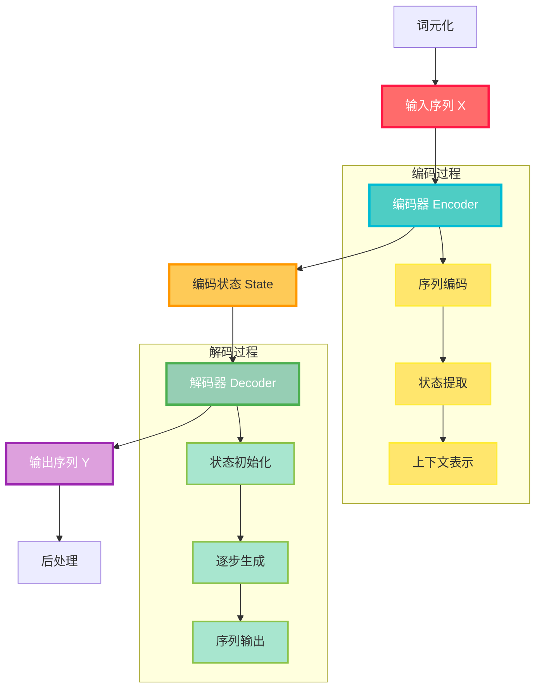
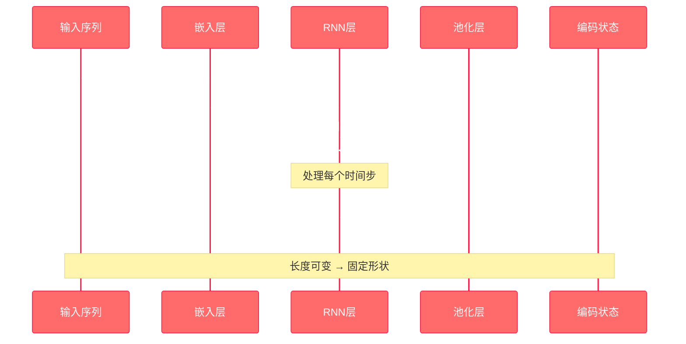
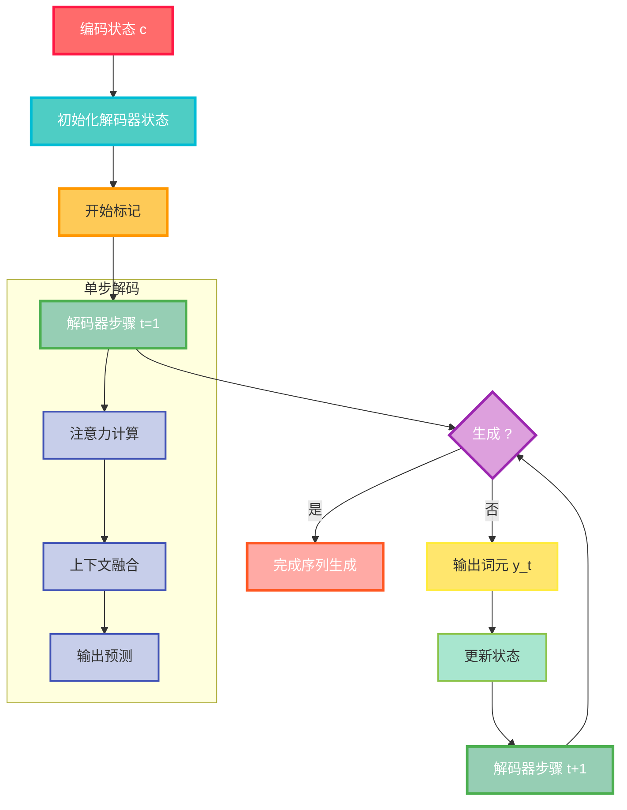
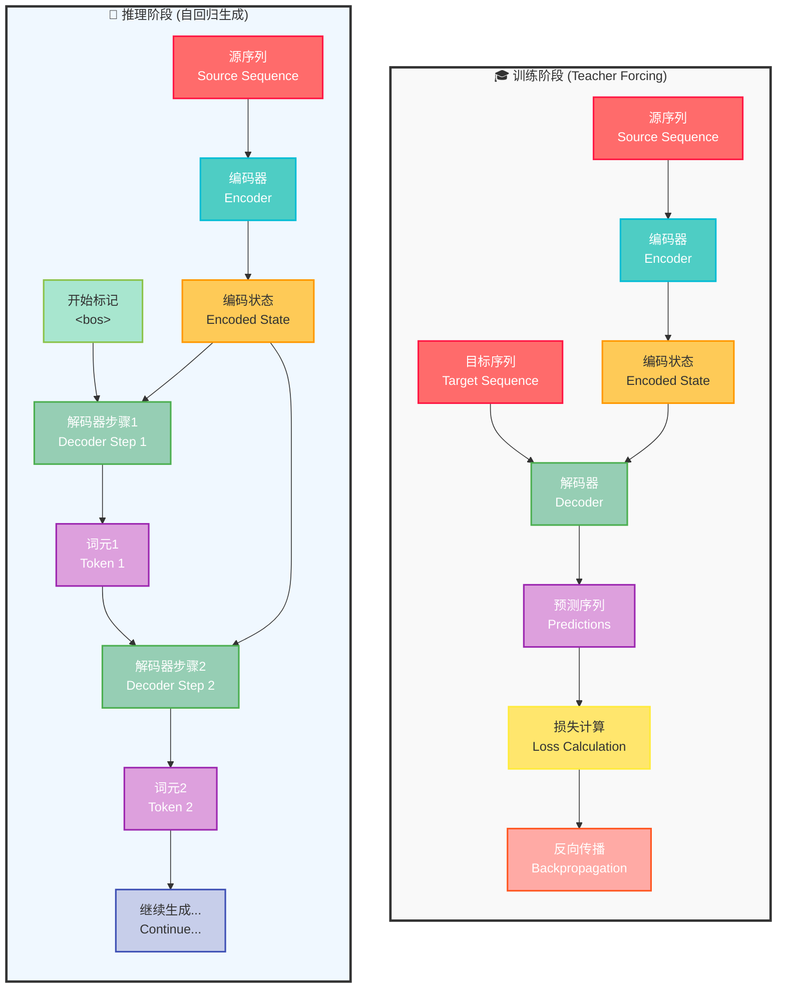

---
title: 编码器-解码器架构
date: 2025-07-12
type: notes-nlp
---


**编码器-解码器架构（Encoder-Decoder Architecture）** 是处理序列转换问题的核心框架，特别适用于机器翻译等输入和输出都是长度可变序列的任务。该架构包含两个主要组件：

- **编码器（Encoder）**：接受长度可变的序列作为输入，将其转换为具有固定形状的编码状态
- **解码器（Decoder）**：将固定形状的编码状态映射到长度可变的序列


## 架构设计原理

### 整体工作流程



### 数学表示

编码器-解码器架构的数学描述如下：

**编码阶段：**
$$\mathbf{c} = f_{enc}(\mathbf{x}_1, \mathbf{x}_2, \ldots, \mathbf{x}_T)$$

**解码阶段：**
$$\mathbf{y}_t = f_{dec}(\mathbf{y}_1, \mathbf{y}_2, \ldots, \mathbf{y}_{t-1}, \mathbf{c})$$

其中：

- $\mathbf{x}_1, \mathbf{x}_2, \ldots, \mathbf{x}_T$ 是输入序列
- $\mathbf{c}$ 是编码状态（上下文向量）
- $\mathbf{y}_t$ 是第 $t$ 步的输出
- $f_{enc}$ 和 $f_{dec}$ 分别是编码器和解码器函数

## 编码器实现(基于 PyTorch)

```python
from torch import nn

#@save
class Encoder(nn.Module):
    """编码器-解码器架构的基本编码器接口"""
    def __init__(self, **kwargs):
        super(Encoder, self).__init__(**kwargs)

    def forward(self, X, *args):
        raise NotImplementedError
```

### 编码过程详解



## 解码器实现(基于 PyTorch)

```python
#@save
class Decoder(nn.Module):
    """编码器-解码器架构的基本解码器接口"""
    def __init__(self, **kwargs):
        super(Decoder, self).__init__(**kwargs)

    def init_state(self, enc_outputs, *args):
        raise NotImplementedError

    def forward(self, X, state):
        raise NotImplementedError
```

### 解码过程详解



## 编码器-解码器架构(基于 PyTorch)

```python
#@save
class EncoderDecoder(nn.Module):
    """编码器-解码器架构的基类"""
    def __init__(self, encoder, decoder, **kwargs):
        super(EncoderDecoder, self).__init__(**kwargs)
        self.encoder = encoder
        self.decoder = decoder

    def forward(self, enc_X, dec_X, *args):
        enc_outputs = self.encoder(enc_X, *args)
        dec_state = self.decoder.init_state(enc_outputs, *args)
        return self.decoder(dec_X, dec_state)
```

### 训练与推理流程对比



#### 核心差异对比

| 特性         | 训练阶段 (Teacher Forcing)     | 推理阶段 (自回归生成)              |
| ------------ | ------------------------------ | ---------------------------------- |
| **输入方式** | 完整目标序列同时输入           | 逐个生成，前一个输出作为下一个输入 |
| **并行性**   | 可以并行计算所有时间步         | 必须串行生成，无法并行             |
| **速度**     | 训练速度快                     | 推理速度相对较慢                   |
| **稳定性**   | 稳定，不受生成错误影响         | 容易累积错误                       |
| **真实性**   | 使用真实标签，可能存在曝光偏差 | 更接近实际使用场景                 |

---

**参考资源**：

- [D2L 教程 - 编码器-解码器架构](https://zh-v2.d2l.ai/chapter_recurrent-modern/encoder-decoder.html)

