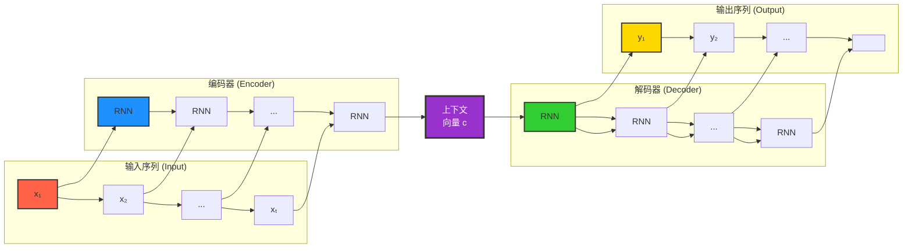
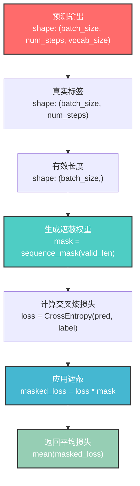
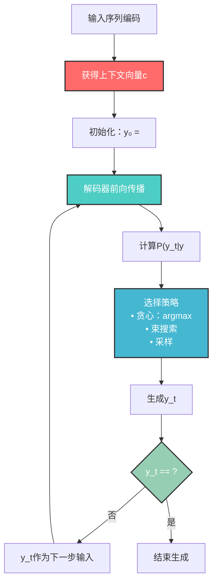
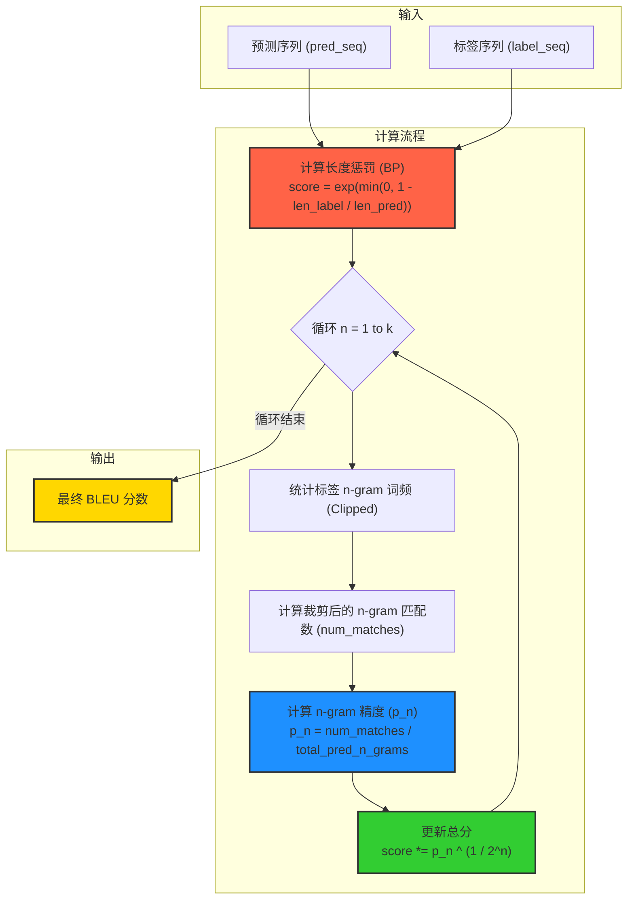
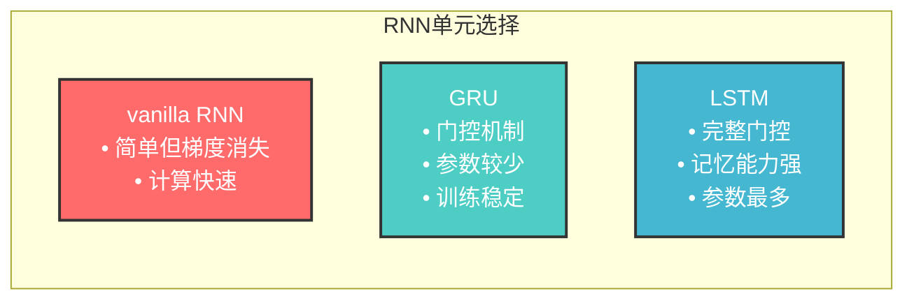
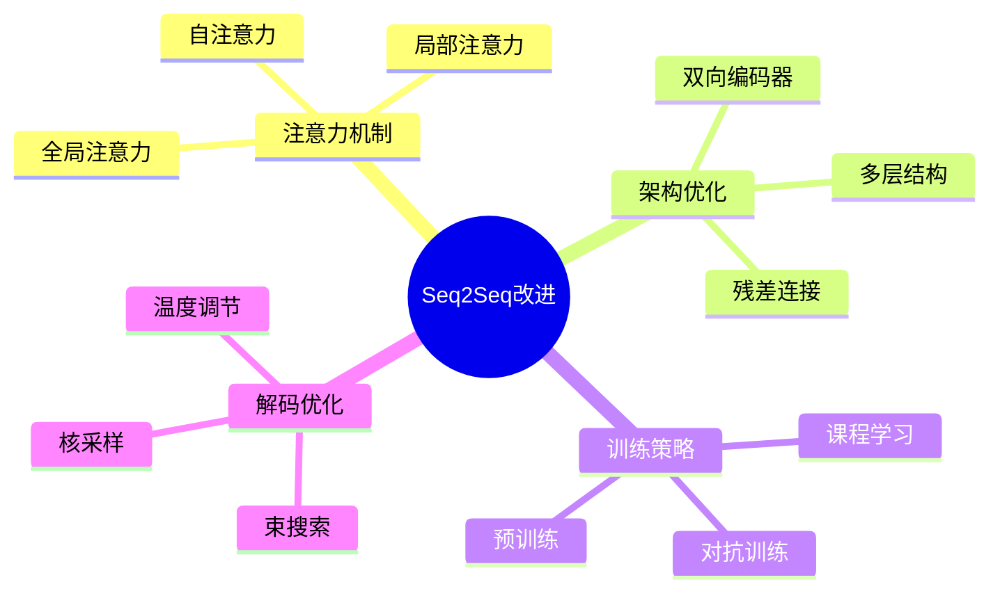

---
title: 序列到序列学习（Seq2Seq）
date: 2025-07-10
type: notes-nlp
---


序列到序列（seq2seq）学习是一种基于编码器-解码器架构的深度学习方法，专门用于处理输入和输出序列长度都可变的任务，如机器翻译、文本摘要、对话系统等。该架构通过编码器将输入序列转换为固定大小的上下文向量，然后通过解码器生成目标序列。


## 核心架构

### 整体架构图



## 损失函数与遮蔽机制

### 遮蔽交叉熵损失

为处理变长序列，使用遮蔽来忽略填充词元：

$$\mathcal{L} = -\frac{1}{N} \sum_{i=1}^{N} \sum_{t=1}^{T_i} \text{mask}_i^{(t)} \log P(y_i^{(t)} | y_i^{(1)}, ..., y_i^{(t-1)}, c_i)$$

其中 $\text{mask}_i^{(t)}$ 为遮蔽权重：

- 有效词元：权重为 1
- 填充词元：权重为 0

### 损失函数流程图



## 推理与预测

### 自回归生成



## BLEU 评估指标

### BLEU 计算公式

$$\text{BLEU} = \exp\left(\min(0, 1-\frac{\text{len}_{\text{label}}}{\text{len}_{\text{pred}}})\right) \prod_{n=1}^k p_n^{1/2^n}$$

其中：

- $\text{len}_{\text{label}}$：标签序列长度
- $\text{len}_{\text{pred}}$：预测序列长度
- $p_n$：n-gram 精确度
- $k$：最大 n-gram 长度（通常为 4）

### BLEU 评估流程



## 代码实现(基于 PyTorch)

### 编码器实现

```python
from torch import nn

#@save
class Encoder(nn.Module):
    """编码器-解码器架构的基本编码器接口"""
    def __init__(self, **kwargs):
        super(Encoder, self).__init__(**kwargs)

    def forward(self, X, *args):
        raise NotImplementedError

#@save
class Seq2SeqEncoder(Encoder):
    """用于序列到序列学习的循环神经网络编码器"""
    def __init__(self, vocab_size, embed_size, num_hiddens, num_layers,
                 dropout=0, **kwargs):
        super(Seq2SeqEncoder, self).__init__(**kwargs)
        # 嵌入层
        self.embedding = nn.Embedding(vocab_size, embed_size)
        self.rnn = nn.GRU(embed_size, num_hiddens, num_layers,
                          dropout=dropout)

    def forward(self, X, *args):
        # 输出'X'的形状：(batch_size,num_steps,embed_size)
        X = self.embedding(X)
        # 在循环神经网络模型中，第一个轴对应于时间步，第二个轴对应于批量大小，这里需要交换位置
        X = X.permute(1, 0, 2)
        # 如果未提及状态，则默认为0
        output, state = self.rnn(X)
        # output的形状:(num_steps,batch_size,num_hiddens)
        # state的形状:(num_layers,batch_size,num_hiddens)
        return output, state
```

### 解码器实现

```python
#@save
class Decoder(nn.Module):
    """编码器-解码器架构的基本解码器接口"""
    def __init__(self, **kwargs):
        super(Decoder, self).__init__(**kwargs)

    def init_state(self, enc_outputs, *args):
        raise NotImplementedError

    def forward(self, X, state):
        raise NotImplementedError

class Seq2SeqDecoder(Decoder):
    """用于序列到序列学习的循环神经网络解码器"""
    def __init__(self, vocab_size, embed_size, num_hiddens, num_layers,
                 dropout=0, **kwargs):
        super(Seq2SeqDecoder, self).__init__(**kwargs)
        self.embedding = nn.Embedding(vocab_size, embed_size)
        self.rnn = nn.GRU(embed_size + num_hiddens, num_hiddens, num_layers,
                          dropout=dropout)
        self.dense = nn.Linear(num_hiddens, vocab_size)

    def init_state(self, enc_outputs, *args):
        return enc_outputs[1]

    def forward(self, X, state):
        # 输出'X'的形状：(batch_size,num_steps,embed_size)
        X = self.embedding(X).permute(1, 0, 2)
        # 广播context，使其具有与X相同的num_steps
        context = state[-1].repeat(X.shape[0], 1, 1)
        X_and_context = torch.cat((X, context), 2)
        output, state = self.rnn(X_and_context, state)
        output = self.dense(output).permute(1, 0, 2)
        # output的形状:(batch_size,num_steps,vocab_size)
        # state的形状:(num_layers,batch_size,num_hiddens)
        return output, state
```

### 损失函数实现

```python
#@save
def sequence_mask(X, valid_len, value=0):
    """在序列中屏蔽不相关的项"""
    maxlen = X.size(1)
    mask = torch.arange((maxlen), dtype=torch.float32,
                        device=X.device)[None, :] < valid_len[:, None]
    X[~mask] = value
    return X

#@save
class MaskedSoftmaxCELoss(nn.CrossEntropyLoss):
    """带遮蔽的softmax交叉熵损失函数"""
    # pred的形状：(batch_size,num_steps,vocab_size)
    # label的形状：(batch_size,num_steps)
    # valid_len的形状：(batch_size,)
    def forward(self, pred, label, valid_len):
        weights = torch.ones_like(label)
        weights = sequence_mask(weights, valid_len)
        self.reduction='none'
        unweighted_loss = super(MaskedSoftmaxCELoss, self).forward(
            pred.permute(0, 2, 1), label)
        weighted_loss = (unweighted_loss * weights).mean(dim=1)
        return weighted_loss
```

### 训练函数

```python
#@save
def train_seq2seq(net, data_iter, lr, num_epochs, tgt_vocab, device):
    """训练序列到序列模型"""
    def xavier_init_weights(m):
        if type(m) == nn.Linear:
            nn.init.xavier_uniform_(m.weight)
        if type(m) == nn.GRU:
            for param in m._flat_weights_names:
                if "weight" in param:
                    nn.init.xavier_uniform_(m._parameters[param])

    net.apply(xavier_init_weights)
    net.to(device)
    optimizer = torch.optim.Adam(net.parameters(), lr=lr)
    loss = MaskedSoftmaxCELoss()
    net.train()
    animator = d2l.Animator(xlabel='epoch', ylabel='loss',
                     xlim=[10, num_epochs])
    for epoch in range(num_epochs):
        timer = d2l.Timer()
        metric = d2l.Accumulator(2)  # 训练损失总和，词元数量
        for batch in data_iter:
            optimizer.zero_grad()
            X, X_valid_len, Y, Y_valid_len = [x.to(device) for x in batch]
            bos = torch.tensor([tgt_vocab['<bos>']] * Y.shape[0],
                          device=device).reshape(-1, 1)
            dec_input = torch.cat([bos, Y[:, :-1]], 1)  # 强制教学
            Y_hat, _ = net(X, dec_input, X_valid_len)
            l = loss(Y_hat, Y, Y_valid_len)
            l.sum().backward()      # 损失函数的标量进行“反向传播”
            d2l.grad_clipping(net, 1)
            num_tokens = Y_valid_len.sum()
            optimizer.step()
            with torch.no_grad():
                metric.add(l.sum(), num_tokens)
        if (epoch + 1) % 10 == 0:
            animator.add(epoch + 1, (metric[0] / metric[1],))
    print(f'loss {metric[0] / metric[1]:.3f}, {metric[1] / timer.stop():.1f} '
        f'tokens/sec on {str(device)}')
```

### 预测函数

```python
# @save
def predict_seq2seq(
    net,
    src_sentence,
    src_vocab,
    tgt_vocab,
    num_steps,
    device,
    save_attention_weights=False,
):
    """序列到序列模型的预测"""
    # 在预测时将net设置为评估模式
    net.eval()
    # 将源句子进行分词，并添加结束词元<eos>
    src_tokens = src_vocab[src_sentence.lower().split(" ")] + [src_vocab["<eos>"]]
    # 计算源序列的有效长度，并转换为tensor
    enc_valid_len = torch.tensor([len(src_tokens)], device=device)
    # 对源序列进行截断或填充，以确保长度为num_steps
    src_tokens = d2l.truncate_pad(src_tokens, num_steps, src_vocab["<pad>"])
    # 添加批量轴，并将源序列转换为tensor
    enc_X = torch.unsqueeze(
        torch.tensor(src_tokens, dtype=torch.long, device=device), dim=0
    )
    # 使用编码器对源序列进行编码
    enc_outputs = net.encoder(enc_X, enc_valid_len)
    # 初始化解码器的状态
    dec_state = net.decoder.init_state(enc_outputs, enc_valid_len)
    # 创建初始的解码器输入，包含一个开始词元<bos>
    dec_X = torch.unsqueeze(
        torch.tensor([tgt_vocab["<bos>"]], dtype=torch.long, device=device), dim=0
    )
    output_seq, attention_weight_seq = [], []
    for _ in range(num_steps):
        # 解码器对当前输入进行解码
        Y, dec_state = net.decoder(dec_X, dec_state)
        # 我们使用具有预测最高可能性的词元，作为解码器在下一时间步的输入
        dec_X = Y.argmax(dim=2)
        # 获取预测的词元
        pred = dec_X.squeeze(dim=0).type(torch.int32).item()
        # 保存注意力权重（稍后讨论）
        if save_attention_weights:
            attention_weight_seq.append(net.decoder.attention_weights)
        # 一旦序列结束词元被预测，输出序列的生成就完成了
        if pred == tgt_vocab["<eos>"]:
            break
        # 将预测的词元添加到输出序列中
        output_seq.append(pred)
    # 将输出序列从词元转换回字符串，并返回
    return " ".join(tgt_vocab.to_tokens(output_seq)), attention_weight_seq
```

### BLEU 评估

```python
def bleu(pred_seq, label_seq, k):  # @save
    """计算BLEU"""
    # 将预测序列和标签序列分割成单词列表
    pred_tokens, label_tokens = pred_seq.split(" "), label_seq.split(" ")
    # 计算预测序列和标签序列的长度
    len_pred, len_label = len(pred_tokens), len(label_tokens)
    # 计算 brevity penalty (BP)，用于惩罚过短的预测序列
    score = math.exp(min(0, 1 - len_label / len_pred))
    # 计算 n-gram 精度并更新总分数
    for n in range(1, k + 1):
        # 初始化匹配次数和标签 n-gram 计数器
        num_matches, label_subs = 0, collections.defaultdict(int)
        # 统计标签序列中所有 n-gram 的出现次数
        for i in range(len_label - n + 1):
            label_subs[" ".join(label_tokens[i : i + n])] += 1
        # 计算预测序列中与标签序列匹配的 n-gram 数量
        for i in range(len_pred - n + 1):
            n_gram = " ".join(pred_tokens[i : i + n])
            if label_subs[n_gram] > 0:
                num_matches += 1
                label_subs[n_gram] -= 1
        # 更新分数，结合匹配次数和预测序列长度计算 n-gram 精度
        score *= math.pow(num_matches / (len_pred - n + 1), math.pow(0.5, n))
    # 返回最终的 BLEU 分数
    return score
```

## 不同 RNN 单元对比



## 改进方向



