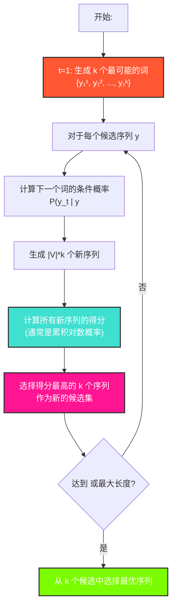

---
title: 束搜索 (Beam Search)
date: 2025-07-12
type: notes-nlp
---

束搜索（Beam Search）是一种在序列生成任务（如机器翻译、文本摘要）中常用的解码策略。它旨在平衡贪心搜索（Greedy Search）的速度和穷举搜索的准确性，通过在每一步保留多个最可能的候选序列来寻找高质量的输出。

## 核心思想

- **贪心搜索的局限**：贪心搜索在每个时间步只选择当前概率最高的词元，这可能导致错过全局最优解。例如，一个在早期步骤中概率稍低的词元，可能在后续步骤中引出整体概率更高的序列。
- **束搜索的策略**：为了弥补这一不足，束搜索在每个时间步维护一个固定大小的候选序列集合。这个集合的大小被称为**束宽（Beam Size）**，通常用 $k$ 表示。
  - 在解码的每一步，我们都会考虑上一步中 $k$ 个候选序列的所有可能扩展。
  - 然后，从所有这些新生成的序列中，我们计算并选择出总得分最高的 $k$ 个，作为当前步骤的新候选集。
  - 这个过程会一直持续，直到所有候选序列都生成了结束符 `<eos>` 或达到了预设的最大长度。

## 算法流程

下图展示了束搜索的解码过程：

## 得分计算

在时间步 $t$，一个候选序列 $(y_1, \dots, y_t)$ 的得分通常是其对数似然之和：

$$
\log P(y_1, \dots, y_t | \mathbf{c}) = \sum_{i=1}^t \log P(y_i | y_1, \dots, y_{i-1}, \mathbf{c})
$$

其中 $\mathbf{c}$ 是编码器输出的上下文向量。

### 长度惩罚

由于对数概率是负值，序列越长，累加的得分会越低，这会导致算法偏向于选择更短的序列。为了缓解这个问题，通常会引入**长度惩罚（Length Penalty）**：

$$
L(y_1, \dots, y_t) = \frac{1}{t^\alpha} \sum_{i=1}^t \log P(y_i | y_1, \dots, y_{i-1}, \mathbf{c})
$$

其中 $t$ 是当前序列的长度，$\alpha$ 是一个超参数（通常在 0.6 到 0.75 之间），用于控制惩罚的强度。当 $\alpha=0$ 时，没有长度惩罚；当 $\alpha=1$ 时，得分是几何平均对数概率。

## 图示

下图直观地展示了束搜索的过程，其中束宽 $k=2$。在每个时间步，都会保留两个得分最高的序列。

## 总结

- 束搜索在每次搜索时，保存 K 歌最好的候选
- K=1 时，就是贪心搜索
- K=n 时，是穷举搜索
- 束搜索是一种启发式算法，它不保证能找到全局最优解，但在实践中通常能以可控的计算成本生成高质量的序列。

