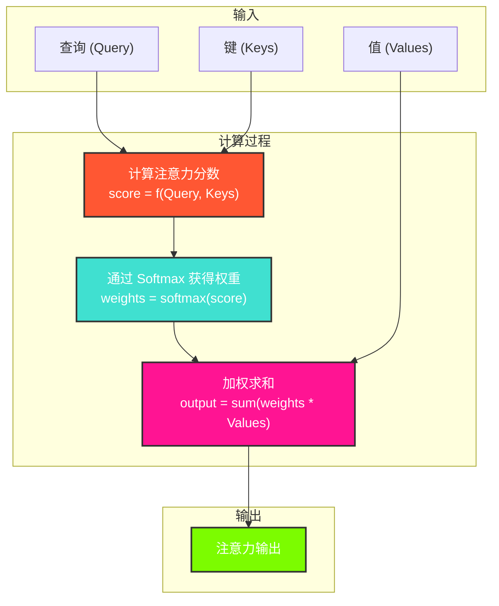

---
title: 注意力机制 (Attention Mechanism)
date: 2025-07-11
type: notes-nlp
---

在深度学习中，注意力机制（Attention Mechanism）模仿了人类的注意力模式，允许模型在处理序列数据时，能够“关注”到输入序列中的特定部分，而不是将整个序列压缩成一个固定长度的上下文向量。这极大地提高了模型处理长序列的能力，尤其在机器翻译、文本摘要和语音识别等任务中取得了巨大成功。

## 注意力的基本思想：查询、键和值

注意力机制可以被抽象地描述为一个将**查询（Query）**和一系列**键-值对（Key-Value Pairs）**映射到输出的过程。

1.  **查询 (Query, Q)**：代表当前需要关注的焦点，比如解码器在生成下一个词时自身的状态。
2.  **键 (Key, K)**：与输入序列中的每个元素相关联，用于和查询进行匹配，以计算注意力分数。
3.  **值 (Value, V)**：同样与输入序列中的每个元素相关联，是实际需要被提取的信息。

注意力机制的核心是通过计算查询和各个键的相似度来得到**注意力权重**，然后利用这些权重对相应的值进行加权求和，得到最终的输出。

### 通用流程

### 注意力机制的详细推导 (以点积模型为例)

> 想象一下，你在图书馆里查找关于“深度学习”的资料。你的**查询 (Query)** 就是“深度学习”。图书馆里有成千上万本书，每本书都有一个**键 (Key)**，可以看作是书的标题或标签，比如“机器学习入门”、“计算机视觉”、“自然语言处理”等。同时，每本书都有其具体的内容，这就是**值 (Value)**。
>
> 注意力机制模仿了这个过程，它帮助模型在处理信息时，将“注意力”集中在最相关的部分。其核心就是三个概念：**查询 (Query, Q)**、**键 (Key, K)** 和 **值 (Value, V)**。
>
> - **Q (Query)**: 代表当前需要关注的焦点，比如解码器正在翻译的下一个词，或者我们想了解的某个特定信息。它是一个“提问者”。
> - **K (Key)**: 代表信息源的“标识”，用于和查询进行匹配。它告诉我们“这里有什么信息”。
> - **V (Value)**: 代表信息源的实际内容。一旦查询和某个键匹配成功，我们真正需要的是这个键对应的值。
>
> 下面我们以**点积注意力 (Dot-Product Attention)** 为例，一步步推导其计算过程。假设我们有一个查询 `q` 和一组键值对 `(k₁, v₁), (k₂, v₂), ..., (kₙ, vₙ)`。
>
> #### 第一步：计算相似度分数 (Similarity Score)
>
> 为了决定应该对哪个 `v` 投入更多注意力，我们首先需要计算查询 `q` 和每个键 `kᵢ` 的相似度。在点积模型中，这个相似度就是它们的点积。
>
> $$
> \text{score}_i = \mathbf{q} \cdot \mathbf{k}_i
> $$
>
> 如果我们有多个查询（一个查询矩阵 `Q`）和多个键（一个键矩阵 `K`），我们可以用矩阵乘法一次性计算所有分数：
>
> $$
> \text{Scores} = \mathbf{Q} \mathbf{K}^\top
> $$
>
> **为什么是点积？** 点积可以衡量两个向量的方向相似度。如果 `q` 和 `kᵢ` 的方向越接近，它们的点积就越大，代表它们越“相关”。
>
> #### 第二步：缩放分数 (Scaling)
>
> 当向量的维度 `d_k` 较大时，点积的结果可能会变得非常大，这会导致 Softmax 函数的梯度变得极小，不利于模型学习。因此，我们需要对分数进行缩放。
>
> $$
> \text{Scaled\_Scores}_i = \frac{\text{score}_i}{\sqrt{d_k}}
> $$
>
> 这里的 `d_k` 是键向量的维度。这个缩放操作可以确保梯度保持在合理的范围内。
>
> #### 第三步：计算注意力权重 (Attention Weights)
>
> 得到缩放后的分数后，我们使用 **Softmax** 函数将其转换为概率分布，即**注意力权重** `αᵢ`。所有权重之和为 1。
>
> $$
> \alpha_i = \text{softmax}(\text{Scaled\_Scores}_i) = \frac{\exp(\text{Scaled\_Scores}_i)}{\sum_{j=1}^{n} \exp(\text{Scaled\_Scores}_j)}
> $$
>
> 权重 `αᵢ` 越高，表示查询 `q` 对第 `i` 个值 `vᵢ` 的注意力就越集中。
>
> #### 第四步：加权求和得到输出 (Weighted Sum)
>
> 最后，我们将计算出的注意力权重 `αᵢ` 与对应的**值 `vᵢ`** 相乘，并求和，得到最终的输出向量。这个向量融合了所有值的信息，但更侧重于那些与查询相关的部分。
>
> $$
> \text{Output} = \sum_{i=1}^{n} \alpha_i \mathbf{v}_i
> $$
>
> 如果用矩阵形式表示，就是：
>
> $$
> \text{Attention}(\mathbf{Q}, \mathbf{K}, \mathbf{V}) = \text{softmax}\left(\frac{\mathbf{Q} \mathbf{K}^\top}{\sqrt{d_k}}\right) \mathbf{V}
> $$
>
> 这就是**缩放点积注意力 (Scaled Dot-Product Attention)** 的完整公式，也是 Transformer 模型的核心组件之一。通过这个过程，模型能够动态地、有选择性地关注输入序列中的重要信息，从而做出更准确的预测。

## Nadaraya-Watson 核回归：一个简单的注意力实例

Nadaraya-Watson 核回归是一个非参数机器学习模型，它完美地诠释了注意力机制的思想。给定一组训练数据（输入 $x_i$ 和输出 $y_i$），模型对新输入 $x$ 的预测值为：

$$
f(x) = \sum_{i=1}^n \alpha(x, x_i) y_i
$$

这本质上是一个对所有训练输出 $y_i$ 的加权平均。这里的权重 $\alpha(x, x_i)$ 就是注意力权重，它由查询 $x$ 和键 $x_i$ 通过一个**核（Kernel）**函数 $K$ 计算得出：

$$
\alpha(x, x_i) = \frac{K(x - x_i)}{\sum_{j=1}^n K(x - x_j)}
$$

最常用的核是**高斯核（Gaussian Kernel）**：

$$
K(u) = \frac{1}{\sqrt{2\pi}} \exp\left(-\frac{u^2}{2}\right)
$$

在这个框架下：

- **查询 (Query)** 是新的输入 $x$。
- **键 (Keys)** 是所有的训练输入 $x_i$。
- **值 (Values)** 是所有的训练输出 $y_i$。
- **注意力分数**由核函数 $K(x - x_i)$ 给出。

## 总结

- 注意力机制通过**查询、键、值**的框架，实现了对信息源的动态加权，使得模型可以聚焦于最重要的部分。
- 这种“可微分”的注意力机制可以无缝集成到深度学习模型中，并通过梯度下降进行端到端的训练。

