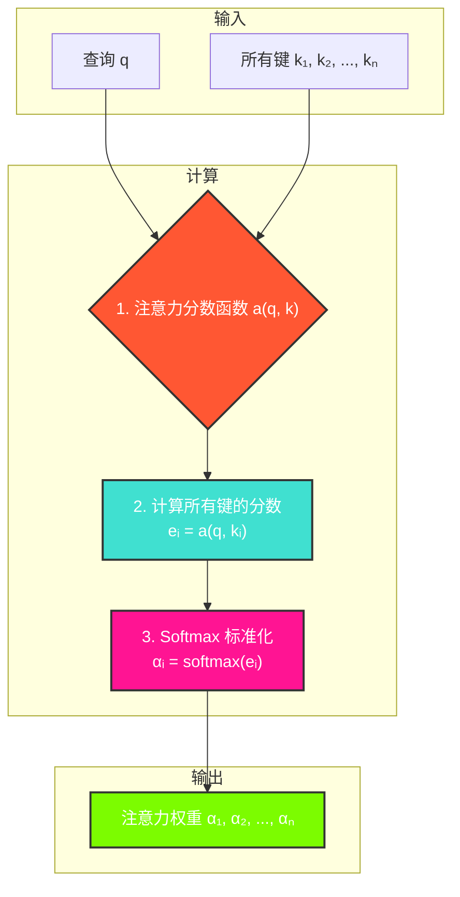

---
title: 注意力分数 (Attention Scoring Functions)
date: 2025-07-11
type: notes-nlp
---


在注意力机制中，**注意力分数（Attention Score）**是连接查询（Query）和键（Key）的核心环节。它用于衡量一个查询与所有键的“相关性”或“相似度”。不同的注意力分数计算方法催生了不同类型的注意力模型。

## 注意力分数的计算流程

无论使用哪种具体的评分函数，其最终目标都是为每个“键-值”对生成一个权重。这个过程可以概括为以下几步：



## 两种主流的评分函数

两种最常用的注意力分数函数：加性注意力和缩放点积注意力。

### 1. 加性注意力 (Additive Attention)

当查询和键的维度不同时，加性注意力是一个很好的选择。它通过一个带有 `tanh` 激活函数的前馈网络来计算分数。

**计算公式**:

$$
a(\mathbf{q}, \mathbf{k}) = \mathbf{w}_v^\top \tanh(\mathbf{W}_q \mathbf{q} + \mathbf{W}_k \mathbf{k})
$$

其中：

- $\mathbf{q} \in \mathbb{R}^{d_q}$ 是查询。
- $\mathbf{k} \in \mathbb{R}^{d_k}$ 是键。
- $\mathbf{W}_q \in \mathbb{R}^{h \times d_q}$ 和 $\mathbf{W}_k \in \mathbb{R}^{h \times d_k}$ 是可学习的权重矩阵，将查询和键投影到相同的维度 $h$。
- $\mathbf{w}_v \in \mathbb{R}^h$ 是另一个可学习的权重向量，将结果映射为一个标量分数。

这种方法因为引入了额外的可学习参数，所以非常灵活和强大。

### 2. 缩放点积注意力 (Scaled Dot-Product Attention)

当查询和键的维度相同时，缩放点积注意力的计算效率非常高。它直接计算查询和键的点积，然后除以一个缩放因子。

**计算公式**:

$$
a(\mathbf{q}, \mathbf{k}) = \frac{\mathbf{q}^\top \mathbf{k}}{\sqrt{d}}
$$

其中：

- $d$ 是查询和键的维度。
- **缩放因子 $\sqrt{d}$** 至关重要。当维度 $d$ 很大时，点积的结果可能会变得非常大，导致 Softmax 函数的梯度变得极小，不利于模型训练。除以 $\sqrt{d}$ 可以将点积结果的方差稳定在 1 左右，从而缓解梯度消失问题。

这种方法在 Transformer 模型中被广泛使用。

## PyTorch 代码实现

下面我们用 PyTorch 来实现这两种注意力评分函数。

### 掩蔽 softmax 操作

```python
# @save
def masked_softmax(X, valid_lens):
    """
    通过在最后一个轴上掩蔽元素来执行softmax操作

    参数:
    X: 3D张量，输入数据
    valid_lens: 1D或2D张量，每个样本的有效长度

    返回值:
    执行掩蔽softmax操作后的张量
    """
    # X:3D张量，valid_lens:1D或2D张量
    if valid_lens is None:
        return nn.functional.softmax(X, dim=-1)  # 对最后一个轴执行softmax
    else:
        shape = X.shape  # 保存X的原始形状
        if valid_lens.dim() == 1:  # 如果valid_lens是1D张量
            valid_lens = torch.repeat_interleave(valid_lens, shape[1])  # 扩展为2D张量
        else:
            valid_lens = valid_lens.reshape(-1)  # 2D张量转1D张量
        # 最后一轴上被掩蔽的元素使用一个非常大的负值替换，从而其softmax输出为0
        X = d2l.sequence_mask(X.reshape(-1, shape[-1]), valid_lens, value=-1e6)
        return nn.functional.softmax(X.reshape(shape), dim=-1) # 对最后一个轴执行softmax# @save

```

#### `masked_softmax` 计算过程详解

用一个具体的例子来逐步分解 `masked_softmax(torch.rand(2, 2, 4), torch.tensor([2, 3]))` 的计算过程。

假设 `torch.rand(2, 2, 4)` 生成了以下随机张量 `X`：

```
X = tensor([[[0.8, 0.2, 0.9, 0.4],  # 第1个批次, 第1个序列
             [0.1, 0.7, 0.3, 0.5]], # 第1个批次, 第2个序列

            [[0.6, 0.2, 0.7, 0.1],  # 第2个批次, 第1个序列
             [0.9, 0.8, 0.3, 0.4]]]) # 第2个批次, 第2个序列
```

`valid_lens` 是 `torch.tensor([2, 3])`。

---

##### 1. 获取形状

`shape = X.shape`，所以 `shape` 是 `(2, 2, 4)`。

##### 2. 扩展 `valid_lens`

- `valid_lens` 的维度是 1D。
- 代码会执行 `torch.repeat_interleave(valid_lens, shape[1])`，其中 `shape[1]` 是 2。
- `torch.tensor([2, 3])` 中的每个元素重复 2 次，得到新的 `valid_lens`：`torch.tensor([2, 2, 3, 3])`。

##### 3. 重塑 `X`

- 代码执行 `X.reshape(-1, shape[-1])`，即 `X.reshape(-1, 4)`。
- `X` 从 `(2, 2, 4)` 被重塑为 `(4, 4)` 的二维张量：

```
X_reshaped = tensor([[0.8, 0.2, 0.9, 0.4],
                     [0.1, 0.7, 0.3, 0.5],
                     [0.6, 0.2, 0.7, 0.1],
                     [0.9, 0.8, 0.3, 0.4]])
```

##### 4. 应用掩码

- 代码调用 `d2l.sequence_mask(X_reshaped, valid_lens, value=-1e6)`。
- 它会根据 `valid_lens` (`[2, 2, 3, 3]`) 来掩盖 `X_reshaped` 的每一行。
  - **第 1 行**: `valid_len` 是 2。保留前 2 个元素，其余用 `-1e6` 替换。`[0.8, 0.2, -1e6, -1e6]`
  - **第 2 行**: `valid_len` 是 2。保留前 2 个元素，其余用 `-1e6` 替换。`[0.1, 0.7, -1e6, -1e6]`
  - **第 3 行**: `valid_len` 是 3。保留前 3 个元素，其余用 `-1e6` 替换。`[0.6, 0.2, 0.7, -1e6]`
  - **第 4 行**: `valid_len` 是 3。保留前 3 个元素，其余用 `-1e6` 替换。`[0.9, 0.8, 0.3, -1e6]`
- 掩码后的张量 `X_masked` 为：

```
X_masked = tensor([[ 8.0e-01,  2.0e-01, -1.0e+06, -1.0e+06],
                   [ 1.0e-01,  7.0e-01, -1.0e+06, -1.0e+06],
                   [ 6.0e-01,  2.0e-01,  7.0e-01, -1.0e+06],
                   [ 9.0e-01,  8.0e-01,  3.0e-01, -1.0e+06]])
```

##### 5. 计算 Softmax

- 首先将 `X_masked` 变回原始形状 `(2, 2, 4)`。
- 然后对最后一个维度应用 Softmax。被替换为 `-1e6` 的值，其 `exp(-1e6)` 的结果会无限趋近于 0。
  - **第 1 行** `[0.8, 0.2, -1e6, -1e6]` 的 Softmax 结果约为 `[0.64, 0.36, 0, 0]`。
  - **第 2 行** `[0.1, 0.7, -1e6, -1e6]` 的 Softmax 结果约为 `[0.35, 0.65, 0, 0]`。
  - **第 3 行** `[0.6, 0.2, 0.7, -1e6]` 的 Softmax 结果约为 `[0.36, 0.24, 0.40, 0]`。
  - **第 4 行** `[0.9, 0.8, 0.3, -1e6]` 的 Softmax 结果约为 `[0.43, 0.39, 0.18, 0]`。

##### 6. 最终输出

- 将上述 Softmax 结果组合成 `(2, 2, 4)` 的形状，得到最终输出。

```
# (数值为近似值)
tensor([[[0.64, 0.36, 0.00, 0.00],
         [0.35, 0.65, 0.00, 0.00]],

        [[0.36, 0.24, 0.40, 0.00],
         [0.43, 0.39, 0.18, 0.00]]])
```

### 加性注意力实现

```python
class AdditiveAttention(nn.Module):
    """加性注意力"""
    def __init__(self, key_size, query_size, num_hiddens, dropout, **kwargs):
        super(AdditiveAttention, self).__init__(**kwargs)
        self.W_k = nn.Linear(key_size, num_hiddens, bias=False)
        self.W_q = nn.Linear(query_size, num_hiddens, bias=False)
        self.w_v = nn.Linear(num_hiddens, 1, bias=False)
        self.dropout = nn.Dropout(dropout)

    def forward(self, queries, keys, values, valid_lens):
        queries, keys = self.W_q(queries), self.W_k(keys)
        # 在维度扩展后，
        # queries的形状：(batch_size，查询的个数，1，num_hidden)
        # key的形状：(batch_size，1，“键－值”对的个数，num_hiddens)
        # 使用广播方式进行求和
        features = queries.unsqueeze(2) + keys.unsqueeze(1)
        features = torch.tanh(features)
        # self.w_v仅有一个输出，因此从形状中移除最后那个维度。
        # scores的形状：(batch_size，查询的个数，“键-值”对的个数)
        scores = self.w_v(features).squeeze(-1)
        self.attention_weights = d2l.masked_softmax(scores, valid_lens)
        # values的形状：(batch_size，“键－值”对的个数，值的维度)
        return torch.bmm(self.dropout(self.attention_weights), values)
```

#### 加性注意力 (`AdditiveAttention`) 详解

加性注意力的核心思想是：将查询（Query）和键（Key）通过一个带有 `tanh` 激活函数的单层前馈网络来计算它们之间的相关性分数。

我们假设有以下小批量数据：

- **批量大小 (batch_size)**: 1
- **查询数量 (num_queries)**: 1
- **键值对数量 (num_keys)**: 3
- **查询/键的特征维度 (query/key size)**: 4
- **值的特征维度 (value dim)**: 6
- **隐藏单元数 (num_hiddens)**: 8
- **有效长度 (valid_lens)**: `[2]` (表示在 3 个键值对中，只有前 2 个是有效的)

---

##### 1. 初始化

首先，我们创建一个 `AdditiveAttention` 实例。

```python
attention = AdditiveAttention(key_size=4, query_size=4, num_hiddens=8, dropout=0.1)
```

这会初始化三个线性层：

- `self.W_q`: 将维度为 4 的 `queries` 映射到维度为 8 的隐藏层。
- `self.W_k`: 将维度为 4 的 `keys` 映射到维度为 8 的隐藏层。
- `self.w_v`: 将维度为 8 的隐藏层映射到维度为 1 的输出分数。

##### 2. 前向传播 (`forward`)

假设输入张量如下：

- `queries`: 形状 `(1, 1, 4)`
- `keys`: 形状 `(1, 3, 4)`
- `values`: 形状 `(1, 3, 6)`
- `valid_lens`: `torch.tensor([2])`

**步骤 1: 线性变换**
`queries` 和 `keys` 分别通过 `W_q` 和 `W_k` 进行线性变换。

```python
# queries: (1, 1, 4) -> (1, 1, 8)
q = self.W_q(queries)
# keys: (1, 3, 4) -> (1, 3, 8)
k = self.W_k(keys)
```

**步骤 2: 维度扩展和广播相加**
为了让每个查询都能和所有的键计算相关性，需要扩展维度然后相加。

```python
# q 扩展后形状: (1, 1, 1, 8)
q_unsqueezed = q.unsqueeze(2)
# k 扩展后形状: (1, 1, 3, 8)
k_unsqueezed = k.unsqueeze(1)

# 利用广播机制相加，features 形状: (1, 1, 3, 8)
features = q_unsqueezed + k_unsqueezed
```

这里的加法是核心，也是它被称为“加性”注意力的原因。

**步骤 3: `tanh` 激活**
将相加后的结果通过 `tanh` 激活函数。

```python
# features 形状不变: (1, 1, 3, 8)
features = torch.tanh(features)
```

**步骤 4: 计算分数**
将 `features` 通过最后一个线性层 `w_v`，将其从隐藏维度 8 降到 1，得到每个查询与每个键的分数。

```python
# self.w_v(features) 输出形状: (1, 1, 3, 1)
# .squeeze(-1) 移除最后一个维度，scores 形状: (1, 1, 3)
scores = self.w_v(features).squeeze(-1)
```

现在 `scores` 张量中的 3 个值，分别代表 1 个查询与 3 个键之间的原始相关性分数。

**步骤 5: 掩码 Softmax**
使用之前定义的 `masked_softmax` 函数，将原始分数转换为注意力权重。`valid_lens` (`[2]`) 会确保只有前 2 个键的权重被计算，第 3 个键的权重为 0。

```python
# self.attention_weights 形状: (1, 1, 3)
# 示例值: tensor([[[0.6, 0.4, 0.0]]])
self.attention_weights = masked_softmax(scores, valid_lens)
```

**步骤 6: 加权求和**
最后，将得到的注意力权重与 `values` 进行批量矩阵乘法 (`bmm`)，得到最终的输出。

```python
# self.attention_weights: (1, 1, 3)
# values: (1, 3, 6)
# torch.bmm(...) 输出形状: (1, 1, 6)
output = torch.bmm(self.attention_weights, values)
```

这个 `output` 就是最终的上下文向量，它融合了所有 `values` 的信息，但更侧重于注意力权重高的 `values`。

### 缩放点积注意力实现

```python
class DotProductAttention(nn.Module):
    """缩放点积注意力"""
    def __init__(self, dropout, **kwargs):
        super(DotProductAttention, self).__init__(**kwargs)
        self.dropout = nn.Dropout(dropout)

    # queries的形状：(batch_size，查询的个数，d)
    # keys的形状：(batch_size，“键－值”对的个数，d)
    # values的形状：(batch_size，“键－值”对的个数，值的维度)
    # valid_lens的形状:(batch_size，)或者(batch_size，查询的个数)
    def forward(self, queries, keys, values, valid_lens=None):
        d = queries.shape[-1]
        # 设置transpose_b=True为了交换keys的最后两个维度
        scores = torch.bmm(queries, keys.transpose(1,2)) / math.sqrt(d)
        self.attention_weights = d2l.masked_softmax(scores, valid_lens)
        return torch.bmm(self.dropout(self.attention_weights), values)
```

#### 缩放点积注意力 (`DotProductAttention`) 详解

缩放点积注意力的计算比加性注意力更高效，因为它不涉及额外的可学习参数，而是直接使用查询（Query）和键（Key）的点积来计算分数。为了防止点积结果过大导致梯度消失，需要对其进行缩放。

我们假设有以下小批量数据：

- **批量大小 (batch_size)**: 1
- **查询数量 (num_queries)**: 1
- **键值对数量 (num_keys)**: 3
- **查询/键的特征维度 (d)**: 4
- **值的特征维度 (value dim)**: 6
- **有效长度 (valid_lens)**: `[2]` (表示在 3 个键值对中，只有前 2 个是有效的)

---

##### 1. 初始化

`DotProductAttention` 只有一个 `dropout` 层，没有像 `AdditiveAttention` 那样的线性层。

```python
attention = DotProductAttention(dropout=0.1)
```

##### 2. 前向传播 (`forward`)

假设输入张量如下：

- `queries`: 形状 `(1, 1, 4)`
- `keys`: 形状 `(1, 3, 4)`
- `values`: 形状 `(1, 3, 6)`
- `valid_lens`: `torch.tensor([2])`

**步骤 1: 计算点积**
通过批量矩阵乘法 (`bmm`) 计算查询和键的点积。为此，需要先将 `keys` 的最后两个维度进行转置。

```python
# queries 形状: (1, 1, 4)
# keys 形状: (1, 3, 4) -> 转置后 keys.transpose(1, 2) 形状: (1, 4, 3)
# bmm 输出形状: (1, 1, 3)
scores = torch.bmm(queries, keys.transpose(1, 2))
```

`scores` 张量中的 3 个值，代表 1 个查询与 3 个键之间的原始点积相似度。

**步骤 2: 缩放**
将点积结果除以 `sqrt(d)`，其中 `d` 是查询/键的维度（这里是 4）。

```python
d = queries.shape[-1]  # d = 4
# scores 形状不变: (1, 1, 3)
scores = scores / math.sqrt(d) # 除以 sqrt(4) = 2
```

这个缩放步骤至关重要，可以防止当维度 `d` 很大时，点积结果过大，从而使得 Softmax 函数的梯度变得极小，导致训练困难。

**步骤 3: 掩码 Softmax**
与加性注意力一样，使用 `masked_softmax` 将缩放后的分数转换为注意力权重。`valid_lens` (`[2]`) 会将第 3 个键的权重置为 0。

```python
# self.attention_weights 形状: (1, 1, 3)
# 示例值: tensor([[[0.7, 0.3, 0.0]]])
self.attention_weights = masked_softmax(scores, valid_lens)
```

**步骤 4: 加权求和**
最后，将注意力权重与 `values` 进行批量矩阵乘法，得到加权的上下文向量。

```python
# self.attention_weights: (1, 1, 3)
# values: (1, 3, 6)
# torch.bmm(...) 输出形状: (1, 1, 6)
output = torch.bmm(self.attention_weights, values)
```

这个 `output` 就是最终的输出，它根据点积相似度融合了 `values` 的信息。

## 总结

- 注意力分数是 query 和 key 之间的相似度，注意力权重是分数 softmax 后的结果。
- 常见的两种分数计算：
  - 将 query 和 key 合并起来进入一个单输出单隐藏层的 MLP。
  - 直接将 query 和 key 做内积。

