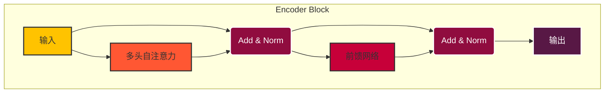
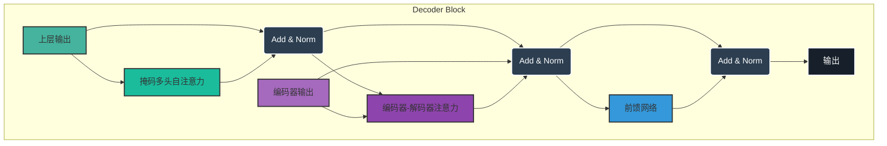

---
title: Transformer 模型详解
date: 2025-07-12
type: notes-nlp
---


Transformer 是一个基于自注意力机制的深度学习模型，完全摒弃了传统的循环和卷积结构。它在自然语言处理（NLP）领域取得了革命性的成功，尤其是在机器翻译、文本摘要和语言生成等任务中。


## 核心架构：编码器-解码器

Transformer 遵循经典的编码器-解码器（Encoder-Decoder）架构。

- **编码器 (Encoder)**: 负责将输入序列（如源语言句子）处理成一系列连续的表示（上下文向量）。它由 N 个相同的编码器层堆叠而成。
- **解码器 (Decoder)**: 负责接收编码器的输出和目标序列（如目标语言句子），并逐个生成输出词元。它也由 N 个相同的解码器层堆叠而成。

---

## 编码器 (Encoder)

每个编码器层都是相同的结构，包含两个核心子层：

1.  **多头自注意力 (Multi-Head Self-Attention)**: 捕捉输入序列内部的依赖关系。
2.  **基于位置的前馈网络 (Position-wise Feed-Forward Network)**: 一个简单的全连接前馈网络。

每个子层后面都跟着一个 **残差连接 (Residual Connection)** 和 **层归一化 (Layer Normalization)**，即 `Add & Norm`。



---

## 解码器 (Decoder)

每个解码器层比编码器层多一个子层，共包含三个核心子层：

1.  **掩码多头自注意力 (Masked Multi-Head Self-Attention)**: 与编码器中的自注意力类似，但增加了掩码（Mask），以确保在预测当前位置时，不会看到未来的信息。这是为了保持模型的自回归（auto-regressive）特性。

> **举例：预测 "suis"**
>
> - 当模型需要预测 "suis" 时，它只能看到前面的 "Je" 和起始符 `<sos>`。
> - 掩码机制会“遮盖”掉 "un"、"étudiant" 等未来的词，防止模型在训练时“作弊”。这模仿了我们在实际翻译时的思考过程：我们是逐词生成译文的，而不是一次性看到所有答案。

2.  **编码器-解码器注意力 (Encoder-Decoder Attention)**: 这是连接编码器和解码器的桥梁。它的查询（Query）来自前一个解码器子层的输出，而键（Key）和值（Value）则来自编码器的最终输出。这使得解码器在生成每个词时都能关注到输入序列的所有部分。

> **举例：翻译 "student"**
>
> - 当解码器准备生成与 "student" 对应的法文词 "étudiant" 时，编码器-解码器注意力机制会帮助解码器将注意力集中在输入句子中的 "student" 这个词上。
> - 这确保了翻译的准确性，使得输出词与输入词的对应关系更加明确。

3.  **基于位置的前馈网络 (Position-wise Feed-Forward Network)**: 与编码器中的完全相同。

同样，每个子层后面也都跟着一个 `Add & Norm`。



---

## 关键组件

### 基于位置的前馈网络 (Position-wise FFN)

基于位置的前馈网络对序列中的所有位置的表示进行变换时使用的是同一个多层感知机（MLP），这就是称前馈网络是基于位置的（positionwise）的原因。

**下面 PositionWiseFFN 的代码实现中，输入 X 的形状（批量大小，时间步数或序列长度，隐单元数或特征维度）将被一个两层的感知机转换成形状为（批量大小，时间步数，ffn_num_outputs）的输出张量。**

```python
#@save
class PositionWiseFFN(nn.Module):
    """
    基于位置的前馈网络

    该网络对输入进行变换，但不改变其时间步长（序列长度），仅在特征维度上进行操作。
    主要用于Transformer模型中，对注意力机制的输出进行进一步处理。

    参数:
    - ffn_num_input (int): 输入特征的维度
    - ffn_num_hiddens (int): 隐藏层单元的数量
    - ffn_num_outputs (int): 输出特征的维度
    """
    def __init__(self, ffn_num_input, ffn_num_hiddens, ffn_num_outputs,
                 **kwargs):
        # 继承自nn.Module，初始化父类
        super(PositionWiseFFN, self).__init__(**kwargs)
        # 第一个全连接层，将输入特征维度转换为隐藏层维度
        self.dense1 = nn.Linear(ffn_num_input, ffn_num_hiddens)
        # ReLU激活函数，增加模型非线性
        self.relu = nn.ReLU()
        # 第二个全连接层，将隐藏层维度转换为输出特征维度
        self.dense2 = nn.Linear(ffn_num_hiddens, ffn_num_outputs)

    def forward(self, X):
        """
        前向传播

        对输入X进行两次线性变换，中间通过ReLU激活函数，最终输出结果。

        参数:
        - X (Tensor): 输入张量，形状为(batch_size, seq_len, ffn_num_input)

        返回:
        - Tensor: 输出张量，形状为(batch_size, seq_len, ffn_num_outputs)
        """
        # 全连接层->ReLU激活->全连接层
        return self.dense2(self.relu(self.dense1(X)))
```

> Link:[PositionWiseFFN](https://zh-v2.d2l.ai/chapter_attention-mechanisms/transformer.html#id5)
>
> 1.  **“Position-wise” (逐位置)**: 这个网络独立地应用于输入序列的每一个“位置”（或时间步）。也就是说，对于一个长度为 `n` 的序列，这个前馈网络会分别对这 `n` 个词元（token）的向量各执行一次。重要的是，在所有位置上，它使用的是**同一组权重**（同一个 `dense1` 和 `dense2` 层）。它只在特征维度上进行变换，不改变序列的长度。
>
> 2.  **“Feed-Forward Network” (前馈网络)**: 它的核心是一个简单的两层全连接网络。
>
> - **第一层**: 一个线性变换（`dense1`），将输入维度 `ffn_num_input` 扩展到中间维度 `ffn_num_hiddens`。
> - **激活函数**: 通常使用 ReLU 激活函数 (`relu`)，为模型引入非线性。
> - **第二层**: 另一个线性变换（`dense2`），将中间维度 `ffn_num_hiddens` 压缩回输出维度 `ffn_num_outputs`。在 Transformer 中，`ffn_num_outputs` 通常等于 `ffn_num_input`。
>
> 虽然自注意力机制能够有效地捕捉序列中不同位置之间的依赖关系，但它本质上是线性的（在计算注意力权重后，是对 value 的加权求和）。`PositionWiseFFN` 的作用就是为模型增加非线性变换的能力，让模型可以学习到更复杂的特征表示。

```python
ffn = PositionWiseFFN(4, 4, 8)
ffn.eval()
ffn(torch.ones((2, 3, 4)))[0]
```

```bash
PositionWiseFFN(
  (dense1): Linear(in_features=4, out_features=4, bias=True)
  (relu): ReLU()
  (dense2): Linear(in_features=4, out_features=8, bias=True)
)
```

```bash
tensor([[ 0.2856,  0.0240,  0.4821,  0.3590, -0.0935,  0.2479, -0.1782,  0.4760],
        [ 0.2856,  0.0240,  0.4821,  0.3590, -0.0935,  0.2479, -0.1782,  0.4760],
        [ 0.2856,  0.0240,  0.4821,  0.3590, -0.0935,  0.2479, -0.1782,  0.4760]],
       grad_fn=<SelectBackward0>)
```

> 这段代码是对上面定义的 `PositionWiseFFN` 类进行的一个简单测试，展示了其输入和输出的形状变化。
>
> 1.  `ffn = PositionWiseFFN(4, 4, 8)`:
>
>     - 我们创建了一个 `PositionWiseFFN` 的实例。
>     - `ffn_num_input=4`: 输入特征的维度是 4。
>     - `ffn_num_hiddens=4`: 中间隐藏层的维度是 4。
>     - `ffn_num_outputs=8`: 输出特征的维度是 8。
>
> 2.  `ffn.eval()`:
>
>     - 将模型设置为评估（evaluation）模式。这会关闭 Dropout 等只在训练时使用的层。虽然我们这个简单的 `PositionWiseFFN` 中没有这些层，但这在模型测试时是一个好习惯。
>
> 3.  `ffn(torch.ones((2, 3, 4)))[0]`:
>     - `torch.ones((2, 3, 4))`: 创建一个形状为 `(2, 3, 4)` 的张量作为输入，其中：
>       - `2` 是批量大小（batch size）。
>       - `3` 是序列长度（sequence length）。
>       - `4` 是每个词元的特征维度，与我们定义的 `ffn_num_input` 相匹配。
>     - `ffn(...)`: 调用网络的前向传播。输入张量 `(2, 3, 4)` 会经过两个线性层和 ReLU 激活函数，输出张量的形状会变为 `(2, 3, 8)`，因为我们设置了 `ffn_num_outputs=8`。
>     - `[0]`: 从输出张量 `(2, 3, 8)` 中取出第一个样本的结果，所以最终显示的张量形状为 `(3, 8)`。
>
> **总结**: 这段代码验证了 `PositionWiseFFN` 能够接收一个三维张量（批量, 序列, 特征），并在不改变序列长度的情况下，将每个位置的特征维度从 4 转换到 8，因为用同一个多层感知机对所有位置上的输入进行变换，所以当所有这些位置的输入相同时，它们的输出也是相同的。

### 多头注意力(Multi-Head Attention)


多头注意力是 Transformer 的核心组件之一。它没有使用单一的注意力机制，而是将注意力机制并行地运行多次，并将结果合并。这允许模型在不同的表示子空间中共同关注来自不同位置的信息。

**核心思想：**

与其让一个注意力机制独自承担理解句子所有复杂关系（如语法结构、指代关系、语义关联等）的重任，不如分派出多个“头”（heads），每个头专注于学习一种特定的关系。

**工作流程：**

1.  **投影 (Projection)**: 将原始的查询（Query）、键（Key）和值（Value）矩阵通过不同的、可学习的线性变换（$W^Q, W^K, W^V$）投影到多个低维度的表示空间中。每个投影版本就是一个“头”。
2.  **并行注意力 (Parallel Attention)**: 在每个“头”上独立地执行缩放点积注意力（Scaled Dot-Product Attention）。
3.  **拼接 (Concatenation)**: 将所有“头”的注意力输出拼接在一起。
4.  **最终投影 (Final Projection)**: 将拼接后的结果再通过一个线性变换（$W^O$），得到最终的输出。

**公式表示：**

$$
\text{MultiHead}(Q, K, V) = \text{Concat}(\text{head}_1, \dots, \text{head}_h)W^O
$$

其中，每个头 $\text{head}_i$ 的计算方式为：

$$
\text{head}_i = \text{Attention}(QW_i^Q, KW_i^K, VW_i^V)
$$

> **举例：理解句子 "The animal didn't cross the street because it was too tired."**
>
> - **单个注意力头** 可能会困惑：`it` 指的是 `animal` 还是 `street`？
> - **多头注意力** 可以解决这个问题：
>   - **头 1 (指代关系头)**: 可能会学习到 `it` 指代的是 `animal`。
>   - **头 2 (因果关系头)**: 可能会关注 `because` 和 `tired` 之间的关系。
>   - **头 3 (语法结构头)**: 可能会关注动词 `cross` 和主语 `animal` 的关系。
>
> 最后，模型将这些不同角度的信息整合起来，从而对整个句子有一个更全面、更鲁棒的理解。

```python
# @save
def transpose_qkv(X, num_heads):
    """为了多注意力头的并行计算而变换形状"""
    # 输入X的形状:(batch_size，查询或者“键－值”对的个数，num_hiddens)
    # 输出X的形状:(batch_size，查询或者“键－值”对的个数，num_heads，
    # num_hiddens/num_heads)
    X = X.reshape(X.shape[0], X.shape[1], num_heads, -1)

    # 输出X的形状:(batch_size，num_heads，查询或者“键－值”对的个数,
    # num_hiddens/num_heads)
    X = X.permute(0, 2, 1, 3)

    # 最终输出的形状:(batch_size*num_heads,查询或者“键－值”对的个数,
    # num_hiddens/num_heads)
    return X.reshape(-1, X.shape[2], X.shape[3])


# @save
def transpose_output(X, num_heads):
    """逆转transpose_qkv函数的操作"""
    X = X.reshape(-1, num_heads, X.shape[1], X.shape[2])
    X = X.permute(0, 2, 1, 3)
    return X.reshape(X.shape[0], X.shape[1], -1)
```

transpose_qkv(X, num_heads):

- 作用: 这个函数为了能让多个注意力头并行计算，对输入的查询（Q）、键（K）或值（V）张量 X 进行形状变换。
- 过程: 它将原始的 num_hiddens 维度拆分成 num_heads 个更小的维度，然后调整张量的维度顺序，最后将 batch_size 和 num_heads 这两个维度合并。这样就可以把多个头的计算打包成一个大的批量计算，从而高效地在 GPU 上并行处理。

transpose_output(X, num_heads):

- 作用: 这个函数执行与 transpose_qkv 完全相反的操作。
- 过程: 在所有注意力头都完成计算后，它会将并行计算的结果（一个包含了所有头输出的大张量）重新组合，恢复成原始的 (batch_size, 查询个数, num_hiddens) 形状，以便进行后续处理。

```python
# @save
class MultiHeadAttention(nn.Module):
    """多头注意力"""

    def __init__(self, key_size, query_size, value_size, num_hiddens,
                 num_heads, dropout, bias=False, **kwargs):
        """
        初始化多头注意力机制的参数。

        参数:
        - key_size (int): 键向量的维度。
        - query_size (int): 查询向量的维度。
        - value_size (int): 值向量的维度。
        - num_hiddens (int): 隐藏层的维度，通常与输出维度相同。
        - num_heads (int): 注意力头的数量。
        - dropout (float): Dropout的概率，用于防止过拟合。
        - bias (bool, optional): 是否在线性层中使用偏置，默认为False。
        - **kwargs: 其他关键字参数，通常用于扩展。

        该构造函数初始化了多头注意力机制中的各种维度和参数，为后续的注意力计算打下基础。
        """
        super(MultiHeadAttention, self).__init__(**kwargs)
        self.num_heads = num_heads
        self.attention = d2l.DotProductAttention(dropout)
        self.W_q = nn.Linear(query_size, num_hiddens, bias=bias)
        self.W_k = nn.Linear(key_size, num_hiddens, bias=bias)
        self.W_v = nn.Linear(value_size, num_hiddens, bias=bias)
        self.W_o = nn.Linear(num_hiddens, num_hiddens, bias=bias)

    def forward(self, queries, keys, values, valid_lens):
        # queries，keys，values的形状:
        # (batch_size，查询或者“键－值”对的个数，num_hiddens)
        # valid_lens　的形状:
        # (batch_size，)或(batch_size，查询的个数)
        # 经过变换后，输出的queries，keys，values　的形状:
        # (batch_size*num_heads，查询或者“键－值”对的个数，
        # num_hiddens/num_heads)
        queries = transpose_qkv(self.W_q(queries), self.num_heads)
        keys = transpose_qkv(self.W_k(keys), self.num_heads)
        values = transpose_qkv(self.W_v(values), self.num_heads)

        if valid_lens is not None:
            # 在轴0，将第一项（标量或者矢量）复制num_heads次，
            # 然后如此复制第二项，然后诸如此类。
            valid_lens = torch.repeat_interleave(
                valid_lens, repeats=self.num_heads, dim=0
            )

        # output的形状:(batch_size*num_heads，查询的个数，
        # num_hiddens/num_heads)
        output = self.attention(queries, keys, values, valid_lens)

        # output_concat的形状:(batch_size，查询的个数，num_hiddens)
        output_concat = transpose_output(output, self.num_heads)
        return self.W_o(output_concat)
```

### 残差连接和层归一化 (Add & Norm)

- **残差连接**: 将子层的输入 `x` 直接加到子层的输出 `Sublayer(x)` 上，即 `x + Sublayer(x)`。这有助于避免在深度网络中出现梯度消失问题，使得训练更深的模型成为可能。
- **层归一化 (Layer Normalization)**: 对每个样本的特征进行归一化，而不是像批量归一化（Batch Normalization）那样对一个批次内的所有样本进行归一化。这使得模型训练更加稳定（**批量归一化不适合序列长度会变的 NLP 应用**）。

```python
ln = nn.LayerNorm(2)
bn = nn.BatchNorm1d(2)
X = torch.tensor([[1, 2], [2, 3]], dtype=torch.float32)
# 在训练模式下计算X的均值和方差
print('layer norm:', ln(X), '\nbatch norm:', bn(X))
```

```bash
layer norm: tensor([[-1.0000,  1.0000],
        [-1.0000,  1.0000]], grad_fn=<NativeLayerNormBackward0>)
batch norm: tensor([[-1.0000, -1.0000],
        [ 1.0000,  1.0000]], grad_fn=<NativeBatchNormBackward0>)
```

> ### 层归一化 (LayerNorm) vs. 批量归一化 (BatchNorm)
>
> 这段代码通过一个简单的例子，直观地展示了 **层归一化（Layer Normalization）** 和 **批量归一化（Batch Normalization）** 之间的核心区别。这两种都是神经网络中常用的归一化技术，但它们的计算方式和适用场景不同。
>
> 1.  `ln = nn.LayerNorm(2)`: 初始化一个**层归一化**层。参数 `2` 指定了需要归一化的特征维度。
> 2.  `bn = nn.BatchNorm1d(2)`: 初始化一个**批量归一化**层。参数 `2` 指定了输入的特征（或通道）数量。
> 3.  `X = torch.tensor([[1, 2], [2, 3]], ...)`: 创建一个输入张量 `X`，可以看作是一个批量包含 2 个样本，每个样本有 2 个特征。
>
> - **`ln(X)` (层归一化)**:
>
>   - **对每个样本独立计算**。它沿着特征维度（`dim=1`）计算均值和方差。
>   - 对第一个样本 `[1, 2]`：均值为 1.5，标准差为 0.5。归一化后为 `[-1., 1.]`。
>   - 对第二个样本 `[2, 3]`：均值为 2.5，标准差为 0.5。归一化后为 `[-1., 1.]`。
>   - **归一化轴**: 在每个样本内部，对所有特征进行归一化。
>
> - **`bn(X)` (批量归一化)**:
>   - **对整个批量计算**。它沿着批量维度（`dim=0`）对每个特征独立计算均值和方差。
>   - 对第一个特征 `[1, 2]`：均值为 1.5，标准差为 0.5。归一化后为 `[-1., 1.]`。
>   - 对第二个特征 `[2, 3]`：均值为 2.5，标准差为 0.5。归一化后为 `[-1., 1.]`。
>   - **归一化轴**: 对每个特征，跨越所有样本进行归一化。
>
> #### 为什么 Transformer 使用 LayerNorm？
>
> - **独立于批量大小**: LayerNorm 对每个样本独立操作，因此它的计算与批量大小无关。这使得它在批量大小较小，或者在测试时（批量大小为 1）的情况下表现更稳定。
> - **适用于序列数据**: 在处理像文本这样的变长序列时，一个批量中每个样本的序列长度可能不同。对整个批量按位置（token）进行归一化（如 BatchNorm）会很复杂且没有意义。而 LayerNorm 对每个序列独立进行归一化，完美地解决了这个问题。
>
> 因此，在 Transformer 的 `Add & Norm` 组件中，使用的正是 **LayerNorm**。

使用残差连接和层规范化来实现 AddNorm 类。暂退法也被作为正则化方法使用。

```python
# @save
class AddNorm(nn.Module):
    """
    残差连接后进行层规范化

    该模块主要用于在前一层的输出上添加残差连接，并在相加后进行层规范化处理。
    层规范化有助于解决内部协变量偏移问题，加速模型训练过程的收敛。

    参数:
    - normalized_shape: 一个整数或整数元组，表示需要进行层规范化的维度。
    - dropout: Dropout比率，用于在前向计算时随机将一部分特征设置为0，以防止过拟合。
    """

    def __init__(self, normalized_shape, dropout, **kwargs):
        # 继承自nn.Module，初始化父类
        super(AddNorm, self).__init__(**kwargs)
        # 初始化Dropout层，用于前向传播时的特征随机丢弃
        self.dropout = nn.Dropout(dropout)
        # 初始化LayerNorm层，用于执行层规范化
        self.ln = nn.LayerNorm(normalized_shape)

    def forward(self, X, Y):
        """
        前向传播函数

        实现残差连接后进行层规范化的主要逻辑，首先在输入X上添加经过Dropout的Y，
        然后对它们的和进行层规范化处理。

        参数:
        - X: 残差连接的输入张量。
        - Y: 主路径的输入张量，将经过Dropout处理。

        返回:
        - 经过层规范化处理后的张量。
        """
        return self.ln(self.dropout(Y) + X)
```

> `AddNorm` 类是 Transformer 模型中的一个关键构建块，它实现了论文 "Attention Is All You Need" 中提到的 "Add & Norm" 步骤。这个步骤位于每个子层（如多头注意力和前馈网络）之后。
>
> 这个类的功能正如其名，包含两个主要操作：
>
> 1.  **Add (残差连接)**:
>
>     - 在 `forward(self, X, Y)` 函数中，`Y` 代表子层（例如，多头注意力层）的输出，而 `X` 是该子层的输入。
>     - `Y + X` 这个操作就是一个**残差连接**（Residual Connection），也叫作捷径连接（Shortcut Connection）。
>     - **目的**: 将子层的输出与其原始输入相加。这允许梯度在反向传播时可以直接流过，极大地缓解了深度网络中的梯度消失问题，使得训练更深的模型成为可能。
>
> 2.  **Norm (层归一化)**:
>     - 在执行完残差连接后，结果会立即被送入一个**层归一化**（Layer Normalization）层 `self.ln`。
>     - **目的**: 规范化每个样本的特征，使其具有零均值和单位方差。这有助于稳定训练过程，加速收敛，并减少模型对初始化参数的敏感度。

### 编码器(Encoder)

一个完整的 Transformer 编码器就是由 N 个这样的 `EncoderBlock` 串行堆叠而成的。它的主要职责是接收一个序列的表示，并通过内部的计算层，输出一个包含了更丰富上下文信息、同样长度的新序列表示。

```python
# @save
class EncoderBlock(nn.Module):
    """Transformer编码器块"""

    def __init__(self, key_size, query_size, value_size, num_hiddens,
                 norm_shape, ffn_num_input, ffn_num_hiddens, num_heads,
                 dropout, use_bias=False, **kwargs):
        """初始化编码器块参数

        参数:
        key_size (int): 关键向量的维度
        query_size (int): 查询向量的维度
        value_size (int): 价值向量的维度
        num_hiddens (int): 隐藏层单元数
        norm_shape (tuple): 归一化层的形状
        ffn_num_input (int): 前馈神经网络输入层单元数
        ffn_num_hiddens (int): 前馈神经网络隐藏层单元数
        num_heads (int): 多头注意力机制的头数
        dropout (float): Dropout比例
        use_bias (bool, optional): 是否使用偏差. 默认为False
        """
        super(EncoderBlock, self).__init__(**kwargs)
        # 多头注意力机制层
        self.attention = d2l.MultiHeadAttention(
            key_size, query_size, value_size, num_hiddens, num_heads, dropout, use_bias
        )
        # 第一个残差连接和层归一化
        self.addnorm1 = AddNorm(norm_shape, dropout)
        # 前馈神经网络层
        self.ffn = PositionWiseFFN(ffn_num_input, ffn_num_hiddens, num_hiddens)
        # 第二个残差连接和层归一化
        self.addnorm2 = AddNorm(norm_shape, dropout)

    def forward(self, X, valid_lens):
        """前向传播

        参数:
        X (torch.Tensor): 输入张量
        valid_lens (torch.Tensor): 有效长度张量

        返回:
        torch.Tensor: 输出张量
        """
        # 注意力机制和第一个残差连接及层归一化
        Y = self.addnorm1(X, self.attention(X, X, X, valid_lens))
        # 前馈神经网络和第二个残差连接及层归一化
        return self.addnorm2(Y, self.ffn(Y))
```

> 每个 `EncoderBlock` 主要由**两个子层 (Sub-layers)** 构成：
>
> 1.  **多头自注意力层 (Multi-Head Self-Attention)**
> 2.  **基于位置的前馈网络 (Position-Wise Feed-Forward Network, FFN)**
>
> 此外，一个至关重要的设计是，在每个子层的输出上，都应用了**残差连接 (Residual Connection)**，并紧跟着一个**层归一化 (Layer Normalization)**。这个组合操作就是我们之前定义的 `AddNorm` 模块。
>
> 一个 `EncoderBlock` 的数据流可以概括为：
>
> `输入 -> 多头自注意力 -> Add & Norm -> 前馈网络 -> Add & Norm -> 输出`

`Transformer编码器输出的形状是（批量大小，时间步数目，num_hiddens）。`

```python
#@save
class TransformerEncoder(d2l.Encoder):
    """Transformer编码器"""
    def __init__(self, vocab_size, key_size, query_size, value_size,
                 num_hiddens, norm_shape, ffn_num_input, ffn_num_hiddens,
                 num_heads, num_layers, dropout, use_bias=False, **kwargs):
        """
        初始化Transformer模型参数。

        参数:
        vocab_size (int): 词汇表大小，即输入数据中不同单词或符号的数量。
        key_size (int): 键向量的维度。
        query_size (int): 查询向量的维度。
        value_size (int): 值向量的维度。
        num_hiddens (int): 隐藏单元的数量，通常用于表示模型中隐藏层的大小。
        norm_shape (tuple): 归一化层的形状，用于LayerNorm层。
        ffn_num_input (int): 前馈网络输入层的大小。
        ffn_num_hiddens (int): 前馈网络隐藏层的大小。
        num_heads (int): 多头注意力机制中的头数。
        num_layers (int): 编码器和解码器中注意力层的数量。
        dropout (float): Dropout比率，用于防止过拟合。
        use_bias (bool, optional): 是否在模型中使用偏置，默认为False。
        **kwargs: 其他关键字参数，通常用于传递给父类或子类。
        """
        # 初始化Transformer编码器
        super(TransformerEncoder, self).__init__(**kwargs)
        self.num_hiddens = num_hiddens
        # 词汇嵌入层
        self.embedding = nn.Embedding(vocab_size, num_hiddens)
        # 位置编码
        self.pos_encoding = d2l.PositionalEncoding(num_hiddens, dropout)
        self.blks = nn.Sequential()
        # 添加编码块
        for i in range(num_layers):
            self.blks.add_module("block"+str(i),
                EncoderBlock(key_size, query_size, value_size, num_hiddens,
                             norm_shape, ffn_num_input, ffn_num_hiddens,
                             num_heads, dropout, use_bias))

    def forward(self, X, valid_lens, *args):
        # 前向传播
        # 因为位置编码值在-1和1之间，因此嵌入值乘以嵌入维度的平方根进行缩放，然后与位置编码相加。
        X = self.pos_encoding(self.embedding(X) * math.sqrt(self.num_hiddens))
        self.attention_weights = [None] * len(self.blks)
        # 通过每个编码块
        for i, blk in enumerate(self.blks):
            X = blk(X, valid_lens)
            self.attention_weights[
                i] = blk.attention.attention.attention_weights
        return X
```

> `TransformerEncoder` 类将前面定义的所有组件（`EncoderBlock`, `PositionWiseFFN`, `AddNorm`, `MultiHeadAttention`）整合在一起，构成了完整的 Transformer 编码器。编码器的作用是接收输入的词元序列，并生成一个包含丰富上下文信息的序列表示，供解码器使用。
> 它的工作流程如下：
>
> - 输入处理:
>   - 词嵌入：首先，将输入的文本序列（一串单词的 ID）通过 nn.Embedding 层转换成向量。
>   - 位置编码：因为 Transformer 看不到单词的顺序，所以需要用 PositionalEncoding 给每个词向量添加位置信息。
> - 核心处理:
>
>   - 堆叠编码器块：将处理好的输入向量，依次送入一个由 N 个 EncoderBlock（我们之前分析过的模块）组成的堆栈中。数据每经过一个 EncoderBlock，就会进行一次“自注意力计算”和“前馈网络计算”，从而不断地提炼和融合整个序列的上下文信息。
>
> - 输出:
>   - 最后，从堆叠的顶部输出一个包含了丰富上下文信息的序列表示。这个输出将被送往解码器（Transformer 的右半边）使用。

### 解码器(Decoder)

`DecoderBlock` 是构成 Transformer 解码器的核心基本单元，一个完整的解码器由 N 个这样的 `DecoderBlock` 串行堆叠而成。解码器块的结构比编码器块稍微复杂，因为它需要处理两方面的输入信息：一是已经生成的目标序列，二是从编码器传来的源序列的上下文表示。

```python
class DecoderBlock(nn.Module):
    """解码器中第i个块"""

    def __init__(self, key_size, query_size, value_size, num_hiddens,
                 norm_shape, ffn_num_input, ffn_num_hiddens, num_heads,
                 dropout, i, **kwargs):
        """
        初始化函数。

        参数:
        - key_size (int): 键向量的维度。
        - query_size (int): 查询向量的维度。
        - value_size (int): 值向量的维度。
        - num_hiddens (int): 隐藏层单元数。
        - norm_shape (tuple): 归一化层的形状。
        - ffn_num_input (int): 前馈神经网络的输入层单元数。
        - ffn_num_hiddens (int): 前馈神经网络的隐藏层单元数。
        - num_heads (int): 注意力头的数量。
        - dropout (float): Dropout的概率。
        - i (int): 可能用于标识或索引的整数。
        - **kwargs: 其他关键字参数。
        """
        super(DecoderBlock, self).__init__(**kwargs)
        self.i = i
        # 初始化第一个多头注意力机制
        self.attention1 = d2l.MultiHeadAttention(
            key_size, query_size, value_size, num_hiddens, num_heads, dropout
        )
        # 初始化第一个加法与归一化层
        self.addnorm1 = AddNorm(norm_shape, dropout)
        # 初始化第二个多头注意力机制
        self.attention2 = d2l.MultiHeadAttention(
            key_size, query_size, value_size, num_hiddens, num_heads, dropout
        )
        # 初始化第二个加法与归一化层
        self.addnorm2 = AddNorm(norm_shape, dropout)
        # 初始化位置全连接层
        self.ffn = PositionWiseFFN(ffn_num_input, ffn_num_hiddens, num_hiddens)
        # 初始化第三个加法与归一化层
        self.addnorm3 = AddNorm(norm_shape, dropout)

    def forward(self, X, state):
        # 解码器的输出和编码器的有效长度
        enc_outputs, enc_valid_lens = state[0], state[1]
        # 训练阶段，输出序列的所有词元都在同一时间处理，因此state[2][self.i]初始化为None。
        # 预测阶段，输出序列是通过词元一个接着一个解码的，因此state[2][self.i]包含着直到当前时间步第i个块解码的输出表示
        if state[2][self.i] is None:
            key_values = X
        else:
            key_values = torch.cat((state[2][self.i], X), axis=1)
        state[2][self.i] = key_values
        # 在训练阶段生成解码的有效长度
        if self.training:
            batch_size, num_steps, _ = X.shape
            dec_valid_lens = torch.arange(1, num_steps + 1, device=X.device).repeat(
                batch_size, 1
            )
        else:
            dec_valid_lens = None

        # 自注意力机制
        X2 = self.attention1(X, key_values, key_values, dec_valid_lens)
        Y = self.addnorm1(X, X2)
        # 编码器-解码器注意力机制
        Y2 = self.attention2(Y, enc_outputs, enc_outputs, enc_valid_lens)
        Z = self.addnorm2(Y, Y2)
        # 通过位置全连接层和第三个加法与归一化层处理注意力机制的输出
        return self.addnorm3(Z, self.ffn(Z)), state
```

> 每个 `DecoderBlock` 主要由**三个子层 (Sub-layers)** 构成：
>
> 1.  **带掩码的多头自注意力 (Masked Multi-Head Self-Attention)**:
>
>     - 这是第一个注意力层 (`self.attention1`)。它对解码器的输入进行自注意力计算。
>     - **关键点是“带掩码”**：在训练时，为了防止模型“偷看”未来的词元，注意力计算需要一个“遮罩”（mask），确保在预测第 `t` 个位置的词元时，只能依赖于 `1` 到 `t-1` 位置的输出。这是实现自回归（auto-regressive）的关键。
>
> 2.  **编码器-解码器注意力 (Encoder-Decoder Attention)**:
>
>     - 这是第二个注意力层 (`self.attention2`)。这是连接编码器和解码器的桥梁。
>     - 它的**查询（Query）** 来自前一个子层（即带掩码的自注意力层）的输出。
>     - 它的**键（Key）和值（Value）** 来自**编码器**的最终输出 (`enc_outputs`)。
>     - 通过这个机制，解码器可以在生成每个新词元时，关注源序列中不同部分的信息。
>
> 3.  **基于位置的前馈网络 (Position-Wise Feed-Forward Network, FFN)**:
>     - 这与编码器块中的前馈网络 (`self.ffn`) 完全相同，负责对信息进行非线性变换。
>
> 与编码器块一样，这三个子层中的每一个都被一个 `AddNorm` 组件包裹。

`TransformerDecoder` 类将前面定义的 `DecoderBlock` 组装起来，构成了完整的 Transformer 解码器。解码器的核心任务是，在给定编码器对源序列的上下文表示后，逐个生成目标序列的词元。首先通过 `init_state` 从编码器获取必要的上下文信息，然后在 `forward` 过程中，利用一个由多个 `DecoderBlock` 组成的堆栈，结合自身的历史输出和编码器的信息，逐步生成目标序列的预测。最后的线性层则将内部表示转换为最终的词汇概率。

```python
class TransformerDecoder(d2l.AttentionDecoder):
    """
    Transformer解码器类，继承自AttentionDecoder。

    参数:
    - vocab_size: 词汇表大小
    - key_size: 键的大小
    - query_size: 查询的大小
    - value_size: 值的大小
    - num_hiddens: 隐藏单元的数量
    - norm_shape: 归一化的形状
    - ffn_num_input: 前馈网络输入层大小
    - ffn_num_hiddens: 前馈网络隐藏层大小
    - num_heads: 注意力头的数量
    - num_layers: 层数
    - dropout: Dropout比例
    """

    def __init__(self, vocab_size, key_size, query_size, value_size,
                 num_hiddens, norm_shape, ffn_num_input, ffn_num_hiddens,
                 num_heads, num_layers, dropout, **kwargs):
        super(TransformerDecoder, self).__init__(**kwargs)
        self.num_hiddens = num_hiddens
        self.num_layers = num_layers
        # 词嵌入层
        self.embedding = nn.Embedding(vocab_size, num_hiddens)
        # 位置编码层
        self.pos_encoding = d2l.PositionalEncoding(num_hiddens, dropout)
        # 解码器块堆叠
        self.blks = nn.Sequential()
        for i in range(num_layers):
            self.blks.add_module(
                "block" + str(i),
                 DecoderBlock(key_size, query_size, value_size, num_hiddens,
                             norm_shape, ffn_num_input, ffn_num_hiddens,
                             num_heads, dropout, i),
            )
        # 输出层
        self.dense = nn.Linear(num_hiddens, vocab_size)

    def init_state(self, enc_outputs, enc_valid_lens, *args):
        """
        初始化解码器状态。

        参数:
        - enc_outputs: 编码器输出
        - enc_valid_lens: 编码器有效长度

        返回: 解码器初始状态
        """
        return [enc_outputs, enc_valid_lens, [None] * self.num_layers]

    def forward(self, X, state):
        """
        前向传播函数。

        参数:
        - X: 输入
        - state: 解码器状态

        返回: 输出，更新后的状态
        """
        X = self.pos_encoding(self.embedding(X) * math.sqrt(self.num_hiddens))
        self._attention_weights = [[None] * len(self.blks) for _ in range(2)]
        for i, blk in enumerate(self.blks):
            X, state = blk(X, state)
            # 解码器自注意力权重
            self._attention_weights[0][i] = blk.attention1.attention.attention_weights
            # “编码器－解码器”自注意力权重
            self._attention_weights[1][i] = blk.attention2.attention.attention_weights
        return self.dense(X), state

    @property
    def attention_weights(self):
        """
        获取注意力权重。

        返回: 注意力权重
        """
        return self._attention_weights
```

> 解码器的整体架构与编码器类似，主要包括：
>
> 1.  **词嵌入层 (Word Embedding)**:
>
>     - `self.embedding`: 将目标语言的词元索引转换为连续的向量表示。
>
> 2.  **位置编码 (Positional Encoding)**:
>
>     - `self.pos_encoding`: 为嵌入向量添加位置信息，这对于 Transformer 至关重要。
>
> 3.  **N 个解码器块 (DecoderBlock)**:
>
>     - `self.blks`: 一个包含了 `num_layers` 个 `DecoderBlock` 的序列容器。这是解码器的核心，数据会按顺序流过所有这些解码器块。
>
> 4.  **输出线性层 (Output Linear Layer)**:
>     - `self.dense`: 这是一个全连接层，它位于解码器堆栈的顶部。它的作用是将最后一个 `DecoderBlock` 输出的高维表示（维度为 `num_hiddens`）映射回目标词汇表的大小（`vocab_size`）。这个输出通常被称为 "logits"，经过 Softmax 函数处理后，就可以得到每个可能词元的概率分布，从而预测下一个词。

### 位置编码 (Positional Encoding)

由于 Transformer 完全基于自注意力，模型本身无法感知序列中词元的位置信息。为了解决这个问题，我们在输入嵌入中加入了**位置编码**。它是一个与嵌入向量维度相同的向量，通过使用不同频率的正弦和余弦函数来为每个位置生成一个独特的编码。

$$
p_{i, 2j} = \sin\left(\frac{i}{10000^{2j/d}}\right)
$$

$$
p_{i, 2j+1} = \cos\left(\frac{i}{10000^{2j/d}}\right)
$$

> **举例：给词语一个“位置身份证”**
>
> 想象一下，自注意力机制让模型中的每个词都能“看到”所有其他词，但它本身并没有顺序感，就像一袋子词（a bag of words）。为了让模型理解词语的顺序，我们需要给每个词一个“位置身份证”。
>
> 这个“身份证”不是一个简单的数字（比如 1, 2, 3...），因为这样不利于模型学习。相反，我们用一个向量来表示它，这个向量的生成方式很巧妙，它使用不同频率的正弦和余弦波为每个位置创建了一个独特的“指纹”。
>
> - 编码向量的**低维度**使用**高频**函数，它们在每个位置上都快速变化。
> - 编码向量的**高维度**使用**低频**函数，它们的变化非常缓慢。
>
> 将这些不同频率的波组合起来，就为序列中的每个位置都创建了一个独一无二的、复杂的“波形签名”。模型可以通过学习识别这些独特的“指纹”来理解词语之间的相对和绝对位置关系。

---

## 总结

- Transformer 是一个纯使用注意力的编码-解码器，完全依赖自注意力机制，摒弃了 RNN 和 CNN。
- 编码器和解码器都有 n 个 transformer 块
- 每个块里使用 Multi-Head Attention，基于位置的 FNN，以及层归一化
- 训练时，每个块的输入和输出都是经过残差连接和层归一化的，因此训练时每个块的输入和输出维度都是相同的

---

_[D2L-Transformer](https://zh-v2.d2l.ai/chapter_attention-mechanisms/transformer.html#id6)_

