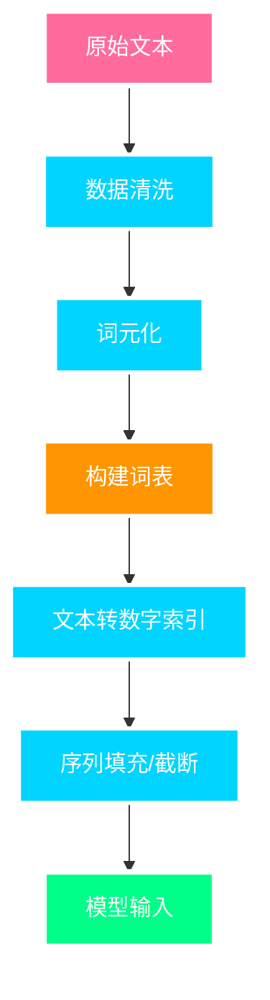
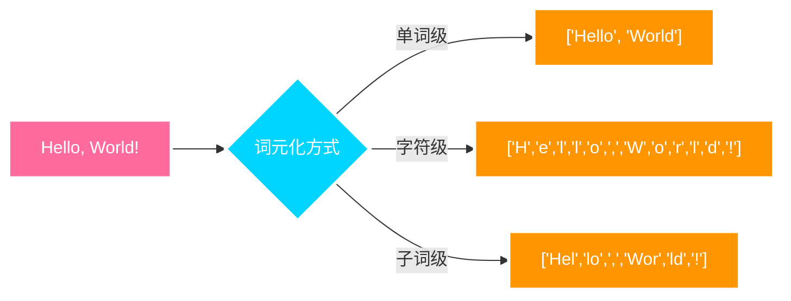
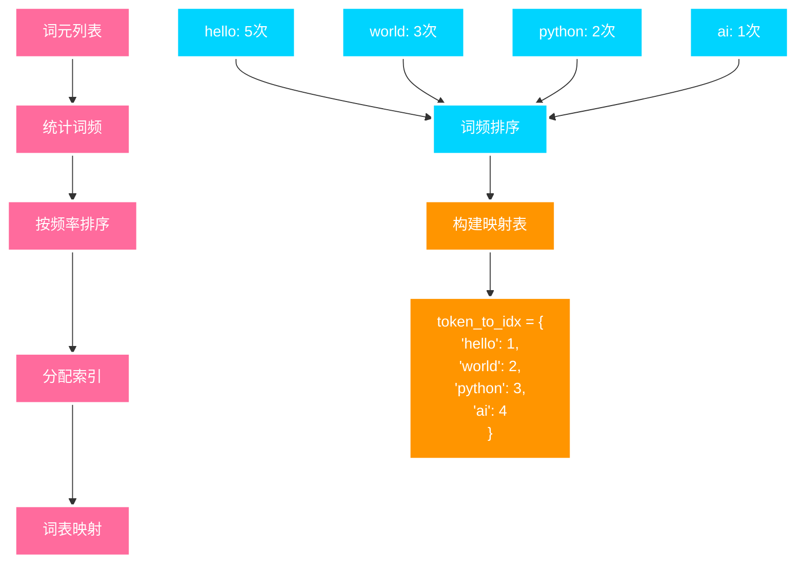
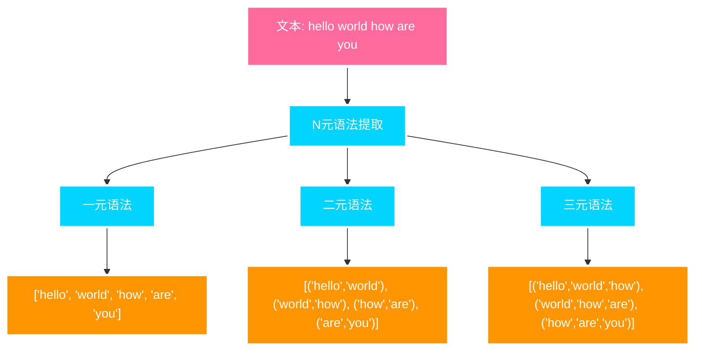
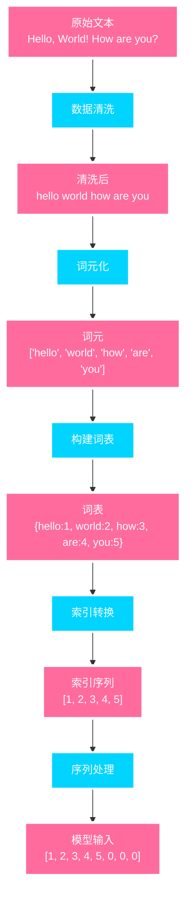

---
title: 文本预处理
date: 2025-07-09
type: notes-nlp
---


文本预处理是自然语言处理中的关键步骤，它将原始文本转换为机器学习模型可以处理的数字格式。高质量的文本预处理直接影响模型的性能和效果。

## 文本预处理的重要性

- **数据标准化**: 统一文本格式，消除噪声
- **特征提取**: 将文本转换为数值特征
- **维度优化**: 控制词汇表大小，平衡性能与计算复杂度
- **模型兼容**: 确保数据格式符合模型输入要求

## 文本预处理流程



### 预处理步骤详解

1. **数据清洗**: 去除特殊字符、标点符号，统一大小写
2. **词元化**: 将文本分割为词汇单元（单词、字符或子词）
3. **构建词表**: 创建词汇到数字索引的映射关系
4. **索引转换**: 将文本转换为数字序列
5. **序列处理**: 统一序列长度，便于批处理
6. **格式化**: 转换为模型可接受的输入格式

## 数据清洗

数据清洗是文本预处理的第一步，目标是去除噪声、统一格式。

```python
def read_text_data(file_path):
    """读取并清洗文本数据"""
    with open(file_path, 'r', encoding='utf-8') as f:
        lines = f.readlines()
    # 清洗：去除标点符号，转换为小写
    return [re.sub('[^A-Za-z]+', ' ', line).strip().lower()
            for line in lines]
```

> **执行示例**：
>
> 原始文本：`"Hello, World! How are you?"`
>
> 清洗后：`"hello world how are you"`
>
> - 去除标点符号：`,`, `!`, `?`
> - 转换为小写：`Hello` → `hello`
> - 去除多余空格

## 词元化 (Tokenization)

将文本分割为最小语义单位，有三种主要方式：

- **单词级**: `["hello", "world"]`
- **字符级**: `["h", "e", "l", "l", "o"]`
- **子词级**: `["hel", "lo", "wor", "ld"]`



```python
def tokenize(lines, token='word'):
    """文本词元化"""
    if token == 'word':
        return [line.split() for line in lines]
    elif token == 'char':
        return [list(line) for line in lines]
```

> **执行示例**：
>
> 输入文本：`"hello world"`
>
> **单词级词元化**：
>
> ```
> tokenize(["hello world"], 'word')
> 输出：[["hello", "world"]]
> ```
>
> **字符级词元化**：
>
> ```
> tokenize(["hello"], 'char')
> 输出：[["h", "e", "l", "l", "o"]]
> ```

## 词表构建

词表将词元映射为数字索引：$\text{vocab}: \text{token} \rightarrow \text{index}$



```python
class Vocab:
    def __init__(self, tokens, min_freq=0):
        # 统计词频
        counter = self.count_corpus(tokens)
        # 按频率排序
        self._token_freqs = sorted(counter.items(),
                                 key=lambda x: x[1], reverse=True)
        # 构建映射
        self.idx_to_token = ['<unk>'] + [token for token, freq
                            in self._token_freqs if freq >= min_freq]
        self.token_to_idx = {token: idx for idx, token
                           in enumerate(self.idx_to_token)}
```

> **执行示例**：
>
> 输入词元：`[["hello", "world"], ["hello", "python"]]`
>
> **词频统计**：
>
> ```
> hello: 2次
> world: 1次
> python: 1次
> ```
>
> **构建词表**：
>
> ```
> idx_to_token = ['<unk>', 'hello', 'world', 'python']
> token_to_idx = {
>     '<unk>': 0,
>     'hello': 1,
>     'world': 2,
>     'python': 3
> }
> ```

### 特殊词元

| 词元    | 用途     | 使用场景         |
| ------- | -------- | ---------------- |
| `<unk>` | 未知词元 | 处理词表外的词   |
| `<pad>` | 填充词元 | 统一序列长度     |
| `<bos>` | 序列开始 | 标记序列起始位置 |
| `<eos>` | 序列结束 | 标记序列结束位置 |

> **使用示例**：
>
> **处理未知词**：
>
> ```
> 词表中没有 "unknown" → 映射为 <unk> (索引0)
> ```
>
> **序列填充**：
>
> ```
> 原序列: [1, 2, 3]
> 填充后: [1, 2, 3, <pad>, <pad>]  # 统一长度为5
> ```
>
> **序列标记**：
>
> ```
> 完整序列: [<bos>, 1, 2, 3, <eos>]
> ```

## N 元语法 (N-gram)

N 元语法将文本序列分割为连续 N 个词元的组合，用于捕获局部语言模式和上下文信息。

### N 元语法类型

- **一元语法 (Unigram)**: 单个词元，如 "hello"
- **二元语法 (Bigram)**: 两个连续词元，如 "hello world"
- **三元语法 (Trigram)**: 三个连续词元，如 "hello world how"



```python
def generate_ngrams(tokens, n):
    """生成N元语法"""
    ngrams = []
    for i in range(len(tokens) - n + 1):
        ngram = tuple(tokens[i:i + n])
        ngrams.append(ngram)
    return ngrams

def extract_all_ngrams(text, max_n=3):
    """提取多种N元语法"""
    tokens = text.split()
    all_ngrams = {}

    for n in range(1, max_n + 1):
        all_ngrams[f'{n}-gram'] = generate_ngrams(tokens, n)

    return all_ngrams
```

> **执行示例**：
>
> 输入文本：`"hello world how are you"`
>
> **一元语法 (1-gram)**：
>
> ```
> [('hello',), ('world',), ('how',), ('are',), ('you',)]
> ```
>
> **二元语法 (2-gram)**：
>
> ```
> [('hello', 'world'), ('world', 'how'), ('how', 'are'), ('are', 'you')]
> ```
>
> **三元语法 (3-gram)**：
>
> ```
> [('hello', 'world', 'how'), ('world', 'how', 'are'), ('how', 'are', 'you')]
> ```

### 概率建模

N 元语法模型通过条件概率来预测下一个词元：

**二元语法模型**：
$$P(w_i | w_{i-1}) = \frac{C(w_{i-1}, w_i)}{C(w_{i-1})}$$

**三元语法模型**：
$$P(w_i | w_{i-2}, w_{i-1}) = \frac{C(w_{i-2}, w_{i-1}, w_i)}{C(w_{i-2}, w_{i-1})}$$

其中 $C(\cdot)$ 表示词元组合在语料库中的出现次数。

> **计算示例**：
>
> 语料库中的统计：
>
> - "hello world" 出现 10 次
> - "hello" 出现 15 次
> - "world how" 出现 8 次
> - "world" 出现 12 次
>
> 则二元语法概率：
> $$P(\text{world} | \text{hello}) = \frac{10}{15} = 0.67$$
>
> $$P(\text{how} | \text{world}) = \frac{8}{12} = 0.67$$

### 应用场景

- **语言模型**: 基于 N 元语法的概率建模
- **文本分类**: 使用 N 元语法作为特征
- **信息检索**: 提高查询匹配的准确性
- **机器翻译**: 捕获翻译中的局部模式

### 词表优化技术

- **频率过滤**: 移除低频和高频词汇
- **停用词处理**: 根据任务需求处理停用词
- **词形还原**: 将词汇还原为词根形式
- **同义词处理**: 合并语义相似的词汇

### 数学建模

#### 文本序列建模

在文本预处理中，我们需要理解文本的序列特性：

$$P(\text{文本}) = P(w_1, w_2, \ldots, w_T) = \prod_{t=1}^{T} P(w_t | w_1, \ldots, w_{t-1})$$

其中 $w_t$ 表示第 $t$ 个词元，$T$ 是序列长度。

#### 词汇分布建模

词汇表构建时需要考虑词频分布，通常遵循齐夫定律：

$$f(r) = \frac{C}{r^s}$$

其中 $f(r)$ 是第 $r$ 个最频繁词的频率，$C$ 和 $s$ 是常数。

## 实际应用示例



### 完整预处理流程

```python
def load_corpus(max_tokens=-1):
    """加载并预处理语料库"""
    # 1. 读取数据
    lines = read_text_data('data.txt')

    # 2. 词元化
    tokens = tokenize(lines, 'char')

    # 3. 构建词表
    vocab = Vocab(tokens)

    # 4. 转换为索引序列
    corpus = [vocab[token] for line in tokens for token in line]

    if max_tokens > 0:
        corpus = corpus[:max_tokens]

    return corpus, vocab
```

> **完整执行示例**：
>
> **步骤 1 - 原始数据**：
>
> ```
> "Hello, World!"
> ```
>
> **步骤 2 - 数据清洗**：
>
> ```
> "hello world"
> ```
>
> **步骤 3 - 字符级词元化**：
>
> ```
> ["h", "e", "l", "l", "o", " ", "w", "o", "r", "l", "d"]
> ```
>
> **步骤 4 - 构建词表**：
>
> ```
> {' ': 1, 'l': 2, 'o': 3, 'h': 4, 'e': 5, 'w': 6, 'r': 7, 'd': 8}
> ```
>
> **步骤 5 - 转换为索引**：
>
> ```
> [4, 5, 2, 2, 3, 1, 6, 3, 7, 2, 8]
> ```

### 数据批处理


> **批处理示例**：
>
> **原始序列**（长度不一）：
>
> ```
> 序列1: [1, 2, 3]
> 序列2: [4, 5, 6, 7, 8]
> 序列3: [9, 10]
> ```
>
> **填充/截断**（统一长度为 4）：
>
> ```
> 序列1: [1, 2, 3, <pad>]     # 填充
> 序列2: [4, 5, 6, 7]         # 截断
> 序列3: [9, 10, <pad>, <pad>] # 填充
> ```
>
> **批处理**（batch_size=3）：
>
> ```
> batch = [
>     [1, 2, 3, 0],      # 0 表示 <pad>
>     [4, 5, 6, 7],
>     [9, 10, 0, 0]
> ]
> ```

## 总结

- 语言模型估计文本序列的联合概率
- 使用统计方法时，常采用 N 元语法来捕获上下文信息
- 文本预处理是 NLP 的基础，直接影响模型性能

---

> 参考资料: [动手学深度学习 - 文本预处理](https://zh-v2.d2l.ai/chapter_recurrent-neural-networks/text-preprocessing.html)

