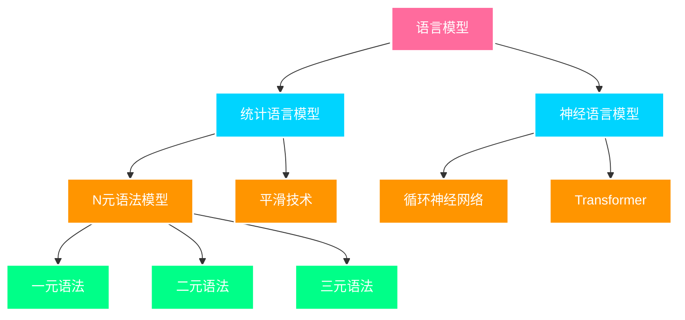
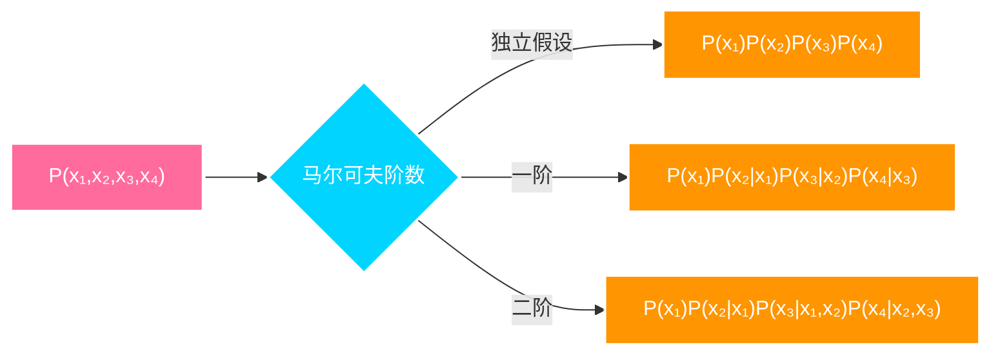
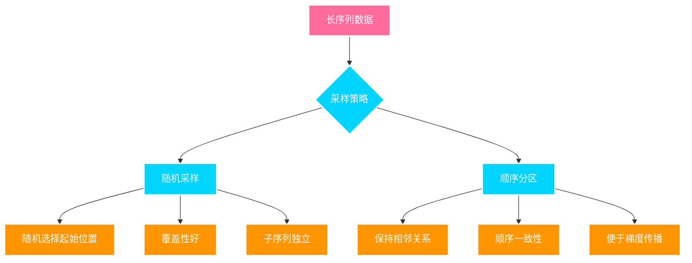
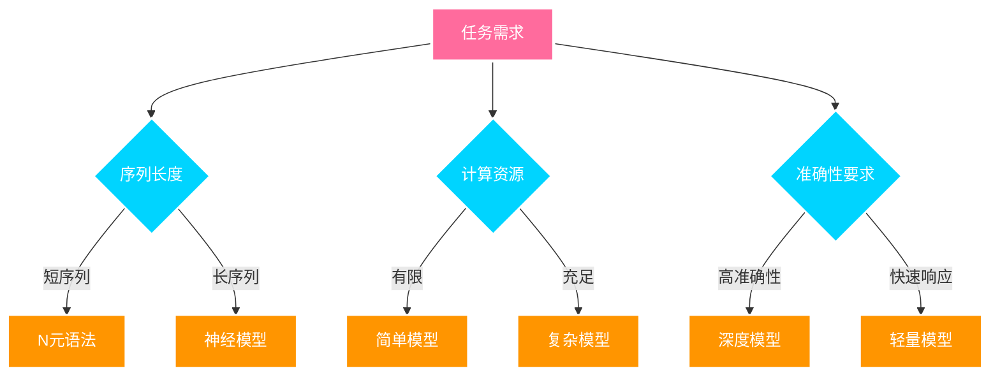

---
title: 语言模型
date: 2025-07-12
type: notes-nlp
---


语言模型是自然语言处理的核心技术，其目标是估计文本序列的联合概率分布，从而实现文本生成、语音识别、机器翻译等任务。

## 语言模型的基本任务

- **概率估计**: 计算文本序列出现的概率
- **文本生成**: 基于已有文本生成后续内容
- **语言理解**: 判断语句的合理性和语法正确性
- **下游应用**: 支持语音识别、机器翻译等任务

## 数学基础

### 联合概率分布

给定长度为 $T$ 的文本序列 $x_1, x_2, \ldots, x_T$，语言模型的目标是估计序列的联合概率：

$$P(x_1, x_2, \ldots, x_T)$$

### 链式法则分解

根据概率论的链式法则，联合概率可以分解为条件概率的乘积：

$$P(x_1, x_2, \ldots, x_T) = \prod_{t=1}^{T} P(x_t | x_1, \ldots, x_{t-1})$$

> **示例**：
>
> 四个单词的文本序列概率：
>
> $$P(\text{deep}, \text{learning}, \text{is}, \text{fun}) = P(\text{deep}) \cdot P(\text{learning} | \text{deep}) \cdot P(\text{is} | \text{deep}, \text{learning}) \cdot P(\text{fun} | \text{deep}, \text{learning}, \text{is})$$

## 语言模型类型



## N 元语法模型

### 马尔可夫假设

由于完整的条件概率计算复杂度过高，我们引入马尔可夫假设，假设当前词元只依赖于前面有限个词元：

**一阶马尔可夫（二元语法）**：
$$P(x_t | x_1, \ldots, x_{t-1}) = P(x_t | x_{t-1})$$

**二阶马尔可夫（三元语法）**：
$$P(x_t | x_1, \ldots, x_{t-1}) = P(x_t | x_{t-2}, x_{t-1})$$

### N 元语法分解



### 参数估计

**最大似然估计**：

一元语法概率：
$$\hat{P}(x) = \frac{n(x)}{N}$$

二元语法条件概率：
$$\hat{P}(x' | x) = \frac{n(x, x')}{n(x)}$$

其中：

- $n(x)$ 是词元 $x$ 的出现次数
- $n(x, x')$ 是词元对 $(x, x')$ 的出现次数
- $N$ 是总词元数

> **计算示例**：
>
> 语料库统计：
>
> - "深度学习" 出现 100 次
> - "深度" 出现 150 次
>
> 则：$P(\text{学习} | \text{深度}) = \frac{100}{150} = 0.67$

## 平滑技术

### 数据稀疏性问题

- **低频词组合**：许多合理的词组合在训练集中很少出现
- **未见词组合**：测试时遇到训练中未出现的词组合
- **零概率问题**：导致整个序列概率为零

### 拉普拉斯平滑

为所有计数添加小常量 $\epsilon$：

$$\hat{P}(x) = \frac{n(x) + \epsilon_1/m}{N + \epsilon_1}$$

$$\hat{P}(x' | x) = \frac{n(x, x') + \epsilon_2 \hat{P}(x')}{n(x) + \epsilon_2}$$

其中 $m$ 是唯一词元数量。

## 自然语言统计规律

### 齐普夫定律

词频分布遵循幂律分布：

$$n_i \propto \frac{1}{i^\alpha}$$

等价形式：
$$\log n_i = -\alpha \log i + c$$

其中：

- $n_i$ 是第 $i$ 个最频繁词的频率
- $\alpha$ 是分布指数
- $c$ 是常数


> **观察结果**：
>
> - 停用词占据最高频率位置
> - 词频快速衰减（第 10 个词频率 < 第 1 个词频率的 1/5）
> - 一元、二元、三元语法都遵循类似分布

### N 元语法频率比较


**重要发现**：

1. 所有 N 元语法都遵循齐普夫定律
2. 序列长度影响指数 $\alpha$ 的大小
3. 词表中 N 元组数量有限，说明语言具有结构性
4. 许多 N 元组出现频率极低，需要特殊处理

## 序列数据处理

### 长序列分割策略

由于文本序列可能很长，需要分割为固定长度的子序列进行训练：


### 数据采样方法



#### 随机采样

- **特点**：每个样本都是原始序列上任意捕获的子序列
- **优势**：提供更好的覆盖性和随机性
- **缺点**：相邻批次的子序列在原始序列中不相邻

#### 顺序分区

- **特点**：保证相邻批次中的子序列在原始序列上也相邻
- **优势**：保留序列的顺序信息，有利于模型学习
- **应用**：更适合需要长期依赖的任务

### 数据迭代器实现

#### 随机采样实现

```python
import random
import torch
def seq_data_iter_random(corpus, batch_size, num_steps):  #@save
    """使用随机抽样生成一个小批量子序列"""
    # 从随机偏移量开始对序列进行分区，随机范围包括num_steps-1
    corpus = corpus[random.randint(0, num_steps - 1):]
    # 减去1，是因为我们需要考虑标签
    num_subseqs = (len(corpus) - 1) // num_steps
    # 长度为num_steps的子序列的起始索引
    initial_indices = list(range(0, num_subseqs * num_steps, num_steps))
    # 在随机抽样的迭代过程中，
    # 来自两个相邻的、随机的、小批量中的子序列不一定在原始序列上相邻
    random.shuffle(initial_indices)

    def data(pos):
        # 返回从pos位置开始的长度为num_steps的序列
        return corpus[pos: pos + num_steps]

    num_batches = num_subseqs // batch_size
    for i in range(0, batch_size * num_batches, batch_size):
        # 在这里，initial_indices包含子序列的随机起始索引
        initial_indices_per_batch = initial_indices[i: i + batch_size]
        X = [data(j) for j in initial_indices_per_batch]
        Y = [data(j + 1) for j in initial_indices_per_batch]
        yield torch.tensor(X), torch.tensor(Y)
```

> **随机采样示例**：
>
> ```python
> # 生成0到34的序列
> my_seq = list(range(35))
> for X, Y in seq_data_iter_random(my_seq, batch_size=2, num_steps=5):
>     print('X:', X, '\nY:', Y)
> ```
>
> **输出**：
>
> ```
> X: tensor([[22, 23, 24, 25, 26],
>            [27, 28, 29, 30, 31]])
> Y: tensor([[23, 24, 25, 26, 27],
>            [28, 29, 30, 31, 32]])
>
> X: tensor([[ 7,  8,  9, 10, 11],
>            [12, 13, 14, 15, 16]])
> Y: tensor([[ 8,  9, 10, 11, 12],
>            [13, 14, 15, 16, 17]])
> ```
>
> **特点**：相邻批次的子序列在原序列中不连续

#### 顺序分区实现

```python
def seq_data_iter_sequential(corpus, batch_size, num_steps):
    """使用顺序分区生成一个小批量子序列"""
    # 从随机偏移量开始划分序列
    offset = random.randint(0, num_steps)
    num_tokens = ((len(corpus) - offset - 1) // batch_size) * batch_size
    Xs = torch.tensor(corpus[offset: offset + num_tokens])
    Ys = torch.tensor(corpus[offset + 1: offset + 1 + num_tokens])
    Xs, Ys = Xs.reshape(batch_size, -1), Ys.reshape(batch_size, -1)
    num_batches = Xs.shape[1] // num_steps
    for i in range(0, num_steps * num_batches, num_steps):
        X = Xs[:, i: i + num_steps]
        Y = Ys[:, i: i + num_steps]
        yield X, Y
```

> **顺序分区示例**：
>
> ```python
> for X, Y in seq_data_iter_sequential(my_seq, batch_size=2, num_steps=5):
>     print('X:', X, '\nY:', Y)
> ```
>
> **输出**：
>
> ```
> X: tensor([[ 0,  1,  2,  3,  4],
>            [17, 18, 19, 20, 21]])
> Y: tensor([[ 1,  2,  3,  4,  5],
>            [18, 19, 20, 21, 22]])
>
> X: tensor([[ 5,  6,  7,  8,  9],
>            [22, 23, 24, 25, 26]])
> Y: tensor([[ 6,  7,  8,  9, 10],
>            [23, 24, 25, 26, 27]])
> ```
>
> **特点**：相邻批次的子序列在原序列中连续

### 数据加载器

```python
class SeqDataLoader:
    """加载序列数据的迭代器"""
    def __init__(self, batch_size, num_steps, use_random_iter, max_tokens):
        if use_random_iter:
            self.data_iter_fn = seq_data_iter_random
        else:
            self.data_iter_fn = seq_data_iter_sequential
        self.corpus, self.vocab = d2l.load_corpus_time_machine(max_tokens)
        self.batch_size, self.num_steps = batch_size, num_steps

    def __iter__(self):
        return self.data_iter_fn(self.corpus, self.batch_size, self.num_steps)

def load_data_time_machine(batch_size, num_steps, use_random_iter=False, max_tokens=10000):
    """返回时光机器数据集的迭代器和词表"""
    data_iter = SeqDataLoader(batch_size, num_steps, use_random_iter, max_tokens)
    return data_iter, data_iter.vocab
```

> **使用示例**：
>
> ```python
> # 加载数据
> train_iter, vocab = load_data_time_machine(batch_size=32, num_steps=35)
> print(f"词汇表大小: {len(vocab)}")
>
> # 获取一个批次数据
> for X, Y in train_iter:
>     print(f"输入形状: {X.shape}")
>     print(f"标签形状: {Y.shape}")
>     break
> ```
>
> **输出**：
>
> ```
> 词汇表大小: 28
> 输入形状: torch.Size([32, 35])
> 标签形状: torch.Size([32, 35])
> ```
>
> **解释**：
>
> - 批次大小：32 个序列
> - 序列长度：每个序列 35 个时间步
> - X[i, t] 是输入，Y[i, t] 是对应的标签（下一个词）

## 模型评估

### 困惑度（Perplexity）

困惑度是评估语言模型的重要指标：

$$\text{PPL} = \exp\left(-\frac{1}{N} \sum_{i=1}^{N} \log P(x_i)\right)$$

**含义**：

- 困惑度越低，模型性能越好
- 表示模型对每个位置"困惑"的平均程度
- 可以理解为模型认为每个位置有多少个等可能的选择

> **困惑度计算示例**：
>
> ```
> 预测概率: [0.7, 0.2, 0.1]
> 平均对数似然: -1.6542
> 困惑度: 5.2327
> ```
>
> **困惑度解释**：
>
> - 困惑度为 5.23，意味着模型平均认为每个位置有约 5 个等可能的选择
> - 困惑度越低说明模型越确定，预测越准确
> - 理想情况下，完美模型的困惑度为 1（完全确定下一个词）
> - 随机猜测的困惑度等于词汇表大小

## 模型选择指导



---

> 参考资料: [动手学深度学习 - 语言模型和数据集](https://zh-v2.d2l.ai/chapter_recurrent-neural-networks/language-models-and-dataset.html)

