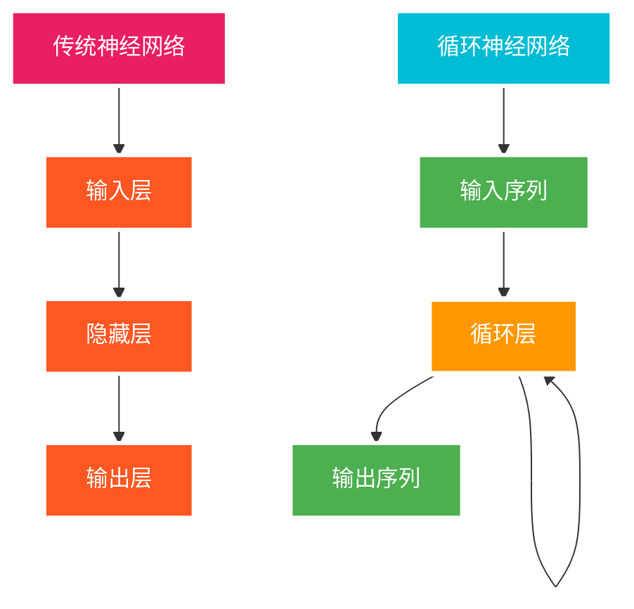
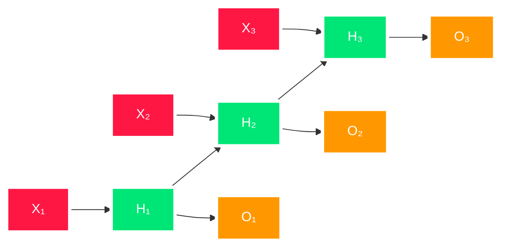
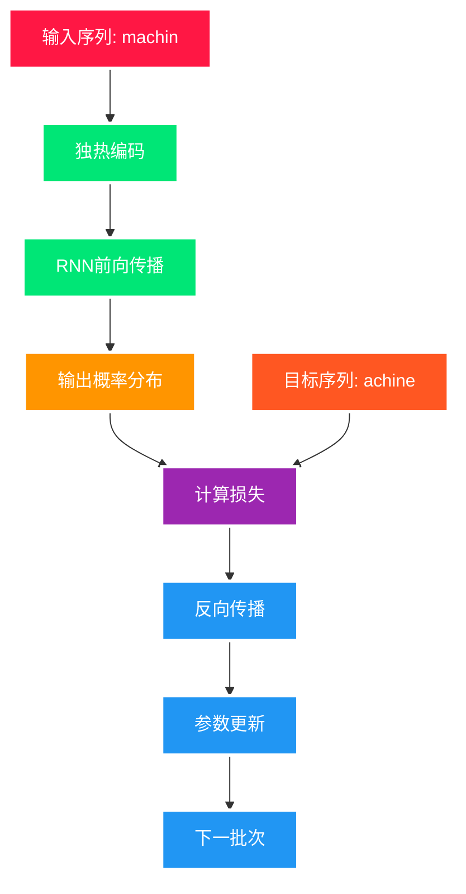
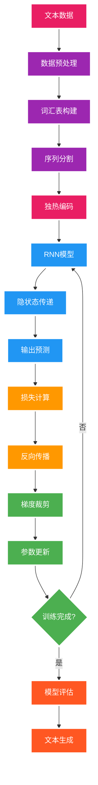
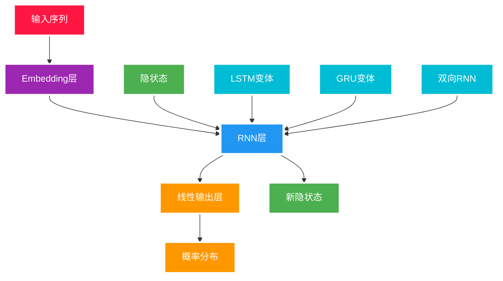
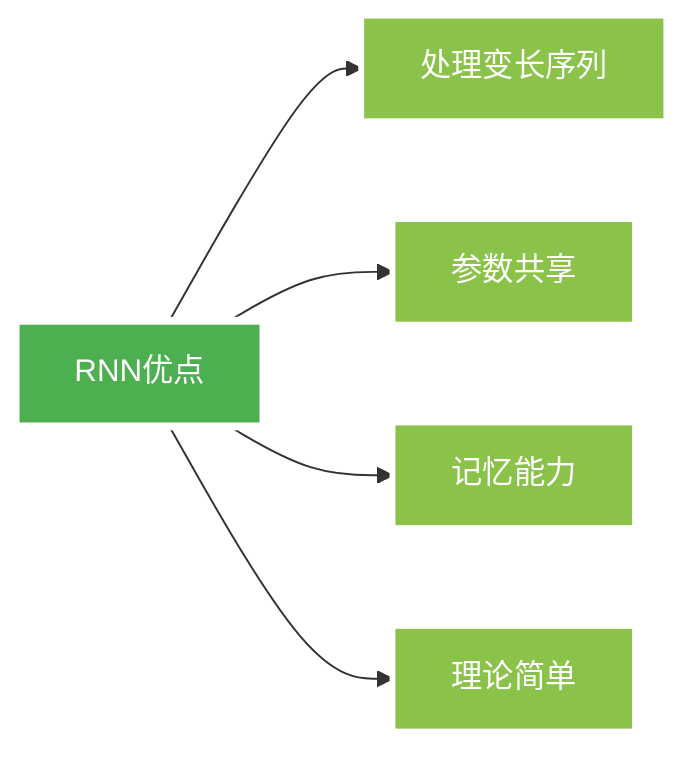
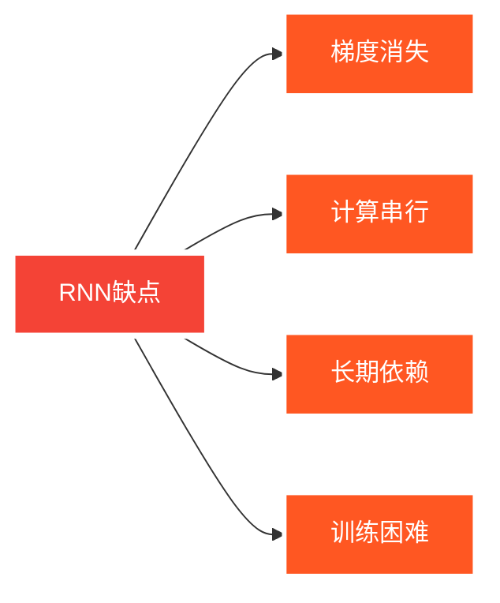

---
title: 循环神经网络 (RNN)
date: 2025-07-09
type: notes-nlp
---


## 概述

循环神经网络（Recurrent Neural Networks, RNNs）是一类专门处理序列数据的神经网络。与传统的前馈神经网络不同，RNN 具有"记忆"功能，能够利用之前的信息来影响当前的输出。

### RNN 的核心优势

- **序列建模**: 能够处理变长序列数据
- **时间依赖**: 捕获序列中的时间依赖关系
- **参数共享**: 所有时间步共享相同的参数
- **记忆机制**: 通过隐状态保存历史信息

## 基本原理

### 隐状态概念

RNN 的关键在于引入了**隐状态**（Hidden State）$h_t$，它作为网络的"记忆"：

$$P(x_t | x_{t-1}, \ldots, x_1) \approx P(x_t | h_{t-1})$$

$$h_t = f(x_t, h_{t-1})$$

其中：

- $h_t$ 是时间步 $t$ 的隐状态
- $x_t$ 是时间步 $t$ 的输入
- $f$ 是状态更新函数

### RNN 架构对比



## 数学定义

### 无隐状态的神经网络

对于传统的多层感知机：

**隐藏层**：
$$H = \phi(XW_{xh} + b_h)$$

**输出层**：
$$O = HW_{hq} + b_q$$

### 有隐状态的循环神经网络

RNN 在每个时间步的计算：

**隐状态更新**：
$$H_t = \phi(X_t W_{xh} + H_{t-1} W_{hh} + b_h)$$

**输出计算**：
$$O_t = H_t W_{hq} + b_q$$

其中：

- $W_{xh} \in \mathbb{R}^{d \times h}$：输入到隐状态的权重
- $W_{hh} \in \mathbb{R}^{h \times h}$：隐状态到隐状态的权重
- $W_{hq} \in \mathbb{R}^{h \times q}$：隐状态到输出的权重
- $b_h, b_q$：偏置项

### RNN 时间展开




## 字符级语言模型

### 模型结构

RNN 可以用于构建字符级语言模型，根据前面的字符预测下一个字符：


### 训练过程



## RNN 完整工作流程

### 端到端流程图



## 从零实现

### 独热编码

```python
import torch
import torch.nn.functional as F

def one_hot_encode(indices, vocab_size):
    """将索引转换为独热向量"""
    return F.one_hot(indices, vocab_size).float()

# 示例
vocab_size = 28
indices = torch.tensor([0, 2])
one_hot = one_hot_encode(indices, vocab_size)
print(f"输入索引: {indices}")
print(f"独热编码形状: {one_hot.shape}")
```

> **独热编码示例**：
>
> ```
> 输入索引: tensor([0, 2])
> 独热编码形状: torch.Size([2, 28])
> ```
>
> **说明**：
>
> - 每个词元被表示为长度为词汇表大小的向量
> - 只有对应位置为 1，其余位置为 0
> - 便于神经网络处理离散的词汇索引

### 参数初始化

```python
def get_rnn_params(vocab_size, num_hiddens, device):
    """初始化RNN参数"""
    num_inputs = num_outputs = vocab_size

    def normal(shape):
        return torch.randn(size=shape, device=device) * 0.01

    # 隐藏层参数
    W_xh = normal((num_inputs, num_hiddens))   # 输入到隐状态
    W_hh = normal((num_hiddens, num_hiddens))  # 隐状态到隐状态
    b_h = torch.zeros(num_hiddens, device=device)

    # 输出层参数
    W_hq = normal((num_hiddens, num_outputs))  # 隐状态到输出
    b_q = torch.zeros(num_outputs, device=device)

    # 启用梯度
    params = [W_xh, W_hh, b_h, W_hq, b_q]
    for param in params:
        param.requires_grad_(True)

    return params

# 使用示例
vocab_size = 28
num_hiddens = 512
device = torch.device('cuda' if torch.cuda.is_available() else 'cpu')
params = get_rnn_params(vocab_size, num_hiddens, device)
print(f"参数数量: {sum(p.numel() for p in params)}")
```

> **参数统计**：
>
> ```
> 参数数量: 307,640
> ```
>
> **参数详解**：
>
> - `W_xh`: (28, 512) = 14,336 参数
> - `W_hh`: (512, 512) = 262,144 参数
> - `W_hq`: (512, 28) = 14,336 参数
> - 偏置项: 512 + 28 = 540 参数

### RNN 前向传播

```python
def init_rnn_state(batch_size, num_hiddens, device):
    """初始化RNN隐状态"""
    return (torch.zeros((batch_size, num_hiddens), device=device),)
```

**初始化时返回隐藏状态，因为在 0 时刻的时候， 没有上一个时刻的隐藏状态**

```python
def rnn(inputs, state, params):
    """RNN前向传播"""
    W_xh, W_hh, b_h, W_hq, b_q = params
    H, = state # 当前的隐藏状态
    outputs = []

    # 按时间步处理输入
    for X in inputs:  # inputs 是一个三维的tensor 沿着第一个维度(时间)遍历,X形状: (batch_size, vocab_size)
        H = torch.tanh(torch.mm(X, W_xh) + torch.mm(H, W_hh) + b_h)
        Y = torch.mm(H, W_hq) + b_q
        outputs.append(Y)

    return torch.cat(outputs, dim=0), (H,) # 此次行数发生了变化,tensor形状:(batch_size(批量大小) * num_steps（时间长度）, num_outputs) ，同时也输出了更新后的隐藏状态
```

定义了如何在一个时间步内计算隐藏状态并输出

```python
class RNNModelScratch:
    """从零实现的RNN模型"""
    def __init__(self, vocab_size, num_hiddens, device, get_params, init_state, forward_fn):
        self.vocab_size = vocab_size
        self.num_hiddens = num_hiddens
        self.params = get_params(vocab_size, num_hiddens, device)
        self.init_state = init_state
        self.forward_fn = forward_fn

    def __call__(self, X, state):
        X = F.one_hot(X.T, self.vocab_size).float()
        return self.forward_fn(X, state, self.params)

    def begin_state(self, batch_size, device):
        return self.init_state(batch_size, self.num_hiddens, device)
```

使用这个类包装模型，支持不同的输入和输出

```python
# 模型实例化
net = RNNModelScratch(vocab_size, num_hiddens, device,
                      get_rnn_params, init_rnn_state, rnn)
```

> **前向传播示例**：
>
> ```python
> # 测试前向传播
> batch_size, num_steps = 2, 5
> X = torch.randint(0, vocab_size, (batch_size, num_steps))
> state = net.begin_state(batch_size, device)
> Y, new_state = net(X.to(device), state)
>
> print(f"输入形状: {X.shape}")
> print(f"输出形状: {Y.shape}")
> print(f"隐状态形状: {new_state[0].shape}")
> ```
>
> **输出**：
>
> ```
> 输入形状: torch.Size([2, 5])
> 输出形状: torch.Size([10, 28])
> 隐状态形状: torch.Size([2, 512])
> ```

### 预测功能

```python
def predict_rnn(prefix, num_preds, net, vocab, device):
    """使用RNN生成文本"""
    state = net.begin_state(batch_size=1, device=device) # 生成初始的隐藏状态
    outputs = [vocab[prefix[0]]] # 存储每个字符串在vocab的下标

    def get_input():
        return torch.tensor([outputs[-1]], device=device).reshape((1, 1)) # 把最近预测的值转换为下一次预测的输入 形状为(1, 1)

    # 预热期：处理前缀
    for y in prefix[1:]: # 从第二个字符开始进行处理
        _, state = net(get_input(), state) # 把前缀信息存入state中
        outputs.append(vocab[y]) # 存储当前字符的下标

    # 预测期：生成新字符
    for _ in range(num_preds):
        y, state = net(get_input(), state) # 每次把前一个时刻的输入与隐藏状态放入，得到下一个时刻的输出和新的隐藏状态
        outputs.append(int(y.argmax(dim=1).reshape(1))) # 获取预测结果，并转换为下标

    return ''.join([vocab.idx_to_token[i] for i in outputs]) # 索引转换为字符串

# 预测示例（未训练模型）
# result = predict_rnn('time traveller ', 10, net, vocab, device)
# 输出：'time traveller fqendfqend'
```

> **预测流程**：
>
> 1. **预热期**：模型读取前缀"time traveller "，更新内部状态
> 2. **预测期**：基于当前状态生成后续字符
> 3. **迭代生成**：每生成一个字符，都更新状态用于下次预测

## 训练优化

### 梯度裁剪

> **梯度裁剪原理**：
>
> $$g \leftarrow \min\left(1, \frac{\theta}{\|g\|}\right) g$$
>
> **作用**：
>
> - 限制梯度范数不超过阈值 $\theta$
> - 保持梯度方向不变
> - 防止梯度爆炸导致训练不稳定

```python
import math

def grad_clipping(net, theta):
    """梯度裁剪防止梯度爆炸"""
    if isinstance(net, torch.nn.Module):
        params = [p for p in net.parameters() if p.requires_grad]
    else:
        params = net.params

    # 计算梯度范数
    norm = torch.sqrt(sum(torch.sum((p.grad ** 2)) for p in params))

    # 裁剪梯度
    if norm > theta:
        for param in params:
            param.grad[:] *= theta / norm
```

定义函数在一个迭代周期内训练模型

```python
def train_epoch_rnn(net, train_iter, loss, updater, device, use_random_iter):
    """训练一个epoch"""
    state, timer = None, Timer() # 初始化状态和计时器
    metric = Accumulator(2)  # 训练损失之和, 词元数量

    for X, Y in train_iter:
        if state is None or use_random_iter:
            # 初始化状态
            state = net.begin_state(batch_size=X.shape[0], device=device)
        else:
            # 分离梯度
            if isinstance(net, torch.nn.Module) and not isinstance(state, tuple):
                state.detach_()
            else:
                for s in state:
                    s.detach_()
        # 将目标值Y进行转置并重塑，以便与模型的输出形状匹配
        y = Y.T.reshape(-1)

        # 将输入数据X和目标值y移动到指定的设备（如GPU）上，以进行高效的计算
        X, y = X.to(device), y.to(device)

        # 通过网络传递输入数据X和当前状态state，得到预测输出y_hat和新的状态state
        y_hat, state = net(X, state)

        # 计算预测输出y_hat与目标值y之间的损失，并取平均值
        l = loss(y_hat, y.long()).mean()

        # 如果更新器updater是torch.optim.Optimizer的实例，则进行梯度清零、反向传播、梯度裁剪和参数更新
        if isinstance(updater, torch.optim.Optimizer):
            updater.zero_grad()
            l.backward()
            grad_clipping(net, 1)
            updater.step()
        else:
            # 如果更新器updater不是torch.optim.Optimizer的实例，则仅进行反向传播和梯度裁剪
            l.backward()
            grad_clipping(net, 1)
            # 因为已经调用了mean函数，所以在这里使用batch_size=1进行参数更新
            updater(batch_size=1)

        # 更新度量metric，添加当前批次的平均损失乘以元素数量和元素总数量
        metric.add(l * y.numel(), y.numel())

    return math.exp(metric[0] / metric[1]), metric[1] / timer.stop() # 计算困惑度
```

### 训练循环

```python
def train_rnn(net, train_iter, vocab, lr, num_epochs, device, use_random_iter=False):
    """训练RNN模型"""
    loss = torch.nn.CrossEntropyLoss()
    animator = Animator(xlabel='epoch', ylabel='perplexity',
                       legend=['train'], xlim=[10, num_epochs])

    # 初始化优化器
    if isinstance(net, torch.nn.Module):
        updater = torch.optim.SGD(net.parameters(), lr)
    else:
        updater = lambda batch_size: sgd(net.params, lr, batch_size)

    predict = lambda prefix: predict_rnn(prefix, 50, net, vocab, device)

    # 训练循环
    for epoch in range(num_epochs):
        ppl, speed = train_epoch_rnn(net, train_iter, loss, updater,
                                   device, use_random_iter)
        if (epoch + 1) % 10 == 0:
            print(predict('time traveller'))
            animator.add(epoch + 1, [ppl])

    print(f'困惑度 {ppl:.1f}, {speed:.1f} 词元/秒 {str(device)}')
```

> **训练输出示例**：
>
> ```
> epoch 10: time traveller the the the the the the the
> epoch 50: time traveller and the time machine was a
> epoch 100: time traveller for so it will be convenient to speak
>
> 困惑度 1.2, 23500.0 词元/秒 cuda:0
> ```

## 高级 API 实现

### PyTorch RNN 模块架构



```python
import torch.nn as nn

class RNNModel(nn.Module):
    """使用PyTorch高级API的RNN模型"""
    def __init__(self, rnn_layer, vocab_size):
        super(RNNModel, self).__init__()
        self.rnn = rnn_layer
        self.vocab_size = vocab_size
        self.num_hiddens = self.rnn.hidden_size

        # 输出层
        if self.rnn.bidirectional:
            self.num_directions = 2
        else:
            self.num_directions = 1
        self.linear = nn.Linear(self.num_hiddens * self.num_directions, vocab_size)

    def forward(self, inputs, state):
        X = F.one_hot(inputs.T.long(), self.vocab_size).float()
        Y, state = self.rnn(X, state)
        # 全连接层
        output = self.linear(Y.reshape((-1, Y.shape[-1])))
        return output, state

    def begin_state(self, device, batch_size=1):
        if not isinstance(self.rnn, nn.LSTM):
            # nn.GRU以及nn.RNN
            return torch.zeros((self.rnn.num_layers * self.num_directions,
                              batch_size, self.num_hiddens), device=device)
        else:
            # nn.LSTM
            return (torch.zeros((self.rnn.num_layers * self.num_directions,
                               batch_size, self.num_hiddens), device=device),
                    torch.zeros((self.rnn.num_layers * self.num_directions,
                               batch_size, self.num_hiddens), device=device))

# 使用示例
num_hiddens = 256
rnn_layer = nn.RNN(len(vocab), num_hiddens)
net = RNNModel(rnn_layer, vocab_size=len(vocab))

# 训练
num_epochs, lr = 500, 1
train_rnn(net, train_iter, vocab, lr, num_epochs, device)
```

### 不同 RNN 变体

```python
# 标准RNN
rnn_layer = nn.RNN(input_size=vocab_size, hidden_size=num_hiddens,
                   num_layers=1, batch_first=False)

# LSTM（长短期记忆网络）
lstm_layer = nn.LSTM(input_size=vocab_size, hidden_size=num_hiddens,
                     num_layers=1, batch_first=False)

# GRU（门控循环单元）
gru_layer = nn.GRU(input_size=vocab_size, hidden_size=num_hiddens,
                   num_layers=1, batch_first=False)

# 双向RNN
bidirectional_rnn = nn.RNN(input_size=vocab_size, hidden_size=num_hiddens,
                           num_layers=1, bidirectional=True, batch_first=False)
```

## 困惑度评估

### 困惑度定义

困惑度是评估语言模型质量的重要指标：

$$\text{PPL} = \exp\left(-\frac{1}{n}\sum_{t=1}^{n} \log P(x_t | x_1, \ldots, x_{t-1})\right)$$

### 困惑度计算

```python
def evaluate_perplexity(net, data_iter, device):
    """计算模型困惑度"""
    net.eval()
    total_loss = 0.0
    total_tokens = 0

    with torch.no_grad():
        for X, Y in data_iter:
            state = net.begin_state(device, X.shape[0])
            y = Y.T.reshape(-1)
            X, y = X.to(device), y.to(device)
            y_hat, _ = net(X, state)
            loss = F.cross_entropy(y_hat, y.long(), reduction='sum')
            total_loss += loss.item()
            total_tokens += y.numel()

    return math.exp(total_loss / total_tokens)

# 使用示例
# perplexity = evaluate_perplexity(net, test_iter, device)
# print(f"测试困惑度: {perplexity:.2f}")
```

> **困惑度解释**：
>
> - **PPL = 1**: 完美预测（理论最优）
> - **PPL = 词汇表大小**: 随机猜测的基线
> - **PPL 越低越好**: 表示模型预测越准确
> - **实际应用**: 好的模型困惑度通常在 10-100 之间

## RNN 的优缺点

### 优点



- **序列建模**: 天然适合处理序列数据
- **参数效率**: 所有时间步共享参数
- **灵活性**: 支持多种输入输出模式
- **可解释性**: 隐状态具有明确的物理含义

### 缺点



- **梯度消失**: 难以捕获长期依赖
- **计算串行**: 无法充分并行化
- **训练不稳定**: 容易出现梯度爆炸
- **性能限制**: 对于复杂任务表现有限

### 技术演进路径


### 发展趋势

- **LSTM/GRU**: 解决梯度消失问题
- **Attention 机制**: 改善长期依赖建模
- **Transformer**: 完全基于注意力的架构
- **预训练模型**: BERT、GPT 等大规模模型

## 总结

- 循环神经网络的输出取决于当下输入和前一时间的隐变量
- 应用到语言模型中时，循环神经网络根据当前词预测下一次时刻词
- 通常使用困惑度来衡量语言模型的好坏

---

> 参考资料:
>
> - [循环神经网络](https://zh-v2.d2l.ai/chapter_recurrent-neural-networks/rnn.html)
> - [循环神经网络的从零开始实现](https://zh-v2.d2l.ai/chapter_recurrent-neural-networks/rnn-scratch.html)
> - [循环神经网络的简洁实现](https://zh-v2.d2l.ai/chapter_recurrent-neural-networks/rnn-concise.html)

