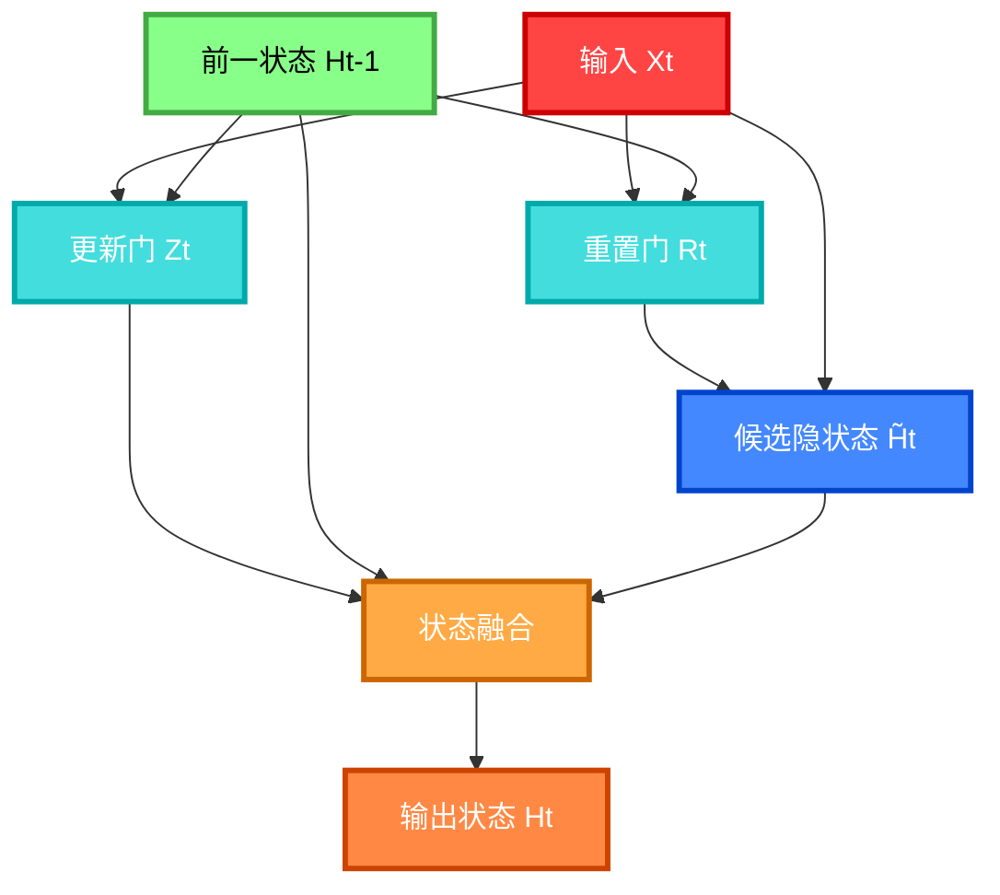

---
title: 门控循环单元 (GRU)
date: 2025-07-10
type: notes-nlp
---


门控循环单元（Gated Recurrent Unit, GRU）是一种特殊的循环神经网络，专门设计用来解决传统 RNN 的梯度消失问题和长期依赖问题。

### 核心特征

- **门控机制**：支持隐状态的门控，决定何时更新和重置隐状态
- **长短期依赖**：能够捕获序列中的长期和短期依赖关系
- **参数更少**：相比 LSTM 结构更简单，参数量更少

## GRU 结构

GRU 包含两个核心门控机制：

### 重置门 (Reset Gate)

控制"记住多少过去状态"的数量，有助于捕获**短期依赖关系**。

$$R_t = \sigma(X_t W_{xr} + H_{t-1} W_{hr} + b_r)$$

### 更新门 (Update Gate)

控制新状态融入的程度，有助于捕获**长期依赖关系**。

$$Z_t = \sigma(X_t W_{xz} + H_{t-1} W_{hz} + b_z)$$

### 候选隐状态

结合重置门的作用，计算候选隐状态：

$$\tilde{H}_t = \tanh(X_t W_{xh} + (R_t \odot H_{t-1}) W_{hh} + b_h)$$

### 最终隐状态

通过更新门融合旧状态和候选状态：

$$H_t = Z_t \odot H_{t-1} + (1 - Z_t) \odot \tilde{H}_t$$

## GRU 工作流程



### 计算步骤说明：

1. **输入处理**：当前时间步输入 $X_t$ 同时流向重置门和更新门
2. **重置门计算**：$R_t = \sigma(X_t W_{xr} + H_{t-1} W_{hr} + b_r)$
3. **更新门计算**：$Z_t = \sigma(X_t W_{xz} + H_{t-1} W_{hz} + b_z)$
4. **候选状态生成**：$\tilde{H}_t = \tanh(X_t W_{xh} + (R_t \odot H_{t-1}) W_{hh} + b_h)$
5. **状态融合**：$H_t = Z_t \odot H_{t-1} + (1 - Z_t) \odot \tilde{H}_t$
6. **最终输出**：新的隐状态 $H_t$ 传递到下一时间步

## 关键机制说明

### 重置门的作用

- 当 $R_t \approx 0$ 时：忽略之前的隐状态，重新开始
- 当 $R_t \approx 1$ 时：保留之前的隐状态信息

### 更新门的作用

- 当 $Z_t \approx 1$ 时：主要保留旧状态，跳过当前输入
- 当 $Z_t \approx 0$ 时：主要使用新的候选状态

## 计算示例


## GRU vs 传统 RNN

| 特性       | 传统 RNN      | GRU      |
| ---------- | ------------- | -------- |
| 梯度问题   | 容易消失/爆炸 | 有效缓解 |
| 长期依赖   | 困难          | 较好处理 |
| 参数量     | 较少          | 中等     |
| 计算复杂度 | 低            | 中等     |

## 应用场景

- **序列建模**：语言模型、机器翻译
- **时间序列**：股价预测、天气预报
- **自然语言处理**：情感分析、文本分类
- **语音识别**：语音到文本转换

## 优势与限制

### 优势

- 解决长期依赖问题
- 参数比 LSTM 少，训练更快
- 门控机制灵活控制信息流

### 限制

- 仍然是序列模型，难以并行化
- 对于极长序列仍有挑战
- 相比 Transformer 等新架构性能有限

## 实现要点

```python
# 核心计算步骤
def gru_cell(X_t, H_prev, params):
    # 重置门
    R_t = sigmoid(X_t @ W_xr + H_prev @ W_hr + b_r)
    # 更新门
    Z_t = sigmoid(X_t @ W_xz + H_prev @ W_hz + b_z)
    # 候选隐状态
    H_tilde = tanh(X_t @ W_xh + (R_t * H_prev) @ W_hh + b_h)
    # 最终隐状态
    H_t = Z_t * H_prev + (1 - Z_t) * H_tilde
    return H_t
```

## 小结

GRU 通过**重置门**和**更新门**的门控机制，有效解决了传统 RNN 的梯度消失问题，能够：

- 重置门帮助捕获短期依赖
- 更新门帮助捕获长期依赖
- 在保持模型简洁性的同时提升性能

GRU 是 LSTM 的简化版本，在许多任务中表现接近 LSTM 但计算效率更高。

