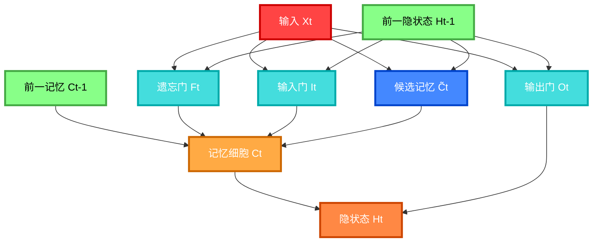

长短期记忆网络（Long Short-Term Memory, LSTM）是一种特殊的门控循环神经网络，专门设计用来解决传统 RNN 的梯度消失问题和长期依赖问题。LSTM 比 GRU 结构稍微复杂，但能更精细地控制信息流动。

### 核心特征

- **三门控机制**：输入门、遗忘门、输出门精确控制信息流
- **记忆细胞**：独立的记忆单元，专门存储长期信息
- **长期依赖**：能够有效捕获和保持长距离的时间依赖关系
- **梯度稳定**：通过门控机制有效缓解梯度消失和爆炸问题

## LSTM 结构

LSTM 包含三个核心门控机制和一个记忆细胞：

### 输入门 (Input Gate)

控制当前输入信息有多少流入记忆细胞：

$$I_t = \sigma(X_t W_{xi} + H_{t-1} W_{hi} + b_i)$$

### 遗忘门 (Forget Gate)

控制从上一时间步记忆细胞中丢弃多少信息：

$$F_t = \sigma(X_t W_{xf} + H_{t-1} W_{hf} + b_f)$$

### 输出门 (Output Gate)

控制记忆细胞的多少信息输出到隐状态：

$$O_t = \sigma(X_t W_{xo} + H_{t-1} W_{ho} + b_o)$$

### 候选记忆细胞

计算候选的新信息，准备添加到记忆细胞：

$$\tilde{C}_t = \tanh(X_t W_{xc} + H_{t-1} W_{hc} + b_c)$$

### 记忆细胞

结合遗忘门和输入门，更新记忆细胞：

$$C_t = F_t \odot C_{t-1} + I_t \odot \tilde{C}_t$$

### 隐状态

通过输出门控制从记忆细胞到隐状态的信息流：

$$H_t = O_t \odot \tanh(C_t)$$

## LSTM 工作流程



### 计算步骤说明：

1. **门控计算**：根据当前输入和前一隐状态计算三个门的值
2. **候选记忆**：计算准备添加到记忆细胞的新信息
3. **记忆更新**：遗忘门控制保留多少旧记忆，输入门控制接收多少新信息
4. **隐状态输出**：输出门控制记忆细胞的多少信息传递到隐状态

## 关键机制说明

### 遗忘门的作用

- 当 $F_t \approx 0$ 时：完全遗忘之前的记忆
- 当 $F_t \approx 1$ 时：完全保留之前的记忆

### 输入门的作用

- 当 $I_t \approx 0$ 时：拒绝当前的新信息
- 当 $I_t \approx 1$ 时：完全接受当前的新信息

### 输出门的作用

- 当 $O_t \approx 0$ 时：隐状态不输出记忆信息
- 当 $O_t \approx 1$ 时：隐状态完全基于记忆细胞

## 计算示例


## LSTM vs GRU vs 传统 RNN

| 特性       | 传统 RNN | GRU    | LSTM         |
| ---------- | -------- | ------ | ------------ |
| 门控数量   | 0        | 2      | 3            |
| 记忆机制   | 隐状态   | 隐状态 | 独立记忆细胞 |
| 参数量     | 少       | 中等   | 多           |
| 计算复杂度 | 低       | 中等   | 高           |
| 长期依赖   | 差       | 好     | 很好         |
| 训练速度   | 快       | 中等   | 慢           |

## 应用场景

- **序列建模**：语言模型、文本生成
- **机器翻译**：序列到序列转换
- **语音识别**：音频序列处理
- **时间序列预测**：股票、天气预测
- **情感分析**：文本情感分类
- **对话系统**：聊天机器人

## 优势与限制

### 优势

- 有效解决梯度消失问题
- 优秀的长期依赖捕获能力
- 精细的信息流控制
- 广泛的应用场景适应性

### 限制

- 计算复杂度高，训练慢
- 参数量大，容易过拟合
- 仍然难以并行化处理
- 对于极长序列仍有挑战

## 实现要点

### 从零开始实现（PyTorch 版本）

#### 初始化参数

```python
import torch
import torch.nn as nn

def get_lstm_params(vocab_size, num_hiddens, device):
    num_inputs = num_outputs = vocab_size

    def normal(shape):
        return torch.randn(*shape, device=device) * 0.01

    def three():
        return (normal((num_inputs, num_hiddens)),
                normal((num_hiddens, num_hiddens)),
                torch.zeros(num_hiddens, device=device))

    # 输入门参数
    W_xi, W_hi, b_i = three()
    # 遗忘门参数
    W_xf, W_hf, b_f = three()
    # 输出门参数
    W_xo, W_ho, b_o = three()
    # 候选记忆细胞参数
    W_xc, W_hc, b_c = three()
    # 输出层参数
    W_hq = normal((num_hiddens, num_outputs))
    b_q = torch.zeros(num_outputs, device=device)

    # 附加梯度
    params = [W_xi, W_hi, b_i, W_xf, W_hf, b_f, W_xo, W_ho, b_o,
              W_xc, W_hc, b_c, W_hq, b_q]
    for param in params:
        param.requires_grad_(True)
    return params
```

#### 初始化状态

```python
def init_lstm_state(batch_size, num_hiddens, device):
    return (torch.zeros((batch_size, num_hiddens), device=device),  # 隐状态
            torch.zeros((batch_size, num_hiddens), device=device))  # 记忆细胞
```

#### LSTM 前向传播

```python
def lstm(inputs, state, params):
    [W_xi, W_hi, b_i, W_xf, W_hf, b_f, W_xo, W_ho, b_o,
     W_xc, W_hc, b_c, W_hq, b_q] = params
    (H, C) = state
    outputs = []

    for X in inputs:
        # 输入门
        I = torch.sigmoid((X @ W_xi) + (H @ W_hi) + b_i)
        # 遗忘门
        F = torch.sigmoid((X @ W_xf) + (H @ W_hf) + b_f)
        # 输出门
        O = torch.sigmoid((X @ W_xo) + (H @ W_ho) + b_o)
        # 候选记忆细胞
        C_tilde = torch.tanh((X @ W_xc) + (H @ W_hc) + b_c)
        # 记忆细胞
        C = F * C + I * C_tilde
        # 隐状态
        H = O * torch.tanh(C)
        # 输出
        Y = H @ W_hq + b_q
        outputs.append(Y)

    return torch.cat(outputs, dim=0), (H, C)
```

### 简洁实现

```python
# 使用PyTorch内置LSTM
lstm_layer = nn.LSTM(input_size=vocab_size, hidden_size=num_hiddens)
model = d2l.RNNModel(lstm_layer, vocab_size)

# 训练模型
d2l.train_ch8(model, train_iter, vocab, lr, num_epochs, device)
```

### 自定义 LSTM 类

```python
class LSTMCell(nn.Module):
    def __init__(self, input_size, hidden_size):
        super(LSTMCell, self).__init__()
        self.input_size = input_size
        self.hidden_size = hidden_size

        # 输入门
        self.W_xi = nn.Parameter(torch.randn(input_size, hidden_size))
        self.W_hi = nn.Parameter(torch.randn(hidden_size, hidden_size))
        self.b_i = nn.Parameter(torch.randn(hidden_size))

        # 遗忘门
        self.W_xf = nn.Parameter(torch.randn(input_size, hidden_size))
        self.W_hf = nn.Parameter(torch.randn(hidden_size, hidden_size))
        self.b_f = nn.Parameter(torch.randn(hidden_size))

        # 输出门
        self.W_xo = nn.Parameter(torch.randn(input_size, hidden_size))
        self.W_ho = nn.Parameter(torch.randn(hidden_size, hidden_size))
        self.b_o = nn.Parameter(torch.randn(hidden_size))

        # 候选记忆细胞
        self.W_xc = nn.Parameter(torch.randn(input_size, hidden_size))
        self.W_hc = nn.Parameter(torch.randn(hidden_size, hidden_size))
        self.b_c = nn.Parameter(torch.randn(hidden_size))

    def forward(self, input, hidden):
        h, c = hidden

        # 计算门控
        forget_gate = torch.sigmoid(input @ self.W_xf + h @ self.W_hf + self.b_f)
        input_gate = torch.sigmoid(input @ self.W_xi + h @ self.W_hi + self.b_i)
        output_gate = torch.sigmoid(input @ self.W_xo + h @ self.W_ho + self.b_o)

        # 候选记忆
        candidate = torch.tanh(input @ self.W_xc + h @ self.W_hc + self.b_c)

        # 更新记忆细胞和隐状态
        c = forget_gate * c + input_gate * candidate
        h = output_gate * torch.tanh(c)

        return h, (h, c)
```

## 小结

LSTM 通过**输入门**、**遗忘门**、**输出门**和**记忆细胞**的精密设计，实现了：

- **精细控制**：三个门控机制分工明确，精确控制信息流
- **长期记忆**：独立的记忆细胞专门存储长期信息
- **梯度稳定**：有效缓解梯度消失问题，支持长序列训练
- **广泛应用**：在自然语言处理、语音识别等领域表现优异

LSTM 是深度学习中处理序列数据的重要工具，虽然计算复杂度较高，但在需要精确控制信息流和处理长期依赖的任务中仍然是首选。

