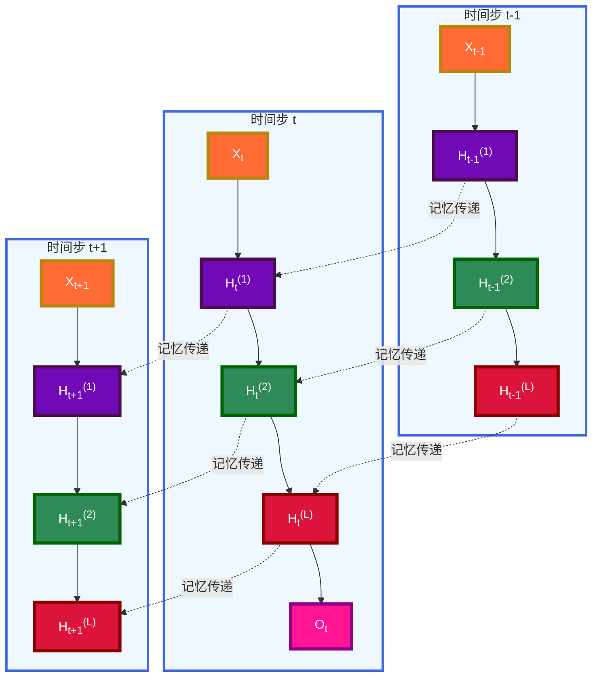

---
title: 深度循环神经网络
date: 2025-07-10
type: notes-nlp
---

## 核心概念

深度循环神经网络（Deep RNN）通过堆叠多个隐藏层来增强模型的表达能力，使得网络能够捕获更复杂的时序模式和特征层次。

### 架构特点

- **多层堆叠**：将多个 RNN 层垂直堆叠
- **双向传递**：隐状态既传递到下一时间步，也传递到下一层
- **层次特征**：不同层捕获不同抽象级别的特征
- **增强表达**：提升模型对复杂序列的建模能力

## 数学公式

### 隐状态计算

对于第$l$层（$l = 1, \ldots, L$），隐状态的计算公式为：

$$H_t^{(l)} = \phi_l(H_t^{(l-1)} W_{xh}^{(l)} + H_{t-1}^{(l)} W_{hh}^{(l)} + b_h^{(l)})$$

其中：

- $H_t^{(l)} \in \mathbb{R}^{n \times h}$：第$l$层在时间步$t$的隐状态
- $H_t^{(0)} = X_t$：输入序列（第 0 层）
- $W_{xh}^{(l)} \in \mathbb{R}^{h \times h}$：输入到隐藏层的权重矩阵
- $W_{hh}^{(l)} \in \mathbb{R}^{h \times h}$：隐藏层到隐藏层的权重矩阵
- $b_h^{(l)} \in \mathbb{R}^{1 \times h}$：偏置向量
- $\phi_l$：激活函数

### 输出层计算

输出层仅基于最顶层的隐状态：

$$O_t = H_t^{(L)} W_{hq} + b_q$$

其中：

- $W_{hq} \in \mathbb{R}^{h \times q}$：隐藏层到输出层的权重矩阵
- $b_q \in \mathbb{R}^{1 \times q}$：输出层偏置

## 网络结构

### 深度 RNN 架构图

### 信息流动图

### 深度 RNN 与普通 RNN 对比

| 特征           | 普通 RNN | 深度 RNN         |
| -------------- | -------- | ---------------- |
| **层数**       | 单层     | 多层堆叠         |
| **参数量**     | 较少     | 较多             |
| **表达能力**   | 有限     | 强大             |
| **计算复杂度** | $O(h^2)$ | $O(L \cdot h^2)$ |
| **训练难度**   | 中等     | 较高             |
| **梯度问题**   | 存在     | 更严重           |
| **应用场景**   | 简单序列 | 复杂序列         |

## 实际应用

### 优势

1. **增强表达能力**：多层结构能捕获更复杂的时序模式
2. **层次特征学习**：不同层学习不同抽象级别的特征
3. **提升性能**：在复杂任务上通常有更好的表现
4. **灵活架构**：可以组合不同类型的 RNN 层

### 挑战

1. **梯度问题**：更深的网络加剧了梯度消失/爆炸问题
2. **计算复杂度**：训练时间和内存需求增加
3. **过拟合风险**：参数增多可能导致过拟合
4. **调参困难**：需要更仔细的超参数调优

### 优化策略

1. **梯度裁剪**：防止梯度爆炸
2. **Dropout 正则化**：减少过拟合
3. **残差连接**：缓解梯度消失
4. **Layer Normalization**：稳定训练过程
5. **学习率调度**：动态调整学习率

## 总结

- 深度循环神经网络使用多个隐藏层来获得更多的非线性性

