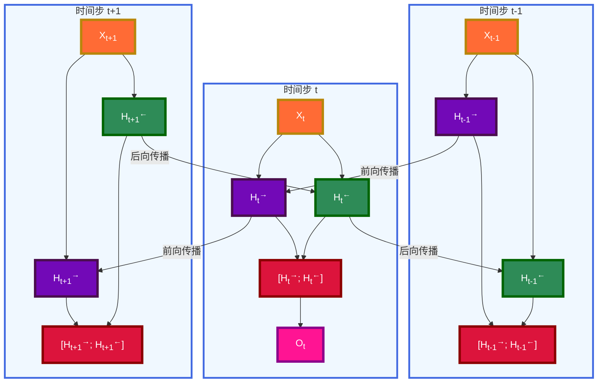

---
title: 双向循环神经网络
date: 2025-07-12
type: notes-nlp
---

## 核心概念

双向循环神经网络（Bidirectional RNN）通过同时使用前向和后向的信息流来增强序列建模能力，使得每个时间步的隐状态都能够获得完整序列的上下文信息。

### 架构特点

- **双向信息流**：同时包含前向和后向的隐藏层
- **完整上下文**：每个时间步都能获得过去和未来的信息
- **状态融合**：将前向和后向的隐状态连接起来
- **增强表达**：提升序列理解和特征提取能力

## 数学公式

### 前向和后向隐状态计算

对于任意时间步$t$，双向 RNN 包含两个独立的隐藏层：

**前向隐状态**：
$$\overrightarrow{H}_t = \phi(X_t W_{xh}^{(f)} + \overrightarrow{H}_{t-1} W_{hh}^{(f)} + b_h^{(f)})$$

**后向隐状态**：
$$\overleftarrow{H}_t = \phi(X_t W_{xh}^{(b)} + \overleftarrow{H}_{t+1} W_{hh}^{(b)} + b_h^{(b)})$$

其中：

- $\overrightarrow{H}_t \in \mathbb{R}^{n \times h}$：前向隐状态
- $\overleftarrow{H}_t \in \mathbb{R}^{n \times h}$：后向隐状态
- $W_{xh}^{(f)}, W_{xh}^{(b)} \in \mathbb{R}^{d \times h}$：输入到隐藏层的权重矩阵
- $W_{hh}^{(f)}, W_{hh}^{(b)} \in \mathbb{R}^{h \times h}$：隐藏层到隐藏层的权重矩阵
- $b_h^{(f)}, b_h^{(b)} \in \mathbb{R}^{1 \times h}$：偏置向量

### 状态连接和输出

将前向和后向隐状态连接：
$$H_t = [\overrightarrow{H}_t; \overleftarrow{H}_t] \in \mathbb{R}^{n \times 2h}$$

输出层计算：
$$O_t = H_t W_{hq} + b_q$$

其中：

- $W_{hq} \in \mathbb{R}^{2h \times q}$：输出层权重矩阵
- $b_q \in \mathbb{R}^{1 \times q}$：输出层偏置

## 网络结构

### 双向 RNN 架构图

### 信息流动图

### 双向 RNN 与单向 RNN 对比

| 特征           | 单向 RNN     | 双向 RNN          |
| -------------- | ------------ | ----------------- |
| **信息方向**   | 单向（前向） | 双向（前向+后向） |
| **上下文信息** | 仅过去信息   | 过去+未来信息     |
| **参数量**     | $O(h^2)$     | $O(2h^2)$         |
| **计算复杂度** | 较低         | 较高              |
| **训练速度**   | 快           | 慢                |
| **适用场景**   | 实时预测     | 序列标注、编码    |
| **隐状态维度** | $h$          | $2h$              |

## 总结

- 双向循环神经网络通过反向更新的隐藏层来利用方向时间信息，从而提高序列建模能力。
- 通常用来对序列抽取特征、填空，而不是预测未来（推理）。

