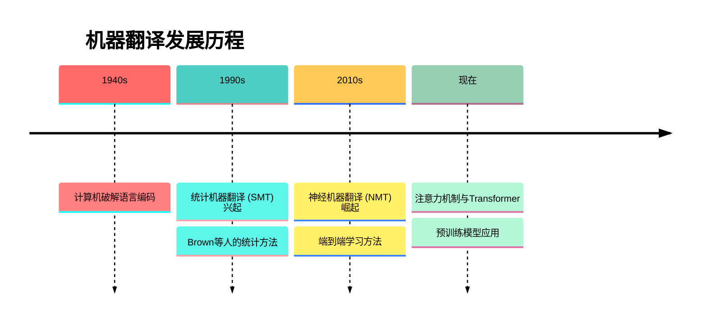
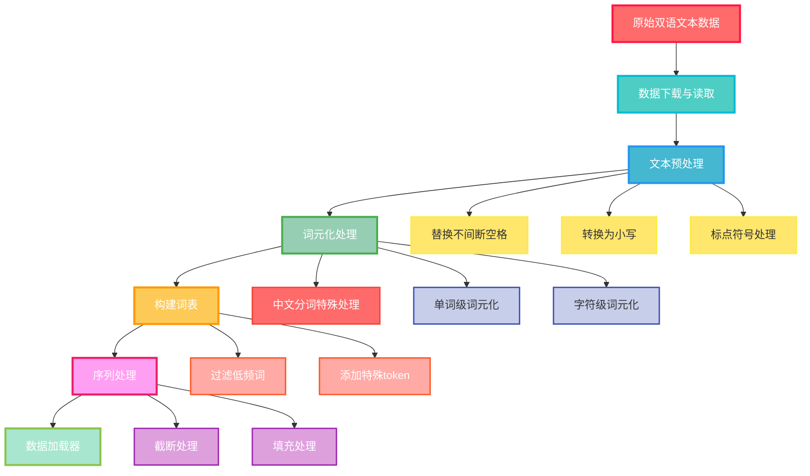
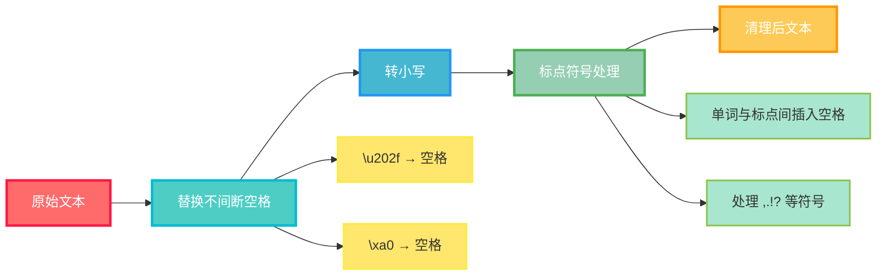
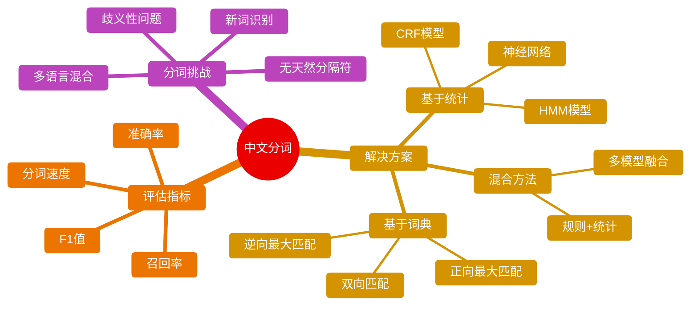
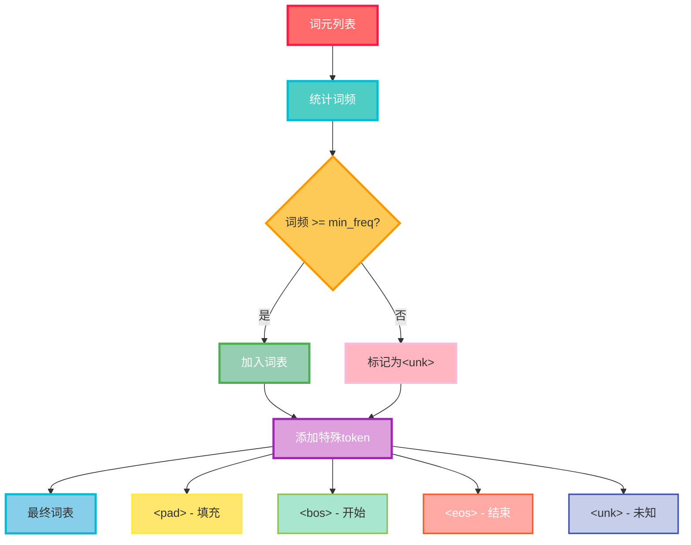
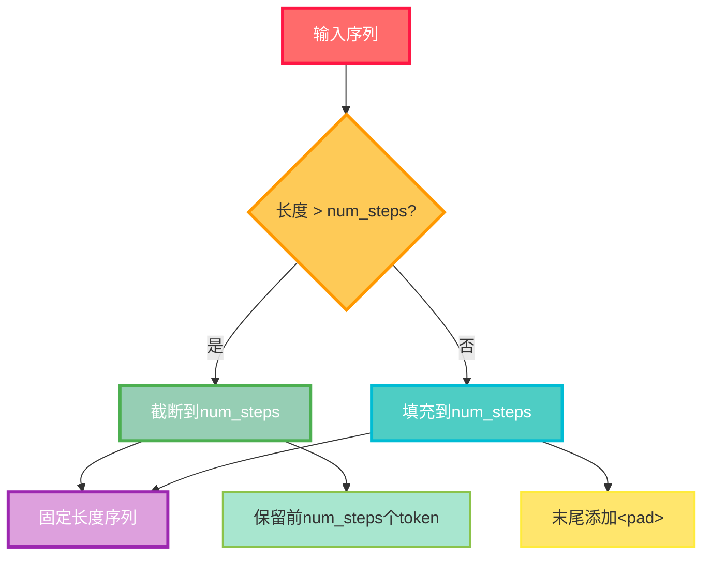
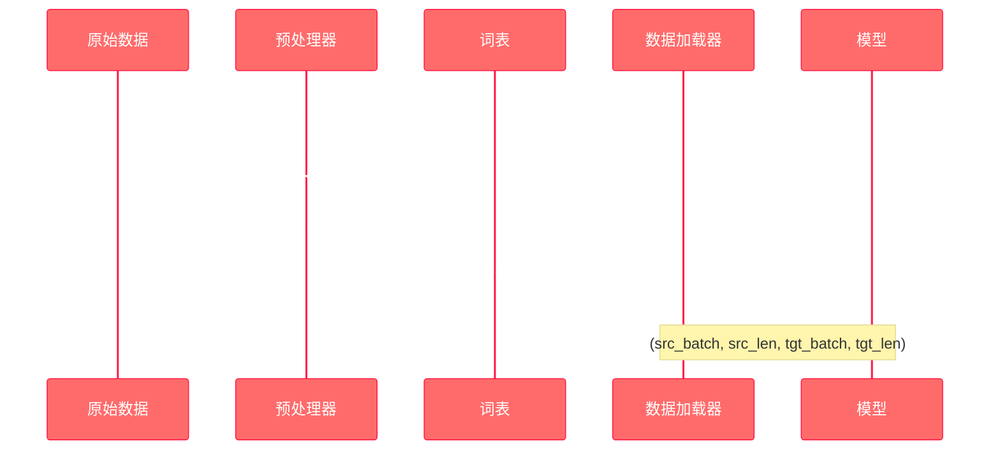
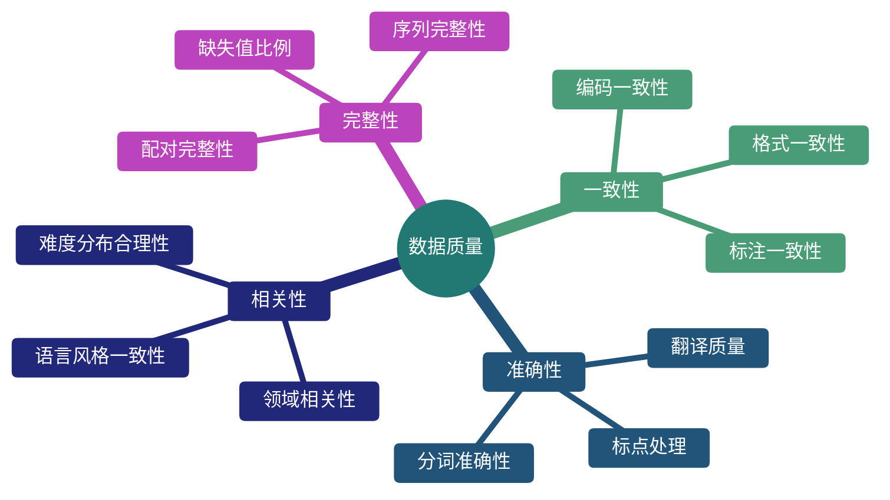

---
title: 机器翻译与数据集
date: 2025-07-10
type: notes-nlp
---


**机器翻译（Machine Translation）** 指的是将序列从一种语言自动翻译成另一种语言。这是序列转换模型（sequence transduction）的核心问题，在现代人工智能应用中发挥着至关重要的作用。

## 发展历程



## 翻译模型分类

- **统计机器翻译（Statistical Machine Translation, SMT）**：基于统计分析的翻译模型和语言模型
- **神经机器翻译（Neural Machine Translation, NMT）**：基于神经网络的端到端学习方法

## 数据集预处理流程

### 整体预处理流程图



### 数据下载与读取

```python
# 数据下载和读取代码块
# TODO: 实现数据下载功能
def read_data_nmt():
    """载入双语数据集"""
    # 实现数据读取逻辑
    pass
```

### 文本预处理详细流程

#### 预处理步骤



#### 预处理函数

```python
# 文本预处理代码块
def preprocess_nmt(text):
    """预处理双语数据集"""
    # TODO: 实现文本预处理逻辑
    # 1. 替换不间断空格
    # 2. 转换为小写
    # 3. 在单词和标点符号之间插入空格
    pass
```

## 词元化处理

### 词元化策略对比

| 策略         | 优点                | 缺点             | 适用场景       |
| ------------ | ------------------- | ---------------- | -------------- |
| 字符级词元化 | 词表小，无 OOV 问题 | 序列长，计算量大 | 字符丰富的语言 |
| 单词级词元化 | 语义完整，序列短    | 词表大，OOV 问题 | 空格分隔的语言 |
| 子词级词元化 | 平衡词表大小和语义  | 实现复杂         | 现代 NLP 任务  |

### 中文分词特殊考虑



### 词元化实现

```python
# 词元化处理代码块
def tokenize_nmt(text, num_examples=None):
    """词元化双语数据集"""
    # TODO: 实现词元化逻辑
    # 对于中文需要特殊处理分词
    pass

def chinese_word_segmentation(text):
    """中文分词专用函数"""
    # TODO: 实现中文分词逻辑
    # 可以使用jieba、pkuseg等工具
    pass
```

## 词表构建

### 词表构建流程



### 词表大小分析

对于不同语言的词表大小考虑：

$$\text{词表大小} = f(\text{语言特性}, \text{数据量}, \text{最小频率阈值})$$

其中：

- **语言特性**：形态变化丰富度、词汇组合方式
- **数据量**：训练数据的规模
- **最小频率阈值**：过滤低频词的标准

```python
# 词表构建代码块
def build_vocab(token_list, min_freq=2, reserved_tokens=None):
    """构建词表"""
    # TODO: 实现词表构建逻辑
    # 1. 统计词频
    # 2. 过滤低频词
    # 3. 添加特殊token
    pass
```

## 序列处理

### 序列长度统计

```python
# 序列长度分析代码块
def show_list_len_pair_hist(legend, xlabel, ylabel, xlist, ylist):
    """绘制列表长度对的直方图"""
    # TODO: 实现长度分布可视化
    pass
```

### 序列截断与填充



#### 截断填充策略

$$
\text{processed\_seq} = \begin{cases}
\text{seq}[:num\_steps] & \text{if } len(\text{seq}) > num\_steps \\
\text{seq} + [\text{pad}] \times (num\_steps - len(\text{seq})) & \text{if } len(\text{seq}) \leq num\_steps
\end{cases}
$$

```python
# 序列处理代码块
def truncate_pad(line, num_steps, padding_token):
    """截断或填充文本序列"""
    # TODO: 实现序列截断和填充逻辑
    pass

def build_array_nmt(lines, vocab, num_steps):
    """将文本序列转换成数组"""
    # TODO: 实现序列到数组的转换
    # 1. 添加<eos>标记
    # 2. 截断或填充
    # 3. 计算有效长度
    pass
```

## 数据加载器

### 批处理数据流



### 数据加载器实现

```python
# 数据加载器代码块
def load_data_nmt(batch_size, num_steps, num_examples=600):
    """返回翻译数据集的迭代器和词表"""
    # TODO: 实现完整的数据加载流程
    # 1. 读取和预处理数据
    # 2. 词元化
    # 3. 构建词表
    # 4. 创建数据迭代器
    pass
```

## 数据质量评估

### 数据清洗效果评估指标



### 中文分词质量评估

对于中文分词效果的评估：

$$\text{F1} = \frac{2 \times \text{Precision} \times \text{Recall}}{\text{Precision} + \text{Recall}}$$

其中：

- $\text{Precision} = \frac{\text{正确分词数}}{\text{系统分词总数}}$
- $\text{Recall} = \frac{\text{正确分词数}}{\text{标准分词总数}}$

```python
# 数据质量评估代码块
def evaluate_segmentation_quality(predicted_tokens, gold_tokens):
    """评估中文分词质量"""
    # TODO: 实现分词质量评估
    # 1. 计算准确率、召回率
    # 2. 计算F1分数
    # 3. 分析错误类型
    pass

def analyze_data_distribution(source_data, target_data):
    """分析数据分布"""
    # TODO: 实现数据分布分析
    # 1. 长度分布
    # 2. 词频分布
    # 3. 语言特征分析
    pass
```

---

**参考资源**：

- [D2L 教程 - 机器翻译与数据集](https://zh-v2.d2l.ai/chapter_recurrent-modern/machine-translation-and-dataset.html)

