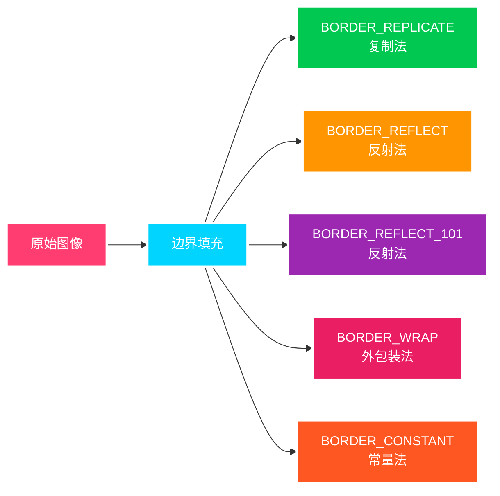

```python
import cv2  # OpenCV读取的格式是BGR
import numpy as np
import matplotlib.pyplot as plt  # Matplotlib是RGB
%matplotlib inline
```

## 数据读取

```python
# 读取图像
img = cv2.imread('cat.jpg')  # 默认彩色图像
img_gray = cv2.imread('cat.jpg', cv2.IMREAD_GRAYSCALE)  # 灰度图像

# 显示图像 - 简单函数封装
def cv_show(name, img):
    cv2.imshow(name, img)
    cv2.waitKey(0)  # 等待时间，毫秒级，0表示任意键终止
    cv2.destroyAllWindows()

# 获取图像基本信息
print(f"图像形状: {img.shape}")  # 返回(高度, 宽度, 通道数)
print(f"图像大小: {img.size}")   # 返回像素总数
print(f"图像类型: {img.dtype}")  # 返回图像数据类型

# 保存图像
cv2.imwrite('mycat.png', img)
```

```python
# 视频读取
vc = cv2.VideoCapture('test.mp4')
# 检查视频是否成功打开
if not vc.isOpened():
    print("无法打开视频文件")
else:
    while vc.isOpened():
        ret, frame = vc.read()
        if not ret:
            break
        # 处理每一帧
        gray = cv2.cvtColor(frame, cv2.COLOR_BGR2GRAY)
        cv2.imshow('frame', gray)
        if cv2.waitKey(30) & 0xFF == 27:  # ESC键退出
            break
    vc.release()
    cv2.destroyAllWindows() # 关闭所有窗口
```

### 函数详解

#### `cv2.imread(filename, flags=cv2.IMREAD_COLOR)`

> **功能**: 读取图像文件
>
> **参数**:
>
> - `filename`: 图像文件路径 (str)
> - `flags`: 读取模式 (int)
>   - `cv2.IMREAD_COLOR` (1): 读取彩色图像，默认值
>   - `cv2.IMREAD_GRAYSCALE` (0): 读取灰度图像
>   - `cv2.IMREAD_UNCHANGED` (-1): 读取包含 Alpha 通道的图像
>
> **返回值**: 图像数组 (numpy.ndarray)，失败时返回 None
>
> **支持格式**: JPEG, PNG, TIFF, BMP, GIF, WEBP, PBM, PGM, PPM, SR, RAS, EXR 等

#### `cv2.imshow(winname, mat)`

> **功能**: 在窗口中显示图像
>
> **参数**:
>
> - `winname`: 窗口名称 (str)
> - `mat`: 要显示的图像 (numpy.ndarray)
>
> **注意**: 通常与`cv2.waitKey()`和`cv2.destroyAllWindows()`配合使用

#### `cv2.waitKey(delay=0)`

> **功能**: 等待键盘输入
>
> **参数**:
>
> - `delay`: 等待时间（毫秒）(int)
>   - 0: 无限等待直到按键
>
> **返回值**: 按键的 ASCII 码值，超时返回-1

#### `cv2.destroyAllWindows()`

> **功能**: 销毁所有 OpenCV 创建的窗口
>
> **参数**: 无

#### `cv2.imwrite(filename, img, params=None)`

> **功能**: 保存图像到文件
>
> **参数**:
>
> - `filename`: 保存的文件路径 (str)
> - `img`: 要保存的图像 (numpy.ndarray)
> - `params`: 编码参数 (list, 可选)
>   - JPEG: `[cv2.IMWRITE_JPEG_QUALITY, 95]` (质量范围: $0 \sim 100$)
>   - PNG: `[cv2.IMWRITE_PNG_COMPRESSION, 9]` (压缩级别: $0 \sim 9$)
>
> **返回值**: 成功返回 True，失败返回 False

#### `cv2.VideoCapture(filename_or_device)`

> **功能**: 创建视频捕获对象
>
> **参数**:
>
> - `filename_or_device`: 视频文件路径或设备索引
>   - 文件路径: 'video.mp4'
>   - 摄像头: 0, 1, 2... (设备索引)
>
> **返回值**: VideoCapture 对象
>
> **常用方法**:
>
> - `isOpened()`: 检查是否成功打开
> - `read()`: 读取下一帧，返回(ret, frame)
> - `release()`: 释放资源
> - `get(propId)`: 获取属性值
> - `set(propId, value)`: 设置属性值

#### `cv2.cvtColor(src, code, dst=None, dstCn=0)`

> **功能**: 颜色空间转换
>
> **参数**:
>
> - `src`: 输入图像 (numpy.ndarray)
> - `code`: 转换代码 (int)
>   - `cv2.COLOR_BGR2GRAY`: BGR 转灰度
>   - `cv2.COLOR_BGR2RGB`: BGR 转 RGB
>   - `cv2.COLOR_RGB2BGR`: RGB 转 BGR
>   - `cv2.COLOR_BGR2HSV`: BGR 转 HSV
> - `dst`: 输出图像 (可选)
> - `dstCn`: 输出通道数 (int, 可选)
>
> **返回值**: 转换后的图像 (numpy.ndarray)

## 图像通道操作

### 函数详解

#### `cv2.split(m)`

> **功能**: 分离多通道图像为单通道图像
>
> **参数**:
>
> - `m`: 多通道输入图像 (numpy.ndarray)
>
> **返回值**: 单通道图像列表 (list)
>
> - 对于 BGR 图像: 返回[B, G, R]三个单通道图像
> - 对于 BGRA 图像: 返回[B, G, R, A]四个单通道图像

#### `cv2.merge(mv)`

> **功能**: 合并多个单通道图像为一个多通道图像
>
> **参数**:
>
> - `mv`: 单通道图像列表 (list 或 tuple)
>
> **返回值**: 多通道图像 (numpy.ndarray)
>
> **注意**: 所有输入图像必须具有相同的大小和数据类型

图像通道分离与合并：

```python
# 通道分离
b, g, r = cv2.split(img)  # OpenCV中图像通道顺序为BGR

# 通道合并
img_merged = cv2.merge((b, g, r))

# 只保留R通道
img_r = img.copy()
img_r[:, :, 0] = 0  # B = 0
img_r[:, :, 1] = 0  # G = 0

# 只保留G通道
img_g = img.copy()
img_g[:, :, 0] = 0  # B = 0
img_g[:, :, 2] = 0  # R = 0

# 只保留B通道
img_b = img.copy()
img_b[:, :, 1] = 0  # G = 0
img_b[:, :, 2] = 0  # R = 0
```


## 边界填充

### 函数详解

#### `cv2.copyMakeBorder(src, top, bottom, left, right, borderType, value=None)`

> **功能**: 为图像添加边界填充
>
> **参数**:
>
> - `src`: 输入图像 (numpy.ndarray)
> - `top`: 顶部填充像素数 (int)
> - `bottom`: 底部填充像素数 (int)
> - `left`: 左侧填充像素数 (int)
> - `right`: 右侧填充像素数 (int)
> - `borderType`: 边界类型 (int)
>   - `cv2.BORDER_REPLICATE`: 复制边缘像素
>   - `cv2.BORDER_REFLECT`: 反射填充
>   - `cv2.BORDER_REFLECT_101`: 反射填充（边缘像素为轴）
>   - `cv2.BORDER_WRAP`: 外包装填充
>   - `cv2.BORDER_CONSTANT`: 常量填充
> - `value`: 常量填充时的像素值 (Scalar, 可选)
>
> **返回值**: 填充后的图像 (numpy.ndarray)



边界填充方法详解:

- **BORDER_REPLICATE** (复制法): 复制最边缘的像素值来填充边界

  - 示例: `aaaaaa|abcdefgh|hhhhhhh`
  - 适用场景: 当边缘像素代表性较强时使用

- **BORDER_REFLECT** (反射法): 以图像边界为镜面进行反射填充

  - 示例: `fedcba|abcdefgh|hgfedcb`
  - 特点: 边界像素会重复出现

- **BORDER_REFLECT_101** (反射法 101): 以边缘像素为轴进行反射，边界像素不重复

  - 示例: `gfedcb|abcdefgh|gfedcba`
  - 特点: 更自然的反射效果，OpenCV 默认推荐

- **BORDER_WRAP** (外包装法): 将图像看作周期性的，用对侧像素填充

  - 示例: `cdefgh|abcdefgh|abcdefg`
  - 适用场景: 处理周期性纹理图像

- **BORDER_CONSTANT** (常量填充): 使用指定的常量值填充边界
  - 默认使用黑色(0)填充，可通过 `value` 参数指定颜色
  - 适用场景: 需要特定背景色时使用


## 图像融合与调整

### 函数详解

#### `cv2.resize(src, dsize, fx=0, fy=0, interpolation=cv2.INTER_LINEAR)`

> **功能**: 调整图像大小
>
> **参数**:
>
> - `src`: 输入图像 (numpy.ndarray)
> - `dsize`: 输出图像尺寸 (tuple): (width, height)
>   - 如果为(0,0)，则通过 fx 和 fy 计算
> - `fx`: 水平缩放因子 (float)
> - `fy`: 垂直缩放因子 (float)
> - `interpolation`: 插值方法 (int)
>   - `cv2.INTER_LINEAR`: 双线性插值（默认）
>   - `cv2.INTER_NEAREST`: 最近邻插值
>   - `cv2.INTER_CUBIC`: 双三次插值
>   - `cv2.INTER_AREA`: 区域插值（用于缩小）
>   - `cv2.INTER_LANCZOS4`: Lanczos 插值
>
> **返回值**: 调整后的图像 (numpy.ndarray)

#### `cv2.addWeighted(src1, alpha, src2, beta, gamma, dst=None, dtype=-1)`

> **功能**: 图像加权融合
>
> **参数**:
>
> - `src1`: 第一个输入图像 (numpy.ndarray)
> - `alpha`: 第一个图像的权重 (float)
> - `src2`: 第二个输入图像 (numpy.ndarray)
> - `beta`: 第二个图像的权重 (float)
> - `gamma`: 加到结果上的标量值 (float)
> - `dst`: 输出图像 (可选)
> - `dtype`: 输出图像深度 (int, 可选)
>
> **返回值**: 融合后的图像 (numpy.ndarray)
>
> **公式**: $$\text{dst} = \text{src1} \times \alpha + \text{src2} \times \beta + \gamma$$
>
> **注意**: 两个输入图像必须具有相同的大小和类型

```python
# 图像尺寸调整 - 指定尺寸
height, width = 300, 500
img_resized1 = cv2.resize(img, (width, height))

# 图像尺寸调整 - 按比例缩放
img_resized2 = cv2.resize(img, (0, 0), fx=0.5, fy=0.5)  # 缩小一半
img_resized3 = cv2.resize(img, (0, 0), fx=2.0, fy=2.0)  # 放大两倍

# 图像融合 (需要相同大小的图像)
img_dog = cv2.imread('dog.jpg')
# 检查图像是否成功读取
if img_dog is None:
    print("无法读取dog.jpg文件，使用复制的图像进行演示")
    img_dog = img.copy()
else:
    # 调整为相同大小
    img_dog = cv2.resize(img_dog, (img.shape[1], img.shape[0]))

# 图像融合 - 不同权重
dst1 = cv2.addWeighted(img, 0.7, img_dog, 0.3, 0)  # 70% 猫，30% 狗
dst2 = cv2.addWeighted(img, 0.5, img_dog, 0.5, 0)  # 各占一半
dst3 = cv2.addWeighted(img, 0.3, img_dog, 0.7, 0)  # 30% 猫，70% 狗
```


## 实用技巧与最佳实践

### 图像读取技巧

```python
# 安全的图像读取
def safe_imread(filename, flags=cv2.IMREAD_COLOR):
    """安全读取图像文件"""
    import os
    if not os.path.exists(filename):
        print(f"文件不存在: {filename}")
        return None

    img = cv2.imread(filename, flags)
    if img is None:
        print(f"无法读取图像: {filename}")
        return None

    print(f"成功读取图像: {filename}, 尺寸: {img.shape}")
    return img

# 使用示例
img = safe_imread('example.jpg')
if img is not None:
    # 处理图像
    pass
```
