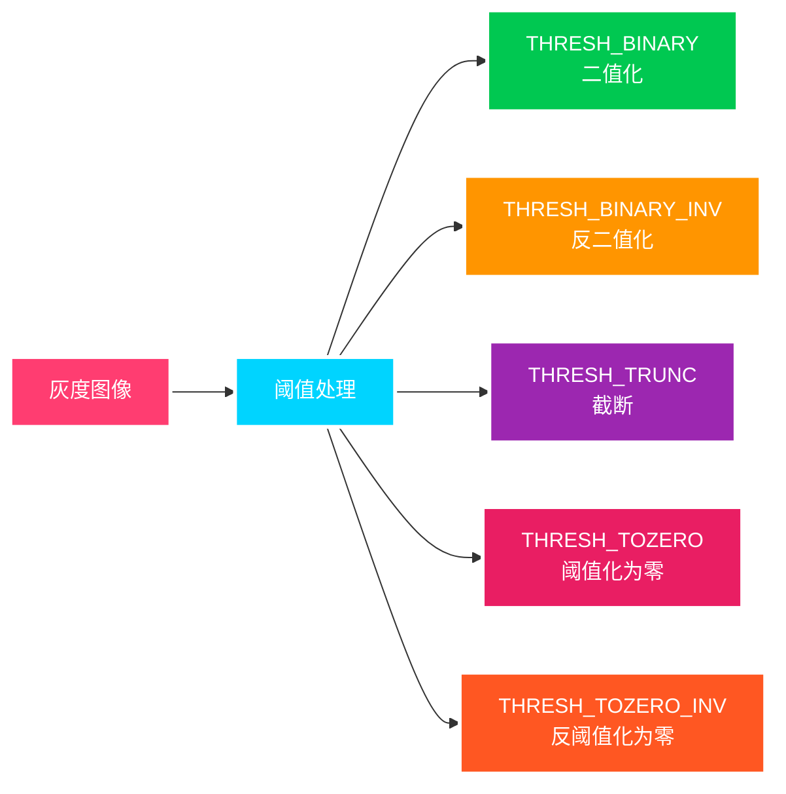
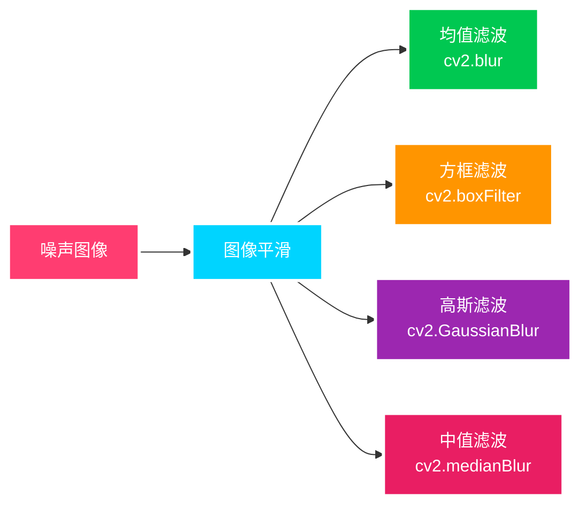
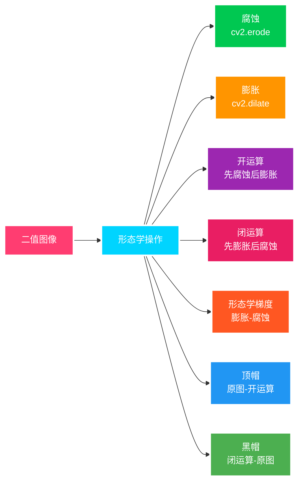
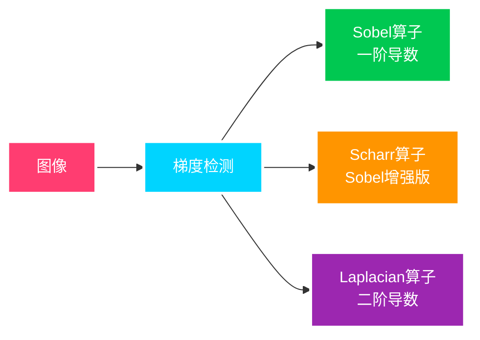
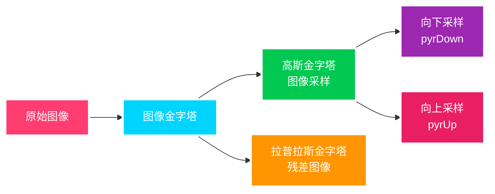
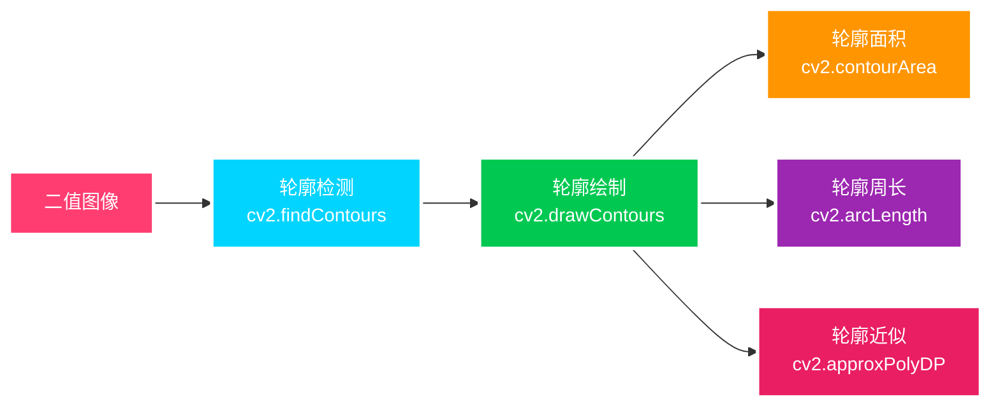

## 灰度图与颜色空间

```python
# 灰度图转换
gray = cv2.cvtColor(img, cv2.COLOR_BGR2GRAY)

# HSV色彩空间转换
hsv = cv2.cvtColor(img, cv2.COLOR_BGR2HSV)
```

HSV 色彩空间:

- **H (色调)**: 主波长，颜色种类
- **S (饱和度)**: 颜色纯度/颜色的阴影
- **V (亮度)**: 颜色的明暗程度


## 阈值处理

### 函数详解

#### `cv2.threshold(src, thresh, maxval, type)`

> **功能**: 对图像进行阈值处理，将灰度图像转换为二值图像
>
> **参数**:
>
> - `src`: 输入图像，必须是单通道灰度图像
> - `thresh`: 阈值 (float)
> - `maxval`: 当像素值超过阈值时赋予的新值 (float)
> - `type`: 阈值类型 (int)
>
> **阈值类型**:
>
> - `cv2.THRESH_BINARY`: 二值化，src > thresh ? maxval : 0
> - `cv2.THRESH_BINARY_INV`: 反二值化，src > thresh ? 0 : maxval
> - `cv2.THRESH_TRUNC`: 截断，src > thresh ? thresh : src
> - `cv2.THRESH_TOZERO`: 阈值化为零，src > thresh ? src : 0
> - `cv2.THRESH_TOZERO_INV`: 反阈值化为零，src > thresh ? 0 : src
>
> **返回值**: 元组 (retval, dst)
>
> - `retval`: 计算出的阈值
> - `dst`: 输出图像



阈值处理数学表达式:

$$
dst(x,y) = \begin{cases}
maxval & \text{if } src(x,y) > thresh \quad \text{(THRESH\_BINARY)} \\
0 & \text{otherwise}
\end{cases}
$$

$$
dst(x,y) = \begin{cases}
0 & \text{if } src(x,y) > thresh \quad \text{(THRESH\_BINARY\_INV)} \\
maxval & \text{otherwise}
\end{cases}
$$

$$
dst(x,y) = \begin{cases}
thresh & \text{if } src(x,y) > thresh \quad \text{(THRESH\_TRUNC)} \\
src(x,y) & \text{otherwise}
\end{cases}
$$

$$
dst(x,y) = \begin{cases}
src(x,y) & \text{if } src(x,y) > thresh \quad \text{(THRESH\_TOZERO)} \\
0 & \text{otherwise}
\end{cases}
$$

$$
dst(x,y) = \begin{cases}
0 & \text{if } src(x,y) > thresh \quad \text{(THRESH\_TOZERO\_INV)} \\
src(x,y) & \text{otherwise}
\end{cases}
$$

## 图像平滑

### 函数详解

#### `cv2.blur(src, ksize, anchor=None, borderType=None)`

> **功能**: 均值滤波，简单的图像平滑
>
> **参数**:
>
> - `src`: 输入图像
> - `ksize`: 滤波核大小 (tuple): (width, height)
> - `anchor`: 锚点位置，默认为(-1, -1)，表示核中心
> - `borderType`: 边界处理方式

#### `cv2.GaussianBlur(src, ksize, sigmaX, sigmaY=None, borderType=None)`

> **功能**: 高斯滤波，更自然的图像平滑
>
> **参数**:
>
> - `src`: 输入图像
> - `ksize`: 高斯核大小 (tuple): (width, height)，必须为奇数
> - `sigmaX`: X 方向的标准差 (float)
> - `sigmaY`: Y 方向的标准差 (float)，默认为 None
> - `borderType`: 边界处理方式

#### `cv2.medianBlur(src, ksize)`

> **功能**: 中值滤波，对椒盐噪声效果好
>
> **参数**:
>
> - `src`: 输入图像
> - `ksize`: 滤波核大小 (int)，必须为奇数

#### `cv2.boxFilter(src, ddepth, ksize, anchor=None, normalize=True, borderType=None)`

> **功能**: 方框滤波，可选择是否归一化
>
> **参数**:
>
> - `src`: 输入图像
> - `ddepth`: 输出图像深度，-1 表示与输入相同
> - `ksize`: 滤波核大小 (tuple): (width, height)
> - `anchor`: 锚点位置
> - `normalize`: 是否归一化 (bool)
> - `borderType`: 边界处理方式



高斯滤波核的数学表达式:

$$G(x, y) = \frac{1}{2\pi\sigma^2}e^{-\frac{x^2+y^2}{2\sigma^2}}$$

高斯滤波器的权重随着距离中心点的增加而减小，符合正态分布，使得图像平滑效果更自然。对于一个 $(2k+1) \times (2k+1)$ 的滤波核，其坐标 $(i, j)$ 处的权重为：

$$H(i,j) = \frac{1}{2\pi\sigma^2}e^{-\frac{(i-k)^2+(j-k)^2}{2\sigma^2}}$$

其中 $\sigma$ 是高斯分布的标准差，决定了平滑程度。$\sigma$ 越大，图像越模糊。


## 形态学操作

### 函数详解

#### `cv2.getStructuringElement(shape, ksize, anchor=None)`

> **功能**: 创建结构元素（形态学核）
>
> **参数**:
>
> - `shape`: 结构元素形状
>   - `cv2.MORPH_RECT`: 矩形
>   - `cv2.MORPH_ELLIPSE`: 椭圆
>   - `cv2.MORPH_CROSS`: 十字形
> - `ksize`: 结构元素大小 (tuple): (width, height)
> - `anchor`: 锚点位置，默认为(-1, -1)

#### `cv2.erode(src, kernel, iterations=1, borderType=None, borderValue=None)`

> **功能**: 腐蚀操作
>
> **参数**:
>
> - `src`: 输入图像，通常是二值图像
> - `kernel`: 结构元素
> - `iterations`: 腐蚀次数 (int)
> - `borderType`: 边界处理方式
> - `borderValue`: 边界值

#### `cv2.dilate(src, kernel, iterations=1, borderType=None, borderValue=None)`

> **功能**: 膨胀操作
>
> **参数**:
>
> - `src`: 输入图像
> - `kernel`: 结构元素
> - `iterations`: 膨胀次数 (int)
> - `borderType`: 边界处理方式
> - `borderValue`: 边界值

#### `cv2.morphologyEx(src, op, kernel, iterations=1, borderType=None, borderValue=None)`

> **功能**: 高级形态学操作
>
> **参数**:
>
> - `src`: 输入图像
> - `op`: 形态学操作类型
>   - `cv2.MORPH_OPEN`: 开运算 (先腐蚀后膨胀)
>   - `cv2.MORPH_CLOSE`: 闭运算 (先膨胀后腐蚀)
>   - `cv2.MORPH_GRADIENT`: 形态学梯度 (膨胀-腐蚀)
>   - `cv2.MORPH_TOPHAT`: 顶帽 (原图-开运算)
>   - `cv2.MORPH_BLACKHAT`: 黑帽 (闭运算-原图)
> - `kernel`: 结构元素
> - `iterations`: 操作次数



腐蚀和膨胀的数学表达式:

**腐蚀操作:**

$$\text{dst}(x,y) = \min_{(x',y') \in \text{kernel}} \text{src}(x+x',y+y')$$

腐蚀操作通过在图像上滑动结构元素(kernel)，将核内的像素值取最小值替代中心像素。直观理解是"腐蚀"掉目标的边缘，使白色区域缩小，黑色区域扩大。

**膨胀操作:**

$$\text{dst}(x,y) = \max_{(x',y') \in \text{kernel}} \text{src}(x-x',y-y')$$

膨胀操作通过在图像上滑动结构元素(kernel)，将核内的像素值取最大值替代中心像素。直观理解是使目标的边缘"膨胀"，白色区域扩大，黑色区域缩小。

**开运算:**

$$\text{open}(I) = \text{dilate}(\text{erode}(I))$$

**闭运算:**

$$\text{close}(I) = \text{erode}(\text{dilate}(I))$$

## 图像梯度



Sobel 算子的数学表达式:

**X 方向 Sobel:**

$$
G_x = \begin{bmatrix}
-1 & 0 & +1 \\
-2 & 0 & +2 \\
-1 & 0 & +1
\end{bmatrix} * A
$$

**Y 方向 Sobel:**

$$
G_y = \begin{bmatrix}
-1 & -2 & -1 \\
0 & 0 & 0 \\
+1 & +2 & +1
\end{bmatrix} * A
$$

**梯度强度:**

$$G = \sqrt{G_x^2 + G_y^2}$$

**梯度方向:**

$$\theta = \arctan\left(\frac{G_y}{G_x}\right)$$

Sobel 算子通过计算图像在水平和垂直方向上的差分，近似求出图像在各点的梯度。由于它是一阶导数算子，对噪声敏感性较低，是一种常用的边缘检测算子。

**Scharr 算子:**

$$
S_x = \begin{bmatrix}
-3 & 0 & +3 \\
-10 & 0 & +10 \\
-3 & 0 & +3
\end{bmatrix} * A
$$

$$
S_y = \begin{bmatrix}
-3 & -10 & -3 \\
0 & 0 & 0 \\
+3 & +10 & +3
\end{bmatrix} * A
$$

Scharr 算子是 Sobel 算子的改进版，在保持 Sobel 轻量级的同时提高了方向不变性，对于精细边缘检测效果更好。

**Laplacian 算子:**

$$
\text{Laplacian} = \begin{bmatrix}
0 & 1 & 0 \\
1 & -4 & 1 \\
0 & 1 & 0
\end{bmatrix} * A
$$

Laplacian 算子是二阶导数算子，对图像进行二阶导数运算，可以同时检测出水平和垂直方向的边缘。由于是二阶导数，对噪声更为敏感。

### 函数详解

#### `cv2.Sobel(src, ddepth, dx, dy, ksize=3, scale=1, delta=0, borderType=None)`

> **功能**: Sobel 算子边缘检测
>
> **参数**:
>
> - `src`: 输入图像
> - `ddepth`: 输出图像深度
>   - `cv2.CV_8U`: 8 位无符号整数
>   - `cv2.CV_16S`: 16 位有符号整数
>   - `cv2.CV_32F`: 32 位浮点数
>   - `cv2.CV_64F`: 64 位浮点数
> - `dx`: X 方向导数的阶数 (int)
> - `dy`: Y 方向导数的阶数 (int)
> - `ksize`: Sobel 核大小 (int)，必须为 1,3,5,7
> - `scale`: 缩放因子 (float)
> - `delta`: 可选的偏移量 (float)
> - `borderType`: 边界处理方式

#### `cv2.Scharr(src, ddepth, dx, dy, scale=1, delta=0, borderType=None)`

> **功能**: Scharr 算子，Sobel 的改进版
>
> **参数**: 与 Sobel 类似，但没有 ksize 参数（固定为 3x3）

#### `cv2.Laplacian(src, ddepth, ksize=1, scale=1, delta=0, borderType=None)`

> **功能**: Laplacian 算子，二阶导数
>
> **参数**:
>
> - `src`: 输入图像
> - `ddepth`: 输出图像深度
> - `ksize`: 核大小 (int)
> - `scale`: 缩放因子
> - `delta`: 偏移量
> - `borderType`: 边界处理方式

#### `cv2.convertScaleAbs(src, alpha=1, beta=0)`

> **功能**: 将图像转换为 8 位无符号整数并取绝对值
>
> **参数**:
>
> - `src`: 输入图像
> - `alpha`: 缩放系数 (float)
> - `beta`: 偏移量 (float)
>
> **公式**: $$\text{dst} = \text{saturate\_cast}^{\text{uchar}}(|\text{src} \times \alpha + \beta|)$$

#### `cv2.addWeighted(src1, alpha, src2, beta, gamma, dst=None, dtype=-1)`

> **功能**: 图像加权融合
>
> **参数**:
>
> - `src1`: 第一个输入图像
> - `alpha`: 第一个图像的权重 (float)
> - `src2`: 第二个输入图像
> - `beta`: 第二个图像的权重 (float)
> - `gamma`: 加到结果上的标量值 (float)
>
> **公式**: $$\text{dst} = \text{src1} \times \alpha + \text{src2} \times \beta + \gamma$$

```python
# 读取图像并转为灰度图
img = cv2.imread('lena.jpg', cv2.IMREAD_GRAYSCALE)

# Sobel 算子 - 分别计算 x 和 y 方向
sobelx = cv2.Sobel(img, cv2.CV_64F, 1, 0, ksize=3)  # x方向，ksize是核大小
sobely = cv2.Sobel(img, cv2.CV_64F, 0, 1, ksize=3)  # y方向

# 取绝对值并转换为 uint8 类型
sobelx = cv2.convertScaleAbs(sobelx)
sobely = cv2.convertScaleAbs(sobely)

# 合并 x 和 y 方向的梯度
sobelxy = cv2.addWeighted(sobelx, 0.5, sobely, 0.5, 0)

# Scharr 算子 - 比 Sobel 更精确
scharrx = cv2.Scharr(img, cv2.CV_64F, 1, 0)
scharry = cv2.Scharr(img, cv2.CV_64F, 0, 1)
scharrx = cv2.convertScaleAbs(scharrx)
scharry = cv2.convertScaleAbs(scharry)
scharrxy = cv2.addWeighted(scharrx, 0.5, scharry, 0.5, 0)

# Laplacian 算子 - 二阶导数
laplacian = cv2.Laplacian(img, cv2.CV_64F)
laplacian = cv2.convertScaleAbs(laplacian)
```


## Canny 边缘检测


Canny 边缘检测步骤:

1. **高斯滤波:** 使用高斯滤波器平滑图像，去除噪声

   - 滤波器的大小由 $\sigma$ 确定，一般 $\sigma=1.4$，滤波核大小为 $5 \times 5$

2. **计算梯度:** 使用 Sobel 算子计算每个像素点的梯度强度和方向

   - 梯度强度：$G = \sqrt{G_x^2 + G_y^2}$
   - 梯度方向：$\theta = \arctan\left(\frac{G_y}{G_x}\right)$
   - 梯度方向一般被量化为 4 个主方向：0°, 45°, 90°, 135°

3. **非极大值抑制(NMS):** 沿梯度方向，如果像素梯度值不是局部最大值，则将其抑制为零

   - 保留"山脊"上的像素，抑制其他像素，使边缘变细

4. **双阈值检测:** 使用两个阈值 $T_{\text{high}}$ 和 $T_{\text{low}}$ 对图像进行二值化

   - 强边缘: $G > T_{\text{high}}$，直接保留
   - 弱边缘: $T_{\text{low}} < G < T_{\text{high}}$，需要进一步判断
   - 非边缘: $G < T_{\text{low}}$，直接丢弃

5. **边缘连接:** 对弱边缘像素进行判断，如果与强边缘像素相连，则保留，否则丢弃
   - 常使用 8 邻域连通性判断
   - 最终得到的边缘是由强边缘点连成的单像素宽的曲线

Canny 边缘检测算法可以通过调整 $T_{\text{high}}$ 和 $T_{\text{low}}$ 阈值来控制检测结果。OpenCV 中一般推荐比例 $T_{\text{high}} : T_{\text{low}} = 2:1$ 或 $3:1$。

### 函数详解

#### `cv2.Canny(image, threshold1, threshold2, edges=None, apertureSize=3, L2gradient=False)`

> **功能**: Canny 边缘检测算法
>
> **参数**:
>
> - `image`: 输入图像，必须是 8 位灰度图像
> - `threshold1`: 第一个阈值（低阈值）(float)
> - `threshold2`: 第二个阈值（高阈值）(float)
> - `edges`: 输出边缘图像（可选）
> - `apertureSize`: Sobel 算子孔径大小 (int)，必须为 3,5,7
> - `L2gradient`: 是否使用 L2 范数计算梯度幅值 (bool)
>   - True: $\sqrt{(dI/dx)^2 + (dI/dy)^2}$
>   - False: $|dI/dx| + |dI/dy|$
>
> **返回值**: 边缘检测结果图像

```python
# Canny 边缘检测示例
img = cv2.imread('lena.jpg', cv2.IMREAD_GRAYSCALE)

# 使用不同的阈值进行 Canny 边缘检测
edges1 = cv2.Canny(img, 50, 150)  # 低阈值 = 50, 高阈值 = 150
edges2 = cv2.Canny(img, 100, 200)  # 低阈值 = 100, 高阈值 = 200
edges3 = cv2.Canny(img, 150, 250)  # 低阈值 = 150, 高阈值 = 250

# 步骤分解 (用于教学目的)
# 1. 高斯滤波
blurred = cv2.GaussianBlur(img, (5, 5), 1.4)
# 2. 梯度计算
sobelx = cv2.Sobel(blurred, cv2.CV_64F, 1, 0, ksize=3)
sobely = cv2.Sobel(blurred, cv2.CV_64F, 0, 1, ksize=3)
magnitude = np.sqrt(sobelx**2 + sobely**2).astype(np.uint8)
# 3-5. 非极大值抑制、双阈值检测和边缘连接由 cv2.Canny 内部完成
```


## 图像金字塔



拉普拉斯金字塔的数学表达式:

$$L_i = G_i - \text{pyrUp}(G_{i+1})$$

其中:

- $G_i$ 是第 $i$ 层高斯金字塔图像
- $\text{pyrUp}(G_{i+1})$ 是将第 $i+1$ 层高斯金字塔图像上采样到第 $i$ 层大小

**高斯金字塔的构建过程:**

1. 原始图像 $G_0$ 作为第 0 层
2. 对 $G_0$ 进行高斯滤波并下采样(隔点采样)得到 $G_1$，尺寸变为原来的 1/4
3. 重复步骤 2，得到更高层的金字塔 $G_2, G_3, \ldots$

在 OpenCV 中，通过 `cv2.pyrDown()` 实现高斯金字塔的向下采样，它结合了高斯滤波和下采样两个操作：

$$G_{i+1} = \text{pyrDown}(G_i) = \text{downsample}(\text{GaussianBlur}(G_i))$$

**拉普拉斯金字塔的构建过程:**

1. 计算高斯金字塔 $G_0, G_1, G_2, \ldots, G_n$
2. 对于每一层(除了最顶层)，计算 $L_i = G_i - \text{pyrUp}(G_{i+1})$

拉普拉斯金字塔常用于图像融合、图像压缩等任务，它保存了不同分辨率下的图像细节信息。

### 函数详解

#### `cv2.pyrDown(src, dstsize=None, borderType=None)`

> **功能**: 向下采样，图像尺寸减半
>
> **参数**:
>
> - `src`: 输入图像
> - `dstsize`: 输出图像尺寸 (tuple)，默认为 None（自动计算）
> - `borderType`: 边界处理方式
>
> **返回值**: 下采样后的图像

#### `cv2.pyrUp(src, dstsize=None, borderType=None)`

> **功能**: 向上采样，图像尺寸加倍
>
> **参数**:
>
> - `src`: 输入图像
> - `dstsize`: 输出图像尺寸 (tuple)，默认为 None（自动计算）
> - `borderType`: 边界处理方式
>
> **返回值**: 上采样后的图像

#### `cv2.resize(src, dsize, fx=0, fy=0, interpolation=cv2.INTER_LINEAR)`

> **功能**: 调整图像大小
>
> **参数**:
>
> - `src`: 输入图像
> - `dsize`: 输出图像尺寸 (tuple): (width, height)
> - `fx`: 水平缩放因子 (float)
> - `fy`: 垂直缩放因子 (float)
> - `interpolation`: 插值方法
>   - `cv2.INTER_LINEAR`: 双线性插值（默认）
>   - `cv2.INTER_NEAREST`: 最近邻插值
>   - `cv2.INTER_CUBIC`: 双三次插值

```python
# 图像金字塔示例
img = cv2.imread('lena.jpg')

# 构建高斯金字塔
G0 = img.copy()  # 原始图像
G1 = cv2.pyrDown(G0)  # 第一层
G2 = cv2.pyrDown(G1)  # 第二层
G3 = cv2.pyrDown(G2)  # 第三层

# 构建拉普拉斯金字塔
# 注意：pyrUp 需要调整尺寸以匹配上一层
L0 = G0 - cv2.resize(cv2.pyrUp(G1), (G0.shape[1], G0.shape[0]))
L1 = G1 - cv2.resize(cv2.pyrUp(G2), (G1.shape[1], G1.shape[0]))
L2 = G2 - cv2.resize(cv2.pyrUp(G3), (G2.shape[1], G2.shape[0]))

# 将拉普拉斯金字塔转换为可视化图像（加上 127 使结果在 0-255 范围内）
L0_vis = cv2.convertScaleAbs(L0, alpha=1, beta=127)
L1_vis = cv2.convertScaleAbs(L1, alpha=1, beta=127)
L2_vis = cv2.convertScaleAbs(L2, alpha=1, beta=127)
```


## 图像轮廓



轮廓检索模式:

- **RETR_EXTERNAL**: 只检索最外面的轮廓，忽略内部轮廓
- **RETR_LIST**: 检索所有轮廓，并以列表形式返回，不建立层次关系
- **RETR_CCOMP**: 检索所有轮廓，组织为两层层次结构
  - 顶层是各部分的外部边界
  - 第二层是内部孔洞的边界
- **RETR_TREE**: 检索所有轮廓，并重构嵌套轮廓的完整层次结构

轮廓逼近方法:

- **CHAIN_APPROX_NONE**: 存储轮廓上的所有点
- **CHAIN_APPROX_SIMPLE**: 压缩水平、垂直和对角线部分，只保留端点
  - 例如，一个矩形轮廓只需要 4 个点，而不是沿着边界的所有点

轮廓分析常用功能:

- **轮廓面积**: `cv2.contourArea(contour)` - 计算轮廓内部的面积
- **轮廓周长**: `cv2.arcLength(contour, closed)` - 计算轮廓的周长
- **轮廓近似**: `cv2.approxPolyDP(contour, epsilon, closed)` - 多边形近似
- **凸包检测**: `cv2.convexHull(contour)` - 计算点集的凸包
- **边界矩形**:
  - 直矩形: `cv2.boundingRect(contour)` - 不考虑旋转的矩形
  - 最小矩形: `cv2.minAreaRect(contour)` - 考虑旋转的最小面积矩形
- **最小外接圆**: `cv2.minEnclosingCircle(contour)` - 能包含轮廓的最小圆

### 函数详解

#### `cv2.findContours(image, mode, method, contours=None, hierarchy=None, offset=None)`

> **功能**: 查找图像中的轮廓
>
> **参数**:
>
> - `image`: 输入图像，必须是 8 位单通道二值图像
> - `mode`: 轮廓检索模式
>   - `cv2.RETR_EXTERNAL`: 只检索最外层轮廓
>   - `cv2.RETR_LIST`: 检索所有轮廓，不建立层次关系
>   - `cv2.RETR_CCOMP`: 检索所有轮廓，组织为两层层次结构
>   - `cv2.RETR_TREE`: 检索所有轮廓，建立完整层次结构
> - `method`: 轮廓近似方法
>   - `cv2.CHAIN_APPROX_NONE`: 存储所有轮廓点
>   - `cv2.CHAIN_APPROX_SIMPLE`: 压缩水平、垂直和对角线段，只保留端点
> - `contours`: 输出的轮廓列表（可选）
> - `hierarchy`: 输出的层次结构（可选）
> - `offset`: 轮廓点偏移量（可选）
>
> **返回值**: 元组 (contours, hierarchy)
>
> - `contours`: 轮廓列表，每个轮廓是一个点的数组
> - `hierarchy`: 层次结构信息

#### `cv2.drawContours(image, contours, contourIdx, color, thickness=None, lineType=None, hierarchy=None, maxLevel=None, offset=None)`

> **功能**: 绘制轮廓
>
> **参数**:
>
> - `image`: 输出图像
> - `contours`: 轮廓列表
> - `contourIdx`: 要绘制的轮廓索引，-1 表示绘制所有轮廓
> - `color`: 轮廓颜色 (tuple): (B, G, R)
> - `thickness`: 轮廓线宽度，-1 表示填充
> - `lineType`: 线条类型
> - `hierarchy`: 层次结构
> - `maxLevel`: 绘制层次的最大级别
> - `offset`: 偏移量

#### `cv2.contourArea(contour, oriented=False)`

> **功能**: 计算轮廓面积
>
> **参数**:
>
> - `contour`: 轮廓点数组
> - `oriented`: 是否考虑方向 (bool)
>
> **返回值**: 轮廓面积 (float)

#### `cv2.arcLength(curve, closed)`

> **功能**: 计算轮廓周长
>
> **参数**:
>
> - `curve`: 轮廓点数组
> - `closed`: 轮廓是否封闭 (bool)
>
> **返回值**: 轮廓周长 (float)

#### `cv2.approxPolyDP(curve, epsilon, closed)`

> **功能**: 轮廓近似为多边形
>
> **参数**:
>
> - `curve`: 轮廓点数组
> - `epsilon`: 近似精度，原始轮廓到近似轮廓的最大距离
> - `closed`: 轮廓是否封闭 (bool)
>
> **返回值**: 近似后的轮廓点数组

```python
# 轮廓检测示例
# 首先需要二值图像
gray = cv2.cvtColor(img, cv2.COLOR_BGR2GRAY)
ret, binary = cv2.threshold(gray, 127, 255, cv2.THRESH_BINARY)

# 查找轮廓
contours, hierarchy = cv2.findContours(binary, cv2.RETR_EXTERNAL, cv2.CHAIN_APPROX_SIMPLE)

# 绘制轮廓
cv2.drawContours(img, contours, -1, (0, 255, 0), 2)  # 绿色轮廓，线宽2

# 计算轮廓属性
for i, contour in enumerate(contours):
    area = cv2.contourArea(contour)
    perimeter = cv2.arcLength(contour, True)
    print(f"轮廓{i}: 面积={area:.2f}, 周长={perimeter:.2f}")

    # 轮廓近似
    epsilon = 0.02 * perimeter
    approx = cv2.approxPolyDP(contour, epsilon, True)
    print(f"近似后顶点数: {len(approx)}")
```


