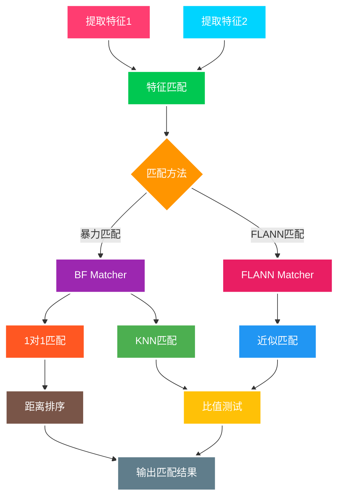

## 匹配算法概述

特征匹配是计算机视觉中的关键步骤，用于在两幅图像之间建立特征点的对应关系。常用的匹配算法包括暴力匹配、KNN 匹配和 FLANN 匹配。

## 匹配算法类型

### 暴力匹配（Brute-Force）

暴力匹配通过计算所有可能的特征点对之间的距离来找到最佳匹配。

**距离计算公式**：
$$d(\mathbf{f_1}, \mathbf{f_2}) = \sqrt{\sum_{i=1}^{n}(f_{1i} - f_{2i})^2}$$

其中 $\mathbf{f_1}, \mathbf{f_2}$ 是两个特征描述符向量。


#### 特点

- **优点**：实现简单，结果准确
- **缺点**：计算复杂度高，O(n²)
- **适用场景**：特征点数量较少的情况

### KNN 匹配

K 最近邻匹配为每个特征点找到 k 个最近邻，通过比值测试筛选良好匹配。

**Lowe's 比值测试**：
$$\frac{d_1}{d_2} < \text{threshold}$$

其中：

- $d_1$ 是最近邻距离
- $d_2$ 是次近邻距离
- $\text{threshold}$ 通常取 0.75

#### 特点

- **优点**：能够筛选出高质量的匹配
- **缺点**：需要调整阈值参数
- **适用场景**：需要高质量匹配的应用

### FLANN 匹配

Fast Library for Approximate Nearest Neighbors，适用于大规模数据的快速匹配。

#### 特点

- **优点**：速度快，适合大规模数据
- **缺点**：近似匹配，精度略低
- **适用场景**：特征点数量很多的情况

## 匹配流程图



## OpenCV 实现

### 基础匹配示例

```python
import cv2
import numpy as np
import matplotlib.pyplot as plt

def feature_matching_demo():
    # 读取图像
    img1 = cv2.imread('/images/notes/opencv/box.png', 0)
    img2 = cv2.imread('/images/notes/opencv/box_in_scene.png', 0)

    # 创建SIFT检测器
    sift = cv2.xfeatures2d.SIFT_create()

    # 检测关键点和计算描述符
    kp1, des1 = sift.detectAndCompute(img1, None)
    kp2, des2 = sift.detectAndCompute(img2, None)

    # 1. 暴力匹配器（1对1匹配）
    bf = cv2.BFMatcher(cv2.NORM_L2, crossCheck=True)
    matches = bf.match(des1, des2)
    matches = sorted(matches, key=lambda x: x.distance)

    # 绘制匹配结果
    img_matches = cv2.drawMatches(
        img1, kp1, img2, kp2, matches[:20], None,
        flags=cv2.DrawMatchesFlags_NOT_DRAW_SINGLE_POINTS
    )

    # 2. KNN匹配
    bf_knn = cv2.BFMatcher(cv2.NORM_L2)
    matches_knn = bf_knn.knnMatch(des1, des2, k=2)

    # Lowe's比值测试
    good_matches = []
    for m, n in matches_knn:
        if m.distance < 0.75 * n.distance:
            good_matches.append([m])

    # 绘制KNN匹配结果
    img_knn_matches = cv2.drawMatchesKnn(
        img1, kp1, img2, kp2, good_matches, None,
        flags=cv2.DrawMatchesFlags_NOT_DRAW_SINGLE_POINTS
    )

    # 3. FLANN匹配
    FLANN_INDEX_KDTREE = 1
    index_params = dict(algorithm=FLANN_INDEX_KDTREE, trees=5)
    search_params = dict(checks=50)
    flann = cv2.FlannBasedMatcher(index_params, search_params)
    matches_flann = flann.knnMatch(des1, des2, k=2)

    # 筛选FLANN匹配结果
    good_flann = []
    for m, n in matches_flann:
        if m.distance < 0.7 * n.distance:
            good_flann.append([m])

    return img_matches, img_knn_matches, good_matches, good_flann

# 使用示例
bf_result, knn_result, good_knn, good_flann = feature_matching_demo()
cv2.imshow('BF Matches', bf_result)
cv2.imshow('KNN Matches', knn_result)
cv2.waitKey(0)
cv2.destroyAllWindows()
```

## 函数详解

### `cv2.BFMatcher(normType, crossCheck=False)`

> **功能**: 创建暴力匹配器对象
>
> **参数**:
>
> - `normType`: 距离度量类型 (int)
>   - `cv2.NORM_L2`: 欧几里德距离，适用于 SIFT、SURF 等
>   - `cv2.NORM_HAMMING`: 汉明距离，适用于 ORB、BRIEF 等
>   - `cv2.NORM_HAMMING2`: 汉明距离（2-bit），适用于 ORB 的 WTA_K=3 或 4
> - `crossCheck`: 是否进行交叉检查 (bool)
>   - `True`: 只返回双向匹配的点对
>   - `False`: 返回所有匹配点对
>
> **返回值**: BFMatcher 对象

### `matcher.match(queryDescriptors, trainDescriptors, mask=None)`

> **功能**: 执行 1 对 1 匹配
>
> **参数**:
>
> - `queryDescriptors`: 查询描述符 (numpy.ndarray)
> - `trainDescriptors`: 训练描述符 (numpy.ndarray)
> - `mask`: 掩码 (numpy.ndarray, 可选)
>
> **返回值**: DMatch 对象列表

### `matcher.knnMatch(queryDescriptors, trainDescriptors, k, mask=None)`

> **功能**: 执行 K 最近邻匹配
>
> **参数**:
>
> - `queryDescriptors`: 查询描述符 (numpy.ndarray)
> - `trainDescriptors`: 训练描述符 (numpy.ndarray)
> - `k`: 返回的最近邻数量 (int)
> - `mask`: 掩码 (numpy.ndarray, 可选)
>
> **返回值**: DMatch 对象列表的列表

### `cv2.FlannBasedMatcher(indexParams, searchParams)`

> **功能**: 创建 FLANN 匹配器对象
>
> **参数**:
>
> - `indexParams`: 索引参数 (dict)
>   - KD-Tree: `{'algorithm': 1, 'trees': 5}`
>   - LSH: `{'algorithm': 6, 'table_number': 6, 'key_size': 12, 'multi_probe_level': 1}`
> - `searchParams`: 搜索参数 (dict)
>   - `{'checks': 50}`: 检查次数
>
> **返回值**: FlannBasedMatcher 对象

### `cv2.drawMatches(img1, keypoints1, img2, keypoints2, matches1to2, outImg, matchColor=None, singlePointColor=None, matchesMask=None, flags=0)`

> **功能**: 绘制特征点匹配结果
>
> **参数**:
>
> - `img1`: 第一幅图像 (numpy.ndarray)
> - `keypoints1`: 第一幅图像的关键点 (list)
> - `img2`: 第二幅图像 (numpy.ndarray)
> - `keypoints2`: 第二幅图像的关键点 (list)
> - `matches1to2`: 匹配结果 (list)
> - `outImg`: 输出图像 (numpy.ndarray, 可选)
> - `matchColor`: 匹配线颜色 (tuple, 可选)
> - `singlePointColor`: 单点颜色 (tuple, 可选)
> - `matchesMask`: 匹配掩码 (list, 可选)
> - `flags`: 绘制标志 (int, 可选)
>
> **返回值**: 绘制结果图像 (numpy.ndarray)
>
> **常用 flags**:
>
> - `cv2.DrawMatchesFlags_DEFAULT`: 默认绘制
> - `cv2.DrawMatchesFlags_NOT_DRAW_SINGLE_POINTS`: 不绘制单个点
> - `cv2.DrawMatchesFlags_DRAW_RICH_KEYPOINTS`: 绘制关键点的方向和大小

## 详细实现

### 暴力匹配器

```python
def brute_force_matching(img1_path, img2_path):
    """暴力匹配器实现"""
    # 读取图像
    img1 = cv2.imread(img1_path, 0)
    img2 = cv2.imread(img2_path, 0)

    # 创建SIFT检测器
    sift = cv2.xfeatures2d.SIFT_create()

    # 检测关键点和计算描述符
    kp1, des1 = sift.detectAndCompute(img1, None)
    kp2, des2 = sift.detectAndCompute(img2, None)

    # 创建BF匹配器
    bf = cv2.BFMatcher(cv2.NORM_L2, crossCheck=True)

    # 执行匹配
    matches = bf.match(des1, des2)

    # 按距离排序
    matches = sorted(matches, key=lambda x: x.distance)

    # 分析匹配结果
    distances = [m.distance for m in matches]
    print(f"匹配点数量: {len(matches)}")
    print(f"最小距离: {min(distances):.2f}")
    print(f"最大距离: {max(distances):.2f}")
    print(f"平均距离: {np.mean(distances):.2f}")

    # 绘制前20个最佳匹配
    img_matches = cv2.drawMatches(
        img1, kp1, img2, kp2, matches[:20], None,
        flags=cv2.DrawMatchesFlags_NOT_DRAW_SINGLE_POINTS
    )

    return img_matches, matches

# 使用示例
result, matches = brute_force_matching('/images/notes/opencv/box.png', '/images/notes/opencv/box_in_scene.png')
cv2.imshow('Brute Force Matches', result)
cv2.waitKey(0)
cv2.destroyAllWindows()
```

### KNN 匹配

```python
def knn_matching(img1_path, img2_path, ratio_threshold=0.75):
    """KNN匹配实现"""
    # 读取图像
    img1 = cv2.imread(img1_path, 0)
    img2 = cv2.imread(img2_path, 0)

    # 创建SIFT检测器
    sift = cv2.xfeatures2d.SIFT_create()

    # 检测关键点和计算描述符
    kp1, des1 = sift.detectAndCompute(img1, None)
    kp2, des2 = sift.detectAndCompute(img2, None)

    # 创建BF匹配器
    bf = cv2.BFMatcher(cv2.NORM_L2)

    # 执行KNN匹配
    matches = bf.knnMatch(des1, des2, k=2)

    # Lowe's比值测试
    good_matches = []
    ratio_tests = []

    for i, (m, n) in enumerate(matches):
        ratio = m.distance / n.distance
        ratio_tests.append(ratio)

        if ratio < ratio_threshold:
            good_matches.append([m])

    # 统计分析
    print(f"总匹配点数: {len(matches)}")
    print(f"通过比值测试的匹配点数: {len(good_matches)}")
    print(f"通过率: {len(good_matches)/len(matches)*100:.1f}%")
    print(f"平均比值: {np.mean(ratio_tests):.3f}")

    # 绘制匹配结果
    img_matches = cv2.drawMatchesKnn(
        img1, kp1, img2, kp2, good_matches, None,
        flags=cv2.DrawMatchesFlags_NOT_DRAW_SINGLE_POINTS
    )

    return img_matches, good_matches, ratio_tests

# 使用示例
result, good_matches, ratios = knn_matching('/images/notes/opencv/box.png', '/images/notes/opencv/box_in_scene.png', 0.75)
cv2.imshow('KNN Matches', result)
cv2.waitKey(0)
cv2.destroyAllWindows()
```

### FLANN 匹配

````python
def flann_matching(img1_path, img2_path, ratio_threshold=0.7):
    """FLANN匹配实现"""
    # 读取图像
    img1 = cv2.imread(img1_path, 0)
    img2 = cv2.imread(img2_path, 0)

    # 创建SIFT检测器
    sift = cv2.xfeatures2d.SIFT_create()

    # 检测关键点和计算描述符
    kp1, des1 = sift.detectAndCompute(img1, None)
    kp2, des2 = sift.detectAndCompute(img2, None)

    # FLANN参数设置
    FLANN_INDEX_KDTREE = 1
    index_params = dict(algorithm=FLANN_INDEX_KDTREE, trees=5)
    search_params = dict(checks=50)  # 或者传递一个空字典

    # 创建FLANN匹配器
    flann = cv2.FlannBasedMatcher(index_params, search_params)

    # 执行匹配
    matches = flann.knnMatch(des1, des2, k=2)

    # 筛选好的匹配
## 实用技巧

### 匹配结果筛选

```python
def filter_matches_by_distance(matches, threshold=100):
    """根据距离筛选匹配"""
    good_matches = []
    for match in matches:
        if match.distance < threshold:
            good_matches.append(match)
    return good_matches

def filter_matches_by_response(kp1, kp2, matches, response_threshold=0.01):
    """根据特征点响应值筛选匹配"""
    good_matches = []
    for match in matches:
        kp1_response = kp1[match.queryIdx].response
        kp2_response = kp2[match.trainIdx].response
        if kp1_response > response_threshold and kp2_response > response_threshold:
            good_matches.append(match)
    return good_matches

def filter_matches_by_scale(kp1, kp2, matches, scale_ratio_threshold=2.0):
    """根据特征点尺度筛选匹配"""
    good_matches = []
    for match in matches:
        kp1_size = kp1[match.queryIdx].size
        kp2_size = kp2[match.trainIdx].size
        scale_ratio = max(kp1_size, kp2_size) / min(kp1_size, kp2_size)
        if scale_ratio < scale_ratio_threshold:
            good_matches.append(match)
    return good_matches

# 使用示例
def comprehensive_matching_filter(img1_path, img2_path):
    """综合匹配筛选"""
    # 读取图像
    img1 = cv2.imread(img1_path, 0)
    img2 = cv2.imread(img2_path, 0)

    # 创建SIFT检测器
    sift = cv2.xfeatures2d.SIFT_create()
    kp1, des1 = sift.detectAndCompute(img1, None)
    kp2, des2 = sift.detectAndCompute(img2, None)

    # 暴力匹配
    bf = cv2.BFMatcher(cv2.NORM_L2, crossCheck=True)
    matches = bf.match(des1, des2)

    print(f"原始匹配数: {len(matches)}")

    # 逐步筛选
    matches = sorted(matches, key=lambda x: x.distance)
    matches = filter_matches_by_distance(matches, 200)
    print(f"距离筛选后: {len(matches)}")

    matches = filter_matches_by_response(kp1, kp2, matches, 0.005)
    print(f"响应值筛选后: {len(matches)}")

    matches = filter_matches_by_scale(kp1, kp2, matches, 3.0)
    print(f"尺度筛选后: {len(matches)}")

    # 绘制最终结果
    img_matches = cv2.drawMatches(
        img1, kp1, img2, kp2, matches[:20], None,
        flags=cv2.DrawMatchesFlags_NOT_DRAW_SINGLE_POINTS
    )

    return img_matches, matches

# 使用示例
result, filtered_matches = comprehensive_matching_filter('/images/notes/opencv/box.png', '/images/notes/opencv/box_in_scene.png')
cv2.imshow('Filtered Matches', result)
cv2.waitKey(0)
cv2.destroyAllWindows()
````

### 匹配可视化优化

```python
def visualize_matches_with_colors(img1_path, img2_path):
    """彩色可视化匹配结果"""
    # 读取图像
    img1 = cv2.imread(img1_path, 0)
    img2 = cv2.imread(img2_path, 0)

    # 创建SIFT检测器
    sift = cv2.xfeatures2d.SIFT_create()
    kp1, des1 = sift.detectAndCompute(img1, None)
    kp2, des2 = sift.detectAndCompute(img2, None)

    # 匹配
    bf = cv2.BFMatcher(cv2.NORM_L2)
    matches = bf.knnMatch(des1, des2, k=2)

    # 筛选
    good_matches = []
    for matches_pair in matches:
        if len(matches_pair) == 2:
            m, n = matches_pair
            if m.distance < 0.75 * n.distance:
                good_matches.append([m])

    # 彩色可视化
    img_matches = cv2.drawMatchesKnn(
        img1, kp1, img2, kp2, good_matches, None,
        matchColor=(0, 255, 0),  # 绿色连接线
        singlePointColor=(255, 0, 0),  # 红色特征点
        flags=cv2.DrawMatchesFlags_DEFAULT
    )

    return img_matches

def visualize_matches_with_quality(img1_path, img2_path):
    """根据匹配质量着色"""
    # 读取图像
    img1 = cv2.imread(img1_path, 0)
    img2 = cv2.imread(img2_path, 0)

    # 创建SIFT检测器
    sift = cv2.xfeatures2d.SIFT_create()
    kp1, des1 = sift.detectAndCompute(img1, None)
    kp2, des2 = sift.detectAndCompute(img2, None)

    # 匹配
    bf = cv2.BFMatcher(cv2.NORM_L2)
    matches = bf.knnMatch(des1, des2, k=2)

    # 分析匹配质量
    good_matches = []
    match_qualities = []

    for matches_pair in matches:
        if len(matches_pair) == 2:
            m, n = matches_pair
            ratio = m.distance / n.distance
            if ratio < 0.75:
                good_matches.append([m])
                match_qualities.append(1.0 - ratio)  # 质量越高值越大

    # 根据质量着色
    img_height, img_width = img1.shape
    result_img = np.zeros((img_height, img_width * 2, 3), dtype=np.uint8)
    result_img[:, :img_width] = cv2.cvtColor(img1, cv2.COLOR_GRAY2BGR)
    result_img[:, img_width:] = cv2.cvtColor(img2, cv2.COLOR_GRAY2BGR)

    # 绘制匹配线
    for i, match_group in enumerate(good_matches):
        match = match_group[0]
        pt1 = tuple(map(int, kp1[match.queryIdx].pt))
        pt2 = tuple(map(int, kp2[match.trainIdx].pt))
        pt2 = (pt2[0] + img_width, pt2[1])

        # 根据质量选择颜色
        quality = match_qualities[i]
        if quality > 0.7:
            color = (0, 255, 0)  # 绿色 - 高质量
        elif quality > 0.5:
            color = (0, 255, 255)  # 黄色 - 中等质量
        else:
            color = (0, 0, 255)  # 红色 - 低质量

        cv2.line(result_img, pt1, pt2, color, 2)
        cv2.circle(result_img, pt1, 3, color, -1)
        cv2.circle(result_img, pt2, 3, color, -1)

    return result_img

# 使用示例
color_result = visualize_matches_with_colors('/images/notes/opencv/box.png', '/images/notes/opencv/box_in_scene.png')
quality_result = visualize_matches_with_quality('/images/notes/opencv/box.png', '/images/notes/opencv/box_in_scene.png')

cv2.imshow('Color Matches', color_result)
cv2.imshow('Quality Matches', quality_result)
cv2.waitKey(0)
cv2.destroyAllWindows()
```

### 多尺度匹配

```python
def multi_scale_matching(img1_path, img2_path):
    """多尺度特征匹配"""
    # 读取图像
    img1 = cv2.imread(img1_path, 0)
    img2 = cv2.imread(img2_path, 0)

    # 创建不同尺度的图像
    scales = [1.0, 0.8, 0.6, 0.4]
    all_matches = []

    for scale in scales:
        # 缩放图像
        if scale != 1.0:
            width = int(img1.shape[1] * scale)
            height = int(img1.shape[0] * scale)
            img1_scaled = cv2.resize(img1, (width, height))

            width = int(img2.shape[1] * scale)
            height = int(img2.shape[0] * scale)
            img2_scaled = cv2.resize(img2, (width, height))
        else:
            img1_scaled = img1
            img2_scaled = img2

        # 特征检测
        sift = cv2.xfeatures2d.SIFT_create()
        kp1, des1 = sift.detectAndCompute(img1_scaled, None)
        kp2, des2 = sift.detectAndCompute(img2_scaled, None)

        # 匹配
        bf = cv2.BFMatcher(cv2.NORM_L2)
        matches = bf.knnMatch(des1, des2, k=2)

        # 筛选
        good_matches = []
        for matches_pair in matches:
            if len(matches_pair) == 2:
                m, n = matches_pair
                if m.distance < 0.75 * n.distance:
                    # 调整关键点坐标到原始尺度
                    if scale != 1.0:
                        kp1[m.queryIdx].pt = (kp1[m.queryIdx].pt[0] / scale, kp1[m.queryIdx].pt[1] / scale)
                        kp2[m.trainIdx].pt = (kp2[m.trainIdx].pt[0] / scale, kp2[m.trainIdx].pt[1] / scale)
                    good_matches.append(m)

        all_matches.extend(good_matches)
        print(f"尺度 {scale}: {len(good_matches)} 个匹配")

    print(f"总匹配数: {len(all_matches)}")

    # 合并关键点
    all_kp1 = []
    all_kp2 = []
    final_matches = []

    for i, match in enumerate(all_matches):
        all_kp1.append(match.queryIdx)
        all_kp2.append(match.trainIdx)
        final_matches.append(cv2.DMatch(i, i, match.distance))

    return len(all_matches)

# 使用示例
total_matches = multi_scale_matching('/images/notes/opencv/box.png', '/images/notes/opencv/box_in_scene.png')
print(f"多尺度匹配总数: {total_matches}")
```
