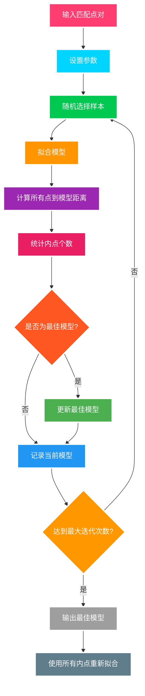

## 核心思想

**随机抽样一致性算法**（Random Sample Consensus）是一种迭代方法，用于从包含离群值的数据中估计数学模型参数。


RANSAC 算法的核心思想是：

- 从数据中随机选择最小样本集
- 拟合模型并评估其对所有数据的适用性
- 迭代寻找最佳模型
- 通过内点数量判断模型质量

## RANSAC 算法步骤

1. **随机采样**：从数据集中随机选择最小样本集
2. **模型拟合**：使用最小样本集拟合模型
3. **一致性检验**：计算所有数据点到模型的距离
4. **内点统计**：统计误差小于阈值的数据点（内点）
5. **迭代优化**：重复步骤 1-4，选择内点最多的模型


## 数学公式

### 迭代次数估计

$$N = \frac{\log(1-p)}{\log(1-w^s)}$$

其中：

- $p$：期望的成功概率（通常取 0.99）
- $w$：内点比例的估计值
- $s$：最小样本集大小

### 距离阈值

$$t = k \cdot \sigma$$

其中：

- $k$：常数（通常取 1.96，对应 95%置信度）
- $\sigma$：噪声标准差

### 模型评估

对于单应性矩阵估计，重投影误差为：
$$e = \sqrt{(x' - \hat{x}')^2 + (y' - \hat{y}')^2}$$

其中 $(x', y')$ 是真实坐标，$(\hat{x}', \hat{y}')$ 是模型预测坐标。

## 算法流程图



## 单应性矩阵

单应性矩阵用于描述两个平面之间的投影变换关系：

$$\begin{bmatrix} x' \\ y' \\ 1 \end{bmatrix} = H \begin{bmatrix} x \\ y \\ 1 \end{bmatrix}$$

其中 $H$ 是 3×3 的单应性矩阵：
$$H = \begin{bmatrix} h_{11} & h_{12} & h_{13} \\ h_{21} & h_{22} & h_{23} \\ h_{31} & h_{32} & h_{33} \end{bmatrix}$$


### 单应性矩阵的物理意义

- **旋转**：$h_{11}, h_{12}, h_{21}, h_{22}$ 项
- **平移**：$h_{13}, h_{23}$ 项
- **透视变换**：$h_{31}, h_{32}$ 项
- **缩放**：$h_{33}$ 项（通常归一化为 1）

### 变换类型

1. **相似变换**：旋转、平移、缩放
2. **仿射变换**：相似变换 + 剪切
3. **投影变换**：仿射变换 + 透视变换

## 函数详解

#### `cv2.findHomography(srcPoints, dstPoints, method, ransacReprojThreshold, confidence, maxIters)`

> **参数说明：**
>
> - `srcPoints`：源图像特征点，格式为 `(N, 1, 2)` 的浮点数组
> - `dstPoints`：目标图像特征点，格式为 `(N, 1, 2)` 的浮点数组
> - `method`：计算方法
>   - `cv2.RANSAC`：RANSAC 算法
>   - `cv2.LMEDS`：最小中值算法
>   - `cv2.RHO`：PROSAC 算法
> - `ransacReprojThreshold`：RANSAC 算法的重投影误差阈值，默认 3.0
> - `confidence`：置信度，默认 0.99
> - `maxIters`：最大迭代次数，默认 2000
>
> **返回值：**
>
> - `homography`：3×3 单应性矩阵
> - `mask`：内点标记数组

#### `cv2.perspectiveTransform(src, m)`

> **参数说明：**
>
> - `src`：输入点，格式为 `(N, 1, 2)` 的浮点数组
> - `m`：3×3 变换矩阵
>
> **返回值：**
>
> - 变换后的点坐标

#### `cv2.warpPerspective(src, M, dsize, flags, borderMode, borderValue)`

> **参数说明：**
>
> - `src`：输入图像
> - `M`：3×3 变换矩阵
> - `dsize`：输出图像大小 `(width, height)`
> - `flags`：插值方法，默认 `cv2.INTER_LINEAR`
> - `borderMode`：边界处理方式，默认 `cv2.BORDER_CONSTANT`
> - `borderValue`：边界填充值，默认 0
>
> **返回值：**
>
> - 变换后的图像

### 基础实现

```python
import cv2
import numpy as np

def ransac_homography_demo():
    # 读取图像
    img1 = cv2.imread('/images/notes/opencv/box.png', 0)
    img2 = cv2.imread('/images/notes/opencv/box_in_scene.png', 0)

    # SIFT特征检测
    sift = cv2.xfeatures2d.SIFT_create()
    kp1, des1 = sift.detectAndCompute(img1, None)
    kp2, des2 = sift.detectAndCompute(img2, None)

    # 特征匹配
    bf = cv2.BFMatcher()
    matches = bf.knnMatch(des1, des2, k=2)

    # Lowe's比值测试
    good_matches = []
    for m, n in matches:
        if m.distance < 0.7 * n.distance:
            good_matches.append(m)

    # 提取匹配点坐标
    if len(good_matches) >= 4:  # 至少需要4个点来计算单应性矩阵
        src_pts = np.float32([kp1[m.queryIdx].pt for m in good_matches]).reshape(-1, 1, 2)
        dst_pts = np.float32([kp2[m.trainIdx].pt for m in good_matches]).reshape(-1, 1, 2)

        # 使用RANSAC计算单应性矩阵
        homography, mask = cv2.findHomography(
            src_pts, dst_pts,
            cv2.RANSAC,
            ransacReprojThreshold=5.0  # 内点阈值
        )

        # 获取内点匹配
        matches_mask = mask.ravel().tolist()
        inlier_matches = [good_matches[i] for i in range(len(good_matches)) if matches_mask[i]]

        # 绘制匹配结果
        img_matches = cv2.drawMatches(
            img1, kp1, img2, kp2, inlier_matches, None,
            flags=cv2.DrawMatchesFlags_NOT_DRAW_SINGLE_POINTS
        )

        # 计算图像边界变换
        h, w = img1.shape
        corners = np.float32([[0, 0], [w, 0], [w, h], [0, h]]).reshape(-1, 1, 2)
        transformed_corners = cv2.perspectiveTransform(corners, homography)

        # 在目标图像上绘制变换后的边界
        img2_with_box = cv2.polylines(
            img2.copy(), [np.int32(transformed_corners)],
            True, 255, 3, cv2.LINE_AA
        )

        print(f"总匹配点数: {len(good_matches)}")
        print(f"内点数量: {len(inlier_matches)}")
        print(f"内点比例: {len(inlier_matches)/len(good_matches):.2%}")
        print(f"单应性矩阵:\n{homography}")

        return img_matches, img2_with_box, homography

    else:
        print("匹配点不足，无法计算单应性矩阵")
        return None, None, None

# 使用示例
matches_result, box_result, H = ransac_homography_demo()
if matches_result is not None:
    cv2.imshow('RANSAC Matches', matches_result)
    cv2.imshow('Detected Object', box_result)
    cv2.waitKey(0)
    cv2.destroyAllWindows()
```

### 参数优化

```python
def ransac_with_parameters(img1_path, img2_path, ransac_threshold=5.0, confidence=0.99, max_iters=5000):
    """
    带参数的RANSAC单应性矩阵估计

    参数：
    - ransac_threshold: 内点阈值
    - confidence: 置信度
    - max_iters: 最大迭代次数
    """
    # 读取图像
    img1 = cv2.imread(img1_path, 0)
    img2 = cv2.imread(img2_path, 0)

    # SIFT特征检测
    sift = cv2.xfeatures2d.SIFT_create()
    kp1, des1 = sift.detectAndCompute(img1, None)
    kp2, des2 = sift.detectAndCompute(img2, None)

    # 特征匹配
    bf = cv2.BFMatcher()
    matches = bf.knnMatch(des1, des2, k=2)

    # 筛选好的匹配
    good_matches = []
    for m, n in matches:
        if m.distance < 0.7 * n.distance:
            good_matches.append(m)

    if len(good_matches) >= 4:
        # 提取匹配点坐标
        src_pts = np.float32([kp1[m.queryIdx].pt for m in good_matches]).reshape(-1, 1, 2)
        dst_pts = np.float32([kp2[m.trainIdx].pt for m in good_matches]).reshape(-1, 1, 2)

        # RANSAC参数估计
        homography, mask = cv2.findHomography(
            src_pts, dst_pts,
            method=cv2.RANSAC,
            ransacReprojThreshold=ransac_threshold,
            confidence=confidence,
            maxIters=max_iters
        )

        # 统计结果
        inliers_count = np.sum(mask)
        inlier_ratio = inliers_count / len(good_matches)

        print(f"RANSAC参数: 阈值={ransac_threshold}, 置信度={confidence}, 最大迭代={max_iters}")
        print(f"匹配点数: {len(good_matches)}")
        print(f"内点数: {inliers_count}")
        print(f"内点比例: {inlier_ratio:.2%}")

        return homography, mask, inlier_ratio

    return None, None, 0

# 参数测试
test_params = [
    {'ransac_threshold': 3.0, 'confidence': 0.95},
    {'ransac_threshold': 5.0, 'confidence': 0.99},
    {'ransac_threshold': 8.0, 'confidence': 0.999},
]

for params in test_params:
    H, mask, ratio = ransac_with_parameters('/images/notes/opencv/box.png', '/images/notes/opencv/box_in_scene.png', **params)
    print(f"参数 {params}: 内点比例 {ratio:.2%}")
    print("-" * 50)
```

### 手动实现 RANSAC

```python
def manual_ransac_homography(src_pts, dst_pts, threshold=5.0, max_iterations=1000, confidence=0.99):
    """
    手动实现RANSAC单应性矩阵估计
    """
    import random

    n_points = len(src_pts)
    if n_points < 4:
        return None, None

    best_homography = None
    best_inliers = []
    best_score = 0

    # 计算所需的迭代次数
    sample_size = 4
    inlier_ratio_est = 0.5  # 估计内点比例
    required_iterations = int(np.log(1 - confidence) / np.log(1 - inlier_ratio_est**sample_size))
    iterations = min(max_iterations, required_iterations)

    print(f"预计迭代次数: {iterations}")

    for i in range(iterations):
        # 随机选择4个点
        sample_indices = random.sample(range(n_points), sample_size)
        sample_src = src_pts[sample_indices]
        sample_dst = dst_pts[sample_indices]

        # 计算单应性矩阵
        try:
            H = cv2.getPerspectiveTransform(sample_src.reshape(4, 2), sample_dst.reshape(4, 2))
        except:
            continue

        # 计算所有点的重投影误差
        src_homogeneous = np.hstack([src_pts.reshape(-1, 2), np.ones((n_points, 1))])
        projected = (H @ src_homogeneous.T).T
        projected_2d = projected[:, :2] / projected[:, 2:3]

        # 计算误差
        errors = np.sqrt(np.sum((projected_2d - dst_pts.reshape(-1, 2))**2, axis=1))

        # 统计内点
        inliers = errors < threshold
        inlier_count = np.sum(inliers)

        # 更新最佳模型
        if inlier_count > best_score:
            best_score = inlier_count
            best_homography = H
            best_inliers = inliers

            # 更新内点比例估计
            inlier_ratio_est = inlier_count / n_points
            required_iterations = int(np.log(1 - confidence) / np.log(1 - inlier_ratio_est**sample_size))

            print(f"迭代 {i+1}: 内点数 {inlier_count}, 内点比例 {inlier_ratio_est:.2%}")

    # 使用所有内点重新拟合
    if best_score >= 4:
        inlier_src = src_pts[best_inliers]
        inlier_dst = dst_pts[best_inliers]

        if len(inlier_src) >= 4:
            refined_H = cv2.findHomography(inlier_src, inlier_dst, cv2.LMEDS)[0]
            return refined_H, best_inliers

    return best_homography, best_inliers

# 使用示例
def test_manual_ransac():
    # 读取图像
    img1 = cv2.imread('/images/notes/opencv/box.png', 0)
    img2 = cv2.imread('/images/notes/opencv/box_in_scene.png', 0)

    # SIFT特征检测
    sift = cv2.xfeatures2d.SIFT_create()
    kp1, des1 = sift.detectAndCompute(img1, None)
    kp2, des2 = sift.detectAndCompute(img2, None)

    # 特征匹配
    bf = cv2.BFMatcher()
    matches = bf.knnMatch(des1, des2, k=2)

    # 筛选好的匹配
    good_matches = []
    for m, n in matches:
        if m.distance < 0.7 * n.distance:
            good_matches.append(m)

    if len(good_matches) >= 4:
        # 提取匹配点坐标
        src_pts = np.float32([kp1[m.queryIdx].pt for m in good_matches]).reshape(-1, 1, 2)
        dst_pts = np.float32([kp2[m.trainIdx].pt for m in good_matches]).reshape(-1, 1, 2)

        # 手动RANSAC
        H_manual, inliers_manual = manual_ransac_homography(src_pts, dst_pts)

        # OpenCV RANSAC对比
        H_opencv, mask_opencv = cv2.findHomography(src_pts, dst_pts, cv2.RANSAC, 5.0)

        print(f"手动RANSAC内点数: {np.sum(inliers_manual)}")
        print(f"OpenCV RANSAC内点数: {np.sum(mask_opencv)}")

        return H_manual, H_opencv, inliers_manual, mask_opencv

    return None, None, None, None

# 测试
H_manual, H_opencv, inliers_manual, mask_opencv = test_manual_ransac()
```

## 应用场景

### 1. 图像配准

```python
def image_registration_ransac(img1_path, img2_path):
    """基于RANSAC的图像配准"""
    # 读取图像
    img1 = cv2.imread(img1_path)
    img2 = cv2.imread(img2_path)

    # 转换为灰度图
    gray1 = cv2.cvtColor(img1, cv2.COLOR_BGR2GRAY)
    gray2 = cv2.cvtColor(img2, cv2.COLOR_BGR2GRAY)

    # SIFT特征检测
    sift = cv2.xfeatures2d.SIFT_create()
    kp1, des1 = sift.detectAndCompute(gray1, None)
    kp2, des2 = sift.detectAndCompute(gray2, None)

    # 特征匹配
    bf = cv2.BFMatcher()
    matches = bf.knnMatch(des1, des2, k=2)

    # 筛选好的匹配
    good_matches = []
    for m, n in matches:
        if m.distance < 0.7 * n.distance:
            good_matches.append(m)

    if len(good_matches) >= 4:
        # 提取匹配点
        src_pts = np.float32([kp1[m.queryIdx].pt for m in good_matches]).reshape(-1, 1, 2)
        dst_pts = np.float32([kp2[m.trainIdx].pt for m in good_matches]).reshape(-1, 1, 2)

        # RANSAC估计变换矩阵
        M, mask = cv2.findHomography(src_pts, dst_pts, cv2.RANSAC, 5.0)

        # 应用变换
        h, w, c = img1.shape
        registered = cv2.warpPerspective(img1, M, (w, h))

        # 计算配准质量
        inlier_count = np.sum(mask)
        inlier_ratio = inlier_count / len(good_matches)

        print(f"配准成功: 内点数 {inlier_count}, 内点比例 {inlier_ratio:.2%}")

        return registered, M, inlier_ratio

    return None, None, 0

# 使用示例
registered, transform_matrix, quality = image_registration_ransac('/images/notes/opencv/img1.jpg', '/images/notes/opencv/img2.jpg')
if registered is not None:
    cv2.imshow('Registered Image', registered)
    cv2.waitKey(0)
    cv2.destroyAllWindows()
```

### 2. 平面检测

```python
def plane_detection_ransac(img_path):
    """基于RANSAC的平面检测"""
    # 读取图像
    img = cv2.imread(img_path)
    gray = cv2.cvtColor(img, cv2.COLOR_BGR2GRAY)

    # 检测线段
    lines = cv2.HoughLinesP(gray, 1, np.pi/180, threshold=100, minLineLength=50, maxLineGap=10)

    if lines is not None:
        # 使用RANSAC拟合主要平面
        points = []
        for line in lines:
            x1, y1, x2, y2 = line[0]
            points.extend([(x1, y1), (x2, y2)])

        points = np.array(points)

        # 简化的平面拟合（这里用线性拟合代替）
        if len(points) >= 2:
            # 使用最小二乘法拟合直线
            x = points[:, 0]
            y = points[:, 1]
            A = np.vstack([x, np.ones(len(x))]).T
            m, b = np.linalg.lstsq(A, y, rcond=None)[0]

            # 计算内点
            distances = np.abs(y - (m * x + b)) / np.sqrt(m**2 + 1)
            inliers = distances < 10  # 阈值

            print(f"检测到 {len(lines)} 条线段")
            print(f"内点数: {np.sum(inliers)}")
            print(f"主要平面方程: y = {m:.2f}x + {b:.2f}")

            # 绘制检测结果
            for i, line in enumerate(lines):
                x1, y1, x2, y2 = line[0]
                color = (0, 255, 0) if inliers[i*2] and inliers[i*2+1] else (0, 0, 255)
                cv2.line(img, (x1, y1), (x2, y2), color, 2)

            return img

    return img

# 使用示例
result = plane_detection_ransac('/images/notes/opencv/building.jpg')
cv2.imshow('Plane Detection', result)
cv2.waitKey(0)
cv2.destroyAllWindows()
```

### 3. 异常值检测

```python
def outlier_detection_ransac(points, threshold=2.0):
    """
    基于RANSAC的异常值检测
    适用于2D点集的直线拟合
    """
    n_points = len(points)
    if n_points < 2:
        return None, None

    best_inliers = []
    best_score = 0
    best_model = None

    max_iterations = 1000

    for _ in range(max_iterations):
        # 随机选择2个点
        sample_indices = np.random.choice(n_points, 2, replace=False)
        p1, p2 = points[sample_indices]

        # 拟合直线 ax + by + c = 0
        if p1[0] == p2[0]:  # 垂直线
            a, b, c = 1, 0, -p1[0]
        else:
            # y = mx + b => mx - y + b = 0
            m = (p2[1] - p1[1]) / (p2[0] - p1[0])
            b = p1[1] - m * p1[0]
            a, b, c = m, -1, b

        # 计算所有点到直线的距离
        distances = np.abs(a * points[:, 0] + b * points[:, 1] + c) / np.sqrt(a**2 + b**2)

        # 统计内点
        inliers = distances < threshold
        inlier_count = np.sum(inliers)

        if inlier_count > best_score:
            best_score = inlier_count
            best_inliers = inliers
            best_model = (a, b, c)

    return best_model, best_inliers

# 使用示例
def test_outlier_detection():
    # 生成带噪声的直线数据
    np.random.seed(42)
    x = np.linspace(0, 10, 50)
    y = 2 * x + 1 + np.random.normal(0, 0.5, 50)

    # 添加异常值
    x = np.append(x, [2, 3, 7, 8])
    y = np.append(y, [15, 18, 8, 12])

    points = np.column_stack([x, y])

    # RANSAC异常值检测
    model, inliers = outlier_detection_ransac(points)

    if model is not None:
        a, b, c = model
        print(f"检测到的直线方程: {a:.2f}x + {b:.2f}y + {c:.2f} = 0")
        print(f"内点数: {np.sum(inliers)}")
        print(f"异常值数: {np.sum(~inliers)}")

        # 可视化结果
        plt.figure(figsize=(10, 6))

        # 绘制内点和异常值
        plt.scatter(x[inliers], y[inliers], c='blue', label='内点', alpha=0.7)
        plt.scatter(x[~inliers], y[~inliers], c='red', label='异常值', alpha=0.7)

        # 绘制拟合直线
        x_line = np.linspace(x.min(), x.max(), 100)
        if b != 0:
            y_line = -(a * x_line + c) / b
            plt.plot(x_line, y_line, 'g-', label='RANSAC拟合直线', linewidth=2)

        plt.xlabel('X')
        plt.ylabel('Y')
        plt.title('RANSAC异常值检测')
        plt.legend()
        plt.grid(True, alpha=0.3)
        plt.show()

# 测试
test_outlier_detection()
```

## 优化技巧

### 1. 自适应阈值

```python
def adaptive_threshold_ransac(src_pts, dst_pts, initial_threshold=5.0):
    """自适应阈值RANSAC"""
    current_threshold = initial_threshold
    best_homography = None
    best_inliers = []

    thresholds = [initial_threshold * 0.5, initial_threshold, initial_threshold * 2.0]

    for threshold in thresholds:
        H, mask = cv2.findHomography(src_pts, dst_pts, cv2.RANSAC, threshold)

        if H is not None:
            inlier_count = np.sum(mask)
            inlier_ratio = inlier_count / len(src_pts)

            print(f"阈值 {threshold}: 内点数 {inlier_count}, 内点比例 {inlier_ratio:.2%}")

            if len(best_inliers) == 0 or inlier_count > len(best_inliers):
                best_homography = H
                best_inliers = mask
                current_threshold = threshold

    return best_homography, best_inliers, current_threshold
```

### 2. 多模型 RANSAC

```python
def multi_model_ransac(src_pts, dst_pts, models=['homography', 'affine']):
    """多模型RANSAC"""
    results = {}

    for model_type in models:
        if model_type == 'homography':
            if len(src_pts) >= 4:
                H, mask = cv2.findHomography(src_pts, dst_pts, cv2.RANSAC, 5.0)
                results[model_type] = {
                    'matrix': H,
                    'inliers': mask,
                    'inlier_count': np.sum(mask) if mask is not None else 0
                }

        elif model_type == 'affine':
            if len(src_pts) >= 3:
                # 仿射变换需要至少3个点
                A = cv2.estimateAffinePartial2D(src_pts, dst_pts, method=cv2.RANSAC)[0]
                # 简化处理，实际应用中需要计算内点
                results[model_type] = {
                    'matrix': A,
                    'inliers': None,
                    'inlier_count': 0
                }

    # 选择最佳模型
    best_model = max(results.keys(), key=lambda k: results[k]['inlier_count'])

    return results, best_model
```

## 性能分析

### 参数对性能的影响

1. **阈值**：

   - 过小：内点数减少，可能错过正确模型
   - 过大：异常值被误判为内点

2. **最大迭代次数**：

   - 过小：可能找不到最优解
   - 过大：计算时间增加

3. **置信度**：
   - 影响所需的迭代次数
   - 高置信度需要更多迭代

### 复杂度分析

- **时间复杂度**：O(k × n)，其中 k 是迭代次数，n 是数据点数
- **空间复杂度**：O(n)
- **实际迭代次数**：依赖于内点比例和所需置信度

## 优缺点

### 优点

1. **鲁棒性强**：能够处理大量异常值
2. **通用性好**：适用于各种模型拟合
3. **实现简单**：算法逻辑清晰
4. **效果稳定**：在噪声环境下表现良好

### 缺点

1. **计算量大**：需要多次迭代
2. **参数敏感**：阈值选择影响结果
3. **随机性**：结果可能有轻微变化
4. **不适用于内点比例很低的情况**

## 应用领域

- **计算机视觉**：图像配准、物体识别
- **机器人学**：SLAM、路径规划
- **医学影像**：图像配准、病变检测
- **遥感**：地图匹配、变化检测
- **三维重建**：点云配准、结构恢复

## 实用技巧

### 1. 参数选择策略

```python
def optimize_ransac_params(src_pts, dst_pts):
    """RANSAC参数优化策略"""
    n_matches = len(src_pts)

    # 根据匹配点数量调整参数
    if n_matches < 20:
        threshold = 3.0
        confidence = 0.95
        max_iters = 1000
    elif n_matches < 50:
        threshold = 5.0
        confidence = 0.99
        max_iters = 2000
    else:
        threshold = 8.0
        confidence = 0.999
        max_iters = 5000

    # 根据图像大小调整阈值
    img_diagonal = np.sqrt(640**2 + 480**2)  # 假设图像大小
    adaptive_threshold = threshold * (img_diagonal / 800)

    return adaptive_threshold, confidence, max_iters
```

### 2. 质量评估

```python
def evaluate_homography_quality(H, src_pts, dst_pts):
    """评估单应性矩阵质量"""
    if H is None:
        return {'valid': False}

    # 计算重投影误差
    src_homogeneous = np.hstack([src_pts.reshape(-1, 2), np.ones((len(src_pts), 1))])
    projected = (H @ src_homogeneous.T).T
    projected_2d = projected[:, :2] / projected[:, 2:3]

    errors = np.sqrt(np.sum((projected_2d - dst_pts.reshape(-1, 2))**2, axis=1))

    # 质量指标
    mean_error = np.mean(errors)
    std_error = np.std(errors)
    max_error = np.max(errors)

    # 条件数检查
    condition_number = np.linalg.cond(H)

    return {
        'valid': True,
        'mean_error': mean_error,
        'std_error': std_error,
        'max_error': max_error,
        'condition_number': condition_number,
        'is_stable': condition_number < 1000
    }
```

### 3. 多尺度 RANSAC

```python
def multi_scale_ransac(img1, img2, scales=[1.0, 0.5, 0.25]):
    """多尺度RANSAC提高鲁棒性"""
    best_H = None
    best_inliers = 0

    for scale in scales:
        # 缩放图像
        h1, w1 = img1.shape[:2]
        h2, w2 = img2.shape[:2]

        scaled_img1 = cv2.resize(img1, (int(w1*scale), int(h1*scale)))
        scaled_img2 = cv2.resize(img2, (int(w2*scale), int(h2*scale)))

        # 在缩放图像上进行RANSAC
        H_scaled, inliers = perform_ransac(scaled_img1, scaled_img2)

        if H_scaled is not None:
            # 将变换矩阵转换回原始尺度
            S = np.array([[1/scale, 0, 0], [0, 1/scale, 0], [0, 0, 1]])
            H_original = S @ H_scaled @ np.linalg.inv(S)

            # 在原始尺度上验证
            inlier_count = validate_homography(H_original, img1, img2)

            if inlier_count > best_inliers:
                best_H = H_original
                best_inliers = inlier_count

    return best_H, best_inliers
```

### 4. 渐进式 RANSAC

```python
def progressive_ransac(src_pts, dst_pts, initial_threshold=5.0, reduction_factor=0.8):
    """渐进式RANSAC：逐步减小阈值"""
    current_threshold = initial_threshold
    best_H = None
    best_inliers = []

    while current_threshold > 1.0:
        H, mask = cv2.findHomography(
            src_pts, dst_pts,
            cv2.RANSAC,
            current_threshold,
            maxIters=1000
        )

        if H is not None:
            inlier_count = np.sum(mask)
            if len(best_inliers) == 0 or inlier_count >= len(best_inliers) * 0.8:
                best_H = H
                best_inliers = mask
                # 用更小的阈值继续优化
                current_threshold *= reduction_factor
            else:
                break
        else:
            break

    return best_H, best_inliers
```

## 常见问题

### Q1: RANSAC 结果不稳定怎么办？

**A1: 结果不稳定的原因和解决方案：**

```python
def stable_ransac(src_pts, dst_pts, num_runs=5):
    """多次运行RANSAC取最稳定结果"""
    results = []

    for _ in range(num_runs):
        H, mask = cv2.findHomography(src_pts, dst_pts, cv2.RANSAC, 5.0)
        if H is not None:
            inlier_count = np.sum(mask)
            results.append((H, mask, inlier_count))

    if not results:
        return None, None

    # 选择内点数最多的结果
    best_result = max(results, key=lambda x: x[2])
    return best_result[0], best_result[1]
```

### Q2: 如何处理匹配点数量不足的情况？

**A2: 匹配点不足的处理策略：**

```python
def handle_insufficient_matches(matches, min_matches=10):
    """处理匹配点不足的情况"""
    if len(matches) < min_matches:
        print(f"警告：匹配点数量不足({len(matches)} < {min_matches})")

        # 策略1：降低匹配阈值
        # 重新进行更宽松的匹配

        # 策略2：使用其他特征检测器
        # 尝试ORB、AKAZE等其他算法

        # 策略3：调整图像预处理
        # 增强对比度、直方图均衡化等

        return False

    return True
```

### Q3: 如何优化 RANSAC 的计算速度？

**A3: 性能优化策略：**

```python
def fast_ransac(src_pts, dst_pts):
    """快速RANSAC实现"""
    # 策略1：预筛选匹配点
    if len(src_pts) > 100:
        # 使用距离阈值预筛选
        good_matches = prefilter_matches(src_pts, dst_pts)
        src_pts = src_pts[good_matches]
        dst_pts = dst_pts[good_matches]

    # 策略2：自适应迭代次数
    max_iters = min(2000, len(src_pts) * 10)

    # 策略3：早停机制
    H, mask = cv2.findHomography(
        src_pts, dst_pts,
        cv2.RANSAC,
        ransacReprojThreshold=5.0,
        maxIters=max_iters,
        confidence=0.99
    )

    return H, mask
```

### Q4: 如何判断 RANSAC 结果的可靠性？

**A4: 可靠性评估方法：**

```python
def assess_ransac_reliability(H, mask, src_pts, dst_pts):
    """评估RANSAC结果可靠性"""
    if H is None or mask is None:
        return {'reliable': False, 'reason': 'No valid homography found'}

    inlier_count = np.sum(mask)
    total_matches = len(src_pts)
    inlier_ratio = inlier_count / total_matches

    # 可靠性检查
    checks = {
        'sufficient_inliers': inlier_count >= 8,
        'good_inlier_ratio': inlier_ratio >= 0.2,
        'stable_matrix': np.linalg.cond(H) < 1000,
        'reasonable_transform': check_transform_reasonableness(H)
    }

    reliable = all(checks.values())

    return {
        'reliable': reliable,
        'inlier_count': inlier_count,
        'inlier_ratio': inlier_ratio,
        'condition_number': np.linalg.cond(H),
        'checks': checks
    }
```

### Q5: 如何处理图像旋转角度过大的情况？

**A5: 大角度旋转处理：**

```python
def robust_ransac_rotation(img1, img2, max_rotation=45):
    """处理大角度旋转的鲁棒RANSAC"""
    # 尝试不同的旋转角度
    angles = np.arange(-max_rotation, max_rotation+1, 15)
    best_H = None
    best_inliers = 0

    for angle in angles:
        # 旋转第一幅图像
        center = (img1.shape[1]//2, img1.shape[0]//2)
        rotation_matrix = cv2.getRotationMatrix2D(center, angle, 1.0)
        rotated_img1 = cv2.warpAffine(img1, rotation_matrix, (img1.shape[1], img1.shape[0]))

        # 在旋转后的图像上进行RANSAC
        H, inliers = perform_ransac(rotated_img1, img2)

        if H is not None and inliers > best_inliers:
            # 补偿旋转
            rotation_3x3 = np.eye(3)
            rotation_3x3[:2, :2] = rotation_matrix[:2, :2]
            rotation_3x3[:2, 2] = rotation_matrix[:2, 2]

            compensated_H = H @ rotation_3x3
            best_H = compensated_H
            best_inliers = inliers

    return best_H, best_inliers
```
